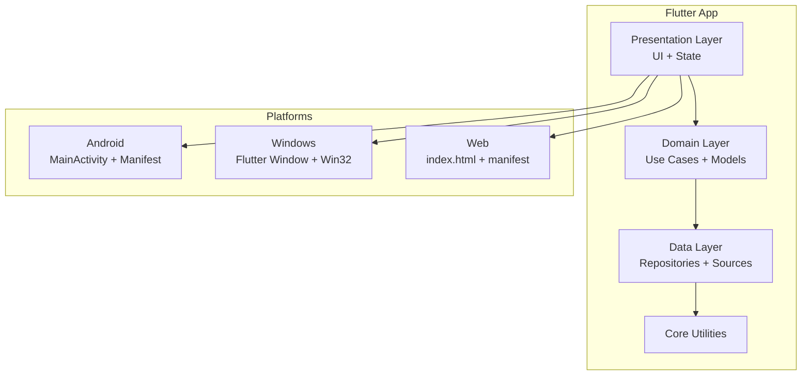
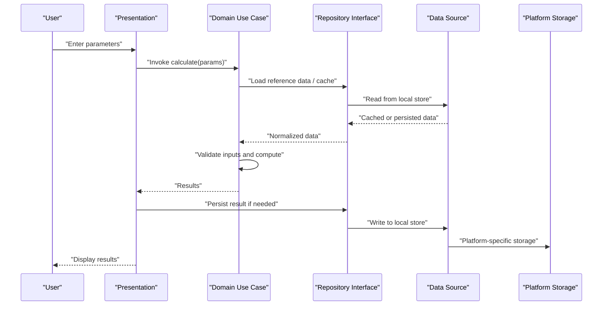
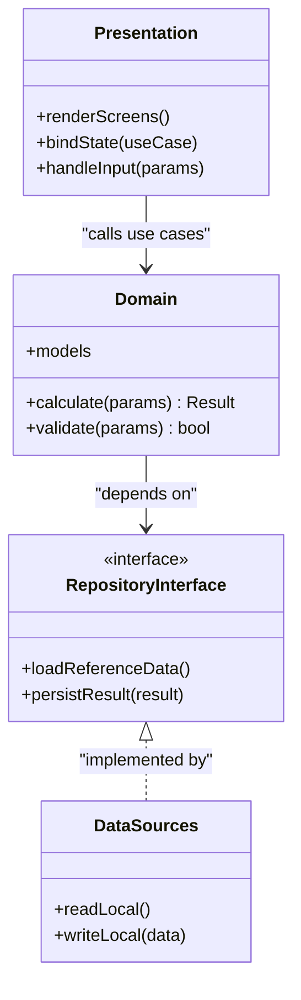
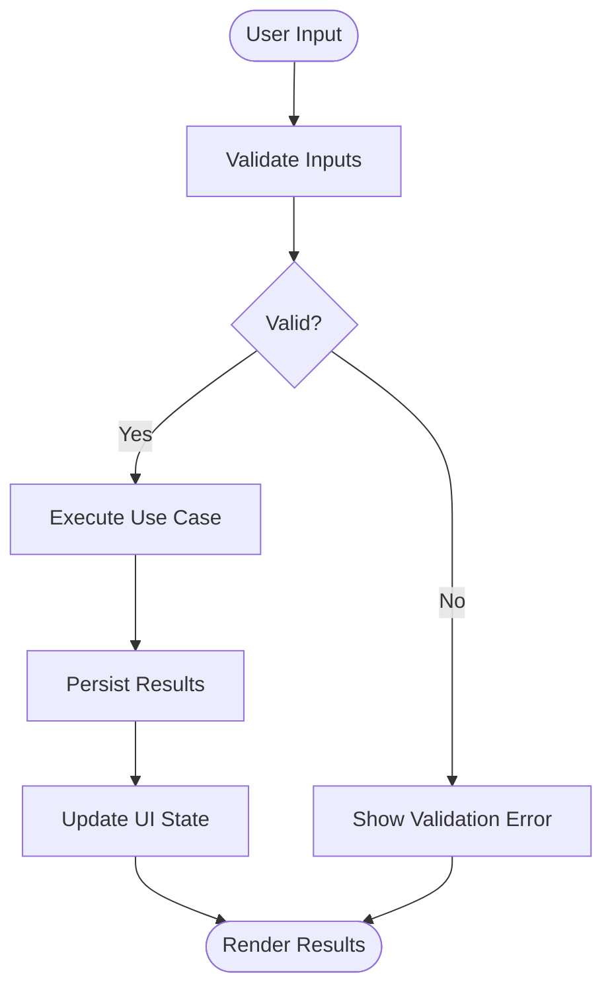
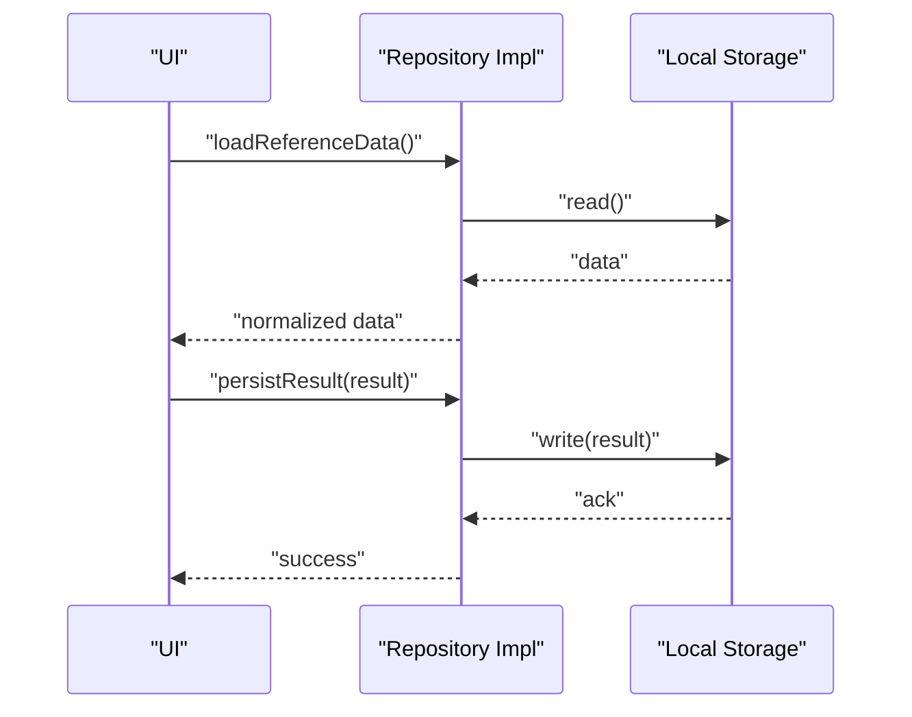
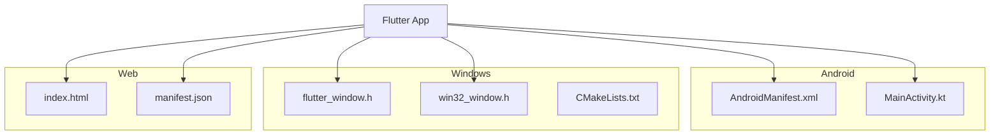
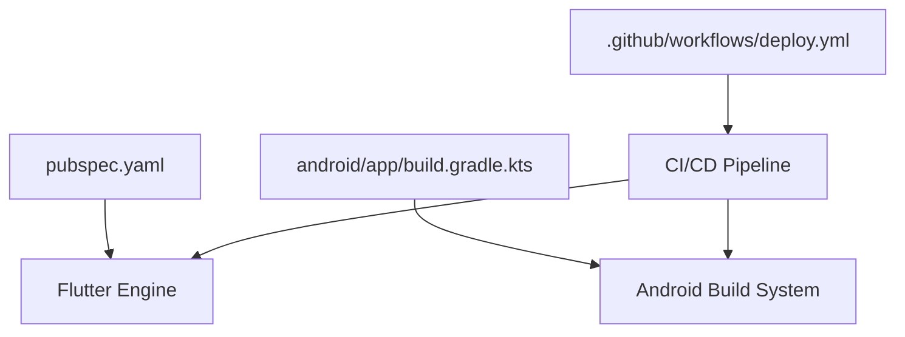
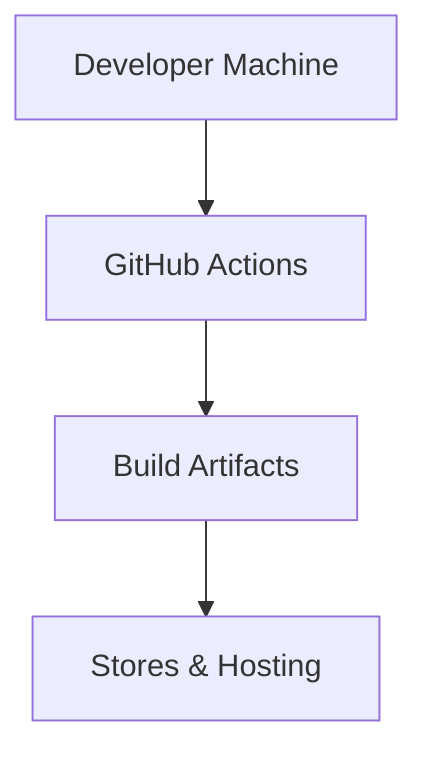

# Application Architecture

<cite>
**Referenced Files in This Document**
- [main.dart](file://lib/main.dart)
- [pubspec.yaml](file://pubspec.yaml)
- [MainActivity.kt](file://android/app/src/main/kotlin/com/medlabib/emtools/MainActivity.kt)
- [AndroidManifest.xml](file://android/app/src/main/AndroidManifest.xml)
- [build.gradle.kts](file://android/app/build.gradle.kts)
- [flutter_window.h](file://windows/runner/flutter_window.h)
- [win32_window.h](file://windows/runner/win32_window.h)
- [CMakeLists.txt](file://windows/CMakeLists.txt)
- [index.html](file://web/index.html)
- [manifest.json](file://web/manifest.json)
- [deploy.yml](file://.github/workflows/deploy.yml)
- [README.md](file://README.md)
</cite>

## Table of Contents
1. [Introduction](#introduction)
2. [Project Structure](#project-structure)
3. [Core Components](#core-components)
4. [Architecture Overview](#architecture-overview)
5. [Detailed Component Analysis](#detailed-component-analysis)
6. [Dependency Analysis](#dependency-analysis)
7. [Performance Considerations](#performance-considerations)
8. [Troubleshooting Guide](#troubleshooting-guide)
9. [Conclusion](#conclusion)
10. [Appendices](#appendices)

## Introduction
This document describes the architecture of EMtools, a Flutter-based medical calculation application targeting Android, Web, and Windows. It explains how Clean Architecture is applied to separate presentation, domain, and data layers; how user inputs flow through calculation engines to results; and how platform integrations are structured. It also covers state management strategy, repository pattern usage, infrastructure requirements, scalability considerations for medical calculations, deployment topology, cross-cutting concerns (offline storage, accuracy validation, platform optimizations), and technology stack details.

## Project Structure
The project follows a layered structure with clear separation:
- lib/presentation: UI widgets, screens, and state binding
- lib/domain: business logic, use cases, models, and interfaces
- lib/data: repositories, data sources, DTOs, serialization, and persistence
- lib/core: shared utilities, constants, theme, and common abstractions
- Platform folders: android, web, windows for native bootstrapping and configuration
- Test suite under test/: unit and widget tests validating calculators and scenarios

**Diagram sources**
- [main.dart](file://lib/main.dart)
- [MainActivity.kt](file://android/app/src/main/kotlin/com/medlabib/emtools/MainActivity.kt)
- [AndroidManifest.xml](file://android/app/src/main/AndroidManifest.xml)
- [flutter_window.h](file://windows/runner/flutter_window.h)
- [win32_window.h](file://windows/runner/win32_window.h)
- [index.html](file://web/index.html)
- [manifest.json](file://web/manifest.json)

**Section sources**
- [main.dart](file://lib/main.dart)
- [pubspec.yaml](file://pubspec.yaml)
- [MainActivity.kt](file://android/app/src/main/kotlin/com/medlabib/emtools/MainActivity.kt)
- [AndroidManifest.xml](file://android/app/src/main/AndroidManifest.xml)
- [flutter_window.h](file://windows/runner/flutter_window.h)
- [win32_window.h](file://windows/runner/win32_window.h)
- [index.html](file://web/index.html)
- [manifest.json](file://web/manifest.json)

## Core Components
- Presentation Layer
  - Screens and widgets that render calculators and display results
  - State management bindings to domain use cases via repositories
- Domain Layer
  - Use cases encapsulating medical calculation workflows
  - Pure models and rules ensuring calculation accuracy and consistency
- Data Layer
  - Repository implementations coordinating local storage and any remote sources
  - Serialization and caching strategies for offline-first operation
- Core
  - Shared utilities, constants, and cross-platform helpers
  - Configuration and environment setup

Key responsibilities:
- Presentation reacts to user input and updates UI
- Domain executes validated calculations without I/O side effects
- Data persists inputs/results and provides consistent APIs to domain

**Section sources**
- [main.dart](file://lib/main.dart)
- [pubspec.yaml](file://pubspec.yaml)

## Architecture Overview
EMtools implements Clean Architecture with strict layering:
- Presentation depends on Domain and Data abstractions
- Domain remains independent of external frameworks and platforms
- Data abstracts persistence and network behind repository interfaces

**Diagram sources**
- [main.dart](file://lib/main.dart)
- [AndroidManifest.xml](file://android/app/src/main/AndroidManifest.xml)
- [flutter_window.h](file://windows/runner/flutter_window.h)
- [win32_window.h](file://windows/runner/win32_window.h)
- [index.html](file://web/index.html)

## Detailed Component Analysis

### Clean Architecture Layers
- Presentation
  - Widgets bind to use cases via repository interfaces
  - Handles navigation, theming, and platform-specific UI nuances
- Domain
  - Use cases orchestrate calculation flows
  - Models represent clinical entities and constraints
- Data
  - Repositories implement repository interfaces
  - Data sources manage local storage and optional remote sync

[No sources needed since this diagram shows conceptual relationships]

### State Management Strategy
- The app uses a reactive approach where UI subscribes to state changes driven by use case execution
- State updates are triggered after successful validations and computations
- For complex flows, scoped state containers isolate calculator contexts

[No sources needed since this diagram shows conceptual workflow]

### Repository Pattern Implementation
- Repository interfaces define contracts for loading reference data and persisting results
- Implementations coordinate local storage and future remote synchronization
- Domain code remains decoupled from persistence mechanisms

[No sources needed since this diagram shows conceptual workflow]

### Platform Integration Patterns
- Android
  - MainActivity initializes Flutter engine and registers plugins
  - AndroidManifest declares permissions and app metadata
- Windows
  - flutter_window and win32_window manage window lifecycle and rendering
  - CMake orchestrates build integration
- Web
  - index.html and manifest.json configure entry points and metadata

**Diagram sources**
- [MainActivity.kt](file://android/app/src/main/kotlin/com/medlabib/emtools/MainActivity.kt)
- [AndroidManifest.xml](file://android/app/src/main/AndroidManifest.xml)
- [flutter_window.h](file://windows/runner/flutter_window.h)
- [win32_window.h](file://windows/runner/win32_window.h)
- [CMakeLists.txt](file://windows/CMakeLists.txt)
- [index.html](file://web/index.html)
- [manifest.json](file://web/manifest.json)

**Section sources**
- [MainActivity.kt](file://android/app/src/main/kotlin/com/medlabib/emtools/MainActivity.kt)
- [AndroidManifest.xml](file://android/app/src/main/AndroidManifest.xml)
- [flutter_window.h](file://windows/runner/flutter_window.h)
- [win32_window.h](file://windows/runner/win32_window.h)
- [CMakeLists.txt](file://windows/CMakeLists.txt)
- [index.html](file://web/index.html)
- [manifest.json](file://web/manifest.json)

## Dependency Analysis
- Flutter SDK and dependencies are declared in pubspec.yaml
- Android build configuration in app/build.gradle.kts defines compile options and packaging
- GitHub Actions workflow deploy.yml automates builds and releases across platforms

**Diagram sources**
- [pubspec.yaml](file://pubspec.yaml)
- [build.gradle.kts](file://android/app/build.gradle.kts)
- [deploy.yml](file://.github/workflows/deploy.yml)

**Section sources**
- [pubspec.yaml](file://pubspec.yaml)
- [build.gradle.kts](file://android/app/build.gradle.kts)
- [deploy.yml](file://.github/workflows/deploy.yml)

## Performance Considerations
- Calculation Accuracy
  - Domain use cases enforce input validation and deterministic algorithms
  - Unit tests cover edge cases and scenario matrices to ensure correctness
- Offline Performance
  - Local storage caches reference datasets and frequent results
  - Lazy loading and pagination reduce memory footprint on large datasets
- Cross-Platform Optimizations
  - Android: ProGuard/R8 rules minimize APK size and improve startup
  - Windows: Native window initialization avoids unnecessary overhead
  - Web: Asset bundling and service worker caching improve load times
- Scalability
  - Modular use cases allow adding new calculators without impacting existing ones
  - Repository abstraction enables pluggable backends for future cloud sync

[No sources needed since this section provides general guidance]

## Troubleshooting Guide
- Build Issues
  - Verify Flutter SDK version compatibility in pubspec.yaml
  - Check Android Gradle plugin versions in build.gradle.kts
- Runtime Errors
  - Inspect platform logs for Android and Windows
  - Validate web assets in index.html and manifest.json
- CI Failures
  - Review deploy.yml steps and environment variables
  - Ensure artifacts are correctly packaged per platform

**Section sources**
- [pubspec.yaml](file://pubspec.yaml)
- [build.gradle.kts](file://android/app/build.gradle.kts)
- [index.html](file://web/index.html)
- [manifest.json](file://web/manifest.json)
- [deploy.yml](file://.github/workflows/deploy.yml)

## Conclusion
EMtools applies Clean Architecture to deliver accurate, maintainable medical calculations across Android, Web, and Windows. The separation of concerns ensures robustness and testability, while repository patterns and offline-first design support reliability in diverse environments. The chosen Flutter framework enables efficient cross-platform delivery with platform-specific optimizations and a streamlined CI/CD pipeline.

[No sources needed since this section summarizes without analyzing specific files]

## Appendices

### Technology Stack
- Flutter SDK: managed via pubspec.yaml
- Key Dependencies: listed in pubspec.yaml
- Third-party Integrations: configured in platform manifests and gradle files

**Section sources**
- [pubspec.yaml](file://pubspec.yaml)
- [AndroidManifest.xml](file://android/app/src/main/AndroidManifest.xml)
- [build.gradle.kts](file://android/app/build.gradle.kts)

### Deployment Topology
- Local Development: Flutter run targets Android emulator/device, Windows desktop, and web server
- CI/CD: GitHub Actions workflow builds and packages artifacts for distribution
- Distribution Channels: Play Store, Microsoft Store, and web hosting

**Diagram sources**
- [deploy.yml](file://.github/workflows/deploy.yml)

**Section sources**
- [deploy.yml](file://.github/workflows/deploy.yml)
- [README.md](file://README.md)