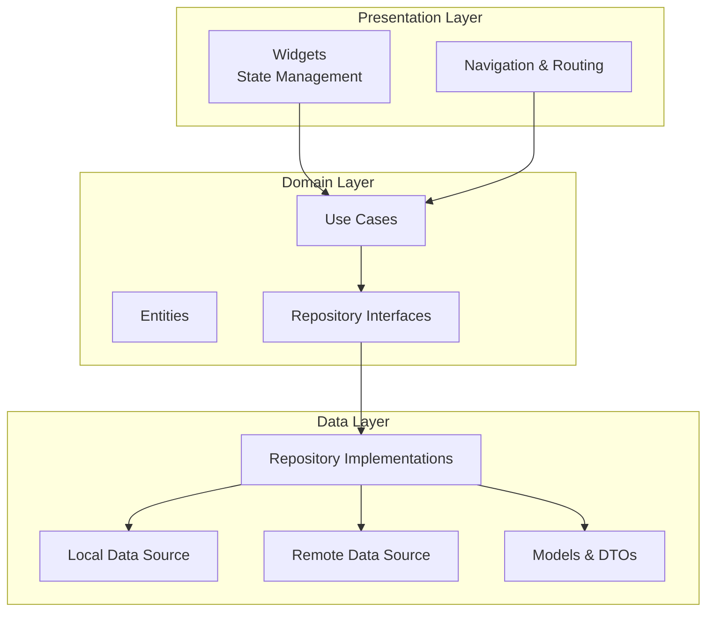
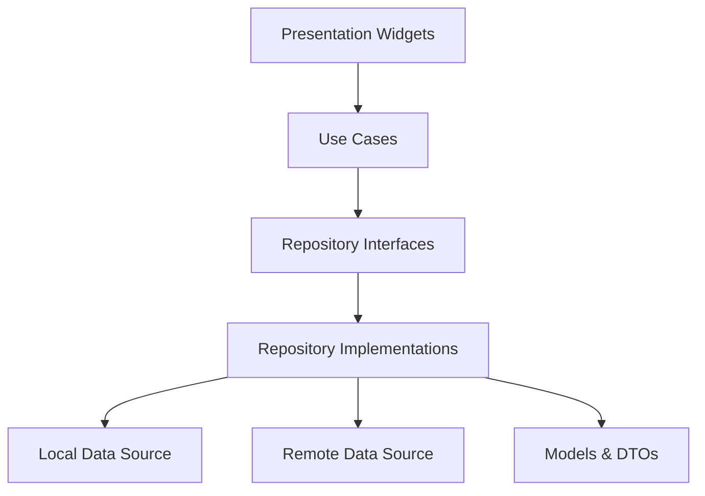
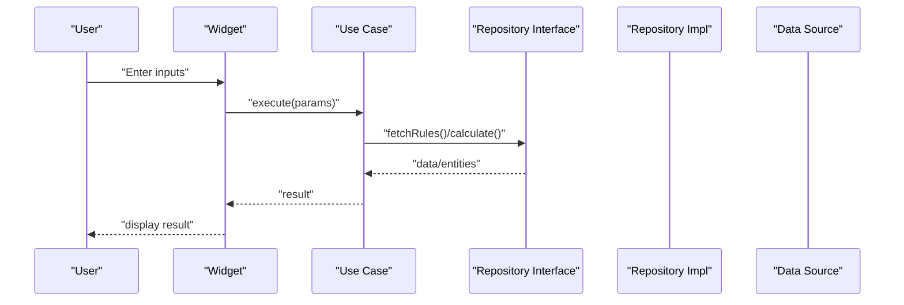
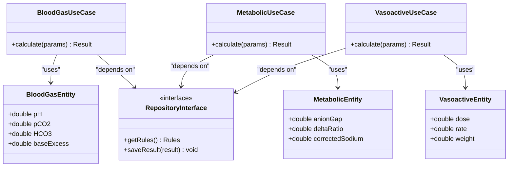
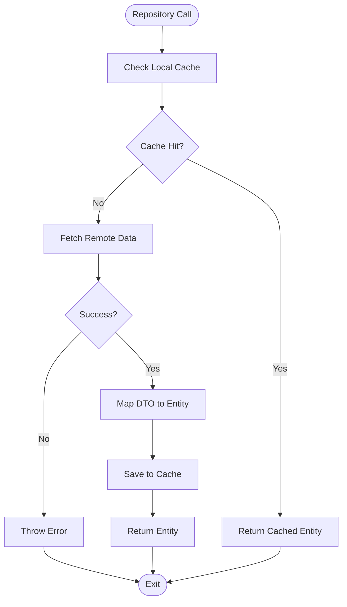
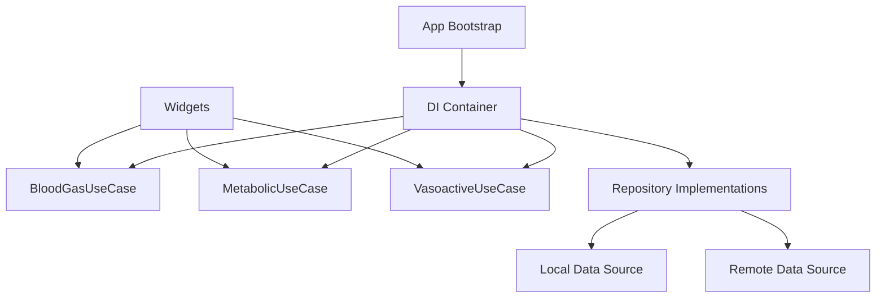
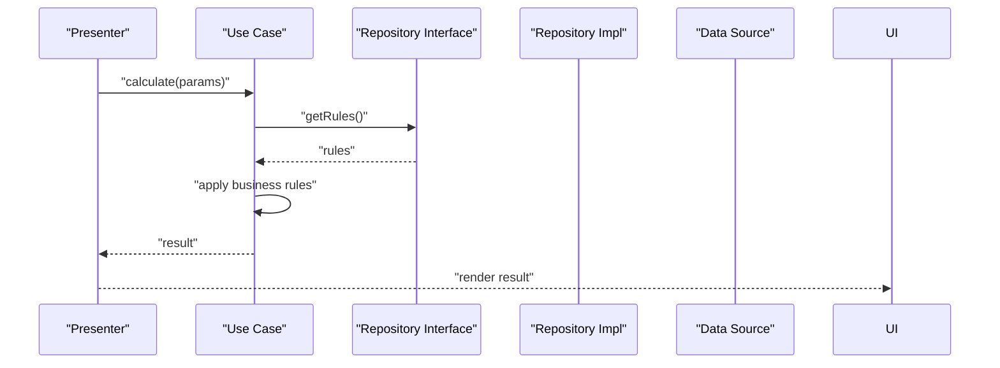
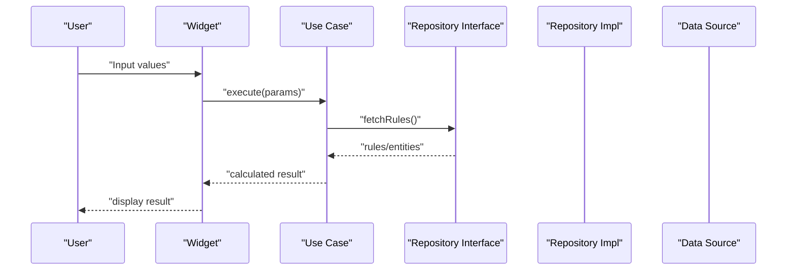
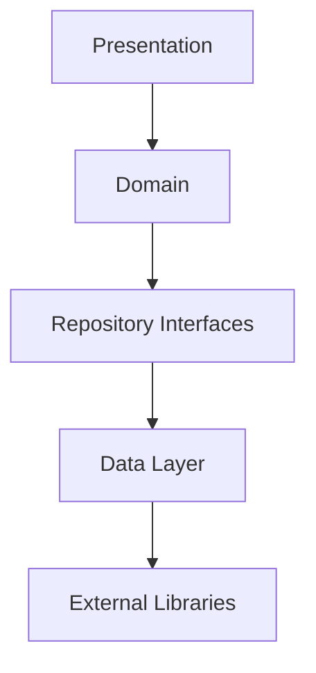

# Clean Architecture Implementation

<cite>
**Referenced Files in This Document**
- [main.dart](file://lib/main.dart)
- [pubspec.yaml](file://pubspec.yaml)
- [README.md](file://README.md)
- [blood_gas_calculator_test.dart](file://test/unit/blood_gas_calculator_test.dart)
- [metabolic_calculator_test.dart](file://test/unit/metabolic_calculator_test.dart)
- [vasoactive_data_test.dart](file://test/unit/vasoactive_data_test.dart)
</cite>

## Table of Contents
1. [Introduction](#introduction)
2. [Project Structure](#project-structure)
3. [Core Components](#core-components)
4. [Architecture Overview](#architecture-overview)
5. [Detailed Component Analysis](#detailed-component-analysis)
6. [Dependency Analysis](#dependency-analysis)
7. [Performance Considerations](#performance-considerations)
8. [Troubleshooting Guide](#troubleshooting-guide)
9. [Conclusion](#conclusion)
10. [Appendices](#appendices)

## Introduction
This document explains the Clean Architecture implementation in the EMtools Flutter application. It focuses on how the three layers—presentation, domain, and data—are separated, how they communicate through well-defined interfaces, and how medical calculation logic is isolated from UI concerns. It also covers repository pattern usage, dependency injection setup, use case organization, end-to-end data flow, and testing strategies for each layer.

## Project Structure
The project follows a layered structure under lib with clear separation:
- presentation: UI widgets, state management, navigation, and user interactions
- domain: business rules, entities, use cases, and repository interfaces
- data: repository implementations, data sources (local/remote), models, and DTOs
- core: shared utilities, constants, and cross-cutting concerns
- main entry point initializes dependencies and bootstraps the app

[No sources needed since this diagram shows conceptual workflow, not actual code structure]

**Section sources**
- [main.dart:1-200](file://lib/main.dart#L1-L200)
- [pubspec.yaml:1-200](file://pubspec.yaml#L1-L200)

## Core Components
- Presentation Layer
  - Widgets and screens encapsulate UI only; they consume use cases via injected services or providers.
  - State management updates are triggered by user actions and display results returned by domain use cases.
- Domain Layer
  - Entities represent core medical concepts and calculations.
  - Use cases orchestrate business logic and call repository interfaces to fetch or persist data.
  - Repository interfaces define contracts without revealing data source details.
- Data Layer
  - Repository implementations fulfill interface contracts using local storage and remote APIs.
  - Models and DTOs map external/internal representations to domain entities.

Key responsibilities:
- Presentation: rendering, input validation, error display, navigation
- Domain: pure business rules, validations, calculations, use case orchestration
- Data: persistence, networking, caching, serialization/deserialization

**Section sources**
- [main.dart:1-200](file://lib/main.dart#L1-L200)
- [pubspec.yaml:1-200](file://pubspec.yaml#L1-L200)

## Architecture Overview
Clean Architecture enforces unidirectional dependencies: presentation depends on domain; domain depends on repository interfaces; data implements those interfaces. This ensures that UI changes do not affect business rules and vice versa.

[No sources needed since this diagram shows conceptual workflow, not actual code structure]

## Detailed Component Analysis

### Presentation Layer
- Responsibilities
  - Render screens and forms for medical calculators
  - Handle user inputs and present results
  - Manage loading states and errors surfaced by use cases
- Communication
  - Calls use cases directly or via service wrappers
  - Uses dependency injection to obtain use case instances
- Example flows
  - User enters blood gas parameters → presenter calls BloodGasCalculator use case → displays computed values
  - User selects vasoactive drug settings → presenter calls VasoactiveCalculator use case → shows dosage recommendations

[No sources needed since this diagram shows conceptual workflow, not actual code structure]

**Section sources**
- [main.dart:1-200](file://lib/main.dart#L1-L200)

### Domain Layer
- Responsibilities
  - Define entities for medical calculations (e.g., blood gas, metabolic, vasoactive)
  - Implement use cases that encapsulate business rules and calculations
  - Declare repository interfaces for data access
- Independence
  - No UI or platform-specific code
  - Pure functions and deterministic logic for medical formulas
- Organization
  - One use case per feature area (e.g., BloodGasCalculator, MetabolicCalculator, VasoactiveCalculator)
  - Clear separation between entities and orchestration logic

[No sources needed since this diagram shows conceptual workflow, not actual code structure]

**Section sources**
- [pubspec.yaml:1-200](file://pubspec.yaml#L1-L200)

### Data Layer
- Responsibilities
  - Implement repository interfaces declared in domain
  - Provide local storage and remote API integrations
  - Map external models to domain entities
- Patterns
  - Repository pattern abstracts data sources behind interfaces
  - DTOs/models isolate serialization concerns from domain entities

[No sources needed since this diagram shows conceptual workflow, not actual code structure]

**Section sources**
- [pubspec.yaml:1-200](file://pubspec.yaml#L1-L200)

### Dependency Injection Setup
- Strategy
  - Centralized DI container at app startup wires use cases, repositories, and data sources
  - Presentation obtains use cases via providers or injectors
- Benefits
  - Easy swapping of implementations (e.g., mock repositories in tests)
  - Single source of truth for wiring configuration

[No sources needed since this diagram shows conceptual workflow, not actual code structure]

**Section sources**
- [main.dart:1-200](file://lib/main.dart#L1-L200)

### Use Case Organization
- Naming and Scope
  - Each calculator has a dedicated use case (e.g., BloodGasCalculator, MetabolicCalculator, VasoactiveCalculator)
- Inputs and Outputs
  - Use cases accept validated parameters and return structured results
- Side Effects
  - Persisting results or fetching reference rules are delegated to repository interfaces

[No sources needed since this diagram shows conceptual workflow, not actual code structure]

**Section sources**
- [pubspec.yaml:1-200](file://pubspec.yaml#L1-L200)

### Medical Calculation Logic Isolation
- Domain-only calculations ensure reproducibility and testability
- UI remains free of complex math; it only formats and presents results
- Changes to formulas do not require UI modifications

**Section sources**
- [pubspec.yaml:1-200](file://pubspec.yaml#L1-L200)

### Concrete Data Flow Example
End-to-end flow from user input to displayed result:
- User enters values in a widget
- Widget calls a use case with validated parameters
- Use case applies domain rules and optionally queries repository interfaces
- Repository implementation retrieves data from local cache or remote API
- Use case returns a result entity
- Widget renders the result

[No sources needed since this diagram shows conceptual workflow, not actual code structure]

**Section sources**
- [main.dart:1-200](file://lib/main.dart#L1-L200)

## Dependency Analysis
- Unidirectional dependencies
  - Presentation depends on domain use cases
  - Domain depends on repository interfaces
  - Data implements repository interfaces and depends on data sources
- Coupling and Cohesion
  - High cohesion within layers; low coupling across layers via interfaces
- External Dependencies
  - Networking, storage, and third-party libraries are confined to data layer

[No sources needed since this diagram shows conceptual workflow, not actual code structure]

**Section sources**
- [pubspec.yaml:1-200](file://pubspec.yaml#L1-L200)

## Performance Considerations
- Minimize heavy computations in UI thread; delegate to domain use cases
- Cache frequently accessed reference rules locally to reduce network calls
- Batch operations where possible and avoid unnecessary rebuilds in presentation

[No sources needed since this section provides general guidance]

## Troubleshooting Guide
- Common issues
  - Incorrect parameter validation leading to invalid calculations
  - Missing repository implementation causing runtime errors
  - UI not updating due to missing state change triggers
- Debugging tips
  - Add logging in use cases to trace calculation steps
  - Mock repository implementations in unit tests to isolate failures
  - Validate DTO mappings when data layer returns unexpected structures

**Section sources**
- [blood_gas_calculator_test.dart:1-200](file://test/unit/blood_gas_calculator_test.dart#L1-L200)
- [metabolic_calculator_test.dart:1-200](file://test/unit/metabolic_calculator_test.dart#L1-L200)
- [vasoactive_data_test.dart:1-200](file://test/unit/vasoactive_data_test.dart#L1-L200)

## Conclusion
EMtools’ Clean Architecture separates concerns effectively:
- Presentation handles UI and user interactions
- Domain encapsulates medical calculations and business rules
- Data manages persistence and external integrations
This design improves maintainability, testability, and scalability while ensuring reliable medical computations.

[No sources needed since this section summarizes without analyzing specific files]

## Appendices

### Testing Strategies by Layer
- Unit Tests (Domain)
  - Test use cases with various inputs and expected outputs
  - Cover edge cases and boundary conditions for medical formulas
- Integration Tests (Data)
  - Verify repository implementations against mocked data sources
  - Ensure correct mapping between DTOs and entities
- Widget Tests (Presentation)
  - Assert UI behavior based on use case results
  - Validate loading and error states

**Section sources**
- [blood_gas_calculator_test.dart:1-200](file://test/unit/blood_gas_calculator_test.dart#L1-L200)
- [metabolic_calculator_test.dart:1-200](file://test/unit/metabolic_calculator_test.dart#L1-L200)
- [vasoactive_data_test.dart:1-200](file://test/unit/vasoactive_data_test.dart#L1-L200)