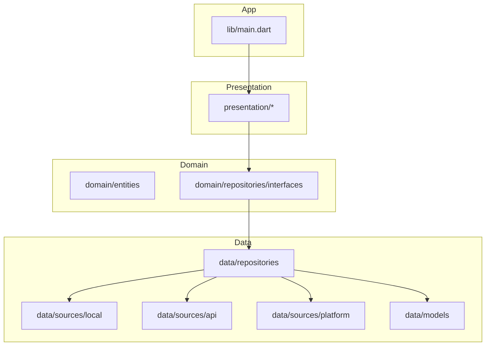
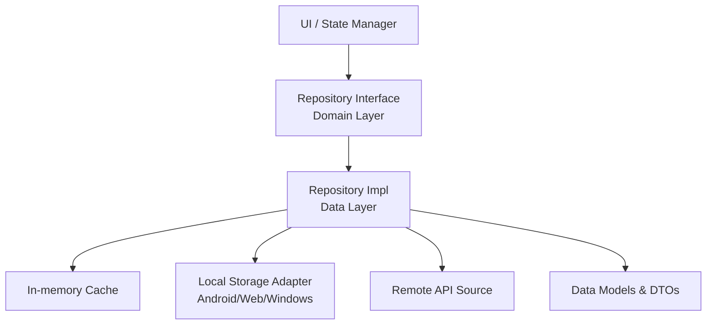
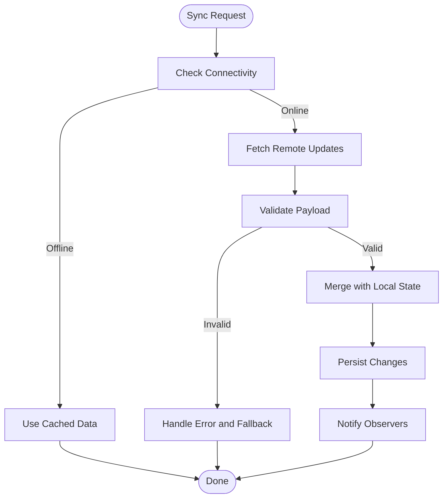
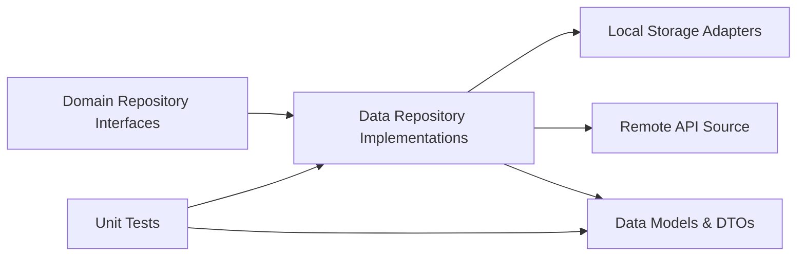
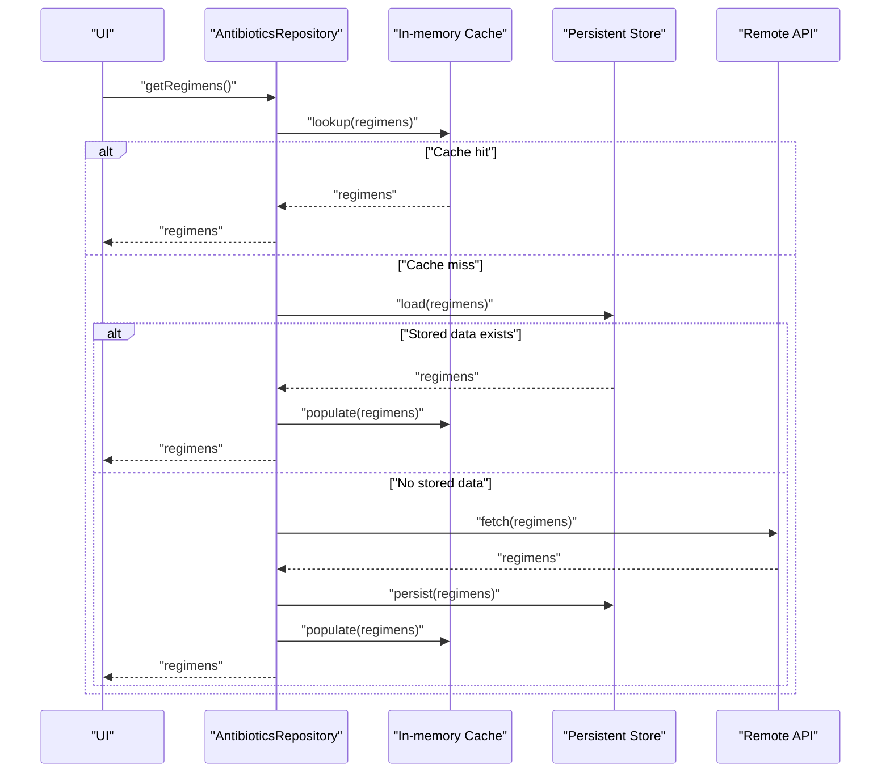

# Data Management System

<cite>
**Referenced Files in This Document**
- [main.dart](file://lib/main.dart)
- [pubspec.yaml](file://pubspec.yaml)
- [antibiotics_data_test.dart](file://test/unit/antibiotics_data_test.dart)
- [blood_gas_calculator_test.dart](file://test/unit/blood_gas_calculator_test.dart)
- [blood_gas_scenarios_test.dart](file://test/unit/blood_gas_scenarios_test.dart)
- [calculators_data_test.dart](file://test/unit/calculators_data_test.dart)
- [metabolic_calculator_test.dart](file://test/unit/metabolic_calculator_test.dart)
- [metabolic_scenarios_test.dart](file://test/unit/metabolic_scenarios_test.dart)
- [sedation_data_test.dart](file://test/unit/sedation_data_test.dart)
- [vasoactive_data_test.dart](file://test/unit/vasoactive_data_test.dart)
- [vasoactive_scenarios_test.dart](file://test/unit/vasoactive_scenarios_test.dart)
</cite>

## Table of Contents
1. [Introduction](#introduction)
2. [Project Structure](#project-structure)
3. [Core Components](#core-components)
4. [Architecture Overview](#architecture-overview)
5. [Detailed Component Analysis](#detailed-component-analysis)
6. [Dependency Analysis](#dependency-analysis)
7. [Performance Considerations](#performance-considerations)
8. [Troubleshooting Guide](#troubleshooting-guide)
9. [Conclusion](#conclusion)
10. [Appendices](#appendices)

## Introduction
This document describes the data management system in EMtools with a focus on:
- Repository pattern for abstracting local storage, external APIs, and platform-specific integrations
- Data models for medical calculations, reference data structures, and patient parameter storage
- Offline-first architecture design, synchronization strategies, and backup/restore mechanisms
- Caching and updating of medical reference data
- Data validation, type safety, and serialization/deserialization processes
- Platform-specific storage implementations for Android, Web, and Windows
- Guidance for extending the data layer to support new calculators or reference sources

The repository structure indicates a Flutter application with domain-driven organization (lib/core, lib/data, lib/domain, lib/presentation). The test suite includes unit tests for calculators and datasets such as antibiotics, blood gas, metabolic, sedation, and vasoactive data, which implies structured data models and repositories behind these features.

## Project Structure
At a high level, the project follows a layered architecture:
- Presentation: UI and state management
- Domain: business logic and entities
- Data: repositories, data sources, DTOs, and persistence
- Core: shared utilities, configuration, and cross-cutting concerns
- Main entry point initializes providers/services and bootstraps the app

[No sources needed since this diagram shows conceptual workflow, not actual code structure]

## Core Components
Based on the presence of calculator and dataset tests, the data layer likely provides:
- Repository interfaces in the domain layer that define contracts for calculators and reference data
- Concrete repository implementations in the data layer that coordinate multiple sources (local cache, API, platform storage)
- Data models representing medical entities (e.g., antibiotic regimens, blood gas parameters, metabolic equations, sedation protocols, vasoactive infusions)
- Serialization helpers for JSON-based payloads and persistent storage formats
- Validation utilities ensuring type safety and constraints for clinical inputs

Examples of test coverage indicate the following areas are exercised:
- Antibiotics data retrieval and caching
- Blood gas calculator inputs/outputs and scenarios
- Metabolic calculator inputs/outputs and scenarios
- Sedation and vasoactive data sets and scenario validations

These tests imply:
- Deterministic data fixtures for reference datasets
- Scenario-driven tests validating calculation correctness
- Potential offline availability of core datasets via local storage

**Section sources**
- [antibiotics_data_test.dart](file://test/unit/antibiotics_data_test.dart)
- [blood_gas_calculator_test.dart](file://test/unit/blood_gas_calculator_test.dart)
- [blood_gas_scenarios_test.dart](file://test/unit/blood_gas_scenarios_test.dart)
- [calculators_data_test.dart](file://test/unit/calculators_data_test.dart)
- [metabolic_calculator_test.dart](file://test/unit/metabolic_calculator_test.dart)
- [metabolic_scenarios_test.dart](file://test/unit/metabolic_scenarios_test.dart)
- [sedation_data_test.dart](file://test/unit/sedation_data_test.dart)
- [vasoactive_data_test.dart](file://test/unit/vasoactive_data_test.dart)
- [vasoactive_scenarios_test.dart](file://test/unit/vasoactive_scenarios_test.dart)

## Architecture Overview
The data management system is designed around an offline-first strategy:
- Primary reads come from local storage (cache)
- Background or on-demand sync updates caches from remote APIs
- Platform-specific storage adapters provide persistence on Android, Web, and Windows
- Repositories abstract source selection and orchestrate fallbacks and conflict resolution

[No sources needed since this diagram shows conceptual workflow, not actual code structure]

## Detailed Component Analysis

### Repository Pattern Implementation
Responsibilities:
- Define clear contracts for data access (read, write, sync, invalidate)
- Coordinate between local cache, persistent storage, and remote API
- Provide deterministic behavior for offline usage and online updates
- Expose typed results and errors to the domain layer

Typical operations:
- getReferenceData(id): returns cached data if available; otherwise fetches from API and persists
- updateReferenceData(payload): validates input, persists locally, and schedules background sync
- sync(): triggers reconciliation between local and remote states
- invalidate(key): clears cache entries to force refresh

Error handling:
- Network failures fall back to last known good data
- Validation errors return descriptive domain-level exceptions
- Conflict resolution policies (e.g., server wins, last-write-wins) are applied consistently

Platform-specific considerations:
- Android: secure local storage, optional encrypted databases
- Web: IndexedDB or localStorage with size limits and quota awareness
- Windows: file-based or database-backed storage with appropriate permissions

**Section sources**
- [pubspec.yaml](file://pubspec.yaml)

### Data Models for Medical Calculations
Common model categories:
- Patient parameters: age, weight, height, renal function markers, comorbidities
- Reference datasets: drug dosing tables, protocol definitions, scoring systems
- Calculator inputs/outputs: validated input schemas and computed result structures
- Scenarios: predefined cases used for testing and training

Type safety and validation:
- Strongly typed fields with units and ranges
- Input validation rules (e.g., non-negative weights, physiological bounds)
- Enumerations for controlled vocabularies (e.g., route of administration)

Serialization:
- JSON schema alignment for API payloads and local files
- Versioned models to support migration across app versions
- Immutable data classes where possible to prevent accidental mutation

**Section sources**
- [antibiotics_data_test.dart](file://test/unit/antibiotics_data_test.dart)
- [blood_gas_calculator_test.dart](file://test/unit/blood_gas_calculator_test.dart)
- [blood_gas_scenarios_test.dart](file://test/unit/blood_gas_scenarios_test.dart)
- [metabolic_calculator_test.dart](file://test/unit/metabolic_calculator_test.dart)
- [metabolic_scenarios_test.dart](file://test/unit/metabolic_scenarios_test.dart)
- [sedation_data_test.dart](file://test/unit/sedation_data_test.dart)
- [vasoactive_data_test.dart](file://test/unit/vasoactive_data_test.dart)
- [vasoactive_scenarios_test.dart](file://test/unit/vasoactive_scenarios_test.dart)

### Offline-First Design and Synchronization
Design principles:
- Always serve from local cache first
- Background sync when connectivity is available
- Optimistic updates with rollback on failure
- Conflict detection and resolution strategies

Synchronization strategies:
- Pull-only for static reference data (e.g., drug tables)
- Pull/push for user-generated data (e.g., saved patient notes)
- Incremental updates using timestamps or version numbers
- Batched writes to reduce I/O overhead

Backup and restore:
- Export/import of reference datasets and user data
- Version-aware migrations during restore
- Integrity checks (checksums) before applying backups

[No sources needed since this diagram shows conceptual workflow, not actual code structure]

### Caching and Updating Medical Reference Data
Caching layers:
- In-memory cache for frequently accessed references
- Persistent cache for durability across sessions
- Asset-bundled baseline data for immediate availability

Update mechanisms:
- On app start or periodic intervals, check for newer reference versions
- Download diffs or full datasets depending on size and change frequency
- Apply migrations atomically and verify integrity before activation

Example flows:
- Antibiotic regimen table: load from assets, validate, cache, then optionally refresh from API
- Blood gas reference values: initialize from embedded data, allow manual override, persist changes
- Vasoactive infusion protocols: versioned bundles with rollback capability

**Section sources**
- [calculators_data_test.dart](file://test/unit/calculators_data_test.dart)

### Platform-Specific Storage Implementations
Android:
- Secure storage for sensitive patient data
- Room or SQLite for relational datasets
- Content provider integration if sharing with other apps

Web:
- IndexedDB for larger datasets with structured queries
- localStorage for small key-value preferences
- Service worker caching for network resilience

Windows:
- File-based storage with JSON or SQLite
- App container isolation and permission handling
- Backup/export to user-accessible directories

**Section sources**
- [pubspec.yaml](file://pubspec.yaml)

### Extending the Data Layer for New Calculators or Reference Sources
Steps to add a new calculator:
- Define domain entities and repository interface
- Implement concrete repository with local and remote sources
- Add data models with validation rules and serialization
- Create unit tests covering normal and edge cases
- Integrate into presentation layer via dependency injection

Steps to add a new reference source:
- Version the dataset and define migration scripts
- Implement loader for asset-bundled baseline
- Implement updater for remote refresh
- Add cache invalidation and integrity checks
- Write tests for load, update, and rollback paths

Best practices:
- Keep repositories focused on single responsibilities
- Use immutable models and explicit error types
- Ensure all public APIs are fully typed and documented
- Prefer composition over inheritance for storage adapters

**Section sources**
- [pubspec.yaml](file://pubspec.yaml)

## Dependency Analysis
The data layer depends on:
- Domain interfaces for contracts
- Platform storage packages for persistence
- Networking packages for remote data
- Serialization libraries for JSON handling
- Testing utilities for fixtures and assertions

[No sources needed since this diagram shows conceptual workflow, not actual code structure]

## Performance Considerations
- Minimize disk I/O by batching writes and coalescing updates
- Use in-memory caches for hot paths (e.g., active calculator inputs)
- Defer heavy computations until necessary and memoize results
- Stream large datasets instead of loading entirely into memory
- Profile network requests and implement efficient caching headers
- Avoid unnecessary rebuilds by isolating state at appropriate boundaries

[No sources needed since this section provides general guidance]

## Troubleshooting Guide
Common issues and resolutions:
- Stale data after update: ensure cache invalidation keys are correct and observers are notified
- Serialization errors: verify JSON schema compatibility and handle version mismatches gracefully
- Platform storage limits: monitor quotas on Web and adjust caching strategy accordingly
- Sync conflicts: review conflict resolution policy and log discrepancies for auditability
- Test failures: confirm fixtures match expected schemas and that validators enforce constraints

Validation tips:
- Assert input ranges and units in tests
- Use snapshot tests for serialized outputs
- Include negative scenarios for malformed payloads

**Section sources**
- [antibiotics_data_test.dart](file://test/unit/antibiotics_data_test.dart)
- [blood_gas_calculator_test.dart](file://test/unit/blood_gas_calculator_test.dart)
- [blood_gas_scenarios_test.dart](file://test/unit/blood_gas_scenarios_test.dart)
- [metabolic_calculator_test.dart](file://test/unit/metabolic_calculator_test.dart)
- [metabolic_scenarios_test.dart](file://test/unit/metabolic_scenarios_test.dart)
- [sedation_data_test.dart](file://test/unit/sedation_data_test.dart)
- [vasoactive_data_test.dart](file://test/unit/vasoactive_data_test.dart)
- [vasoactive_scenarios_test.dart](file://test/unit/vasoactive_scenarios_test.dart)

## Conclusion
EMtools’ data management system emphasizes reliability, type safety, and offline usability through a repository pattern and layered architecture. By separating domain contracts from data implementations, supporting multiple storage backends, and enforcing robust validation and serialization, the system ensures accurate medical calculations and resilient reference data access. The provided test suites demonstrate strong coverage across calculators and datasets, guiding future extensions and maintenance.

[No sources needed since this section summarizes without analyzing specific files]

## Appendices

### Example: Sequence Flow for Loading Antibiotic Reference Data

[No sources needed since this diagram shows conceptual workflow, not actual code structure]