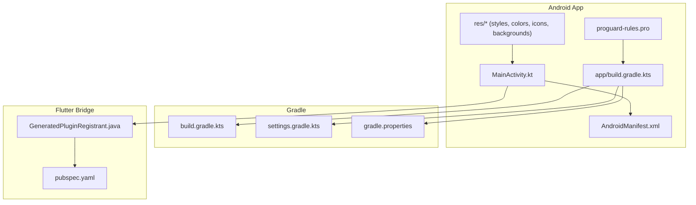
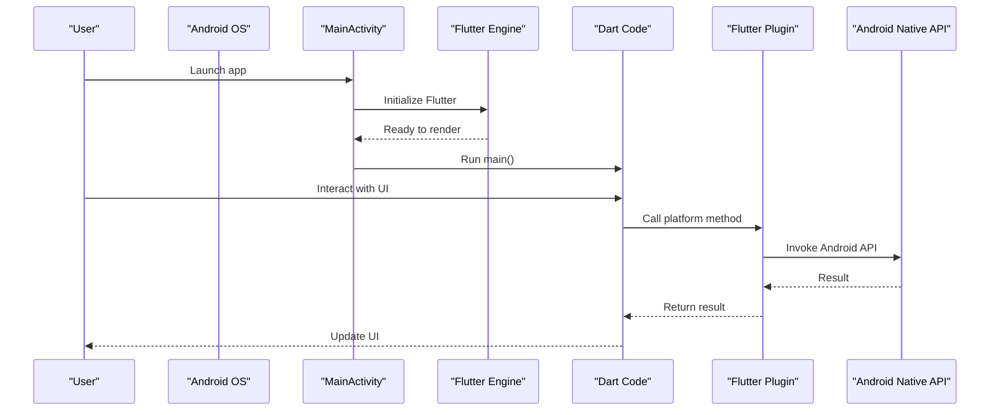
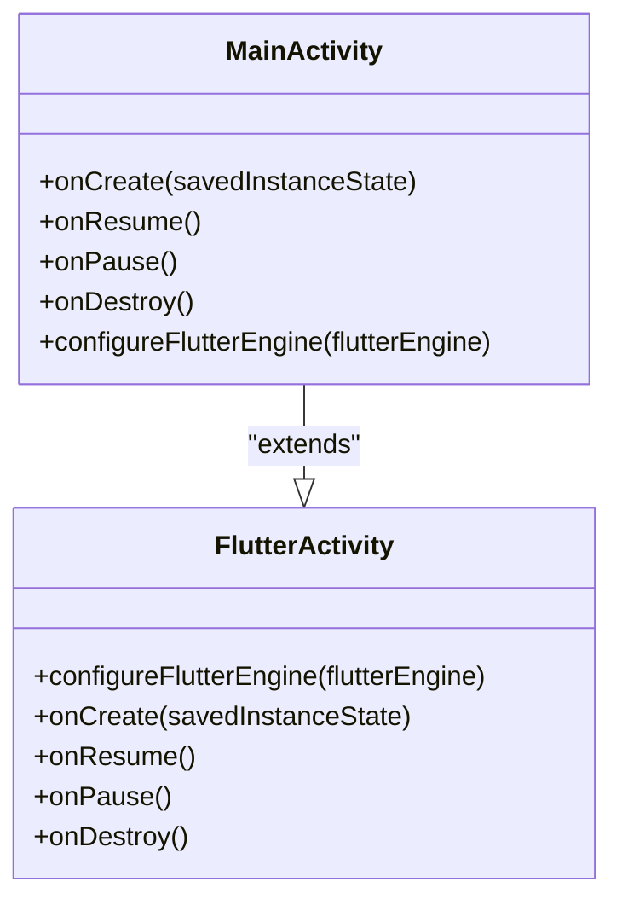
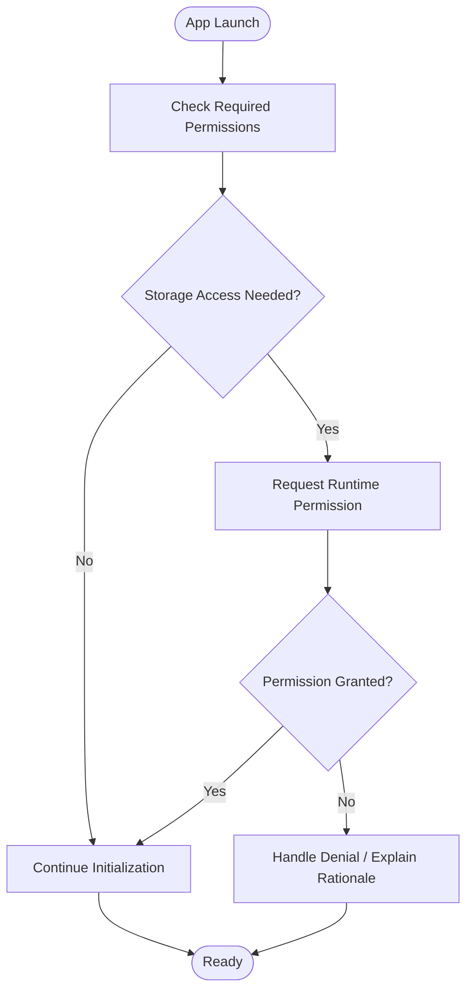
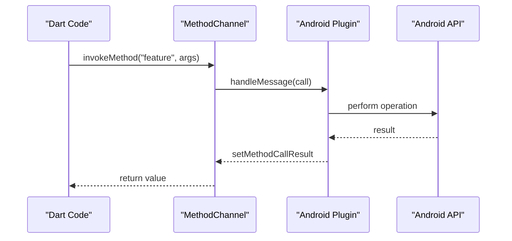
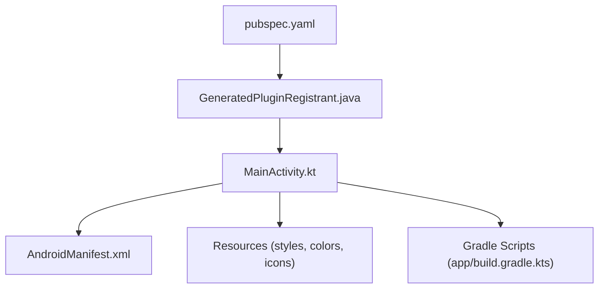

# Android Platform Integration

<cite>
**Referenced Files in This Document**
- [MainActivity.kt](file://android/app/src/main/kotlin/com/medlabib/emtools/MainActivity.kt)
- [AndroidManifest.xml](file://android/app/src/main/AndroidManifest.xml)
- [app/build.gradle.kts](file://android/app/build.gradle.kts)
- [build.gradle.kts](file://android/build.gradle.kts)
- [settings.gradle.kts](file://android/settings.gradle.kts)
- [gradle.properties](file://android/gradle.properties)
- [GeneratedPluginRegistrant.java](file://android/app/src/main/java/io/flutter/plugins/GeneratedPluginRegistrant.java)
- [launch_background.xml](file://android/app/src/main/res/drawable/launch_background.xml)
- [styles.xml](file://android/app/src/main/res/values/styles.xml)
- [colors.xml](file://android/app/src/main/res/values/colors.xml)
- [ic_launcher.xml](file://android/app/src/main/res/mipmap-anydpi-v26/ic_launcher.xml)
- [proguard-rules.pro](file://android/app/proguard-rules.pro)
- [pubspec.yaml](file://pubspec.yaml)
</cite>

## Table of Contents
1. [Introduction](#introduction)
2. [Project Structure](#project-structure)
3. [Core Components](#core-components)
4. [Architecture Overview](#architecture-overview)
5. [Detailed Component Analysis](#detailed-component-analysis)
6. [Dependency Analysis](#dependency-analysis)
7. [Performance Considerations](#performance-considerations)
8. [Troubleshooting Guide](#troubleshooting-guide)
9. [Conclusion](#conclusion)
10. [Appendices](#appendices)

## Introduction
This document explains how EMtools integrates with the Android platform using Flutter. It covers the MainActivity implementation, Android-specific configurations, and native feature access patterns. It also details how Flutter bridges to Android for device capabilities such as file system access, storage permissions, and hardware features, along with build configuration, Gradle setup, manifest permissions, performance optimizations, deployment considerations, signing processes, and Play Store submission requirements. Examples are provided for implementing medical device integrations and handling Android lifecycle events.

## Project Structure
The Android module is located under android/. The key files include:
- App-level Gradle configuration (app/build.gradle.kts)
- Project-level Gradle configuration (build.gradle.kts)
- Gradle settings (settings.gradle.kts)
- Android manifest (AndroidManifest.xml)
- Kotlin entry point (MainActivity.kt)
- Generated plugin registrant (GeneratedPluginRegistrant.java)
- Resource definitions (styles.xml, colors.xml, launch_background.xml, ic_launcher.xml)
- ProGuard rules (proguard-rules.pro)
- Gradle properties (gradle.properties)

**Diagram sources**
- [MainActivity.kt](file://android/app/src/main/kotlin/com/medlabib/emtools/MainActivity.kt)
- [AndroidManifest.xml](file://android/app/src/main/AndroidManifest.xml)
- [app/build.gradle.kts](file://android/app/build.gradle.kts)
- [build.gradle.kts](file://android/build.gradle.kts)
- [settings.gradle.kts](file://android/settings.gradle.kts)
- [gradle.properties](file://android/gradle.properties)
- [GeneratedPluginRegistrant.java](file://android/app/src/main/java/io/flutter/plugins/GeneratedPluginRegistrant.java)
- [launch_background.xml](file://android/app/src/main/res/drawable/launch_background.xml)
- [styles.xml](file://android/app/src/main/res/values/styles.xml)
- [colors.xml](file://android/app/src/main/res/values/colors.xml)
- [ic_launcher.xml](file://android/app/src/main/res/mipmap-anydpi-v26/ic_launcher.xml)
- [proguard-rules.pro](file://android/app/proguard-rules.pro)
- [pubspec.yaml](file://pubspec.yaml)

**Section sources**
- [MainActivity.kt](file://android/app/src/main/kotlin/com/medlabib/emtools/MainActivity.kt)
- [AndroidManifest.xml](file://android/app/src/main/AndroidManifest.xml)
- [app/build.gradle.kts](file://android/app/build.gradle.kts)
- [build.gradle.kts](file://android/build.gradle.kts)
- [settings.gradle.kts](file://android/settings.gradle.kts)
- [gradle.properties](file://android/gradle.properties)
- [GeneratedPluginRegistrant.java](file://android/app/src/main/java/io/flutter/plugins/GeneratedPluginRegistrant.java)
- [launch_background.xml](file://android/app/src/main/res/drawable/launch_background.xml)
- [styles.xml](file://android/app/src/main/res/values/styles.xml)
- [colors.xml](file://android/app/src/main/res/values/colors.xml)
- [ic_launcher.xml](file://android/app/src/main/res/mipmap-anydpi-v26/ic_launcher.xml)
- [proguard-rules.pro](file://android/app/proguard-rules.pro)
- [pubspec.yaml](file://pubspec.yaml)

## Core Components
- MainActivity: The Android entry point that hosts the Flutter engine and can be extended to handle platform-specific logic or lifecycle callbacks.
- AndroidManifest.xml: Declares app metadata, components, and permissions required by the app and its plugins.
- Gradle scripts: Configure compile options, dependencies, signing, and packaging for release builds.
- GeneratedPluginRegistrant.java: Automatically registers Flutter plugins at runtime so Dart code can call into Android APIs.
- Resources: Define app theme, colors, launcher icon, and splash background.

Key responsibilities:
- Initialize Flutter and integrate with Android lifecycle.
- Provide a surface for adding native features via method channels or custom plugins.
- Ensure correct permissions and resource configuration for medical calculator functionality.

**Section sources**
- [MainActivity.kt](file://android/app/src/main/kotlin/com/medlabib/emtools/MainActivity.kt)
- [AndroidManifest.xml](file://android/app/src/main/AndroidManifest.xml)
- [app/build.gradle.kts](file://android/app/build.gradle.kts)
- [build.gradle.kts](file://android/build.gradle.kts)
- [settings.gradle.kts](file://android/settings.gradle.kts)
- [GeneratedPluginRegistrant.java](file://android/app/src/main/java/io/flutter/plugins/GeneratedPluginRegistrant.java)
- [styles.xml](file://android/app/src/main/res/values/styles.xml)
- [colors.xml](file://android/app/src/main/res/values/colors.xml)
- [launch_background.xml](file://android/app/src/main/res/drawable/launch_background.xml)
- [ic_launcher.xml](file://android/app/src/main/res/mipmap-anydpi-v26/ic_launcher.xml)

## Architecture Overview
Flutter runs on the Android platform through an embedded Flutter engine. The Android app hosts a FlutterActivity (or similar), which initializes the engine and renders Flutter UI. Plugins bridge Dart calls to Android APIs via method channels. The generated plugin registrant wires up plugins declared in pubspec.yaml.

**Diagram sources**
- [MainActivity.kt](file://android/app/src/main/kotlin/com/medlabib/emtools/MainActivity.kt)
- [GeneratedPluginRegistrant.java](file://android/app/src/main/java/io/flutter/plugins/GeneratedPluginRegistrant.java)
- [pubspec.yaml](file://pubspec.yaml)

## Detailed Component Analysis

### MainActivity Implementation
- Purpose: Hosts the Flutter view and can override lifecycle methods to coordinate with Android features (e.g., permission requests, sensor access).
- Typical usage: Extend FlutterActivity or FlutterFragmentActivity; register plugins if needed; handle lifecycle events like onResume/onPause for foreground/background behaviors.
- Medical use cases: Pause/resume calculations, manage wake locks, handle orientation changes, and integrate with external devices when the app becomes active.

**Diagram sources**
- [MainActivity.kt](file://android/app/src/main/kotlin/com/medlabib/emtools/MainActivity.kt)

**Section sources**
- [MainActivity.kt](file://android/app/src/main/kotlin/com/medlabib/emtools/MainActivity.kt)

### Android Manifest Configuration
- Declares application metadata, activity entries, and permissions.
- For medical calculators, common permissions may include:
  - Storage access (scoped storage considerations)
  - Internet access (for updates or remote data)
  - Camera (if scanning documents)
  - Bluetooth/BLE (for device integration)
  - Foreground service (for background tasks)
- Ensure only necessary permissions are requested to comply with privacy policies and store guidelines.

**Diagram sources**
- [AndroidManifest.xml](file://android/app/src/main/AndroidManifest.xml)

**Section sources**
- [AndroidManifest.xml](file://android/app/src/main/AndroidManifest.xml)

### Gradle Build Configuration
- app/build.gradle.kts: Defines compileSdk, targetSdk, minSdk, versioning, dependencies, signing configs, and packaging options.
- build.gradle.kts: Configures project-wide settings, repositories, and plugin versions.
- settings.gradle.kts: Includes modules and dependency resolution strategy.
- gradle.properties: Sets JVM args, AndroidX flags, and other global properties.

Key areas:
- Version alignment across Kotlin, AGP, and Flutter tooling.
- Signing configuration for release builds (keystore paths, aliases).
- ProGuard/R8 rules for shrinking and obfuscation.
- Resource processing and asset inclusion.

**Section sources**
- [app/build.gradle.kts](file://android/app/build.gradle.kts)
- [build.gradle.kts](file://android/build.gradle.kts)
- [settings.gradle.kts](file://android/settings.gradle.kts)
- [gradle.properties](file://android/gradle.properties)
- [proguard-rules.pro](file://android/app/proguard-rules.pro)

### Flutter-to-Android Bridge and Plugins
- GeneratedPluginRegistrant.java: Registers plugins discovered from pubspec.yaml during build time.
- pubspec.yaml: Lists Flutter plugins used by the app; these map to Android implementations.
- Method channels: Enable Dart code to invoke Android functions and receive results.

Typical workflow:
- Dart calls a plugin method.
- Plugin uses a method channel to send a message to Android.
- Android handler executes native logic and returns a result.
- Plugin forwards the result back to Dart.

**Diagram sources**
- [GeneratedPluginRegistrant.java](file://android/app/src/main/java/io/flutter/plugins/GeneratedPluginRegistrant.java)
- [pubspec.yaml](file://pubspec.yaml)

**Section sources**
- [GeneratedPluginRegistrant.java](file://android/app/src/main/java/io/flutter/plugins/GeneratedPluginRegistrant.java)
- [pubspec.yaml](file://pubspec.yaml)

### Resources and Theming
- styles.xml: Defines app themes and window attributes.
- colors.xml: Centralizes color resources for consistent theming.
- launch_background.xml: Splash screen background drawable.
- ic_launcher.xml: Adaptive launcher icon definition.

These resources ensure a polished user experience and compliance with Android design guidelines.

**Section sources**
- [styles.xml](file://android/app/src/main/res/values/styles.xml)
- [colors.xml](file://android/app/src/main/res/values/colors.xml)
- [launch_background.xml](file://android/app/src/main/res/drawable/launch_background.xml)
- [ic_launcher.xml](file://android/app/src/main/res/mipmap-anydpi-v26/ic_launcher.xml)

## Dependency Analysis
Flutter plugins declared in pubspec.yaml drive Android dependencies resolved by Gradle. The generated plugin registrant wires these plugins into the Flutter engine at runtime.

**Diagram sources**
- [pubspec.yaml](file://pubspec.yaml)
- [GeneratedPluginRegistrant.java](file://android/app/src/main/java/io/flutter/plugins/GeneratedPluginRegistrant.java)
- [MainActivity.kt](file://android/app/src/main/kotlin/com/medlabib/emtools/MainActivity.kt)
- [AndroidManifest.xml](file://android/app/src/main/AndroidManifest.xml)
- [styles.xml](file://android/app/src/main/res/values/styles.xml)
- [colors.xml](file://android/app/src/main/res/values/colors.xml)
- [ic_launcher.xml](file://android/app/src/main/res/mipmap-anydpi-v26/ic_launcher.xml)
- [app/build.gradle.kts](file://android/app/build.gradle.kts)

**Section sources**
- [pubspec.yaml](file://pubspec.yaml)
- [GeneratedPluginRegistrant.java](file://android/app/src/main/java/io/flutter/plugins/GeneratedPluginRegistrant.java)
- [MainActivity.kt](file://android/app/src/main/kotlin/com/medlabib/emtools/MainActivity.kt)
- [AndroidManifest.xml](file://android/app/src/main/AndroidManifest.xml)
- [app/build.gradle.kts](file://android/app/build.gradle.kts)

## Performance Considerations
- Minimize heavy work on the main thread; offload computations to background threads or isolate workers in Dart.
- Use efficient image formats and sizes; leverage vector drawables where appropriate.
- Enable R8/shrinking and resource optimization in release builds.
- Avoid unnecessary allocations in hot paths; reuse objects when possible.
- Manage memory carefully when integrating with large datasets or streaming data from native APIs.
- Profile with Android Studio Profiler and Flutter DevTools to identify bottlenecks.

[No sources needed since this section provides general guidance]

## Troubleshooting Guide
Common issues and resolutions:
- Missing permissions: Verify AndroidManifest.xml declarations and runtime permission flows.
- Crash on startup: Check MainActivity initialization and plugin registration.
- Build failures: Align AGP, Kotlin, and Gradle versions; review app/build.gradle.kts and project-level settings.
- Obfuscation errors: Add keep rules in proguard-rules.pro for reflection-heavy libraries.
- Resource conflicts: Ensure unique resource names and proper theme inheritance.

**Section sources**
- [AndroidManifest.xml](file://android/app/src/main/AndroidManifest.xml)
- [MainActivity.kt](file://android/app/src/main/kotlin/com/medlabib/emtools/MainActivity.kt)
- [app/build.gradle.kts](file://android/app/build.gradle.kts)
- [proguard-rules.pro](file://android/app/proguard-rules.pro)

## Conclusion
EMtools leverages Flutter’s cross-platform approach while maintaining robust Android integration. The MainActivity hosts the Flutter engine, the manifest declares essential permissions, and Gradle scripts configure builds and signing. Plugins bridge Dart to Android APIs, enabling device capabilities critical for medical calculators. Following best practices for permissions, performance, and deployment ensures a reliable and compliant application.

[No sources needed since this section summarizes without analyzing specific files]

## Appendices

### Android Build and Signing Checklist
- Set compileSdk, targetSdk, minSdk appropriately.
- Configure signingConfigs and buildTypes for release.
- Validate keystore security and alias/password management.
- Test signed APK/AAB thoroughly before submission.

**Section sources**
- [app/build.gradle.kts](file://android/app/build.gradle.kts)

### Play Store Submission Requirements
- Generate an Android App Bundle (AAB).
- Sign the bundle with a secure keystore.
- Prepare store listing, screenshots, and descriptions.
- Ensure privacy policy and permissions align with Google Play policies.
- Complete content rating and data safety questionnaire.

[No sources needed since this section provides general guidance]

### Example Patterns for Medical Device Integrations
- BLE communication: Use a Flutter BLE plugin; implement connection lifecycle and error handling in Android.
- File import/export: Use storage-access framework or scoped storage APIs; expose via method channels.
- Lifecycle-aware operations: Pause/resume calculations in onResume/onPause; manage wake locks for long-running tasks.

[No sources needed since this section provides conceptual examples]