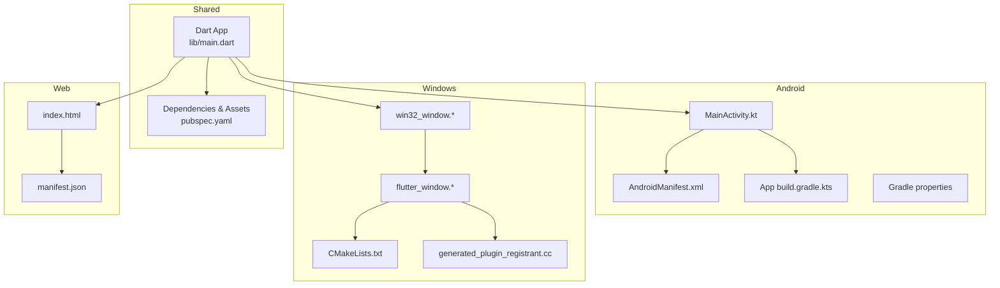
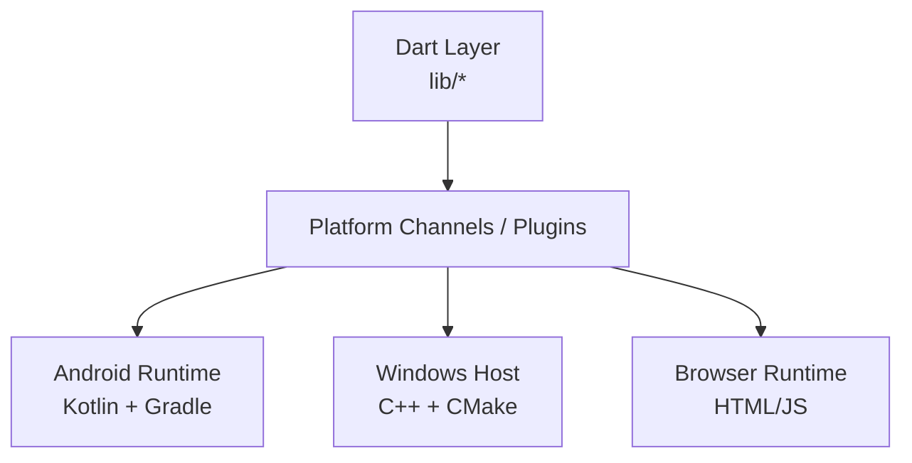
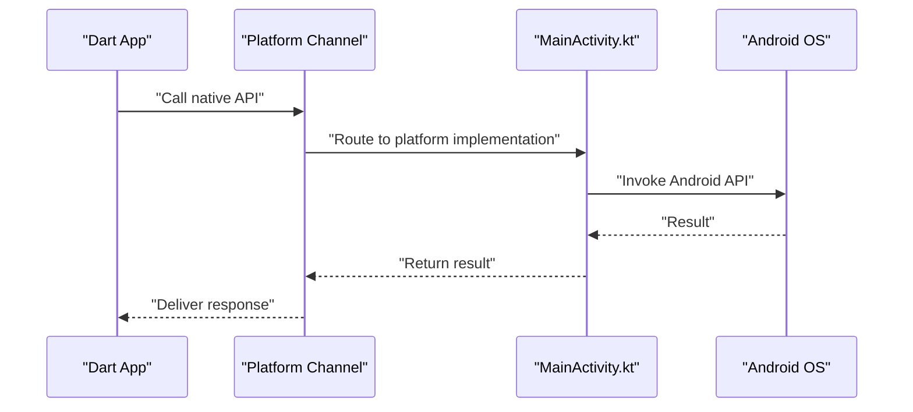
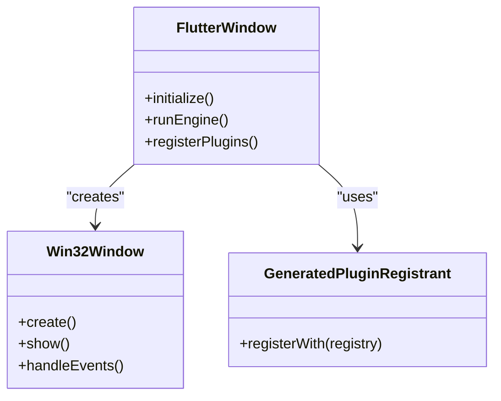
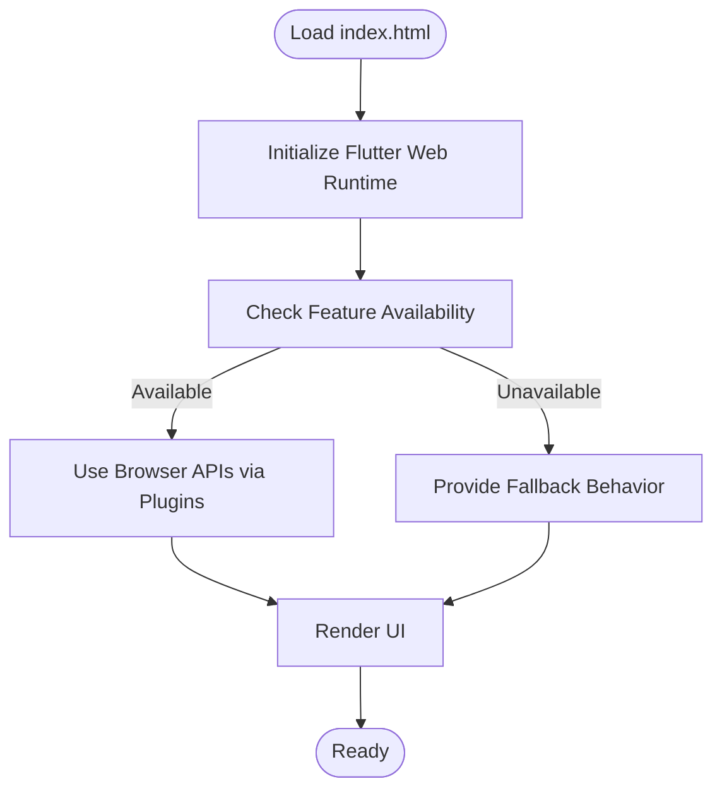
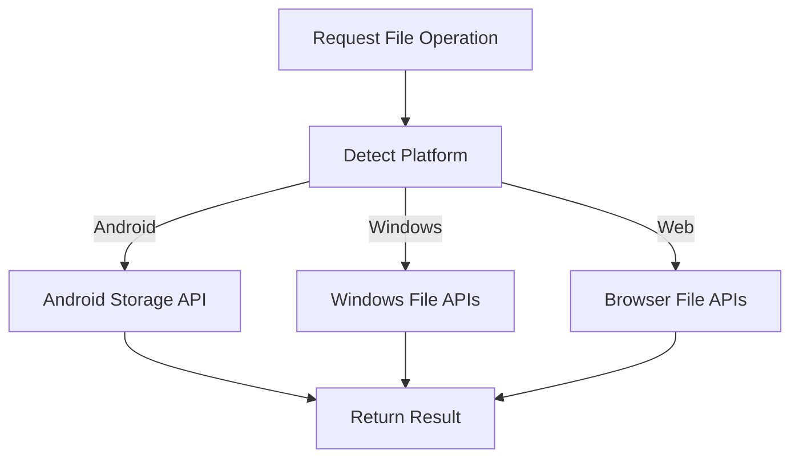
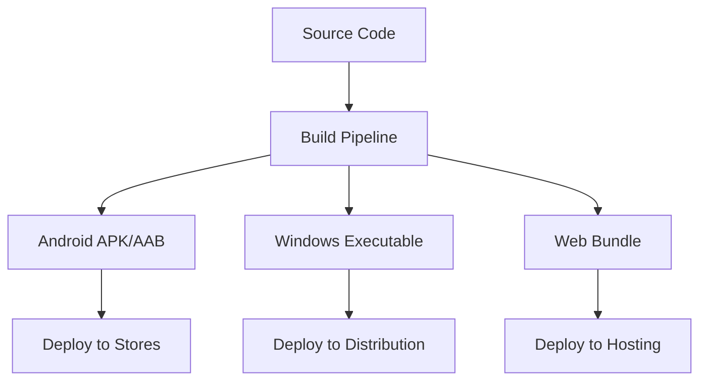
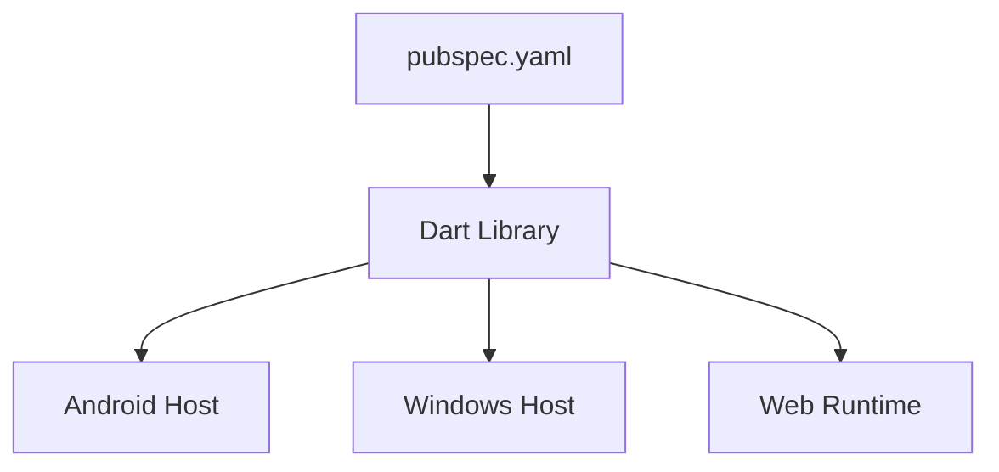

# Platform Integration Patterns

<cite>
**Referenced Files in This Document**
- [pubspec.yaml](file://pubspec.yaml)
- [main.dart](file://lib/main.dart)
- [MainActivity.kt](file://android/app/src/main/kotlin/com/medlabib/emtools/MainActivity.kt)
- [AndroidManifest.xml](file://android/app/src/main/AndroidManifest.xml)
- [build.gradle.kts](file://android/build.gradle.kts)
- [app build.gradle.kts](file://android/app/build.gradle.kts)
- [gradle.properties](file://android/gradle.properties)
- [settings.gradle.kts](file://android/settings.gradle.kts)
- [flutter_window.h](file://windows/runner/flutter_window.h)
- [flutter_window.cpp](file://windows/runner/flutter_window.cpp)
- [win32_window.h](file://windows/runner/win32_window.h)
- [win32_window.cpp](file://windows/runner/win32_window.cpp)
- [CMakeLists.txt (Windows)](file://windows/CMakeLists.txt)
- [generated_plugin_registrant.cc](file://windows/flutter/generated_plugin_registrant.cc)
- [index.html (Web)](file://web/index.html)
- [manifest.json (Web)](file://web/manifest.json)
- [deploy.yml](file://.github/workflows/deploy.yml)
- [proguard-rules.pro](file://android/app/proguard-rules.pro)
</cite>

## Table of Contents
1. [Introduction](#introduction)
2. [Project Structure](#project-structure)
3. [Core Components](#core-components)
4. [Architecture Overview](#architecture-overview)
5. [Detailed Component Analysis](#detailed-component-analysis)
6. [Dependency Analysis](#dependency-analysis)
7. [Performance Considerations](#performance-considerations)
8. [Troubleshooting Guide](#troubleshooting-guide)
9. [Conclusion](#conclusion)
10. [Appendices](#appendices)

## Introduction
This document explains how EMtools uses Flutter to deliver a consistent medical calculator experience across Android, Web, and Windows while accessing platform-specific capabilities such as file system access, device sensors, and system integrations. It covers:
- How Flutter abstracts platform differences and exposes native features via plugins and platform channels
- Platform-specific implementations for file system access, device capabilities, and system integrations
- Conditional compilation, platform detection, and feature availability checks
- Platform-specific optimizations for performance and memory usage
- Build configurations, deployment strategies, and testing approaches per platform
- Guidance for adding new platforms and handling medical device integrations
- Troubleshooting common compatibility issues and performance optimization techniques

## Project Structure
EMtools follows the standard Flutter multi-platform layout with shared Dart code under lib and platform-specific directories for Android, Web, and Windows. The root configuration includes dependency declarations and tooling settings.

**Diagram sources**
- [main.dart](file://lib/main.dart)
- [pubspec.yaml](file://pubspec.yaml)
- [MainActivity.kt](file://android/app/src/main/kotlin/com/medlabib/emtools/MainActivity.kt)
- [AndroidManifest.xml](file://android/app/src/main/AndroidManifest.xml)
- [app build.gradle.kts](file://android/app/build.gradle.kts)
- [gradle.properties](file://android/gradle.properties)
- [flutter_window.h](file://windows/runner/flutter_window.h)
- [flutter_window.cpp](file://windows/runner/flutter_window.cpp)
- [win32_window.h](file://windows/runner/win32_window.h)
- [win32_window.cpp](file://windows/runner/win32_window.cpp)
- [CMakeLists.txt (Windows)](file://windows/CMakeLists.txt)
- [generated_plugin_registrant.cc](file://windows/flutter/generated_plugin_registrant.cc)
- [index.html (Web)](file://web/index.html)
- [manifest.json (Web)](file://web/manifest.json)

**Section sources**
- [pubspec.yaml](file://pubspec.yaml)
- [main.dart](file://lib/main.dart)
- [MainActivity.kt](file://android/app/src/main/kotlin/com/medlabib/emtools/MainActivity.kt)
- [AndroidManifest.xml](file://android/app/src/main/AndroidManifest.xml)
- [app build.gradle.kts](file://android/app/build.gradle.kts)
- [gradle.properties](file://android/gradle.properties)
- [flutter_window.h](file://windows/runner/flutter_window.h)
- [flutter_window.cpp](file://windows/runner/flutter_window.cpp)
- [win32_window.h](file://windows/runner/runner/win32_window.h)
- [win32_window.cpp](file://windows/runner/win32_window.cpp)
- [CMakeLists.txt (Windows)](file://windows/CMakeLists.txt)
- [generated_plugin_registrant.cc](file://windows/flutter/generated_plugin_registrant.cc)
- [index.html (Web)](file://web/index.html)
- [manifest.json (Web)](file://web/manifest.json)

## Core Components
- Shared Dart layer: Entry point and app bootstrap reside in the main entry file. Cross-platform logic is implemented here using platform detection and conditional imports where appropriate.
- Android platform integration: Native activity initialization and plugin registration are handled by the Kotlin activity and manifest. Gradle configures build variants and packaging options.
- Windows platform integration: Win32 window host initializes the Flutter engine and registers plugins through generated registrant files. CMake orchestrates builds.
- Web platform integration: Standard web entry and manifest define runtime behavior and metadata.

Key responsibilities:
- Platform detection and capability checks
- Plugin-based access to native APIs (e.g., file system, storage, sensors)
- Feature gating based on runtime environment
- Performance tuning per platform (memory, rendering, I/O)

**Section sources**
- [main.dart](file://lib/main.dart)
- [MainActivity.kt](file://android/app/src/main/kotlin/com/medlabib/emtools/MainActivity.kt)
- [AndroidManifest.xml](file://android/app/src/main/AndroidManifest.xml)
- [app build.gradle.kts](file://android/app/build.gradle.kts)
- [flutter_window.h](file://windows/runner/flutter_window.h)
- [flutter_window.cpp](file://windows/runner/flutter_window.cpp)
- [win32_window.h](file://windows/runner/win32_window.h)
- [win32_window.cpp](file://windows/runner/win32_window.cpp)
- [CMakeLists.txt (Windows)](file://windows/CMakeLists.txt)
- [generated_plugin_registrant.cc](file://windows/flutter/generated_plugin_registrant.cc)
- [index.html (Web)](file://web/index.html)
- [manifest.json (Web)](file://web/manifest.json)

## Architecture Overview
Flutter provides a unified UI and business logic layer that communicates with platform-specific code via plugins and platform channels. In EMtools:
- Dart code calls into platform channels or plugins to access OS services
- Android uses Kotlin and Gradle to configure permissions and native components
- Windows uses C++ host code and CMake to initialize the Flutter engine and register plugins
- Web runs in the browser sandbox with constraints enforced by the platform

[No sources needed since this diagram shows conceptual workflow, not actual code structure]

## Detailed Component Analysis

### Android Integration
- Activity and plugin registration: The Kotlin activity initializes Flutter and ensures plugins are registered at startup.
- Manifest configuration: Declares required permissions and application metadata.
- Gradle build: Configures compile options, signing, and packaging; ProGuard rules can be applied for release builds.

**Diagram sources**
- [MainActivity.kt](file://android/app/src/main/kotlin/com/medlabib/emtools/MainActivity.kt)
- [AndroidManifest.xml](file://android/app/src/main/AndroidManifest.xml)
- [app build.gradle.kts](file://android/app/build.gradle.kts)

**Section sources**
- [MainActivity.kt](file://android/app/src/main/kotlin/com/medlabib/emtools/MainActivity.kt)
- [AndroidManifest.xml](file://android/app/src/main/AndroidManifest.xml)
- [app build.gradle.kts](file://android/app/build.gradle.kts)
- [gradle.properties](file://android/gradle.properties)
- [settings.gradle.kts](file://android/settings.gradle.kts)
- [proguard-rules.pro](file://android/app/proguard-rules.pro)

### Windows Integration
- Host window and Flutter engine: The Win32 window and flutter_window classes create and manage the Flutter engine lifecycle.
- Plugin registration: Generated registrant wires Dart plugins to the Windows host.
- Build orchestration: CMake configures targets and links dependencies.

**Diagram sources**
- [flutter_window.h](file://windows/runner/flutter_window.h)
- [flutter_window.cpp](file://windows/runner/flutter_window.cpp)
- [win32_window.h](file://windows/runner/win32_window.h)
- [win32_window.cpp](file://windows/runner/win32_window.cpp)
- [generated_plugin_registrant.cc](file://windows/flutter/generated_plugin_registrant.cc)
- [CMakeLists.txt (Windows)](file://windows/CMakeLists.txt)

**Section sources**
- [flutter_window.h](file://windows/runner/flutter_window.h)
- [flutter_window.cpp](file://windows/runner/flutter_window.cpp)
- [win32_window.h](file://windows/runner/win32_window.h)
- [win32_window.cpp](file://windows/runner/win32_window.cpp)
- [generated_plugin_registrant.cc](file://windows/flutter/generated_plugin_registrant.cc)
- [CMakeLists.txt (Windows)](file://windows/CMakeLists.txt)

### Web Integration
- Entry point and metadata: index.html bootstraps the Flutter web runtime; manifest.json defines app metadata for browsers.
- Constraints: Web runs within browser security policies; certain native features may be unavailable or require user permission.

**Diagram sources**
- [index.html (Web)](file://web/index.html)
- [manifest.json (Web)](file://web/manifest.json)

**Section sources**
- [index.html (Web)](file://web/index.html)
- [manifest.json (Web)](file://web/manifest.json)

### Platform Detection and Conditional Compilation
- Runtime detection: Use platform checks to branch behavior based on target environment.
- Conditional imports: Import platform-specific implementations only when available.
- Feature flags: Gate functionality behind capability checks to ensure graceful degradation.

Best practices:
- Centralize platform checks in a small utility module
- Return well-defined results for missing features rather than throwing exceptions
- Provide clear fallbacks for non-critical features

**Section sources**
- [main.dart](file://lib/main.dart)

### File System Access Patterns
- Strategy: Abstract file operations behind a service interface; implement platform-specific backends using plugins.
- Android: Use storage-access patterns and scoped storage; request permissions via manifest and runtime prompts.
- Windows: Use local app data or selected folders; handle paths and permissions according to Windows conventions.
- Web: Use browser APIs (e.g., File System Access API) with fallbacks to downloads/uploads when unavailable.

**Diagram sources**
- [AndroidManifest.xml](file://android/app/src/main/AndroidManifest.xml)
- [app build.gradle.kts](file://android/app/build.gradle.kts)
- [flutter_window.cpp](file://windows/runner/flutter_window.cpp)
- [index.html (Web)](file://web/index.html)

**Section sources**
- [AndroidManifest.xml](file://android/app/src/main/AndroidManifest.xml)
- [app build.gradle.kts](file://android/app/build.gradle.kts)
- [flutter_window.cpp](file://windows/runner/flutter_window.cpp)
- [index.html (Web)](file://web/index.html)

### Device Capabilities and System Integrations
- Sensors and hardware: Access via platform channels/plugins; check availability before use.
- Notifications and background tasks: Implement per platform with appropriate permissions and lifecycle handling.
- Medical device integrations: Use secure channels, validate inputs, and handle connection states robustly.

Guidance:
- Always verify feature availability at runtime
- Cache capability checks to avoid repeated overhead
- Provide user-facing messages when features are unavailable

**Section sources**
- [MainActivity.kt](file://android/app/src/main/kotlin/com/medlabib/emtools/MainActivity.kt)
- [flutter_window.cpp](file://windows/runner/flutter_window.cpp)
- [index.html (Web)](file://web/index.html)

### Conditional Compilation and Feature Flags
- Compile-time flags: Use platform-specific source files and conditional imports to include only necessary code.
- Runtime flags: Evaluate environment variables or capability probes to enable/disable features dynamically.
- Configuration management: Keep feature toggles centralized and documented.

**Section sources**
- [main.dart](file://lib/main.dart)

### Platform-Specific Optimizations for Medical Calculators
- Android:
  - Enable R8/ProGuard for release builds to reduce size and improve startup
  - Tune minSdkVersion and targetSdkVersion for broad compatibility
  - Use efficient data structures and avoid heavy allocations during calculations
- Windows:
  - Optimize CMake targets and link only required libraries
  - Prefer vectorized math where applicable and avoid excessive UI redraws
- Web:
  - Minimize asset sizes and lazy-load heavy modules
  - Avoid blocking the main thread; offload long-running work to isolates or workers if needed

**Section sources**
- [app build.gradle.kts](file://android/app/build.gradle.kts)
- [proguard-rules.pro](file://android/app/proguard-rules.pro)
- [CMakeLists.txt (Windows)](file://windows/CMakeLists.txt)
- [index.html (Web)](file://web/index.html)

### Build Configurations and Deployment Strategies
- Android:
  - Configure build types (debug, profile, release), signing, and resource shrinking
  - Use Gradle properties for environment-specific settings
- Windows:
  - Manage dependencies via CMake; generate installers with external tools
- Web:
  - Serve static assets; configure caching and CDN strategies
- CI/CD:
  - Automate builds and tests across platforms using GitHub Actions

**Diagram sources**
- [deploy.yml](file://.github/workflows/deploy.yml)
- [app build.gradle.kts](file://android/app/build.gradle.kts)
- [CMakeLists.txt (Windows)](file://windows/CMakeLists.txt)
- [index.html (Web)](file://web/index.html)

**Section sources**
- [deploy.yml](file://.github/workflows/deploy.yml)
- [app build.gradle.kts](file://android/app/build.gradle.kts)
- [CMakeLists.txt (Windows)](file://windows/CMakeLists.txt)
- [index.html (Web)](file://web/index.html)

### Testing Approaches Per Platform
- Unit tests: Validate core calculators and domain logic without platform dependencies
- Widget tests: Exercise UI flows and platform-gated features with mocks
- Platform tests:
  - Android: Instrumented tests for permissions and storage interactions
  - Windows: Host-side unit tests for plugin registration and engine lifecycle
  - Web: E2E tests against deployed artifacts to verify runtime behavior

**Section sources**
- [main.dart](file://lib/main.dart)

### Adding Support for New Platforms
Steps:
- Create platform directory and entry points (e.g., iOS, Linux)
- Implement host code to initialize Flutter engine and register plugins
- Add platform-specific implementations for file system and device capabilities
- Update build scripts (Gradle, CMake, Xcode, etc.) and CI pipelines
- Introduce conditional imports and capability checks in Dart layer

**Section sources**
- [MainActivity.kt](file://android/app/src/main/kotlin/com/medlabib/emtools/MainActivity.kt)
- [flutter_window.cpp](file://windows/runner/flutter_window.cpp)
- [CMakeLists.txt (Windows)](file://windows/CMakeLists.txt)
- [deploy.yml](file://.github/workflows/deploy.yml)

### Handling Platform-Specific Medical Device Integrations
- Define a stable Dart interface for device communication
- Implement platform backends using secure channels and validated payloads
- Handle connection state, retries, and error reporting consistently
- Ensure compliance with privacy and security requirements per platform

**Section sources**
- [main.dart](file://lib/main.dart)

## Dependency Analysis
Flutter’s plugin ecosystem enables cross-platform access to native features. EMtools relies on:
- Dart packages declared in pubspec.yaml for shared functionality
- Platform-specific registrations in Android and Windows hosts
- Web runtime constraints and capabilities

**Diagram sources**
- [pubspec.yaml](file://pubspec.yaml)
- [MainActivity.kt](file://android/app/src/main/kotlin/com/medlabib/emtools/MainActivity.kt)
- [flutter_window.cpp](file://windows/runner/flutter_window.cpp)
- [index.html (Web)](file://web/index.html)

**Section sources**
- [pubspec.yaml](file://pubspec.yaml)
- [MainActivity.kt](file://android/app/src/main/kotlin/com/medlabib/emtools/MainActivity.kt)
- [flutter_window.cpp](file://windows/runner/flutter_window.cpp)
- [index.html (Web)](file://web/index.html)

## Performance Considerations
- Memory management:
  - Avoid large object graphs in hot paths; reuse buffers where possible
  - Profile memory usage on each platform and tune accordingly
- Rendering:
  - Minimize widget rebuilds; use const constructors and value objects
  - On Web, prefer CanvasKit or HTML renderer based on target devices
- I/O:
  - Batch file operations; stream large datasets instead of loading entirely into memory
- Startup time:
  - Android: Use R8/ProGuard and split APKs if needed
  - Windows: Reduce linked libraries and delay initialization of non-critical features
  - Web: Lazy-load heavy modules and optimize assets

[No sources needed since this section provides general guidance]

## Troubleshooting Guide
Common issues and resolutions:
- Permission denied on Android:
  - Verify manifest declarations and runtime prompts
  - Test on devices with different Android versions
- Plugin not found on Windows:
  - Ensure generated registrant is included and CMake targets are correct
- Web feature unavailable:
  - Check browser support and provide fallbacks
- Slow startup or high memory:
  - Enable code shrinking and profiling; analyze bottlenecks per platform

**Section sources**
- [AndroidManifest.xml](file://android/app/src/main/AndroidManifest.xml)
- [app build.gradle.kts](file://android/app/build.gradle.kts)
- [generated_plugin_registrant.cc](file://windows/flutter/generated_plugin_registrant.cc)
- [CMakeLists.txt (Windows)](file://windows/CMakeLists.txt)
- [index.html (Web)](file://web/index.html)

## Conclusion
EMtools leverages Flutter’s cross-platform architecture to unify medical calculator functionality while integrating native capabilities through plugins and platform channels. By centralizing platform detection, implementing robust fallbacks, and optimizing per platform, the app delivers reliable performance and a consistent user experience across Android, Web, and Windows. The provided patterns and guidelines facilitate extending support to additional platforms and integrating specialized medical devices safely and efficiently.

[No sources needed since this section summarizes without analyzing specific files]

## Appendices

### Quick Reference: Platform Entry Points
- Android: MainActivity.kt, AndroidManifest.xml, app build.gradle.kts
- Windows: flutter_window.*, win32_window.*, generated_plugin_registrant.cc, CMakeLists.txt
- Web: index.html, manifest.json

**Section sources**
- [MainActivity.kt](file://android/app/src/main/kotlin/com/medlabib/emtools/MainActivity.kt)
- [AndroidManifest.xml](file://android/app/src/main/AndroidManifest.xml)
- [app build.gradle.kts](file://android/app/build.gradle.kts)
- [flutter_window.h](file://windows/runner/flutter_window.h)
- [flutter_window.cpp](file://windows/runner/flutter_window.cpp)
- [win32_window.h](file://windows/runner/win32_window.h)
- [win32_window.cpp](file://windows/runner/win32_window.cpp)
- [generated_plugin_registrant.cc](file://windows/flutter/generated_plugin_registrant.cc)
- [CMakeLists.txt (Windows)](file://windows/CMakeLists.txt)
- [index.html (Web)](file://web/index.html)
- [manifest.json (Web)](file://web/manifest.json)