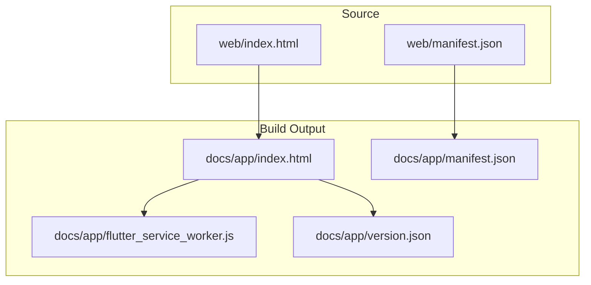
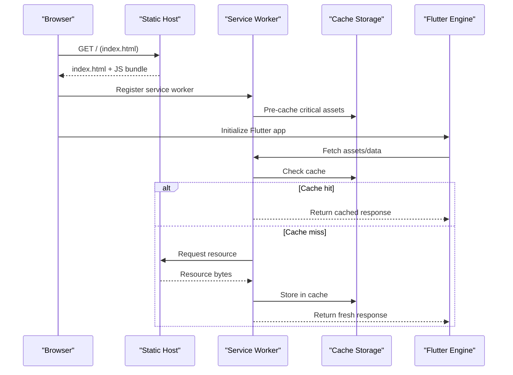
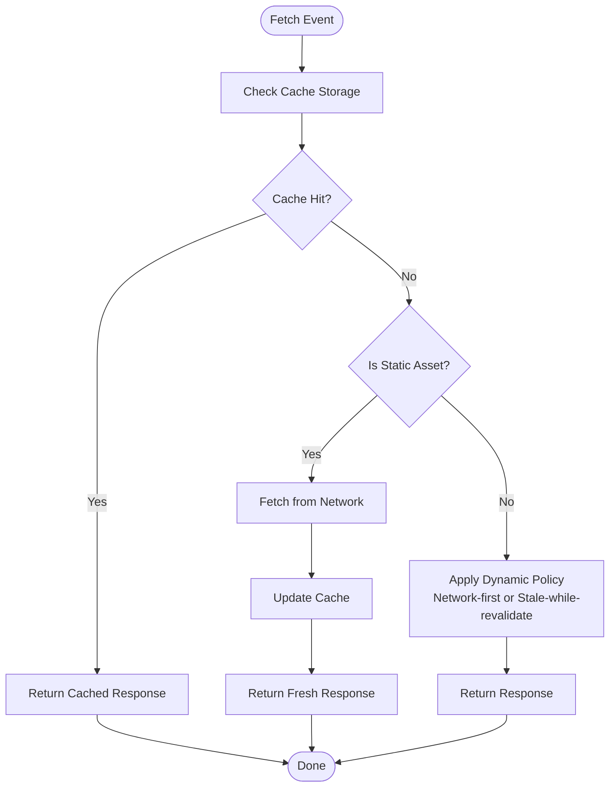
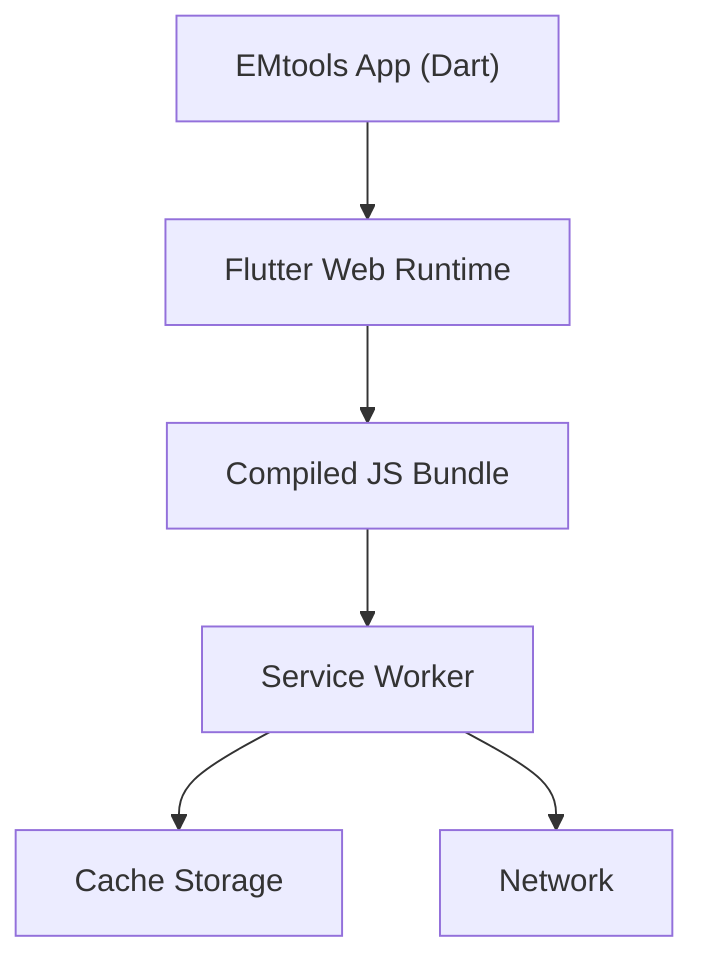

# Web Platform Integration

<cite>
**Referenced Files in This Document**
- [index.html](file://web/index.html)
- [manifest.json](file://web/manifest.json)
- [flutter_service_worker.js](file://docs/app/flutter_service_worker.js)
- [index.html](file://docs/app/index.html)
- [manifest.json](file://docs/app/manifest.json)
- [version.json](file://docs/app/version.json)
- [pubspec.yaml](file://pubspec.yaml)
- [main.dart](file://lib/main.dart)
- [deploy.yml](file://.github/workflows/deploy.yml)
</cite>

## Table of Contents
1. [Introduction](#introduction)
2. [Project Structure](#project-structure)
3. [Core Components](#core-components)
4. [Architecture Overview](#architecture-overview)
5. [Detailed Component Analysis](#detailed-component-analysis)
6. [Dependency Analysis](#dependency-analysis)
7. [Performance Considerations](#performance-considerations)
8. [Troubleshooting Guide](#troubleshooting-guide)
9. [Conclusion](#conclusion)
10. [Appendices](#appendices)

## Introduction
This document explains how EMtools integrates with the Web platform using Flutter for web. It covers the web entry point configuration, Progressive Web App (PWA) setup, browser-specific optimizations, and strategies for offline capabilities and caching of medical reference data. It also addresses bundle size considerations, cross-browser compatibility, deployment strategies, hosting requirements, security considerations for medical applications, and guidance for implementing web-specific features such as print functionality and responsive design adaptations.

## Project Structure
The repository includes both a source-level web directory and a generated build output under docs/app. The key web-related files are:
- Source-level web entry and manifest: web/index.html, web/manifest.json
- Generated build artifacts: docs/app/index.html, docs/app/manifest.json, docs/app/flutter_service_worker.js, docs/app/version.json

**Diagram sources**
- [index.html](file://web/index.html)
- [manifest.json](file://web/manifest.json)
- [index.html](file://docs/app/index.html)
- [manifest.json](file://docs/app/manifest.json)
- [flutter_service_worker.js](file://docs/app/flutter_service_worker.js)
- [version.json](file://docs/app/version.json)

**Section sources**
- [index.html](file://web/index.html)
- [manifest.json](file://web/manifest.json)
- [index.html](file://docs/app/index.html)
- [manifest.json](file://docs/app/manifest.json)
- [flutter_service_worker.js](file://docs/app/flutter_service_worker.js)
- [version.json](file://docs/app/version.json)

## Core Components
- Web entry point: The HTML file that bootstraps the Flutter web app and loads the compiled JavaScript bundle.
- Web manifest: Declares PWA metadata such as name, icons, theme color, display mode, and start URL.
- Service worker: Manages caching and offline behavior for the Flutter web build.
- Version file: Provides version information used by the service worker to bust caches on updates.
- Application initialization: The Dart entrypoint that initializes the Flutter engine and runs the app.

Key responsibilities:
- Entry point configures the canvas renderer, theme colors, and asset base path.
- Manifest enables installability and defines app appearance.
- Service worker implements caching strategies for static assets and API responses.
- Versioning ensures users receive updated bundles after deployments.

**Section sources**
- [index.html](file://web/index.html)
- [manifest.json](file://web/manifest.json)
- [flutter_service_worker.js](file://docs/app/flutter_service_worker.js)
- [version.json](file://docs/app/version.json)
- [main.dart](file://lib/main.dart)

## Architecture Overview
Flutter compiles Dart code to JavaScript (and optionally WASM) for the web. The generated build outputs include an HTML shell, a service worker, and a version file. The service worker intercepts network requests and serves cached resources when available, enabling fast cold starts and partial offline support.

**Diagram sources**
- [index.html](file://docs/app/index.html)
- [flutter_service_worker.js](file://docs/app/flutter_service_worker.js)
- [version.json](file://docs/app/version.json)

## Detailed Component Analysis

### Web Entry Point Configuration
- Purpose: Bootstrap the Flutter web application, set up the canvas renderer, define theme colors, and configure the asset base path.
- Typical responsibilities:
  - Load the compiled Flutter JavaScript bundle.
  - Provide meta tags for SEO and mobile readiness.
  - Configure initial viewport and theme colors.
  - Set the asset base path for assets served from the web root.
- Cross-browser notes:
  - Ensure the canvas renderer is supported; fallbacks can be configured if needed.
  - Avoid deprecated APIs and ensure CSP allows required script execution.

Implementation references:
- [Web entry point](file://web/index.html)
- [Generated web entry point](file://docs/app/index.html)

**Section sources**
- [index.html](file://web/index.html)
- [index.html](file://docs/app/index.html)

### Web Manifest Configuration
- Purpose: Define PWA metadata for installability and user experience.
- Key fields:
  - Name and short name for display.
  - Start URL to open when launched.
  - Display mode (e.g., standalone or fullscreen).
  - Theme and background colors.
  - Icons in multiple sizes for splash screens and taskbar.
- Best practices:
  - Include high-resolution icons for various densities.
  - Use a consistent theme color across the app.
  - Validate with Lighthouse or similar tools.

Implementation references:
- [Web manifest](file://web/manifest.json)
- [Generated manifest](file://docs/app/manifest.json)

**Section sources**
- [manifest.json](file://web/manifest.json)
- [manifest.json](file://docs/app/manifest.json)

### Service Worker Setup and Caching Strategies
- Purpose: Enable fast loading and partial offline access by caching static assets and selectively caching dynamic content.
- Responsibilities:
  - Install phase: pre-cache critical assets (HTML, CSS, JS, fonts, icons).
  - Activate phase: clean up old caches based on versioning.
  - Fetch phase: implement cache-first for static assets and network-first for API calls.
- Versioning:
  - Use the version file to invalidate caches on new deployments.
- Medical data considerations:
  - Prefer cache-first for large, immutable reference datasets.
  - Use network-first for patient-specific or frequently changing data.
  - Implement stale-while-revalidate patterns where appropriate.

Implementation references:
- [Service worker](file://docs/app/flutter_service_worker.js)
- [Version file](file://docs/app/version.json)

**Diagram sources**
- [flutter_service_worker.js](file://docs/app/flutter_service_worker.js)
- [version.json](file://docs/app/version.json)

**Section sources**
- [flutter_service_worker.js](file://docs/app/flutter_service_worker.js)
- [version.json](file://docs/app/version.json)

### Flutter Web Initialization and Platform Differences
- Entry point: The Dart main function initializes the Flutter engine and runs the app.
- Platform detection:
  - Use platform checks to conditionally execute web-only features (e.g., printing, clipboard).
- Web APIs access:
  - Local storage: use a persistence package compatible with web (e.g., shared_preferences with web support).
  - Offline capabilities: rely on service worker caching for assets and consider IndexedDB via packages for larger datasets.
  - Browser features: integrate with window, navigator, and document APIs through web-specific packages.
- Rendering:
  - CanvasKit provides high-fidelity rendering but increases bundle size; Skia HTML may reduce size at the cost of some features.

Implementation references:
- [Dart entrypoint](file://lib/main.dart)
- [Dependencies](file://pubspec.yaml)

**Section sources**
- [main.dart](file://lib/main.dart)
- [pubspec.yaml](file://pubspec.yaml)

### Web-Specific Features: Print and Responsive Design
- Print functionality:
  - Use web-only packages to trigger browser print dialogs and style print layouts.
  - Ensure sensitive medical data is not inadvertently printed; provide clear controls.
- Responsive design:
  - Leverage Flutter’s layout system to adapt UI for desktop, tablet, and mobile viewports.
  - Optimize images and assets for different screen densities.
  - Test keyboard navigation and accessibility features on web.

[No sources needed since this section provides general guidance]

## Dependency Analysis
Flutter web builds depend on the Dart SDK and Flutter framework. Additional dependencies may include:
- Persistence libraries for local storage on web.
- Service worker management utilities.
- Printing and clipboard packages for web-specific features.

**Diagram sources**
- [main.dart](file://lib/main.dart)
- [flutter_service_worker.js](file://docs/app/flutter_service_worker.js)
- [version.json](file://docs/app/version.json)

**Section sources**
- [pubspec.yaml](file://pubspec.yaml)
- [flutter_service_worker.js](file://docs/app/flutter_service_worker.js)

## Performance Considerations
- Bundle size:
  - Prefer CanvasKit only when necessary due to larger payload; evaluate Skia HTML for smaller bundles.
  - Tree-shake unused code and avoid heavy third-party libraries.
  - Compress assets and use efficient formats (e.g., WebP, AVIF).
- Caching strategy:
  - Cache immutable assets aggressively with long-lived cache headers.
  - Use versioned filenames and service worker cache busting for updates.
  - Apply stale-while-revalidate for frequently accessed but slowly changing data.
- Rendering performance:
  - Minimize repaints and rebuilds in Flutter widgets.
  - Use const constructors and isolate heavy computations.
- Network optimization:
  - Enable HTTP/2 and gzip/brotli compression on the host.
  - Use CDN for static assets and medical reference data.

[No sources needed since this section provides general guidance]

## Troubleshooting Guide
Common issues and resolutions:
- Service worker not updating:
  - Verify version file changes and ensure cache invalidation logic is present.
  - Clear browser cache or force reload during development.
- Offline mode not working:
  - Confirm service worker registration and pre-caching steps.
  - Check network policies and CORS settings for API endpoints.
- Large bundle size:
  - Analyze build output and remove unused dependencies.
  - Evaluate rendering backend options and asset optimization.
- Cross-browser inconsistencies:
  - Test on Chrome, Edge, Firefox, Safari.
  - Avoid non-standard APIs; use polyfills or feature detection where necessary.

**Section sources**
- [flutter_service_worker.js](file://docs/app/flutter_service_worker.js)
- [version.json](file://docs/app/version.json)

## Conclusion
EMtools leverages Flutter’s web capabilities to deliver a responsive, installable, and partially offline-capable medical reference application. By configuring the web entry point, manifest, and service worker appropriately, and by applying robust caching and performance strategies, the app can provide reliable access to critical medical data across devices and browsers. Security and privacy must remain paramount, especially when handling sensitive information.

[No sources needed since this section summarizes without analyzing specific files]

## Appendices

### Deployment and Hosting Requirements
- Static hosting:
  - Serve the docs/app directory over HTTPS.
  - Configure proper MIME types and compression.
- CI/CD:
  - Automate builds and deployments using GitHub Actions.
- Versioning:
  - Increment version.json on each release to ensure cache busting.

**Section sources**
- [deploy.yml](file://.github/workflows/deploy.yml)
- [version.json](file://docs/app/version.json)

### Security Considerations for Medical Applications
- Transport security:
  - Enforce HTTPS everywhere.
- Content Security Policy:
  - Restrict script sources and disallow inline scripts where possible.
- Data protection:
  - Avoid storing PHI in client-side storage unless encrypted and justified.
  - Implement authentication and authorization at the server layer.
- Privacy:
  - Minimize logging and telemetry; comply with applicable regulations.

[No sources needed since this section provides general guidance]