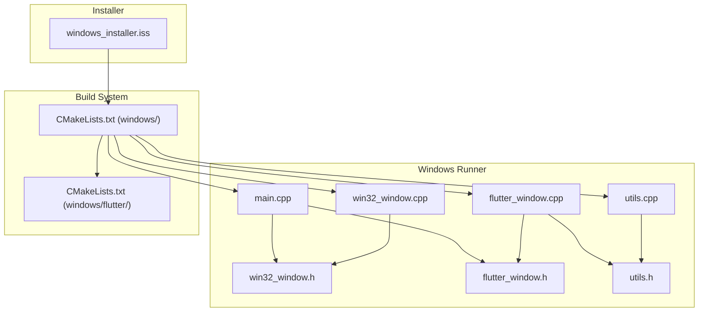
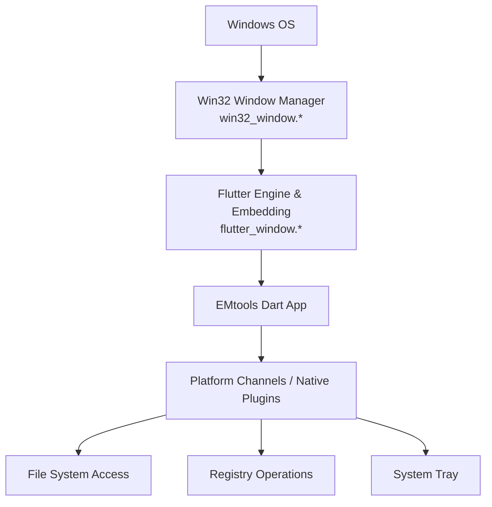
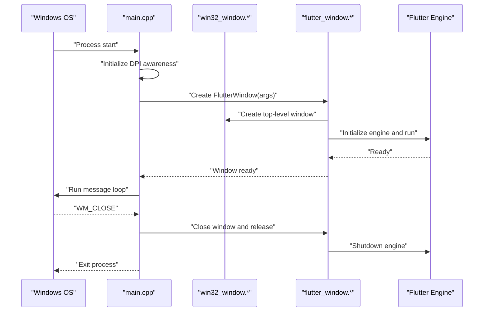
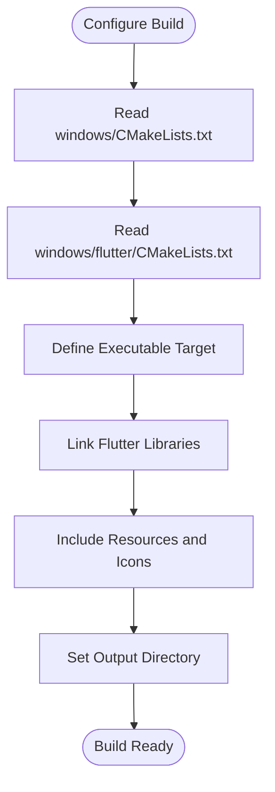
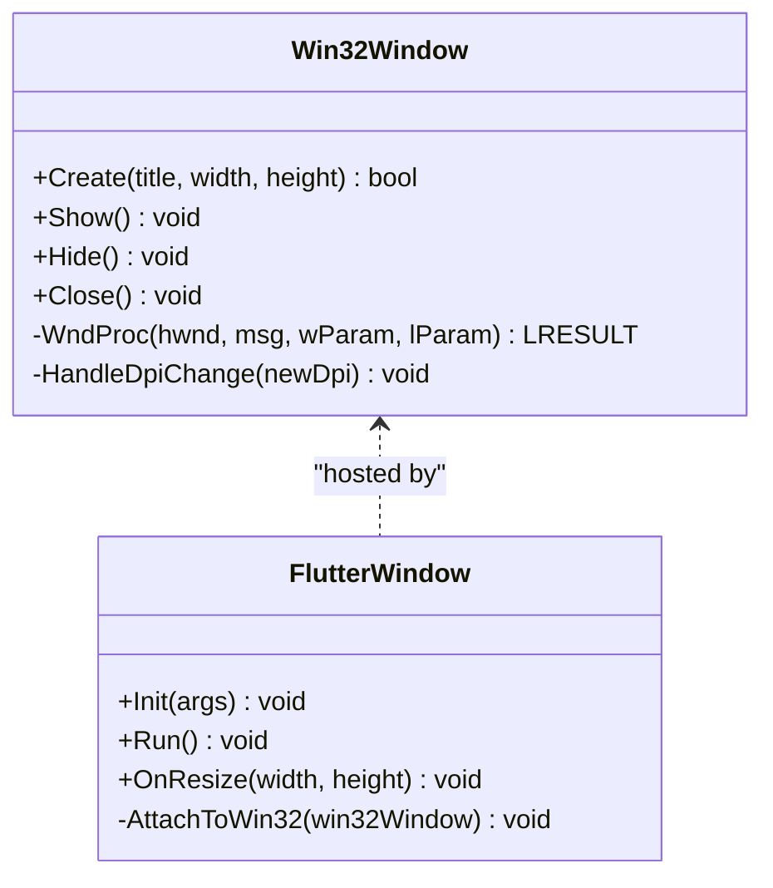
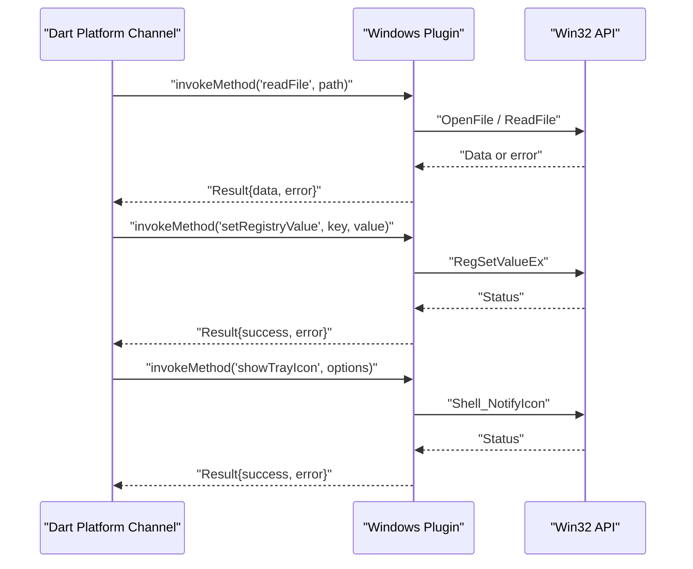
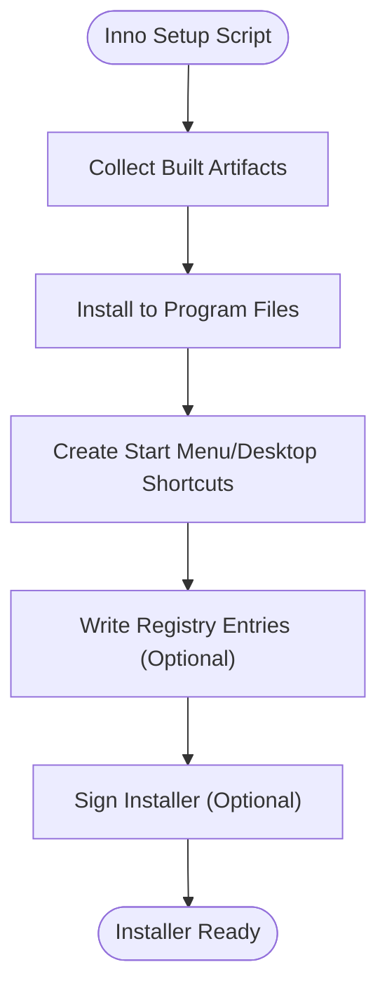
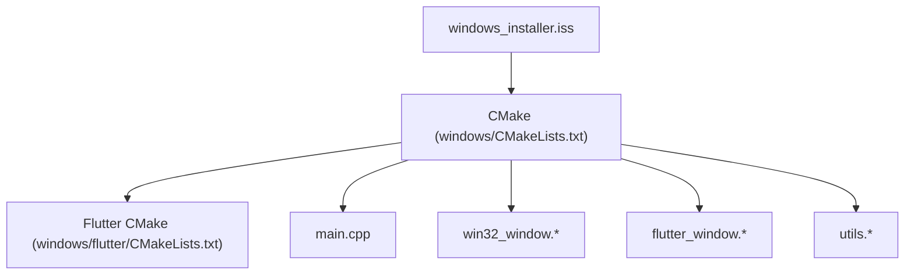

# Windows Desktop Integration

<cite>
**Referenced Files in This Document**
- [windows/CMakeLists.txt](file://windows/CMakeLists.txt)
- [windows/flutter/CMakeLists.txt](file://windows/flutter/CMakeLists.txt)
- [windows/runner/main.cpp](file://windows/runner/main.cpp)
- [windows/runner/win32_window.h](file://windows/runner/win32_window.h)
- [windows/runner/win32_window.cpp](file://windows/runner/win32_window.cpp)
- [windows/runner/flutter_window.h](file://windows/runner/flutter_window.h)
- [windows/runner/flutter_window.cpp](file://windows/runner/flutter_window.cpp)
- [windows/runner/utils.h](file://windows/runner/utils.h)
- [windows/runner/utils.cpp](file://windows/runner/utils.cpp)
- [windows_installer.iss](file://windows_installer.iss)
</cite>

## Table of Contents
1. [Introduction](#introduction)
2. [Project Structure](#project-structure)
3. [Core Components](#core-components)
4. [Architecture Overview](#architecture-overview)
5. [Detailed Component Analysis](#detailed-component-analysis)
6. [Dependency Analysis](#dependency-analysis)
7. [Performance Considerations](#performance-considerations)
8. [Troubleshooting Guide](#troubleshooting-guide)
9. [Conclusion](#conclusion)
10. [Appendices](#appendices)

## Introduction
This document explains how EMtools integrates with the Windows desktop platform using Flutter’s Windows embedding. It covers the application entry point, CMake build configuration, Win32 window management, and how Flutter bridges to native Windows APIs for file system access, registry operations, and system tray functionality. It also documents installer creation with Inno Setup, packaging and distribution strategies, Windows-specific optimizations (including multi-monitor support), deployment considerations, digital signing requirements, enterprise deployment options, and examples of implementing Windows-specific medical device integrations and user interactions.

## Project Structure
The Windows integration is implemented under the windows directory. The key components are:
- CMake configuration files that define targets and link Flutter libraries
- A Win32 runner that creates the OS window and hosts the Flutter engine
- Utilities for path conversion and resource handling
- An Inno Setup script for building installers

**Diagram sources**
- [windows/CMakeLists.txt](file://windows/CMakeLists.txt)
- [windows/flutter/CMakeLists.txt](file://windows/flutter/CMakeLists.txt)
- [windows/runner/main.cpp](file://windows/runner/main.cpp)
- [windows/runner/win32_window.h](file://windows/runner/win32_window.h)
- [windows/runner/win32_window.cpp](file://windows/runner/win32_window.cpp)
- [windows/runner/flutter_window.h](file://windows/runner/flutter_window.h)
- [windows/runner/flutter_window.cpp](file://windows/runner/flutter_window.cpp)
- [windows/runner/utils.h](file://windows/runner/utils.h)
- [windows/runner/utils.cpp](file://windows/runner/utils.cpp)
- [windows_installer.iss](file://windows_installer.iss)

**Section sources**
- [windows/CMakeLists.txt](file://windows/CMakeLists.txt)
- [windows/flutter/CMakeLists.txt](file://windows/flutter/CMakeLists.txt)
- [windows/runner/main.cpp](file://windows/runner/main.cpp)
- [windows/runner/win32_window.h](file://windows/runner/win32_window.h)
- [windows/runner/win32_window.cpp](file://windows/runner/win32_window.cpp)
- [windows/runner/flutter_window.h](file://windows/runner/flutter_window.h)
- [windows/runner/flutter_window.cpp](file://windows/runner/flutter_window.cpp)
- [windows/runner/utils.h](file://windows/runner/utils.h)
- [windows/runner/utils.cpp](file://windows/runner/utils.cpp)
- [windows_installer.iss](file://windows_installer.iss)

## Core Components
- Application entry point: Initializes the Windows runtime, sets up command-line arguments, and starts the Flutter engine via a FlutterWindow instance.
- Win32 window manager: Creates and manages the top-level Win32 window, handles lifecycle events, DPI awareness, and message loop integration.
- Flutter window bridge: Hosts the Flutter engine within the Win32 window, forwards window messages, and coordinates resizing and focus.
- Utilities: Provide helpers for converting between Dart paths and Windows paths, and for accessing resources or environment information.
- Build configuration: CMake files define the executable target, link Flutter libraries, and configure resources and output directories.
- Installer: Inno Setup script packages the built artifacts into an MSI/EXE installer.

**Section sources**
- [windows/runner/main.cpp](file://windows/runner/main.cpp)
- [windows/runner/win32_window.h](file://windows/runner/win32_window.h)
- [windows/runner/win32_window.cpp](file://windows/runner/win32_window.cpp)
- [windows/runner/flutter_window.h](file://windows/runner/flutter_window.h)
- [windows/runner/flutter_window.cpp](file://windows/runner/flutter_window.cpp)
- [windows/runner/utils.h](file://windows/runner/utils.h)
- [windows/runner/utils.cpp](file://windows/runner/utils.cpp)
- [windows/CMakeLists.txt](file://windows/CMakeLists.txt)
- [windows/flutter/CMakeLists.txt](file://windows/flutter/CMakeLists.txt)
- [windows_installer.iss](file://windows_installer.iss)

## Architecture Overview
The Windows architecture layers from OS to app:
- Win32 layer: Provides the top-level window and message pump.
- Flutter embedding layer: Bridges Win32 window events to the Flutter engine and renders UI on GPU-accelerated backends.
- Dart/Flutter layer: Implements business logic and UI; calls into platform channels to access Windows features.
- Native plugins: Implement platform channels for file system, registry, and system tray operations.

**Diagram sources**
- [windows/runner/win32_window.h](file://windows/runner/win32_window.h)
- [windows/runner/win32_window.cpp](file://windows/runner/win32_window.cpp)
- [windows/runner/flutter_window.h](file://windows/runner/flutter_window.h)
- [windows/runner/flutter_window.cpp](file://windows/runner/flutter_window.cpp)

## Detailed Component Analysis

### Windows Application Entry Point
Responsibilities:
- Initialize process-wide settings such as DPI awareness and console attachment if needed.
- Parse command-line arguments and pass them to the Flutter engine.
- Create and run the FlutterWindow instance, which hosts the Flutter engine.
- Manage the Windows message loop until the app exits.

Key behaviors:
- Sets high-DPI awareness before creating any windows.
- Ensures the Flutter engine is initialized once and reused across the lifetime of the process.
- Handles graceful shutdown by closing the Flutter window and releasing resources.

**Diagram sources**
- [windows/runner/main.cpp](file://windows/runner/main.cpp)
- [windows/runner/win32_window.h](file://windows/runner/win32_window.h)
- [windows/runner/win32_window.cpp](file://windows/runner/win32_window.cpp)
- [windows/runner/flutter_window.h](file://windows/runner/flutter_window.h)
- [windows/runner/flutter_window.cpp](file://windows/runner/flutter_window.cpp)

**Section sources**
- [windows/runner/main.cpp](file://windows/runner/main.cpp)
- [windows/runner/win32_window.h](file://windows/runner/win32_window.h)
- [windows/runner/win32_window.cpp](file://windows/runner/win32_window.cpp)
- [windows/runner/flutter_window.h](file://windows/runner/flutter_window.h)
- [windows/runner/flutter_window.cpp](file://windows/runner/flutter_window.cpp)

### CMake Build Configuration
Responsibilities:
- Define the Windows executable target and link against Flutter libraries.
- Configure include directories, compile definitions, and output directories.
- Integrate generated plugin registrant code and assets.
- Support Debug/Release configurations and optional code signing steps.

Key aspects:
- Top-level CMakeLists.txt aggregates targets and dependencies.
- Flutter-specific CMakeLists.txt configures the Flutter engine and embedding library.
- Resource files and icons can be included via custom commands or additional targets.

**Diagram sources**
- [windows/CMakeLists.txt](file://windows/CMakeLists.txt)
- [windows/flutter/CMakeLists.txt](file://windows/flutter/CMakeLists.txt)

**Section sources**
- [windows/CMakeLists.txt](file://windows/CMakeLists.txt)
- [windows/flutter/CMakeLists.txt](file://windows/flutter/CMakeLists.txt)

### Win32 Window Management
Responsibilities:
- Create the top-level window with appropriate styles and DPI awareness.
- Handle window messages (resize, move, close, focus).
- Coordinate with the Flutter embedding to update rendering bounds.
- Ensure proper cleanup on exit.

Key behaviors:
- Uses Win32 APIs to register window classes and create windows.
- Processes WM_SIZE and WM_DPICHANGED to maintain correct layout and scaling.
- Integrates with the Flutter window host to forward events.

**Diagram sources**
- [windows/runner/win32_window.h](file://windows/runner/win32_window.h)
- [windows/runner/win32_window.cpp](file://windows/runner/win32_window.cpp)
- [windows/runner/flutter_window.h](file://windows/runner/flutter_window.h)
- [windows/runner/flutter_window.cpp](file://windows/runner/flutter_window.cpp)

**Section sources**
- [windows/runner/win32_window.h](file://windows/runner/win32_window.h)
- [windows/runner/win32_window.cpp](file://windows/runner/win32_window.cpp)
- [windows/runner/flutter_window.h](file://windows/runner/flutter_window.h)
- [windows/runner/flutter_window.cpp](file://windows/runner/flutter_window.cpp)

### Flutter Integration with Windows Native APIs
Integration points:
- File system access: Use platform channels to call Windows APIs for reading/writing files, enumerating directories, and handling long paths.
- Registry operations: Access HKCU/HKLM keys for configuration and telemetry, ensuring proper permissions and error handling.
- System tray: Show/hide the app icon, handle context menu actions, and manage notifications.

Implementation patterns:
- Dart side defines method channels and invokes platform-specific implementations.
- Windows side implements handlers in native code or through a plugin, marshaling data between Dart and Win32 types.
- Error propagation uses structured results with codes and messages.

[No diagram sources since this diagram shows conceptual integration patterns]

**Section sources**
- [windows/runner/utils.h](file://windows/runner/utils.h)
- [windows/runner/utils.cpp](file://windows/runner/utils.cpp)

### Windows Installer Creation with Inno Setup
Responsibilities:
- Package the built executable and required DLLs.
- Define installation paths, shortcuts, and uninstaller behavior.
- Optionally perform post-install tasks like registering file associations or writing registry entries.

Key elements:
- SourceDir and DestDir configuration for artifact placement.
- Tasks for optional features (e.g., adding to PATH or startup).
- Signing directives for code signing during build.

**Diagram sources**
- [windows_installer.iss](file://windows_installer.iss)

**Section sources**
- [windows_installer.iss](file://windows_installer.iss)

## Dependency Analysis
The Windows runner depends on Flutter’s embedding and Win32 APIs. CMake orchestrates linking and resource inclusion. The installer consumes the final artifacts produced by the build.

**Diagram sources**
- [windows/CMakeLists.txt](file://windows/CMakeLists.txt)
- [windows/flutter/CMakeLists.txt](file://windows/flutter/CMakeLists.txt)
- [windows/runner/main.cpp](file://windows/runner/main.cpp)
- [windows/runner/win32_window.h](file://windows/runner/win32_window.h)
- [windows/runner/win32_window.cpp](file://windows/runner/win32_window.cpp)
- [windows/runner/flutter_window.h](file://windows/runner/flutter_window.h)
- [windows/runner/flutter_window.cpp](file://windows/runner/flutter_window.cpp)
- [windows/runner/utils.h](file://windows/runner/utils.h)
- [windows/runner/utils.cpp](file://windows/runner/utils.cpp)
- [windows_installer.iss](file://windows_installer.iss)

**Section sources**
- [windows/CMakeLists.txt](file://windows/CMakeLists.txt)
- [windows/flutter/CMakeLists.txt](file://windows/flutter/CMakeLists.txt)
- [windows/runner/main.cpp](file://windows/runner/main.cpp)
- [windows/runner/win32_window.h](file://windows/runner/win32_window.h)
- [windows/runner/win32_window.cpp](file://windows/runner/win32_window.cpp)
- [windows/runner/flutter_window.h](file://windows/runner/flutter_window.h)
- [windows/runner/flutter_window.cpp](file://windows/runner/flutter_window.cpp)
- [windows/runner/utils.h](file://windows/runner/utils.h)
- [windows/runner/utils.cpp](file://windows/runner/utils.cpp)
- [windows_installer.iss](file://windows_installer.iss)

## Performance Considerations
- High-DPI and multi-monitor support:
  - Enable per-monitor DPI awareness at process startup to ensure accurate scaling across monitors.
  - Handle WM_DPICHANGED to adjust window size and Flutter rendering bounds when moving between displays.
  - Avoid heavy work in resize handlers; defer expensive computations to background threads.
- Memory management:
  - Minimize allocations in hot paths (window messages, input handling).
  - Reuse buffers for file I/O and registry reads; avoid repeated string conversions.
  - Release resources promptly on window close and engine shutdown.
- Rendering performance:
  - Prefer hardware-accelerated backends; verify GPU availability and fallback gracefully.
  - Batch updates and reduce unnecessary repaints by coalescing state changes.
- Threading model:
  - Keep UI thread responsive; offload disk/network operations to background tasks.
  - Ensure thread-safe access to shared state and use synchronization primitives where necessary.

[No sources needed since this section provides general guidance]

## Troubleshooting Guide
Common issues and resolutions:
- DPI scaling problems:
  - Verify DPI awareness initialization occurs before any window creation.
  - Confirm WM_DPICHANGED handling updates both Win32 and Flutter bounds.
- Window not responding or freezing:
  - Check that long-running operations are not executed on the UI thread.
  - Validate message loop integrity and ensure no blocking calls inside handlers.
- File system access errors:
  - Inspect return codes from Win32 file APIs and propagate meaningful errors to Dart.
  - Ensure paths are correctly converted between Dart and Windows formats.
- Registry access failures:
  - Confirm requested hive and key exist; handle permission errors gracefully.
  - Log detailed error codes for diagnostics.
- System tray icon missing:
  - Validate Shell_NotifyIcon usage and icon resource validity.
  - Handle cases where Explorer is restarting or tray is unavailable.

**Section sources**
- [windows/runner/win32_window.h](file://windows/runner/win32_window.h)
- [windows/runner/win32_window.cpp](file://windows/runner/win32_window.cpp)
- [windows/runner/flutter_window.h](file://windows/runner/flutter_window.h)
- [windows/runner/flutter_window.cpp](file://windows/runner/flutter_window.cpp)
- [windows/runner/utils.h](file://windows/runner/utils.h)
- [windows/runner/utils.cpp](file://windows/runner/utils.cpp)

## Conclusion
EMtools’ Windows integration leverages Flutter’s embedding to deliver a native desktop experience. The Win32 runner manages the OS window and lifecycle, while Flutter handles UI and business logic. Platform channels enable secure and efficient access to Windows features such as file system, registry, and system tray. CMake builds the executable and links Flutter libraries, and Inno Setup packages the application for distribution. Following the performance and deployment recommendations ensures a robust, scalable, and enterprise-ready Windows desktop application.

[No sources needed since this section summarizes without analyzing specific files]

## Appendices

### Windows Deployment Considerations
- Code signing:
  - Sign the executable and installer to establish trust and satisfy enterprise policies.
  - Integrate signing steps into CI/CD pipelines and store certificates securely.
- Enterprise deployment:
  - Use Group Policy or software distribution tools to deploy installers across domains.
  - Provide silent install switches and preconfigured registry values for centralized management.
- Distribution strategies:
  - Offer both portable and installer variants based on organizational needs.
  - Include versioning and update mechanisms compatible with enterprise environments.

[No sources needed since this section provides general guidance]

### Examples: Windows-Specific Medical Device Integrations
- Device communication:
  - Implement platform channel methods to open device handles, send/receive packets, and handle asynchronous callbacks.
  - Use buffered I/O and timeouts to ensure responsiveness and reliability.
- Data validation and safety:
  - Validate incoming device data against expected schemas and ranges.
  - Log diagnostic information for compliance and auditability.
- User interactions:
  - Provide clear status indicators for device connectivity and errors.
  - Allow users to select devices and configure connection parameters via UI.

[No sources needed since this section provides general guidance]