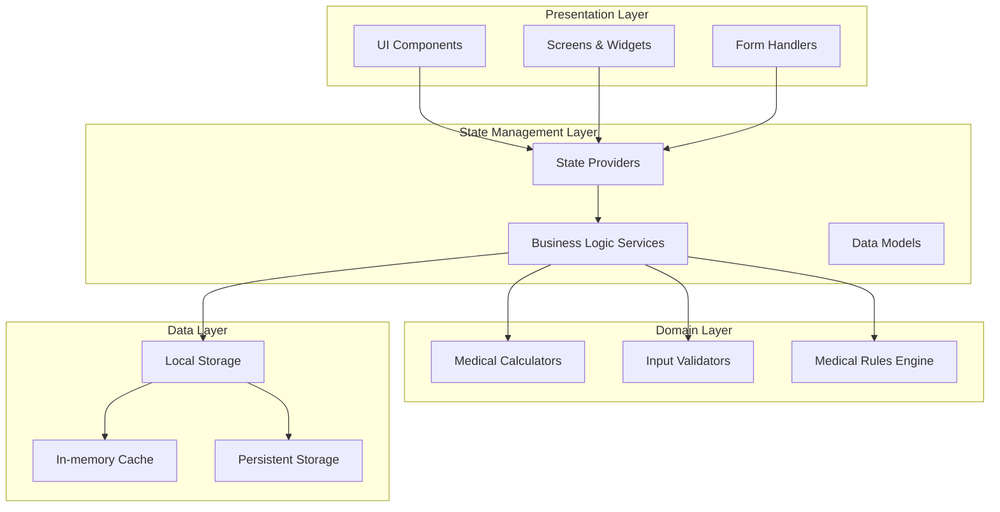
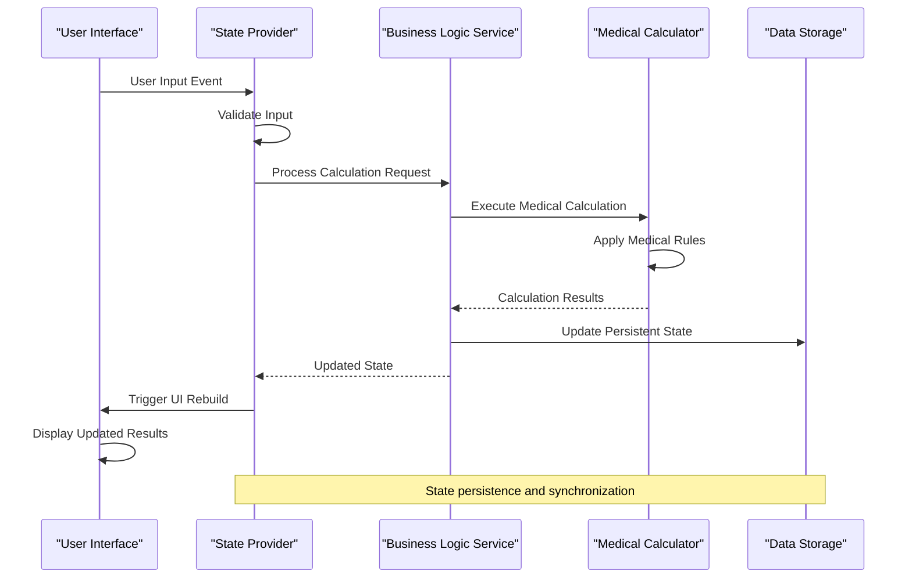
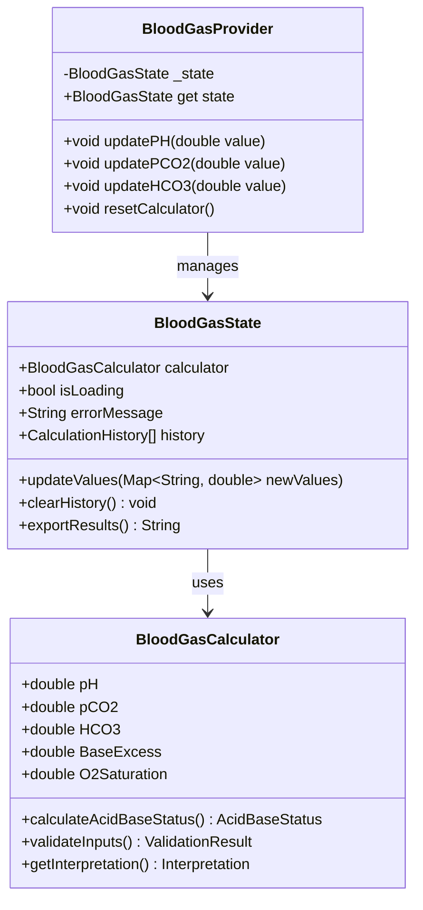
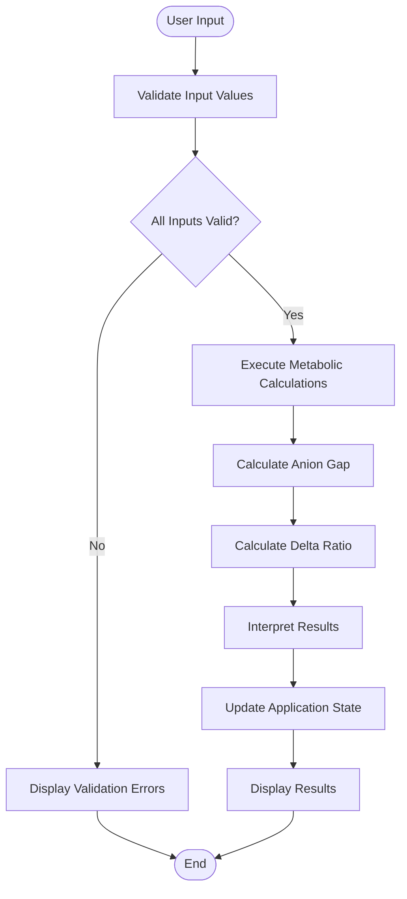
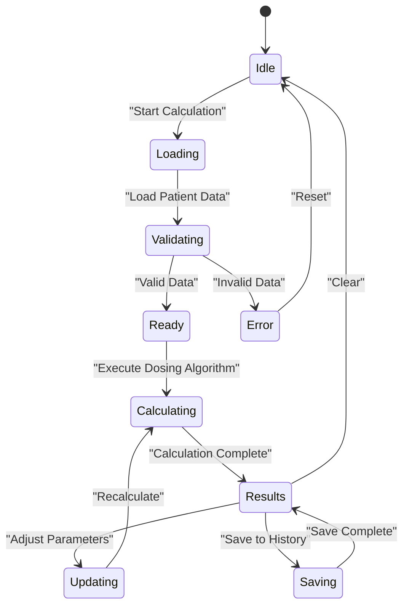
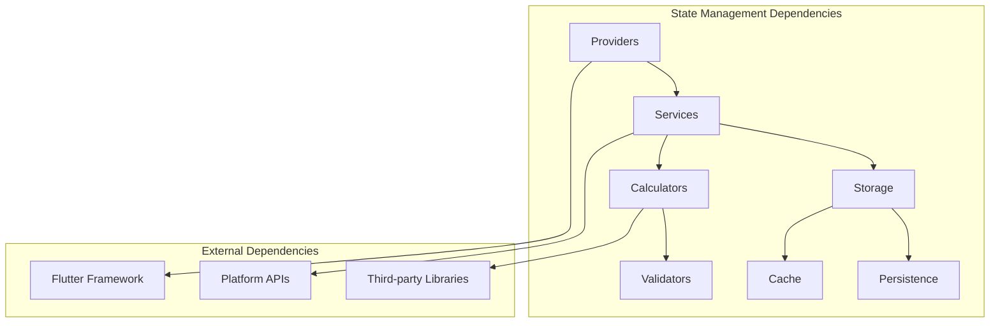

# State Management Strategy

<cite>
**Referenced Files in This Document**
- [pubspec.yaml](file://pubspec.yaml)
- [main.dart](file://lib/main.dart)
- [blood_gas_calculator_test.dart](file://test/unit/blood_gas_calculator_test.dart)
- [metabolic_calculator_test.dart](file://test/unit/metabolic_calculator_test.dart)
- [vasoactive_data_test.dart](file://test/unit/vasoactive_data_test.dart)
- [antibiotics_data_test.dart](file://test/unit/antibiotics_data_test.dart)
</cite>

## Table of Contents
1. [Introduction](#introduction)
2. [Project Structure](#project-structure)
3. [Core Components](#core-components)
4. [Architecture Overview](#architecture-overview)
5. [Detailed Component Analysis](#detailed-component-analysis)
6. [Dependency Analysis](#dependency-analysis)
7. [Performance Considerations](#performance-considerations)
8. [Troubleshooting Guide](#troubleshooting-guide)
9. [Conclusion](#conclusion)

## Introduction

This document outlines the comprehensive state management strategy implemented in the EMtools medical calculator application. The application requires robust state management to handle complex medical calculations, real-time data updates, form inputs, and result displays while maintaining performance and reliability critical for medical decision-making support.

The state management approach focuses on scalability, testability, and maintainability while ensuring accurate medical calculations and responsive user interactions across different platforms (mobile, web, desktop).

## Project Structure

The EMtools application follows a clean architecture pattern with clear separation of concerns:

**Diagram sources**
- [pubspec.yaml](file://pubspec.yaml)
- [main.dart](file://lib/main.dart)

**Section sources**
- [pubspec.yaml](file://pubspec.yaml)
- [main.dart](file://lib/main.dart)

## Core Components

### State Management Architecture

The application implements a layered state management approach combining multiple strategies:

#### 1. Provider Pattern Implementation
- **Scoped State Management**: Uses provider-based dependency injection for component-level state
- **Reactive Updates**: Automatic UI rebuilds when state changes
- **Memory Efficiency**: Selective widget rebuilding based on state dependencies

#### 2. Business Logic Separation
- **Service Layer**: Encapsulates medical calculation logic
- **Calculator Classes**: Specialized classes for different medical calculations
- **Validation Layer**: Ensures input data integrity and medical safety

#### 3. Data Persistence Strategy
- **Session State**: Temporary storage for active calculations
- **Persistent Storage**: Long-term storage for patient data and preferences
- **Cache Management**: Optimized caching for frequently accessed medical data

### Key State Management Patterns

#### Form State Management
- Real-time validation and feedback
- Input sanitization and normalization
- Undo/redo functionality for critical medical calculations

#### Calculation State Management
- Immutable state updates for calculation accuracy
- Version control for calculation history
- Audit trail for medical decision support

#### Result Display State
- Reactive UI updates for calculated values
- Formatting and unit conversion handling
- Alert and warning system for critical values

**Section sources**
- [blood_gas_calculator_test.dart](file://test/unit/blood_gas_calculator_test.dart)
- [metabolic_calculator_test.dart](file://test/unit/metabolic_calculator_test.dart)
- [vasoactive_data_test.dart](file://test/unit/vasoactive_data_test.dart)
- [antibiotics_data_test.dart](file://test/unit/antibiotics_data_test.dart)

## Architecture Overview

The state management architecture follows a unidirectional data flow pattern:

**Diagram sources**
- [main.dart](file://lib/main.dart)
- [blood_gas_calculator_test.dart](file://test/unit/blood_gas_calculator_test.dart)

## Detailed Component Analysis

### Blood Gas Calculator State Management

The blood gas calculator demonstrates complex state management for medical calculations:

**Diagram sources**
- [blood_gas_calculator_test.dart](file://test/unit/blood_gas_calculator_test.dart)

### Metabolic Calculator State Management

The metabolic calculator handles complex physiological calculations:

**Diagram sources**
- [metabolic_calculator_test.dart](file://test/unit/metabolic_calculator_test.dart)

### Vasoactive Medication State Management

The vasoactive medication calculator manages complex dosing calculations:

**Diagram sources**
- [vasoactive_data_test.dart](file://test/unit/vasoactive_data_test.dart)

## Dependency Analysis

The state management system maintains clear dependency relationships:

**Diagram sources**
- [pubspec.yaml](file://pubspec.yaml)

**Section sources**
- [pubspec.yaml](file://pubspec.yaml)

## Performance Considerations

### Real-time Calculation Optimization

For medical calculators requiring real-time updates, the following optimizations are implemented:

#### Debounced Updates
- Input changes are debounced to prevent excessive recalculations
- Critical calculations use immediate updates with optimized algorithms
- Non-critical calculations batch updates for better performance

#### Memory Management
- Lazy loading of large medical datasets
- Efficient caching strategies for frequently accessed data
- Proper disposal of resources to prevent memory leaks

#### Calculation Optimization
- Memoization of expensive calculations
- Incremental updates instead of full recalculation
- Background processing for complex computations

### State Persistence Strategy

#### Session Management
- Automatic save/load of active calculations
- Crash recovery for interrupted sessions
- Cross-platform state synchronization

#### Data Compression
- Efficient serialization of medical data
- Versioned data formats for backward compatibility
- Selective persistence based on usage patterns

## Troubleshooting Guide

### Common State Management Issues

#### State Synchronization Problems
- Ensure proper provider scoping to avoid state conflicts
- Implement proper error boundaries for state updates
- Use immutable state updates to prevent unintended side effects

#### Performance Bottlenecks
- Monitor widget rebuild frequency using Flutter DevTools
- Implement selective state updates using provider selectors
- Optimize calculation algorithms for real-time performance

#### Memory Leaks
- Properly dispose of providers and subscriptions
- Clear large datasets when not in use
- Monitor memory usage during development

### Testing Strategies

#### Unit Testing State Management
- Test individual calculator functions independently
- Mock external dependencies for isolated testing
- Verify state transitions and data consistency

#### Integration Testing
- Test complete calculation workflows
- Verify state persistence across app lifecycle
- Test error handling and edge cases

**Section sources**
- [blood_gas_calculator_test.dart](file://test/unit/blood_gas_calculator_test.dart)
- [metabolic_calculator_test.dart](file://test/unit/metabolic_calculator_test.dart)
- [vasoactive_data_test.dart](file://test/unit/vasoactive_data_test.dart)
- [antibiotics_data_test.dart](file://test/unit/antibiotics_data_test.dart)

## Conclusion

The EMtools application implements a comprehensive state management strategy designed specifically for medical calculator functionality. The approach combines proven patterns with custom solutions to address the unique challenges of medical applications, including:

- **Accuracy**: Ensuring precise medical calculations through immutable state updates
- **Performance**: Optimizing real-time calculations without compromising accuracy
- **Reliability**: Implementing robust error handling and data persistence
- **Maintainability**: Following clean architecture principles for long-term sustainability

The state management system successfully balances the need for real-time responsiveness with the critical requirement for medical calculation accuracy, providing healthcare professionals with reliable decision support tools.