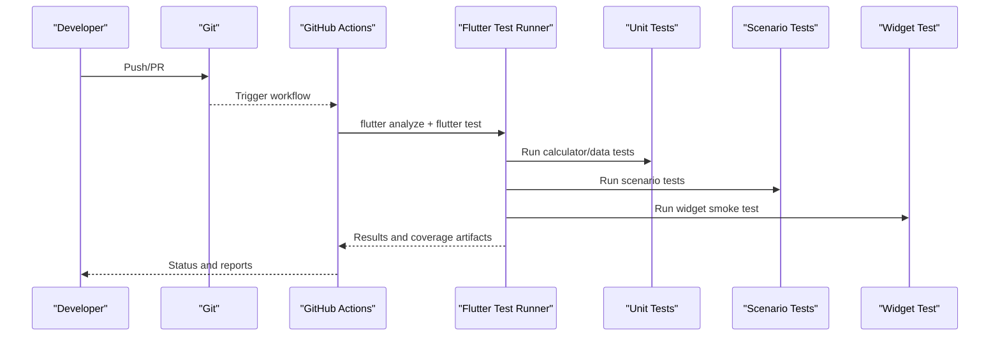
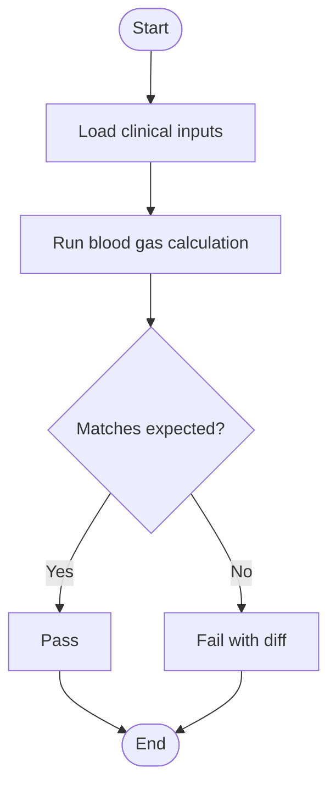
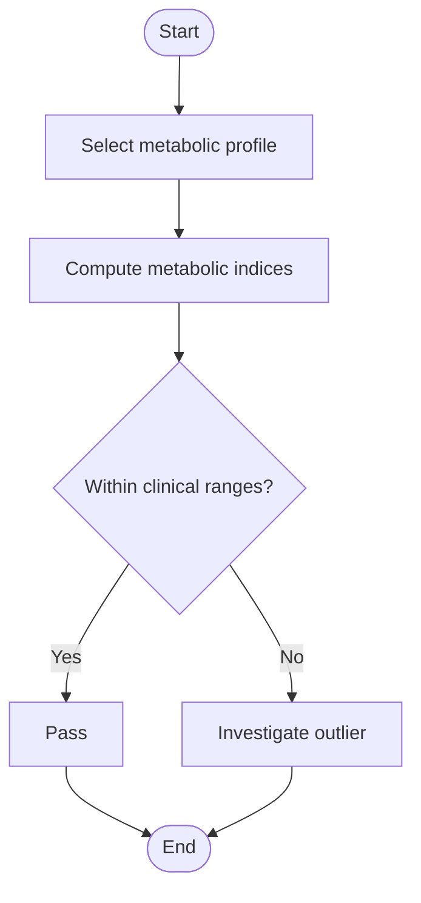
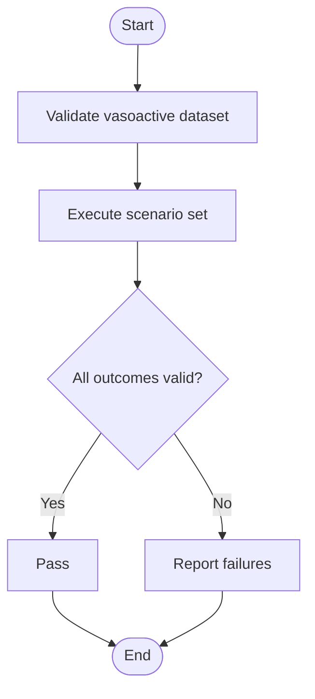
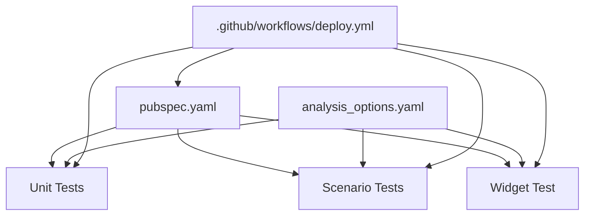

# Testing Framework and Strategy

<cite>
**Referenced Files in This Document**
- [pubspec.yaml](file://pubspec.yaml)
- [analysis_options.yaml](file://analysis_options.yaml)
- [test/widget_test.dart](file://test/widget_test.dart)
- [test/unit/blood_gas_calculator_test.dart](file://test/unit/blood_gas_calculator_test.dart)
- [test/unit/blood_gas_scenarios_test.dart](file://test/unit/blood_gas_scenarios_test.dart)
- [test/unit/metabolic_calculator_test.dart](file://test/unit/metabolic_calculator_test.dart)
- [test/unit/metabolic_scenarios_test.dart](file://test/unit/metabolic_scenarios_test.dart)
- [test/unit/vasoactive_data_test.dart](file://test/unit/vasoactive_data_test.dart)
- [test/unit/vasoactive_scenarios_test.dart](file://test/unit/vasoactive_scenarios_test.dart)
- [test/unit/antibiotics_data_test.dart](file://test/unit/antibiotics_data_test.dart)
- [test/unit/sedation_data_test.dart](file://test/unit/sedation_data_test.dart)
- [test/unit/calculators_data_test.dart](file://test/unit/calculators_data_test.dart)
- [.github/workflows/deploy.yml](file://.github/workflows/deploy.yml)
</cite>

## Table of Contents
1. [Introduction](#introduction)
2. [Project Structure](#project-structure)
3. [Core Components](#core-components)
4. [Architecture Overview](#architecture-overview)
5. [Detailed Component Analysis](#detailed-component-analysis)
6. [Dependency Analysis](#dependency-analysis)
7. [Performance Considerations](#performance-considerations)
8. [Troubleshooting Guide](#troubleshooting-guide)
9. [Conclusion](#conclusion)
10. [Appendices](#appendices)

## Introduction
This document describes the testing framework and strategy implemented in EMtools, focusing on a multi-level approach:
- Unit tests for medical calculation algorithms and data integrity
- Widget tests for UI components
- Integration-style scenarios that validate end-to-end workflows using clinical datasets

The goal is to ensure accuracy of medical calculations against known clinical scenarios, robustness of UI interactions, and reliable automation through continuous integration.

## Project Structure
EMtools uses a Flutter-based structure with tests organized under test/:
- unit/: Isolated tests for calculators, data sets, and scenario validations
- widget_test.dart: Basic widget smoke test

```mermaid
graph TB
subgraph "Flutter App"
A["lib/main.dart"]
end
subgraph "Tests"
U1["test/unit/blood_gas_calculator_test.dart"]
U2["test/unit/blood_gas_scenarios_test.dart"]
U3["test/unit/metabolic_calculator_test.dart"]
U4["test/unit/metabolic_scenarios_test.dart"]
U5["test/unit/vasoactive_data_test.dart"]
U6["test/unit/vasoactive_scenarios_test.dart"]
U7["test/unit/antibiotics_data_test.dart"]
U8["test/unit/sedation_data_test.dart"]
U9["test/unit/calculators_data_test.dart"]
W1["test/widget_test.dart"]
end
subgraph "Config"
C1["pubspec.yaml"]
C2["analysis_options.yaml"]
end
subgraph "CI"
CI[".github/workflows/deploy.yml"]
end
A --> U1
A --> U2
A --> U3
A --> U4
A --> U5
A --> U6
A --> U7
A --> U8
A --> U9
A --> W1
CI --> C1
CI --> U1
CI --> U2
CI --> U3
CI --> U4
CI --> U5
CI --> U6
CI --> U7
CI --> U8
CI --> U9
CI --> W1
```

**Diagram sources**
- [pubspec.yaml](file://pubspec.yaml)
- [analysis_options.yaml](file://analysis_options.yaml)
- [test/widget_test.dart](file://test/widget_test.dart)
- [test/unit/blood_gas_calculator_test.dart](file://test/unit/blood_gas_calculator_test.dart)
- [test/unit/blood_gas_scenarios_test.dart](file://test/unit/blood_gas_scenarios_test.dart)
- [test/unit/metabolic_calculator_test.dart](file://test/unit/metabolic_calculator_test.dart)
- [test/unit/metabolic_scenarios_test.dart](file://test/unit/metabolic_scenarios_test.dart)
- [test/unit/vasoactive_data_test.dart](file://test/unit/vasoactive_data_test.dart)
- [test/unit/vasoactive_scenarios_test.dart](file://test/unit/vasoactive_scenarios_test.dart)
- [test/unit/antibiotics_data_test.dart](file://test/unit/antibiotics_data_test.dart)
- [test/unit/sedation_data_test.dart](file://test/unit/sedation_data_test.dart)
- [test/unit/calculators_data_test.dart](file://test/unit/calculators_data_test.dart)
- [.github/workflows/deploy.yml](file://.github/workflows/deploy.yml)

**Section sources**
- [pubspec.yaml](file://pubspec.yaml)
- [analysis_options.yaml](file://analysis_options.yaml)
- [test/widget_test.dart](file://test/widget_test.dart)
- [test/unit/blood_gas_calculator_test.dart](file://test/unit/blood_gas_calculator_test.dart)
- [test/unit/blood_gas_scenarios_test.dart](file://test/unit/blood_gas_scenarios_test.dart)
- [test/unit/metabolic_calculator_test.dart](file://test/unit/metabolic_calculator_test.dart)
- [test/unit/metabolic_scenarios_test.dart](file://test/unit/metabolic_scenarios_test.dart)
- [test/unit/vasoactive_data_test.dart](file://test/unit/vasoactive_data_test.dart)
- [test/unit/vasoactive_scenarios_test.dart](file://test/unit/vasoactive_scenarios_test.dart)
- [test/unit/antibiotics_data_test.dart](file://test/unit/antibiotics_data_test.dart)
- [test/unit/sedation_data_test.dart](file://test/unit/sedation_data_test.dart)
- [test/unit/calculators_data_test.dart](file://test/unit/calculators_data_test.dart)
- [.github/workflows/deploy.yml](file://.github/workflows/deploy.yml)

## Core Components
- Calculator unit tests: Validate core medical calculation functions (e.g., blood gas, metabolic, vasoactive) by asserting expected outputs for given inputs.
- Scenario tests: Use curated clinical datasets to assert realistic end-to-end outcomes across multiple calculators or data flows.
- Data integrity tests: Ensure consistency and completeness of static datasets used by calculators.
- Widget smoke test: Quick check that the app can mount its root widget without errors.

Key patterns observed:
- Deterministic assertions over calculated values
- Scenario-driven tests parameterized by clinical cases
- Data validation checks for completeness and constraints

**Section sources**
- [test/unit/blood_gas_calculator_test.dart](file://test/unit/blood_gas_calculator_test.dart)
- [test/unit/blood_gas_scenarios_test.dart](file://test/unit/blood_gas_scenarios_test.dart)
- [test/unit/metabolic_calculator_test.dart](file://test/unit/metabolic_calculator_test.dart)
- [test/unit/metabolic_scenarios_test.dart](file://test/unit/metabolic_scenarios_test.dart)
- [test/unit/vasoactive_data_test.dart](file://test/unit/vasoactive_data_test.dart)
- [test/unit/vasoactive_scenarios_test.dart](file://test/unit/vasoactive_scenarios_test.dart)
- [test/unit/antibiotics_data_test.dart](file://test/unit/antibiotics_data_test.dart)
- [test/unit/sedation_data_test.dart](file://test/unit/sedation_data_test.dart)
- [test/unit/calculators_data_test.dart](file://test/unit/calculators_data_test.dart)
- [test/widget_test.dart](file://test/widget_test.dart)

## Architecture Overview
The testing architecture separates concerns into layers:
- Unit layer: Pure function verification and dataset validation
- Scenario layer: Multi-step validations using real-world-like inputs
- Widget layer: UI mounting and basic interaction smoke tests
- CI layer: Automated execution of tests and analysis on push/PR events



**Diagram sources**
- [.github/workflows/deploy.yml](file://.github/workflows/deploy.yml)
- [test/unit/blood_gas_calculator_test.dart](file://test/unit/blood_gas_calculator_test.dart)
- [test/unit/blood_gas_scenarios_test.dart](file://test/unit/blood_gas_scenarios_test.dart)
- [test/unit/metabolic_calculator_test.dart](file://test/unit/metabolic_calculator_test.dart)
- [test/unit/metabolic_scenarios_test.dart](file://test/unit/metabolic_scenarios_test.dart)
- [test/unit/vasoactive_data_test.dart](file://test/unit/vasoactive_data_test.dart)
- [test/unit/vasoactive_scenarios_test.dart](file://test/unit/vasoactive_scenarios_test.dart)
- [test/unit/antibiotics_data_test.dart](file://test/unit/antibiotics_data_test.dart)
- [test/unit/sedation_data_test.dart](file://test/unit/sedation_data_test.dart)
- [test/unit/calculators_data_test.dart](file://test/unit/calculators_data_test.dart)
- [test/widget_test.dart](file://test/widget_test.dart)

## Detailed Component Analysis

### Blood Gas Calculators and Scenarios
- Purpose: Verify correctness of blood gas-related calculations and validate them against representative clinical scenarios.
- Patterns:
  - Input-output assertions for deterministic formulas
  - Scenario tables covering edge cases (e.g., extreme pH, PaO2, HCO3-)
- Recommendations:
  - Add tolerance-based comparisons for floating-point results
  - Include boundary conditions and invalid input handling



**Diagram sources**
- [test/unit/blood_gas_calculator_test.dart](file://test/unit/blood_gas_calculator_test.dart)
- [test/unit/blood_gas_scenarios_test.dart](file://test/unit/blood_gas_scenarios_test.dart)

**Section sources**
- [test/unit/blood_gas_calculator_test.dart](file://test/unit/blood_gas_calculator_test.dart)
- [test/unit/blood_gas_scenarios_test.dart](file://test/unit/blood_gas_scenarios_test.dart)

### Metabolic Calculators and Scenarios
- Purpose: Validate metabolic rate and related calculations; ensure scenario-driven correctness.
- Patterns:
  - Parameterized tests over multiple patient profiles
  - Assertions on derived metrics (e.g., energy expenditure, oxygen consumption)
- Recommendations:
  - Normalize units consistently across tests
  - Document reference sources for expected values



**Diagram sources**
- [test/unit/metabolic_calculator_test.dart](file://test/unit/metabolic_calculator_test.dart)
- [test/unit/metabolic_scenarios_test.dart](file://test/unit/metabolic_scenarios_test.dart)

**Section sources**
- [test/unit/metabolic_calculator_test.dart](file://test/unit/metabolic_calculator_test.dart)
- [test/unit/metabolic_scenarios_test.dart](file://test/unit/metabolic_scenarios_test.dart)

### Vasoactive Agents: Data and Scenarios
- Purpose: Ensure vasoactive agent datasets are complete and consistent; verify scenario outcomes.
- Patterns:
  - Data integrity checks (presence of required fields, non-negative values)
  - Scenario assertions for dosing and titration logic
- Recommendations:
  - Add schema validation for dataset entries
  - Cover zero-dose and maximum-capacity boundaries



**Diagram sources**
- [test/unit/vasoactive_data_test.dart](file://test/unit/vasoactive_data_test.dart)
- [test/unit/vasoactive_scenarios_test.dart](file://test/unit/vasoactive_scenarios_test.dart)

**Section sources**
- [test/unit/vasoactive_data_test.dart](file://test/unit/vasoactive_data_test.dart)
- [test/unit/vasoactive_scenarios_test.dart](file://test/unit/vasoactive_scenarios_test.dart)

### Antibiotics and Sedation Data Integrity
- Purpose: Maintain high-quality reference data for antibiotics and sedation calculators.
- Patterns:
  - Non-empty collections, unique identifiers, and constraint checks
- Recommendations:
  - Introduce versioning and provenance metadata for datasets
  - Add cross-reference checks between related datasets

**Section sources**
- [test/unit/antibiotics_data_test.dart](file://test/unit/antibiotics_data_test.dart)
- [test/unit/sedation_data_test.dart](file://test/unit/sedation_data_test.dart)

### Calculators Data Consistency
- Purpose: Centralized validation of shared calculator data structures and constants.
- Patterns:
  - Global invariants (e.g., enum completeness, constant positivity)
- Recommendations:
  - Centralize assertion helpers to reduce duplication

**Section sources**
- [test/unit/calculators_data_test.dart](file://test/unit/calculators_data_test.dart)

### Widget Smoke Test
- Purpose: Ensure the application’s root widget mounts successfully.
- Patterns:
  - Minimal setup to verify no immediate runtime exceptions
- Recommendations:
  - Expand to include key navigation paths and critical user flows

**Section sources**
- [test/widget_test.dart](file://test/widget_test.dart)

## Dependency Analysis
Testing dependencies and configuration:
- pubspec.yaml defines Flutter and test dependencies
- analysis_options.yaml enforces static analysis rules
- GitHub Actions workflow orchestrates analysis and test runs



**Diagram sources**
- [pubspec.yaml](file://pubspec.yaml)
- [analysis_options.yaml](file://analysis_options.yaml)
- [.github/workflows/deploy.yml](file://.github/workflows/deploy.yml)

**Section sources**
- [pubspec.yaml](file://pubspec.yaml)
- [analysis_options.yaml](file://analysis_options.yaml)
- [.github/workflows/deploy.yml](file://.github/workflows/deploy.yml)

## Performance Considerations
- Keep unit tests fast and deterministic; avoid I/O where possible.
- Use small, focused datasets for scenario tests; reserve larger datasets for nightly runs if needed.
- Prefer equality and range checks over heavy serialization/deserialization in hot paths.
- Profile slow tests locally with Flutter’s built-in profiling tools before committing.

[No sources needed since this section provides general guidance]

## Troubleshooting Guide
Common issues and remedies:
- Floating-point mismatches: Use tolerance-based comparisons for approximate equality.
- Missing or malformed datasets: Add explicit schema and constraint checks to fail fast.
- Flaky UI tests: Stabilize timing by pumping frames and avoiding timers; prefer widget tester utilities.
- CI failures: Reproduce locally with the same Flutter channel and cache; inspect logs from the workflow.

Debugging techniques:
- Print intermediate values in failing tests to isolate the step.
- Reduce scenario complexity to minimal reproducer.
- Use Flutter’s devtools to inspect widget trees when UI tests fail.

[No sources needed since this section provides general guidance]

## Conclusion
EMtools employs a layered testing strategy centered on accurate medical calculations, validated via unit and scenario tests, complemented by widget smoke tests and automated CI. Maintaining rigorous data integrity and clear scenario documentation ensures reliability and safety-critical correctness.

[No sources needed since this section summarizes without analyzing specific files]

## Appendices

### Writing Effective Medical Calculator Tests
- Define clear inputs and expected outputs for each formula.
- Include boundary and pathological cases (e.g., zero, negative, extreme values).
- Document clinical references for expected values.
- Group related tests by calculator or domain.

### Mocking External Dependencies
- Replace network calls with local fixtures or stubs.
- Inject mock repositories/services into calculators via constructor parameters or dependency injection.
- Validate behavior without side effects.

### Testing Asynchronous Operations
- Use async/await and pumpAndSettle for UI interactions.
- For background computations, wrap in futures and assert completion states.

### Simulating User Interactions
- Use Flutter’s widget tester to tap, type, and navigate.
- Verify state changes and UI updates after interactions.

### Code Coverage Requirements
- Configure coverage reporting in CI to enforce minimum thresholds.
- Focus coverage on critical calculators and scenario paths.

### Continuous Integration and Quality Gates
- Enforce static analysis and tests on every PR.
- Publish test artifacts and coverage summaries.

### Maintaining Test Data Sets
- Version datasets and track provenance.
- Provide human-readable comments for clinical rationale.
- Regularly review and update datasets with expert input.

[No sources needed since this section provides general guidance]