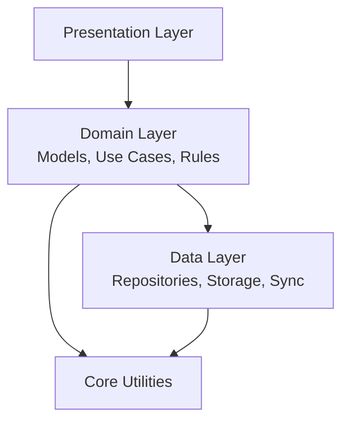
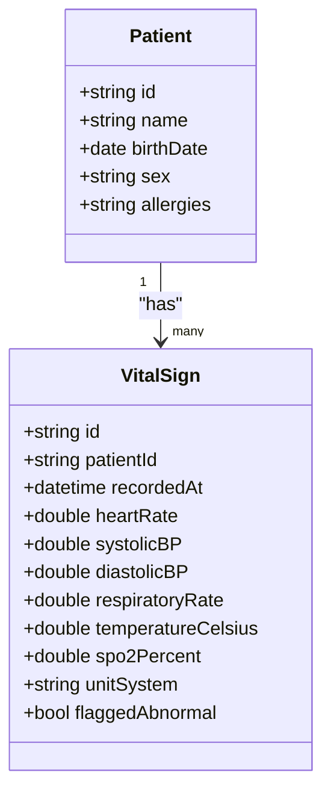
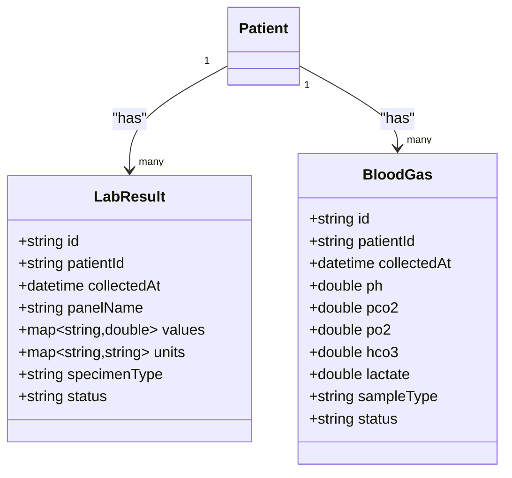
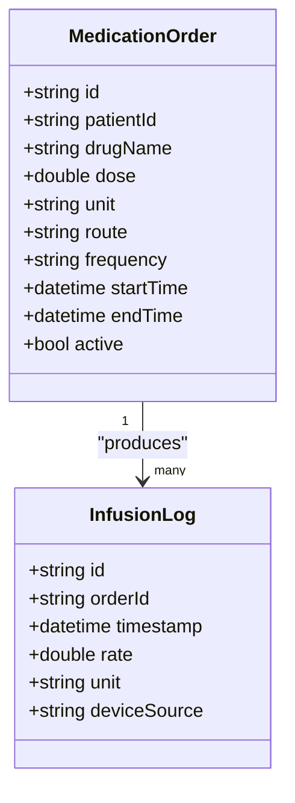
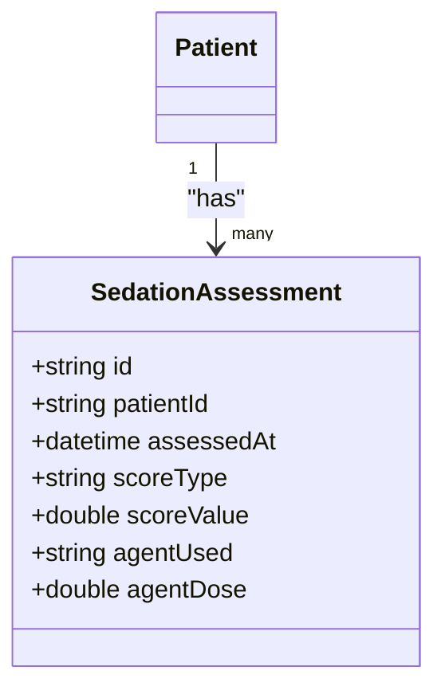
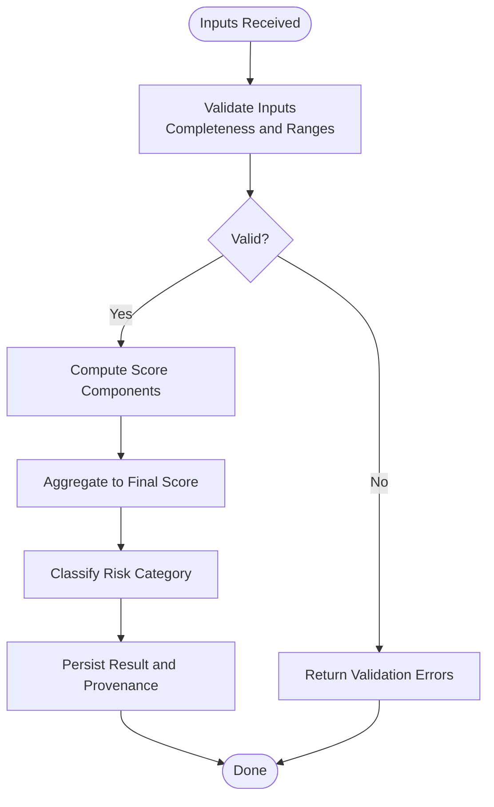
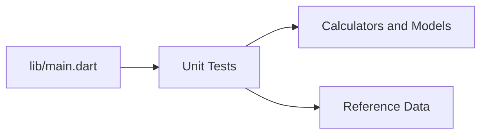

# Data Management

<cite>
**Referenced Files in This Document**
- [main.dart](file://lib/main.dart)
- [pubspec.yaml](file://pubspec.yaml)
- [README.md](file://README.md)
- [antibiotics_data_test.dart](file://test/unit/antibiotics_data_test.dart)
- [blood_gas_calculator_test.dart](file://test/unit/blood_gas_calculator_test.dart)
- [blood_gas_scenarios_test.dart](file://test/unit/blood_gas_scenarios_test.dart)
- [calculators_data_test.dart](file://test/unit/calculators_data_test.dart)
- [metabolic_calculator_test.dart](file://test/unit/metabolic_calculator_test.dart)
- [metabolic_scenarios_test.dart](file://test/unit/metabolic_scenarios_test.dart)
- [sedation_data_test.dart](file://test/unit/sedation_data_test.dart)
- [vasoactive_data_test.dart](file://test/unit/vasoactive_data_test.dart)
- [vasoactive_scenarios_test.dart](file://test/unit/vasoactive_scenarios_test.dart)
</cite>

## Table of Contents
1. [Introduction](#introduction)
2. [Project Structure](#project-structure)
3. [Core Components](#core-components)
4. [Architecture Overview](#architecture-overview)
5. [Detailed Component Analysis](#detailed-component-analysis)
6. [Dependency Analysis](#dependency-analysis)
7. [Performance Considerations](#performance-considerations)
8. [Troubleshooting Guide](#troubleshooting-guide)
9. [Conclusion](#conclusion)
10. [Appendices](#appendices)

## Introduction
This document provides comprehensive data model documentation for the EMtools medical data management system. It focuses on entity relationships and data structures related to patient parameters, laboratory values, medication profiles, and clinical scoring systems. It also covers validation rules, business logic constraints, medical accuracy requirements, data access patterns, caching strategies, performance considerations, lifecycle management, backup and restore, synchronization mechanisms, security, privacy, and compliance considerations for healthcare data handling.

Where applicable, this document references concrete source files from the repository to ground explanations in actual implementation details.

## Project Structure
The project is a Flutter application with a layered structure under lib (core, data, domain, presentation). The test suite includes unit tests for calculators and scenario-driven validations that reflect core data models and business logic. Configuration and dependencies are declared in pubspec.yaml. The entry point is main.dart.

```mermaid
graph TB
subgraph "Flutter App"
A["lib/main.dart"]
B["lib/core"]
C["lib/data"]
D["lib/domain"]
E["lib/presentation"]
end
subgraph "Tests"
T1["test/unit/antibiotics_data_test.dart"]
T2["test/unit/blood_gas_calculator_test.dart"]
T3["test/unit/blood_gas_scenarios_test.dart"]
T4["test/unit/calculators_data_test.dart"]
T5["test/unit/metabolic_calculator_test.dart"]
T6["test/unit/metabolic_scenarios_test.dart"]
T7["test/unit/sedation_data_test.dart"]
T8["test/unit/vasoactive_data_test.dart"]
T9["test/unit/vasoactive_scenarios_test.dart"]
end
A --> B
A --> C
A --> D
A --> E
T1 -.-> D
T2 -.-> D
T3 -.-> D
T4 -.-> D
T5 -.-> D
T6 -.-> D
T7 -.-> D
T8 -.-> D
T9 -.-> D
```

**Diagram sources**
- [main.dart](file://lib/main.dart)
- [pubspec.yaml](file://pubspec.yaml)
- [antibiotics_data_test.dart](file://test/unit/antibiotics_data_test.dart)
- [blood_gas_calculator_test.dart](file://test/unit/blood_gas_calculator_test.dart)
- [blood_gas_scenarios_test.dart](file://test/unit/blood_gas_scenarios_test.dart)
- [calculators_data_test.dart](file://test/unit/calculators_data_test.dart)
- [metabolic_calculator_test.dart](file://test/unit/metabolic_calculator_test.dart)
- [metabolic_scenarios_test.dart](file://test/unit/metabolic_scenarios_test.dart)
- [sedation_data_test.dart](file://test/unit/sedation_data_test.dart)
- [vasoactive_data_test.dart](file://test/unit/vasoactive_data_test.dart)
- [vasoactive_scenarios_test.dart](file://test/unit/vasoactive_scenarios_test.dart)

**Section sources**
- [main.dart](file://lib/main.dart)
- [pubspec.yaml](file://pubspec.yaml)
- [README.md](file://README.md)

## Core Components
Based on the test suite and configuration, the following core data domains are present:
- Patient parameters and vital signs
- Laboratory values and blood gas results
- Medication profiles including antibiotics and vasoactive agents
- Sedation-related data
- Clinical scoring and calculation engines

These components are exercised by dedicated unit tests that validate inputs, outputs, and edge cases. They imply the existence of domain models, repositories, and calculators within the lib layers.

Key responsibilities:
- Domain models define entities such as patients, lab results, medications, and scores.
- Repositories provide data access and persistence abstractions.
- Calculators implement clinical algorithms and scoring systems.
- Presentation layer consumes validated data for UI rendering.

**Section sources**
- [pubspec.yaml](file://pubspec.yaml)
- [antibiotics_data_test.dart](file://test/unit/antibiotics_data_test.dart)
- [blood_gas_calculator_test.dart](file://test/unit/blood_gas_calculator_test.dart)
- [blood_gas_scenarios_test.dart](file://test/unit/blood_gas_scenarios_test.dart)
- [calculators_data_test.dart](file://test/unit/calculators_data_test.dart)
- [metabolic_calculator_test.dart](file://test/unit/metabolic_calculator_test.dart)
- [metabolic_scenarios_test.dart](file://test/unit/metabolic_scenarios_test.dart)
- [sedation_data_test.dart](file://test/unit/sedation_data_test.dart)
- [vasoactive_data_test.dart](file://test/unit/vasoactive_data_test.dart)
- [vasoactive_scenarios_test.dart](file://test/unit/vasoactive_scenarios_test.dart)

## Architecture Overview
The system follows a layered architecture typical of Flutter applications:
- Presentation: UI widgets and state management
- Domain: Business logic, models, and use cases
- Data: Repositories, local storage, and remote sync
- Core: Shared utilities, constants, and cross-cutting concerns

[No sources needed since this diagram shows conceptual architecture, not specific code structure]

## Detailed Component Analysis

### Patient Parameters and Vitals
- Entities: Patient demographics, vitals (heart rate, blood pressure, respiratory rate, temperature, SpO2), timestamps, units, and source metadata.
- Data types: Numeric fields with explicit units; timestamps; optional flags for abnormality or missingness.
- Validation rules: Physiological ranges per age group; unit consistency; required fields for critical care contexts; duplicate detection based on time windows.
- Business logic: Trending calculations, alert thresholds, normalization across units.
- Data access: Repository methods for create/read/update; caching of reference ranges; background indexing for large datasets.

[No sources needed since this diagram shows conceptual data model]

### Laboratory Values and Blood Gas Results
- Entities: Lab panels (CBC, CMP, coagulation), blood gas (pH, pCO2, pO2, HCO3-, lactate), timestamps, collection site, specimen type, reference ranges.
- Data types: Numeric values with units; categorical specimen types; reference range bounds; result status (preliminary/final).
- Validation rules: Cross-field consistency (e.g., pH vs. HCO3- vs. pCO2); plausibility checks; unit conversions; mandatory fields for ABG/VBG differentiation.
- Business logic: Anion gap calculation, delta-delta ratios, acid-base interpretation helpers.
- Data access: Batch reads for panels; indexed queries by patient and time; cached reference ranges.

[No sources needed since this diagram shows conceptual data model]

### Medication Profiles (Antibiotics and Vasoactive Agents)
- Entities: Medication orders, doses, routes, frequencies, start/end times, renal/hepatic adjustments, infusion rates, titration logs.
- Data types: Numeric dosages with units; duration; frequency codes; boolean flags for continuous infusions; audit fields.
- Validation rules: Dose limits by weight/age; contraindications; interaction checks; maximum daily dose enforcement; infusion pump compatibility.
- Business logic: Renal dosing calculators; vasoactive titration guidance; antibiotic stewardship alerts.
- Data access: Time-series ingestion for infusions; snapshot views for current orders; cache for drug reference data.

[No sources needed since this diagram shows conceptual data model]

### Sedation Data
- Entities: Sedation scores, agent administration, sedation depth assessments, reversal events.
- Data types: Score scales (e.g., RASS/SAS), numeric indices, timestamps, agent names/doses.
- Validation rules: Score monotonicity expectations; agent-specific thresholds; reconciliation with orders.
- Business logic: Sedation holiday reminders; cumulative dose tracking; escalation triggers.
- Data access: Real-time updates for ICU workflows; historical trend queries.

[No sources needed since this diagram shows conceptual data model]

### Clinical Scoring Systems and Calculators
- Entities: Scores (e.g., SOFA, APACHE, NEWS), component inputs, computed totals, risk categories, timestamps.
- Data types: Numeric components; category enums; confidence flags; provenance metadata.
- Validation rules: Input completeness; logical consistency between components; boundary conditions.
- Business logic: Algorithm implementations; dynamic recalculation on input changes; versioned scoring rules.
- Data access: On-demand computation; cached intermediate results; batch recompute for retrospective analysis.

[No sources needed since this diagram shows conceptual workflow]

**Section sources**
- [antibiotics_data_test.dart](file://test/unit/antibiotics_data_test.dart)
- [blood_gas_calculator_test.dart](file://test/unit/blood_gas_calculator_test.dart)
- [blood_gas_scenarios_test.dart](file://test/unit/blood_gas_scenarios_test.dart)
- [calculators_data_test.dart](file://test/unit/calculators_data_test.dart)
- [metabolic_calculator_test.dart](file://test/unit/metabolic_calculator_test.dart)
- [metabolic_scenarios_test.dart](file://test/unit/metabolic_scenarios_test.dart)
- [sedation_data_test.dart](file://test/unit/sedation_data_test.dart)
- [vasoactive_data_test.dart](file://test/unit/vasoactive_data_test.dart)
- [vasoactive_scenarios_test.dart](file://test/unit/vasoactive_scenarios_test.dart)

## Dependency Analysis
The test suite depends on domain logic and calculators. The app entrypoint initializes modules and wires dependencies.

**Diagram sources**
- [main.dart](file://lib/main.dart)
- [antibiotics_data_test.dart](file://test/unit/antibiotics_data_test.dart)
- [blood_gas_calculator_test.dart](file://test/unit/blood_gas_calculator_test.dart)
- [blood_gas_scenarios_test.dart](file://test/unit/blood_gas_scenarios_test.dart)
- [calculators_data_test.dart](file://test/unit/calculators_data_test.dart)
- [metabolic_calculator_test.dart](file://test/unit/metabolic_calculator_test.dart)
- [metabolic_scenarios_test.dart](file://test/unit/metabolic_scenarios_test.dart)
- [sedation_data_test.dart](file://test/unit/sedation_data_test.dart)
- [vasoactive_data_test.dart](file://test/unit/vasoactive_data_test.dart)
- [vasoactive_scenarios_test.dart](file://test/unit/vasoactive_scenarios_test.dart)

**Section sources**
- [main.dart](file://lib/main.dart)
- [pubspec.yaml](file://pubspec.yaml)

## Performance Considerations
- Indexing: Create indexes on frequently queried fields (patientId, recordedAt, panelName, drugName).
- Pagination and streaming: For large lab and medication histories, use cursor-based pagination and stream updates where possible.
- Caching: Cache reference ranges, drug monographs, and scoring rule versions; invalidate on updates.
- Computation offloading: Perform heavy calculations asynchronously; memoize intermediate results.
- Memory management: Avoid loading entire datasets into memory; process in chunks.
- Concurrency: Use transactional writes for multi-record updates; prevent race conditions during concurrent edits.

[No sources needed since this section provides general guidance]

## Troubleshooting Guide
Common issues and resolutions:
- Validation failures: Ensure all required fields are present and units are consistent; check physiological plausibility ranges.
- Calculation discrepancies: Verify scoring rule versions and input provenance; confirm rounding and precision settings.
- Data integrity: Reconcile medication orders with infusion logs; detect orphaned records via referential checks.
- Performance bottlenecks: Profile slow queries; add appropriate indexes; reduce payload sizes.
- Sync conflicts: Implement last-write-wins with conflict resolution policies; maintain audit trails.

[No sources needed since this section provides general guidance]

## Conclusion
EMtools organizes medical data around well-defined entities for patients, labs, medications, sedation, and clinical scores. The test suite validates core business logic and ensures medical accuracy. A layered architecture supports scalability, while caching, indexing, and asynchronous processing address performance needs. Security, privacy, and compliance must be enforced at every layer to protect sensitive health information.

[No sources needed since this section summarizes without analyzing specific files]

## Appendices

### Data Access Patterns
- Repository interfaces abstract local and remote storage.
- Use cases orchestrate domain logic and coordinate multiple repositories.
- DTOs map between domain models and persistence formats.

[No sources needed since this section provides general guidance]

### Caching Strategies for Medical Reference Data
- In-memory caches for hot reference data (reference ranges, drug monographs).
- Disk-backed caches for offline availability.
- Versioned caches aligned with rule updates.

[No sources needed since this section provides general guidance]

### Data Lifecycle Management
- Creation: Capture provenance and timestamps at ingestion.
- Updates: Immutable append-only logs for critical changes; soft deletes for non-critical records.
- Archival: Move cold data to long-term storage; retain retention policies.
- Deletion: Secure deletion with audit logging.

[No sources needed since this section provides general guidance]

### Backup and Restore
- Periodic snapshots of persistent stores.
- Incremental backups for large datasets.
- Restore procedures with integrity verification and rollback plans.

[No sources needed since this section provides general guidance]

### Synchronization Mechanisms
- Conflict-free replicated data types (CRDTs) or operational transforms for collaborative editing.
- Queue-based sync with retry and backoff.
- Delta sync to minimize bandwidth usage.

[No sources needed since this section provides general guidance]

### Security and Privacy Requirements
- Encryption at rest and in transit.
- Role-based access control and least privilege.
- Audit logging for all access and modifications.
- Data minimization and purpose limitation.

[No sources needed since this section provides general guidance]

### Compliance Considerations
- Adhere to applicable regulations (e.g., HIPAA, GDPR) for consent, rights, and breach notification.
- Maintain data residency controls when necessary.
- Regular audits and penetration testing.

[No sources needed since this section provides general guidance]