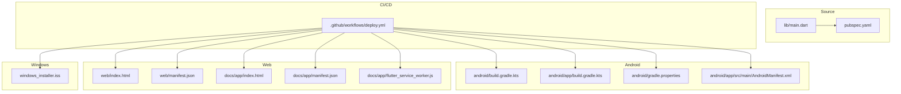
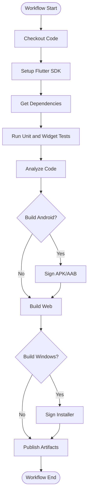
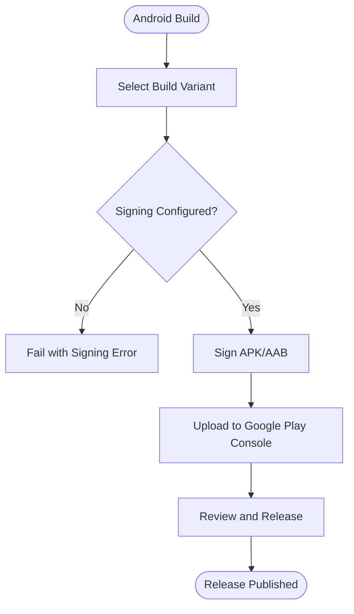
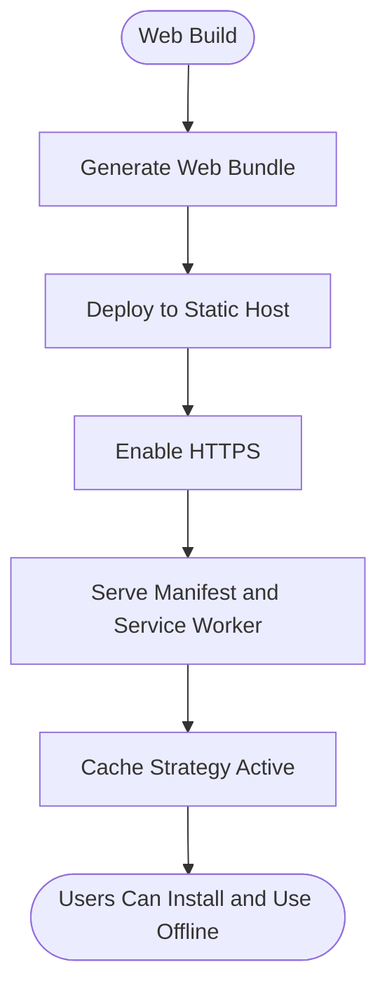
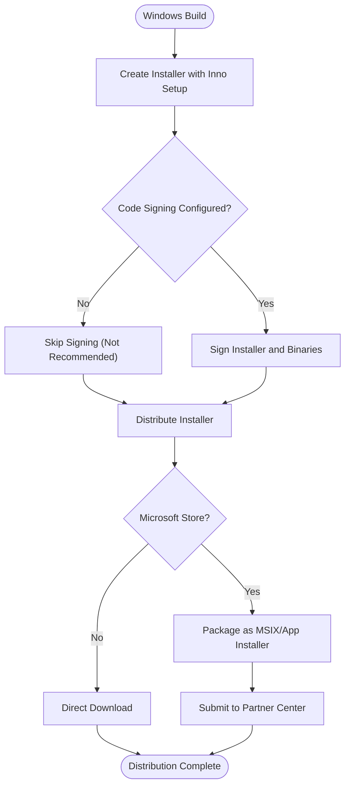
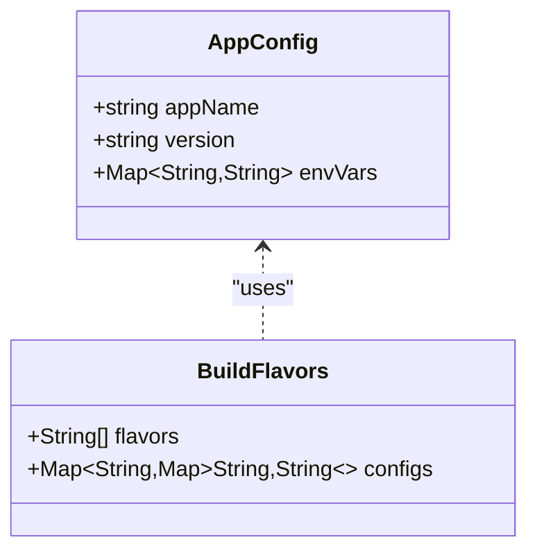
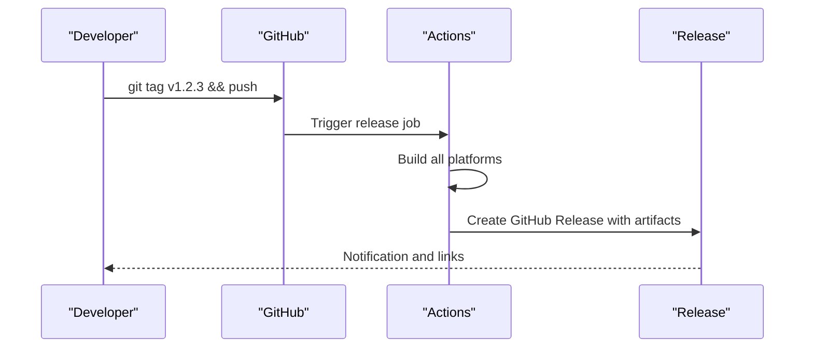
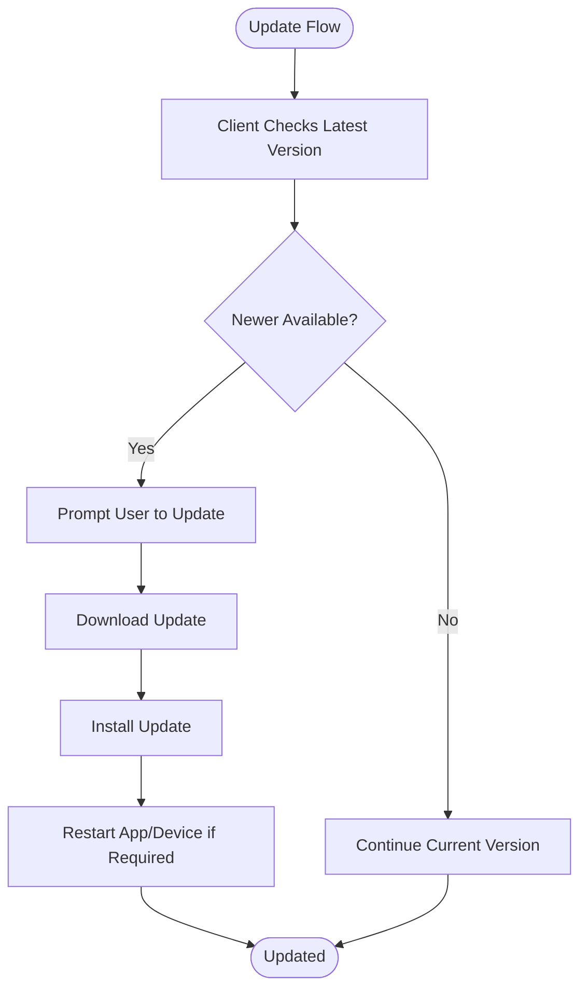
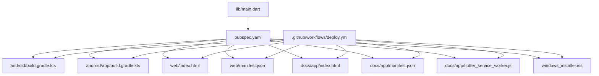

# Deployment and Distribution

<cite>
**Referenced Files in This Document**
- [deploy.yml](file://.github/workflows/deploy.yml)
- [pubspec.yaml](file://pubspec.yaml)
- [android/build.gradle.kts](file://android/build.gradle.kts)
- [android/app/build.gradle.kts](file://android/app/build.gradle.kts)
- [android/gradle.properties](file://android/gradle.properties)
- [android/app/src/main/AndroidManifest.xml](file://android/app/src/main/AndroidManifest.xml)
- [windows_installer.iss](file://windows_installer.iss)
- [web/index.html](file://web/index.html)
- [web/manifest.json](file://web/manifest.json)
- [docs/app/index.html](file://docs/app/index.html)
- [docs/app/manifest.json](file://docs/app/manifest.json)
- [docs/app/flutter_service_worker.js](file://docs/app/flutter_service_worker.js)
- [lib/main.dart](file://lib/main.dart)
</cite>

## Table of Contents
1. [Introduction](#introduction)
2. [Project Structure](#project-structure)
3. [Core Components](#core-components)
4. [Architecture Overview](#architecture-overview)
5. [Detailed Component Analysis](#detailed-component-analysis)
6. [Dependency Analysis](#dependency-analysis)
7. [Performance Considerations](#performance-considerations)
8. [Troubleshooting Guide](#troubleshooting-guide)
9. [Conclusion](#conclusion)
10. [Appendices](#appendices)

## Introduction
This document provides deployment and distribution guidance for EMtools across Android, Web, and Windows platforms. It covers CI/CD configuration with GitHub Actions, app packaging and signing, store submission procedures, hosting options, SSL configuration, progressive web app (PWA) distribution, desktop installer creation, code signing, Microsoft Store distribution, build configuration management, versioning strategies, release automation, environment-specific configurations, optimization techniques, troubleshooting, update mechanisms, over-the-air updates, and enterprise considerations for healthcare environments.

## Project Structure
The repository is a Flutter application with platform-specific directories for Android, Web, and Windows. A GitHub Actions workflow orchestrates builds and deployments. The docs directory contains a prebuilt Web artifact suitable for static hosting.



**Diagram sources**
- [deploy.yml](file://.github/workflows/deploy.yml)
- [pubspec.yaml](file://pubspec.yaml)
- [android/build.gradle.kts](file://android/build.gradle.kts)
- [android/app/build.gradle.kts](file://android/app/build.gradle.kts)
- [android/gradle.properties](file://android/gradle.properties)
- [android/app/src/main/AndroidManifest.xml](file://android/app/src/main/AndroidManifest.xml)
- [web/index.html](file://web/index.html)
- [web/manifest.json](file://web/manifest.json)
- [docs/app/index.html](file://docs/app/index.html)
- [docs/app/manifest.json](file://docs/app/manifest.json)
- [docs/app/flutter_service_worker.js](file://docs/app/flutter_service_worker.js)
- [windows_installer.iss](file://windows_installer.iss)

**Section sources**
- [deploy.yml](file://.github/workflows/deploy.yml)
- [pubspec.yaml](file://pubspec.yaml)
- [android/build.gradle.kts](file://android/build.gradle.kts)
- [android/app/build.gradle.kts](file://android/app/build.gradle.kts)
- [android/gradle.properties](file://android/gradle.properties)
- [android/app/src/main/AndroidManifest.xml](file://android/app/src/main/AndroidManifest.xml)
- [web/index.html](file://web/index.html)
- [web/manifest.json](file://web/manifest.json)
- [docs/app/index.html](file://docs/app/index.html)
- [docs/app/manifest.json](file://docs/app/manifest.json)
- [docs/app/flutter_service_worker.js](file://docs/app/flutter_service_worker.js)
- [windows_installer.iss](file://windows_installer.iss)

## Core Components
- CI/CD pipeline: GitHub Actions workflow that triggers on pushes and tags, sets up Flutter, runs tests, builds artifacts, and deploys to targets.
- Android build system: Gradle-based configuration for app metadata, signing, and ProGuard rules.
- Web assets: Static site files and PWA manifest/service worker for offline caching and installability.
- Windows installer: Inno Setup script to package the desktop app into an MSI/EXE installer.

Key responsibilities:
- Versioning and tagging strategy aligned with semantic versioning.
- Environment-specific configuration via secrets and flags.
- Artifact generation and publishing for each platform.
- Automated testing and linting prior to builds.

**Section sources**
- [deploy.yml](file://.github/workflows/deploy.yml)
- [pubspec.yaml](file://pubspec.yaml)
- [android/build.gradle.kts](file://android/build.gradle.kts)
- [android/app/build.gradle.kts](file://android/app/build.gradle.kts)
- [android/gradle.properties](file://android/gradle.properties)
- [android/app/src/main/AndroidManifest.xml](file://android/app/src/main/AndroidManifest.xml)
- [web/index.html](file://web/index.html)
- [web/manifest.json](file://web/manifest.json)
- [docs/app/index.html](file://docs/app/index.html)
- [docs/app/manifest.json](file://docs/app/manifest.json)
- [docs/app/flutter_service_worker.js](file://docs/app/flutter_service_worker.js)
- [windows_installer.iss](file://windows_installer.iss)

## Architecture Overview
The deployment architecture integrates source control, CI/CD, and multiple distribution channels.

```mermaid
sequenceDiagram
participant Dev as "Developer"
participant GH as "GitHub"
participant GA as "GitHub Actions"
participant AND as "Android Build"
participant WEB as "Web Build"
participant WIN as "Windows Build"
participant STORES as "Stores/Hosts"
Dev->>GH : Push commit or tag
GH->>GA : Trigger workflow
GA->>GA : Setup Flutter and dependencies
GA->>GA : Run unit/widget tests
GA->>AND : Build APK/AAB
GA->>WEB : Build Web artifacts
GA->>WIN : Build Windows installer
GA-->>STORES : Upload artifacts / publish
```

**Diagram sources**
- [deploy.yml](file://.github/workflows/deploy.yml)
- [android/build.gradle.kts](file://android/build.gradle.kts)
- [android/app/build.gradle.kts](file://android/app/build.gradle.kts)
- [web/index.html](file://web/index.html)
- [windows_installer.iss](file://windows_installer.iss)

## Detailed Component Analysis

### CI/CD Pipeline (GitHub Actions)
- Triggers: On push to main branches and on semantic version tags.
- Jobs:
  - Test and lint: Install dependencies, run tests, analyze code.
  - Android: Build debug/release variants, sign if configured, upload artifacts.
  - Web: Build optimized Web output, optionally deploy to static host.
  - Windows: Build installer using Inno Setup, sign if configured, upload artifacts.
- Secrets: Keystore, keystore password, key alias, key password, Google Play credentials, Windows signing certificate, and deployment tokens are provided via repository secrets.



**Diagram sources**
- [deploy.yml](file://.github/workflows/deploy.yml)

**Section sources**
- [deploy.yml](file://.github/workflows/deploy.yml)

### Android Packaging, Signing, and Google Play Submission
- Build outputs: APK for sideloading/testing; AAB for Google Play.
- Signing: Use keystore and keys stored securely in repository secrets. Configure Gradle properties for signing and ProGuard rules for obfuscation and shrinking.
- Manifest: Ensure required permissions and application metadata are set appropriately for production.
- Google Play:
  - Create a release track in Google Play Console.
  - Upload signed AAB.
  - Complete content rating, privacy policy, and data safety forms.
  - Roll out to internal, closed, open, or production tracks.



**Diagram sources**
- [android/build.gradle.kts](file://android/build.gradle.kts)
- [android/app/build.gradle.kts](file://android/app/build.gradle.kts)
- [android/gradle.properties](file://android/gradle.properties)
- [android/app/src/main/AndroidManifest.xml](file://android/app/src/main/AndroidManifest.xml)

**Section sources**
- [android/build.gradle.kts](file://android/build.gradle.kts)
- [android/app/build.gradle.kts](file://android/app/build.gradle.kts)
- [android/gradle.properties](file://android/gradle.properties)
- [android/app/src/main/AndroidManifest.xml](file://android/app/src/main/AndroidManifest.xml)

### Web Platform Deployment and PWA Distribution
- Hosting options:
  - Static hosting providers (e.g., Firebase Hosting, Netlify, Vercel, GitHub Pages).
  - Self-hosted servers with reverse proxy and TLS termination.
- SSL/TLS:
  - Enable HTTPS at the hosting provider or configure reverse proxy (e.g., Nginx/Apache) with valid certificates.
  - Ensure service worker registration uses secure context (HTTPS).
- PWA:
  - Provide a web manifest and service worker for caching and installability.
  - Optimize assets and enable compression at the server level.
- Prebuilt artifacts:
  - The docs/app directory contains a built Web bundle ready for static hosting.



**Diagram sources**
- [web/index.html](file://web/index.html)
- [web/manifest.json](file://web/manifest.json)
- [docs/app/index.html](file://docs/app/index.html)
- [docs/app/manifest.json](file://docs/app/manifest.json)
- [docs/app/flutter_service_worker.js](file://docs/app/flutter_service_worker.js)

**Section sources**
- [web/index.html](file://web/index.html)
- [web/manifest.json](file://web/manifest.json)
- [docs/app/index.html](file://docs/app/index.html)
- [docs/app/manifest.json](file://docs/app/manifest.json)
- [docs/app/flutter_service_worker.js](file://docs/app/flutter_service_worker.js)

### Windows Desktop Packaging with Inno Setup
- Installer script: Use Inno Setup to create an installer that packages the Flutter Windows runner and assets.
- Code signing:
  - Sign the installer and binaries with a trusted certificate to avoid warnings.
  - Store certificate and passwords in CI secrets.
- Microsoft Store:
  - Prepare MSIX package or use App Installer (.appxbundle/.msixbundle).
  - Submit via Partner Center following store guidelines.



**Diagram sources**
- [windows_installer.iss](file://windows_installer.iss)

**Section sources**
- [windows_installer.iss](file://windows_installer.iss)

### Build Configuration Management and Versioning
- Application metadata and dependencies are defined in the project manifest.
- Semantic versioning:
  - Use tags (e.g., v1.2.3) to trigger releases.
  - Align app version with Git tags for traceability.
- Environment-specific configuration:
  - Use build flavors or environment variables to switch endpoints and feature flags.
  - Store sensitive values in CI secrets.



[No diagram sources since this diagram shows conceptual relationships]

**Section sources**
- [pubspec.yaml](file://pubspec.yaml)
- [deploy.yml](file://.github/workflows/deploy.yml)

### Release Automation Processes
- Tagging workflow:
  - Create a tag to trigger release jobs.
  - Generate changelog from commits between tags.
- Artifact publishing:
  - Attach APK/AAB, Web bundle, and Windows installer to the GitHub release.
- Notifications:
  - Post release notes to stakeholders or internal channels.



**Diagram sources**
- [deploy.yml](file://.github/workflows/deploy.yml)

**Section sources**
- [deploy.yml](file://.github/workflows/deploy.yml)

### Update Mechanisms, Over-the-Air Updates, and Enterprise Deployment
- Android:
  - Use Google Play’s rollout features for staged updates.
  - For enterprise, distribute signed APK/AAB via private repositories or mobile device management (MDM) systems.
- Web:
  - Implement service worker cache-busting and version checks to prompt users to refresh.
  - Serve updated assets from CDN with appropriate cache headers.
- Windows:
  - Provide installer updates with version checks and silent installation switches for enterprise rollouts.
  - Use Group Policy or MDM to distribute updates.



[No diagram sources since this diagram shows conceptual workflow]

**Section sources**
- [docs/app/flutter_service_worker.js](file://docs/app/flutter_service_worker.js)
- [android/app/src/main/AndroidManifest.xml](file://android/app/src/main/AndroidManifest.xml)
- [windows_installer.iss](file://windows_installer.iss)

## Dependency Analysis
The CI/CD workflow depends on platform build scripts and assets. The Flutter entry point drives application behavior, while platform manifests define runtime requirements.



**Diagram sources**
- [lib/main.dart](file://lib/main.dart)
- [pubspec.yaml](file://pubspec.yaml)
- [android/build.gradle.kts](file://android/build.gradle.kts)
- [android/app/build.gradle.kts](file://android/app/build.gradle.kts)
- [web/index.html](file://web/index.html)
- [web/manifest.json](file://web/manifest.json)
- [docs/app/index.html](file://docs/app/index.html)
- [docs/app/manifest.json](file://docs/app/manifest.json)
- [docs/app/flutter_service_worker.js](file://docs/app/flutter_service_worker.js)
- [windows_installer.iss](file://windows_installer.iss)
- [deploy.yml](file://.github/workflows/deploy.yml)

**Section sources**
- [lib/main.dart](file://lib/main.dart)
- [pubspec.yaml](file://pubspec.yaml)
- [android/build.gradle.kts](file://android/build.gradle.kts)
- [android/app/build.gradle.kts](file://android/app/build.gradle.kts)
- [web/index.html](file://web/index.html)
- [web/manifest.json](file://web/manifest.json)
- [docs/app/index.html](file://docs/app/index.html)
- [docs/app/manifest.json](file://docs/app/manifest.json)
- [docs/app/flutter_service_worker.js](file://docs/app/flutter_service_worker.js)
- [windows_installer.iss](file://windows_installer.iss)
- [deploy.yml](file://.github/workflows/deploy.yml)

## Performance Considerations
- Android:
  - Enable minification and resource shrinking via ProGuard/R8 rules.
  - Use AAB to reduce installed size.
- Web:
  - Compress assets (gzip/brotli) at the server.
  - Leverage HTTP caching headers and CDN edge caching.
  - Optimize images and fonts; consider lazy loading.
- Windows:
  - Minimize installer payload by excluding unnecessary files.
  - Use incremental updates where possible.

[No sources needed since this section provides general guidance]

## Troubleshooting Guide
- CI failures:
  - Validate Flutter setup and dependency resolution logs.
  - Ensure secrets are correctly configured for signing and publishing.
- Android:
  - Verify keystore integrity and passwords.
  - Check manifest permissions and target SDK compatibility.
- Web:
  - Confirm HTTPS is enabled and service worker is registered under secure context.
  - Inspect browser console for cache-related errors.
- Windows:
  - Validate Inno Setup paths and certificate availability.
  - Check installer logs for permission issues during installation.

**Section sources**
- [deploy.yml](file://.github/workflows/deploy.yml)
- [android/gradle.properties](file://android/gradle.properties)
- [android/app/build.gradle.kts](file://android/app/build.gradle.kts)
- [android/app/src/main/AndroidManifest.xml](file://android/app/src/main/AndroidManifest.xml)
- [docs/app/flutter_service_worker.js](file://docs/app/flutter_service_worker.js)
- [windows_installer.iss](file://windows_installer.iss)

## Conclusion
EMtools supports multi-platform deployment through a cohesive CI/CD pipeline, standardized build configurations, and clear distribution procedures. By leveraging automated testing, secure signing, and optimized builds, teams can reliably deliver updates to Android, Web, and Windows users. For healthcare environments, prioritize security, compliance, and controlled rollout strategies.

[No sources needed since this section summarizes without analyzing specific files]

## Appendices

### Environment-Specific Configuration Checklist
- Define environment variables for API endpoints and feature flags.
- Separate development, staging, and production configurations.
- Store secrets in CI/CD vaults and reference them in workflows.

[No sources needed since this section provides general guidance]

### Security and Compliance Notes for Healthcare Environments
- Encrypt sensitive data at rest and in transit.
- Implement least-privilege access controls.
- Maintain audit logs and ensure compliance with relevant regulations.
- Conduct regular vulnerability assessments and penetration testing.

[No sources needed since this section provides general guidance]