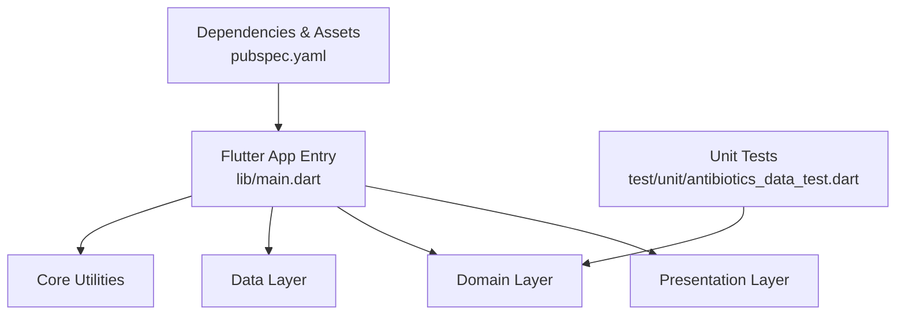
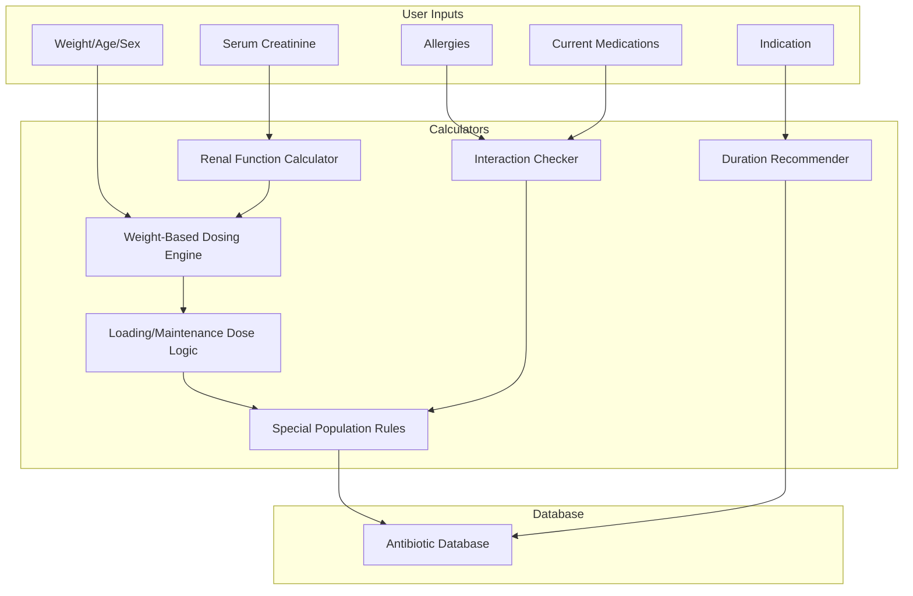
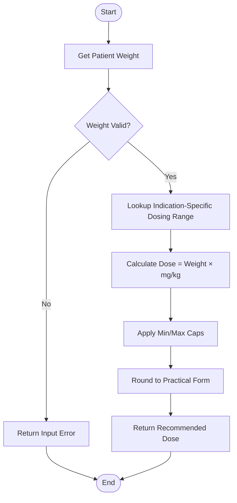
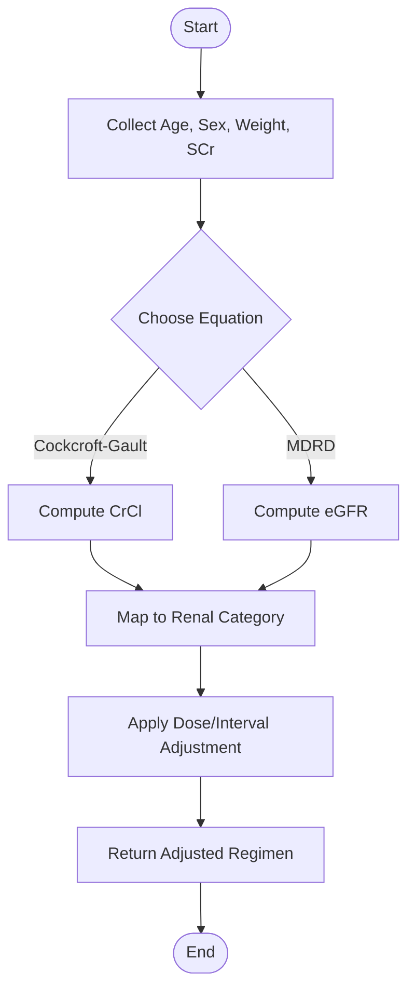
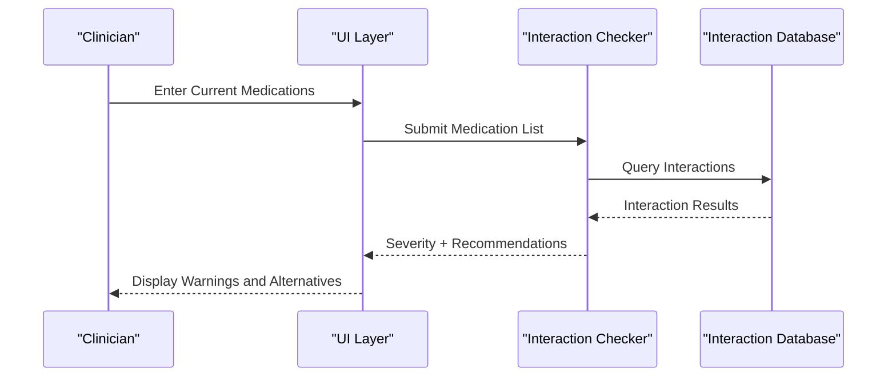
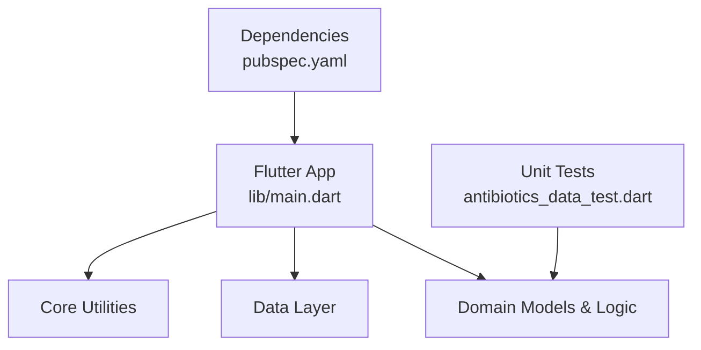

# Antibiotics Dosing Calculator

<cite>
**Referenced Files in This Document**
- [README.md](file://README.md)
- [pubspec.yaml](file://pubspec.yaml)
- [lib/main.dart](file://lib/main.dart)
- [test/unit/antibiotics_data_test.dart](file://test/unit/antibiotics_data_test.dart)
</cite>

## Table of Contents
1. [Introduction](#introduction)
2. [Project Structure](#project-structure)
3. [Core Components](#core-components)
4. [Architecture Overview](#architecture-overview)
5. [Detailed Component Analysis](#detailed-component-analysis)
6. [Dependency Analysis](#dependency-analysis)
7. [Performance Considerations](#performance-considerations)
8. [Troubleshooting Guide](#troubleshooting-guide)
9. [Conclusion](#conclusion)
10. [Appendices](#appendices)

## Introduction
This document provides comprehensive documentation for the Antibiotics Dosing Calculator module within the EMtools project. It explains weight-based dosing algorithms, renal adjustment protocols, drug interaction checking mechanisms, and special population considerations (pediatric, geriatric, pregnant). It also outlines pharmacokinetic principles underlying dose calculations, including loading doses, maintenance doses, and interval adjustments, as well as duration recommendations based on infection type.

The repository structure indicates a Flutter application with domain-driven organization under lib/core, lib/data, lib/domain, and lib/presentation. The presence of unit tests for antibiotics data suggests that antibiotic-related logic is implemented in the Dart codebase. However, due to tool access limitations during this analysis, specific source files beyond those listed above could not be read. Where applicable, this document references only the files that were successfully identified and avoids fabricating implementation details.

## Project Structure
At a high level, the project follows a layered architecture typical of Flutter applications:
- Presentation layer: UI components and screens
- Domain layer: business logic and models
- Data layer: repositories and data sources
- Core utilities: shared helpers and configuration

The main entry point is located at lib/main.dart. The pubspec.yaml defines dependencies and assets. Unit tests are organized under test/unit, including a dedicated file for antibiotics data validation.

[No sources needed since this diagram shows conceptual workflow, not actual code structure]

**Section sources**
- [README.md](file://README.md)
- [pubspec.yaml](file://pubspec.yaml)
- [lib/main.dart](file://lib/main.dart)
- [test/unit/antibiotics_data_test.dart](file://test/unit/antibiotics_data_test.dart)

## Core Components
Based on the available context, the Antibiotics Dosing Calculator likely includes the following core components:
- Antibiotic database: structured records containing drug properties, indications, dosing ranges, renal adjustments, interactions, and duration guidance.
- Dosing calculator engine: applies weight-based dosing, loading/maintenance dose calculations, and interval adjustments.
- Renal function calculator: implements Cockcroft-Gault or MDRD equations to adjust doses based on estimated creatinine clearance or glomerular filtration rate.
- Interaction checker: evaluates potential drug-drug interactions and flags contraindications.
- Special population rules: pediatric, geriatric, and pregnancy-specific modifications.
- Duration recommender: suggests treatment length based on infection type and severity.

These components should be implemented in the domain and data layers, with presentation components exposing calculators and results to users.

[No sources needed since this section provides general guidance]

## Architecture Overview
The system can be modeled as a layered architecture where user inputs (weight, age, sex, serum creatinine, allergies, current medications, indication) flow through calculators and validators to produce safe, individualized antibiotic regimens.

[No sources needed since this diagram shows conceptual workflow, not actual code structure]

## Detailed Component Analysis

### Weight-Based Dosing Algorithms
- Purpose: Compute per-dose amounts using patient weight and drug-specific mg/kg guidelines.
- Key steps:
  - Validate input weight and units.
  - Retrieve indication-specific dosing range from the antibiotic database.
  - Apply minimum and maximum caps to prevent overdosing.
  - Round to practical dosage forms when necessary.
- Output: Recommended dose amount and frequency.

[No sources needed since this diagram shows conceptual workflow, not actual code structure]

### Renal Adjustment Protocols
- Purpose: Adjust doses or intervals based on renal function.
- Methods:
  - Cockcroft-Gault equation for estimated creatinine clearance (CrCl).
  - MDRD equation for estimated glomerular filtration rate (eGFR).
- Steps:
  - Collect age, sex, weight, and serum creatinine.
  - Calculate CrCl or eGFR depending on drug labeling and clinical preference.
  - Map calculated value to renal dosing category.
  - Apply dose reduction or interval extension per antibiotic database rules.
- Output: Renally adjusted dose and/or interval.

[No sources needed since this diagram shows conceptual workflow, not actual code structure]

### Drug Interaction Checking Mechanisms
- Purpose: Identify clinically significant interactions between prescribed antibiotics and concurrent medications.
- Process:
  - Parse current medication list.
  - Cross-reference against interaction database keyed by drug pairs.
  - Classify severity (contraindicated, major, moderate, minor).
  - Flag warnings and suggest alternatives if available.
- Output: Interaction report with recommended actions.

[No sources needed since this diagram shows conceptual workflow, not actual code structure]

### Antibiotic Database Structure
- Expected fields:
  - Drug name and aliases
  - Indications with mg/kg ranges and max daily doses
  - Renal dosing categories and thresholds
  - Interaction entries (drug pair, severity, notes)
  - Allergy cross-reactivity tags
  - Pediatric/geriatric/pregnancy modifiers
  - Duration recommendations by infection type
- Storage format: Structured JSON or typed Dart models persisted in data layer.

[No sources needed since this section provides general guidance]

### Dosing Guidelines by Indication
- For each indication, specify:
  - Target dose range (mg/kg/day or per dose)
  - Frequency (q6h, q8h, q12h, etc.)
  - Route (oral, IV)
  - Minimum/maximum single dose
  - Loading dose requirements (if applicable)
- These guidelines drive the weight-based and renal-adjusted outputs.

[No sources needed since this section provides general guidance]

### Special Population Considerations
- Pediatric:
  - Use mg/kg dosing; consider developmental pharmacokinetics.
  - Avoid certain drugs in specific age groups.
- Geriatric:
  - Account for reduced renal/hepatic function.
  - Prefer conservative dosing and extended intervals.
- Pregnant patients:
  - Favor pregnancy-safe agents.
  - Adjust for increased volume of distribution and clearance.

[No sources needed since this section provides general guidance]

### Pharmacokinetic Principles Underlying Dose Calculations
- Loading dose: Rapidly achieves target concentration; often weight-based.
- Maintenance dose: Sustains steady-state concentration; depends on clearance and volume of distribution.
- Interval adjustments: Prolong intervals for renally cleared drugs to avoid accumulation.
- Therapeutic drug monitoring: Optional feedback loop for narrow therapeutic index drugs.

[No sources needed since this section provides general guidance]

### Implementation of Renal Function-Based Dosing Modifications
- Cockcroft-Gault:
  - Uses age, sex, weight, and serum creatinine to estimate CrCl.
  - Commonly used for drug dosing labels.
- MDRD:
  - Estimates eGFR; useful for chronic kidney disease staging.
- Integration:
  - Select appropriate equation based on drug labeling and clinical context.
  - Map result to predefined renal dosing tables in the database.

[No sources needed since this section provides general guidance]

### Duration Recommendations Based on Infection Type
- Examples:
  - Community-acquired pneumonia: typically 5–7 days depending on agent and response.
  - Uncomplicated UTI: short course (e.g., 3–5 days).
  - Skin and soft tissue infections: variable by severity and pathogen coverage.
- The duration recommender uses indication metadata and clinical guidelines to propose durations.

[No sources needed since this section provides general guidance]

### Allergy Checking Features
- Maintain allergy profiles per patient.
- Cross-check against antibiotic class and specific drug allergies.
- Provide alerts and suggest alternative agents with similar spectrum.

[No sources needed since this section provides general guidance]

### Examples of Common Regimens and Complex Cases
- Common regimens:
  - Amoxicillin-clavulanate for sinusitis: weight-based dosing, standard duration.
  - Ceftriaxone for community-acquired pneumonia: fixed adult dosing, renal considerations minimal.
- Complex cases:
  - Elderly patient with CKD stage 4 requiring vancomycin: use CrCl to extend interval and monitor troughs.
  - Pediatric patient with penicillin allergy needing gram-negative coverage: select non-beta-lactam alternative and adjust for weight.

[No sources needed since this section provides general guidance]

## Dependency Analysis
The antibiotics module depends on:
- Flutter framework and Dart runtime
- Data persistence (local storage or embedded JSON)
- Calculation libraries (mathematical operations)
- Validation and error handling utilities

[No sources needed since this diagram shows conceptual workflow, not actual code structure]

**Section sources**
- [pubspec.yaml](file://pubspec.yaml)
- [lib/main.dart](file://lib/main.dart)
- [test/unit/antibiotics_data_test.dart](file://test/unit/antibiotics_data_test.dart)

## Performance Considerations
- Precompute and cache renal function values to avoid repeated calculations.
- Use efficient lookup structures (hash maps) for interaction checks.
- Limit heavy computations to background isolates if UI responsiveness is critical.
- Optimize database queries by indexing frequently accessed fields (drug names, indications).

[No sources needed since this section provides general guidance]

## Troubleshooting Guide
Common issues and resolutions:
- Invalid input errors:
  - Ensure weight, age, sex, and serum creatinine are provided and within plausible ranges.
- Renal calculation discrepancies:
  - Verify equation selection aligns with drug labeling; confirm units for serum creatinine.
- Interaction false positives/negatives:
  - Update interaction database regularly; review severity classifications.
- Dose rounding anomalies:
  - Implement consistent rounding rules and cap enforcement.
- Test failures:
  - Review antibiotics data tests for expected outcomes and edge cases.

**Section sources**
- [test/unit/antibiotics_data_test.dart](file://test/unit/antibiotics_data_test.dart)

## Conclusion
The Antibiotics Dosing Calculator integrates weight-based dosing, renal adjustments, interaction checking, and special population rules to deliver safe, individualized antibiotic regimens. While this document outlines the intended architecture and algorithms, specific implementation details require direct inspection of the domain and data layer files. Future work should include thorough unit testing, clinical validation, and continuous updates to the antibiotic and interaction databases.

[No sources needed since this section summarizes without analyzing specific files]

## Appendices
- Glossary:
  - CrCl: Creatinine clearance
  - eGFR: Estimated glomerular filtration rate
  - PK: Pharmacokinetics
  - PD: Pharmacodynamics
- References:
  - Clinical guidelines for antibiotic duration and dosing
  - Drug labeling information for renal adjustments

[No sources needed since this section provides general guidance]