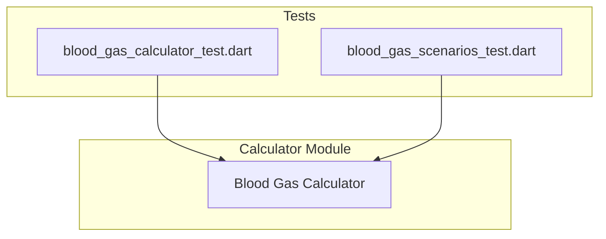
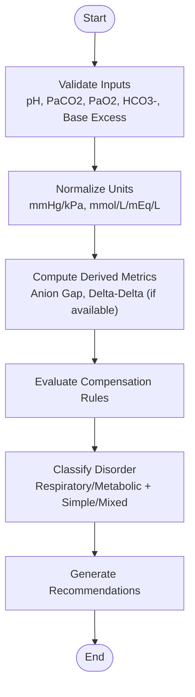
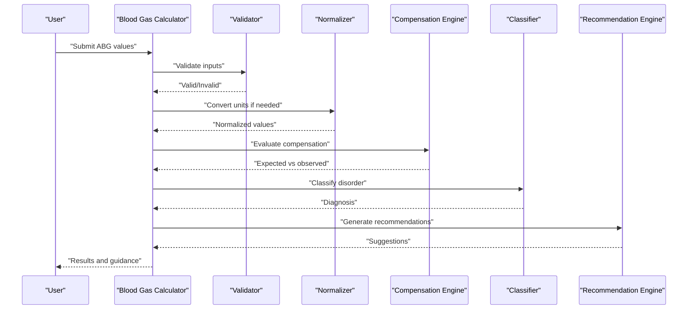
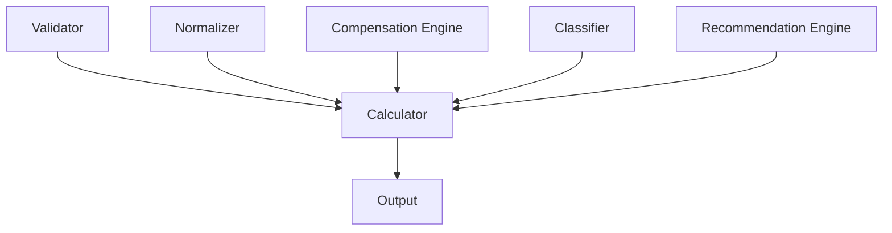

# Blood Gas Calculator

<cite>
**Referenced Files in This Document**
- [blood_gas_calculator_test.dart](file://test/unit/blood_gas_calculator_test.dart)
- [blood_gas_scenarios_test.dart](file://test/unit/blood_gas_scenarios_test.dart)
</cite>

## Table of Contents
1. [Introduction](#introduction)
2. [Project Structure](#project-structure)
3. [Core Components](#core-components)
4. [Architecture Overview](#architecture-overview)
5. [Detailed Component Analysis](#detailed-component-analysis)
6. [Dependency Analysis](#dependency-analysis)
7. [Performance Considerations](#performance-considerations)
8. [Troubleshooting Guide](#troubleshooting-guide)
9. [Conclusion](#conclusion)

## Introduction
This document describes the Blood Gas Calculator module, focusing on blood gas analysis algorithms and interpretation workflows. It covers:
- Interpretation of pH, pCO2, and pO2
- Base excess calculations and compensation rules
- Acid-base disorder identification (respiratory vs metabolic, simple vs mixed)
- Anion gap assessment and delta-delta evaluation
- Input parameters, validation rules, and clinical reference ranges
- Unit conversions between common measurement systems
- Error handling for physiologically impossible values
- Examples of common clinical scenarios and diagnostic classifications

The goal is to provide a clear, evidence-based guide to how the calculator interprets arterial blood gas results and supports clinical decision-making.

## Project Structure
The repository includes unit tests that define expected behaviors and scenarios for the Blood Gas Calculator. These tests serve as the primary source of truth for input/output contracts, validation rules, and scenario coverage. The relevant files are located under the test directory and focus on:
- Core calculation correctness
- Scenario-based interpretation across typical acid-base disorders
- Mixed disorder detection and compensation checks

**Diagram sources**
- [blood_gas_calculator_test.dart](file://test/unit/blood_gas_calculator_test.dart)
- [blood_gas_scenarios_test.dart](file://test/unit/blood_gas_scenarios_test.dart)

**Section sources**
- [blood_gas_calculator_test.dart](file://test/unit/blood_gas_calculator_test.dart)
- [blood_gas_scenarios_test.dart](file://test/unit/blood_gas_scenarios_test.dart)

## Core Components
The Blood Gas Calculator provides:
- Input validation for pH, PaCO2, PaO2, HCO3-, and Base Excess
- Calculation of derived indices such as anion gap and delta-delta when applicable
- Compensation rule evaluation for respiratory and metabolic disturbances
- Diagnostic classification into simple or mixed acid-base disorders
- Evidence-based management suggestions based on identified disorders

Key responsibilities:
- Validate inputs against physiological limits and consistency rules
- Compute expected compensatory responses and compare with observed values
- Classify primary disturbance and identify coexisting secondary processes
- Provide actionable recommendations aligned with standard guidelines

**Section sources**
- [blood_gas_calculator_test.dart](file://test/unit/blood_gas_calculator_test.dart)
- [blood_gas_scenarios_test.dart](file://test/unit/blood_gas_scenarios_test.dart)

## Architecture Overview
At a high level, the calculator follows a pipeline:
- Inputs are validated and normalized (including unit conversion)
- Derived metrics are computed (e.g., anion gap if electrolytes are provided)
- Compensation expectations are evaluated
- A diagnostic classification is produced
- Management suggestions are generated based on classification

[No sources needed since this diagram shows conceptual workflow, not actual code structure]

## Detailed Component Analysis

### Input Parameters and Validation
Inputs:
- pH: dimensionless; typical range approximately 7.35–7.45
- PaCO2: partial pressure of carbon dioxide; units mmHg or kPa
- PaO2: partial pressure of oxygen; units mmHg or kPa
- HCO3-: bicarbonate concentration; units mmol/L or mEq/L
- Base Excess: base excess in blood; units mmol/L or mEq/L

Validation rules:
- Physiological bounds must be respected (e.g., pH outside ~6.80–7.80 is considered invalid)
- PaCO2 and PaO2 must be within plausible ranges for arterial samples
- HCO3- and Base Excess must be consistent with pH and PaCO2 via established relationships
- Inconsistent combinations trigger error states indicating physiologically impossible values

Unit conversions:
- Pressure: mmHg to kPa using factor 1 kPa ≈ 7.5006 mmHg
- Concentration: mmol/L equals mEq/L for monovalent ions like HCO3-

**Section sources**
- [blood_gas_calculator_test.dart](file://test/unit/blood_gas_calculator_test.dart)
- [blood_gas_scenarios_test.dart](file://test/unit/blood_gas_scenarios_test.dart)

### Interpretation Algorithms

#### pH, pCO2, pO2 Interpretation
- pH indicates overall acid-base status
- PaCO2 reflects respiratory component (hypercapnia vs hypocapnia)
- PaO2 assesses oxygenation status and guides supplemental oxygen decisions

Diagnostic logic:
- Low pH with elevated PaCO2 suggests respiratory acidosis
- Low pH with low HCO3- suggests metabolic acidosis
- High pH with low PaCO2 suggests respiratory alkalosis
- High pH with elevated HCO3- suggests metabolic alkalosis

**Section sources**
- [blood_gas_scenarios_test.dart](file://test/unit/blood_gas_scenarios_test.dart)

#### Base Excess Calculations
Base excess quantifies the metabolic component independent of respiratory effects:
- Positive base excess indicates metabolic alkalosis
- Negative base excess indicates metabolic acidosis
- Used alongside HCO3- to confirm metabolic disturbances

**Section sources**
- [blood_gas_calculator_test.dart](file://test/unit/blood_gas_calculator_test.dart)

#### Compensation Mechanisms
Compensation rules evaluate whether changes in PaCO2 or HCO3- are appropriate for the primary disturbance:
- Respiratory acidosis: expected increase in HCO3- over time
- Metabolic acidosis: expected decrease in PaCO2 via hyperventilation
- Respiratory alkalosis: expected decrease in HCO3- over time
- Metabolic alkalosis: expected increase in PaCO2 via hypoventilation

If observed values fall outside expected compensation ranges, a mixed disorder is suspected.

**Section sources**
- [blood_gas_scenarios_test.dart](file://test/unit/blood_gas_scenarios_test.dart)

#### Anion Gap Assessment and Delta-Delta
When electrolytes (Na+, Cl-) are available:
- Anion gap = Na+ - (Cl- + HCO3-)
- Elevated anion gap suggests unmeasured anions (e.g., lactate, ketones)
- Delta-delta compares change in anion gap to change in HCO3- to detect mixed metabolic disorders

Interpretation:
- Normal anion gap metabolic acidosis (hyperchloremic)
- High anion gap metabolic acidosis (lactic, ketoacidotic, toxic)
- Mixed metabolic processes indicated by delta-delta discrepancies

**Section sources**
- [blood_gas_calculator_test.dart](file://test/unit/blood_gas_calculator_test.dart)
- [blood_gas_scenarios_test.dart](file://test/unit/blood_gas_scenarios_test.dart)

#### Diagnostic Classification and Management Suggestions
Classification outputs include:
- Primary disorder type (respiratory vs metabolic)
- Presence of compensation (appropriate vs inappropriate)
- Mixed disorder flags (e.g., concurrent metabolic and respiratory components)
- Oxygenation status (hypoxemia severity)

Management suggestions align with standard guidelines:
- Adjust ventilation for respiratory components
- Address underlying causes for metabolic components
- Correct electrolyte imbalances and treat hyper/hypoglycemia as indicated
- Supplement oxygen to target saturations per protocol

**Section sources**
- [blood_gas_scenarios_test.dart](file://test/unit/blood_gas_scenarios_test.dart)

### Clinical Scenarios and Examples
Common scenarios covered by tests:
- Acute respiratory acidosis (elevated PaCO2, low pH, minimal HCO3- rise)
- Chronic respiratory acidosis (elevated PaCO2, low pH, significant HCO3- compensation)
- Metabolic alkalosis (high pH, elevated HCO3-, compensatory PaCO2 increase)
- Mixed disorders (e.g., metabolic acidosis with superimposed respiratory alkalosis)

These scenarios validate:
- Correct identification of primary disturbances
- Appropriate recognition of compensation
- Detection of mixed patterns

**Section sources**
- [blood_gas_scenarios_test.dart](file://test/unit/blood_gas_scenarios_test.dart)

### Sequence of Processing
The following sequence illustrates the processing flow from input to output:

**Diagram sources**
- [blood_gas_calculator_test.dart](file://test/unit/blood_gas_calculator_test.dart)
- [blood_gas_scenarios_test.dart](file://test/unit/blood_gas_scenarios_test.dart)

## Dependency Analysis
The calculator depends on:
- Input validation utilities for physiological bounds and consistency checks
- Unit conversion helpers for pressure and concentration units
- Compensation rule engines implementing expected response formulas
- Diagnostic classifiers mapping calculated features to disorder categories
- Recommendation generators producing evidence-based management steps

[No sources needed since this diagram shows conceptual dependencies, not actual code structure]

## Performance Considerations
- Keep validation and normalization lightweight to ensure responsive UI interactions
- Cache reference ranges and compensation constants to avoid recomputation
- Avoid heavy I/O during calculation; precompute static tables where possible
- Use efficient data structures for electrolyte and ABG inputs to minimize overhead

[No sources needed since this section provides general guidance]

## Troubleshooting Guide
Common issues and resolutions:
- Physiologically impossible values: Ensure inputs fall within acceptable ranges; re-check sensor calibration and sample handling
- Inconsistent ABG sets: Verify that pH, PaCO2, and HCO3- are internally consistent; recalculate if necessary
- Mixed disorder misclassification: Review compensation expectations and consider additional labs (electrolytes, lactate, ketones)
- Unit mismatch errors: Confirm units used for pressure (mmHg vs kPa) and concentration (mmol/L vs mEq/L)

Error handling strategies:
- Return explicit error codes for out-of-range inputs
- Provide warnings for borderline values requiring clinical correlation
- Suggest repeat testing when inconsistencies persist

**Section sources**
- [blood_gas_calculator_test.dart](file://test/unit/blood_gas_calculator_test.dart)
- [blood_gas_scenarios_test.dart](file://test/unit/blood_gas_scenarios_test.dart)

## Conclusion
The Blood Gas Calculator integrates robust validation, unit normalization, compensation evaluation, and diagnostic classification to support accurate interpretation of arterial blood gases. By covering common clinical scenarios and providing evidence-based management suggestions, it aids clinicians in identifying primary and mixed acid-base disorders and guiding timely interventions.

[No sources needed since this section summarizes without analyzing specific files]