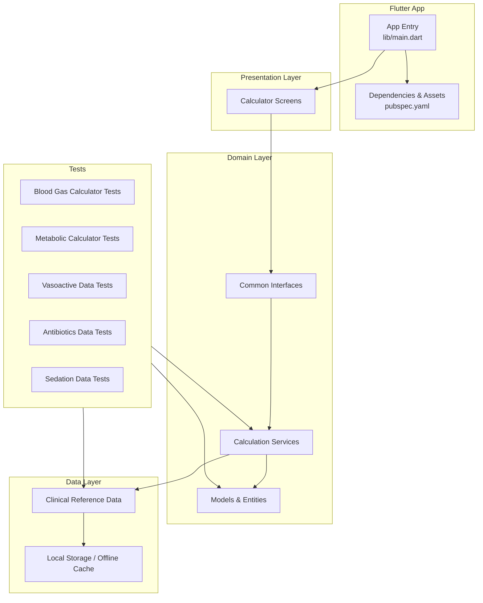
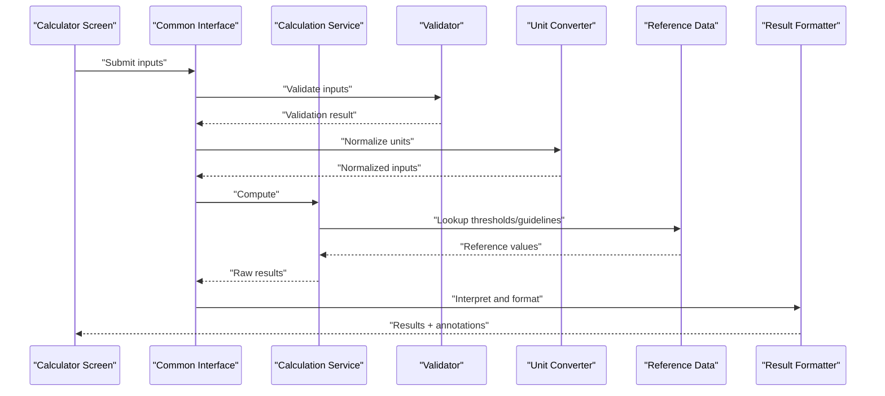
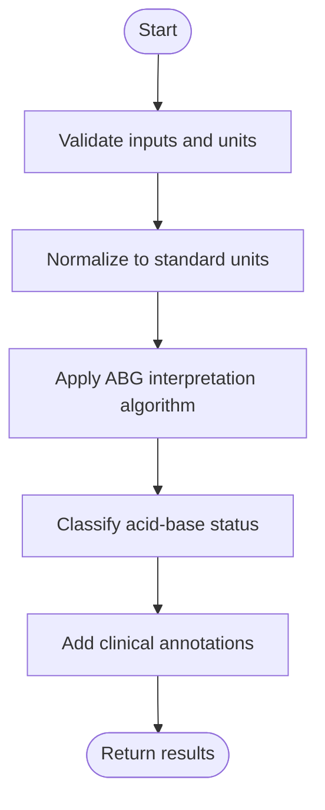
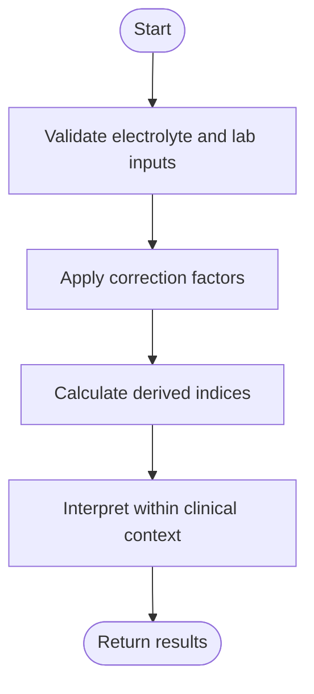
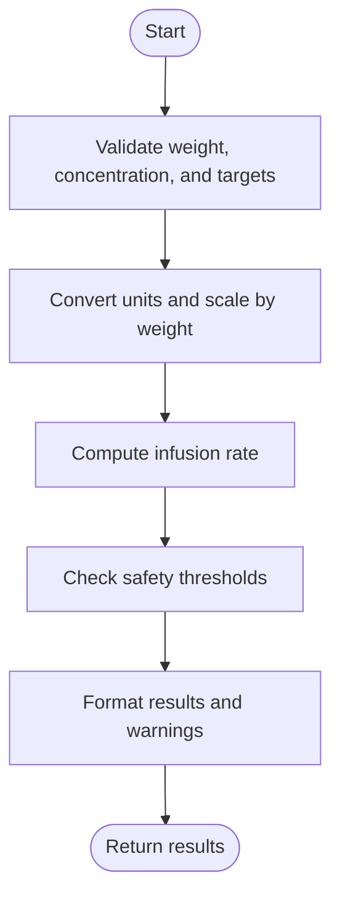
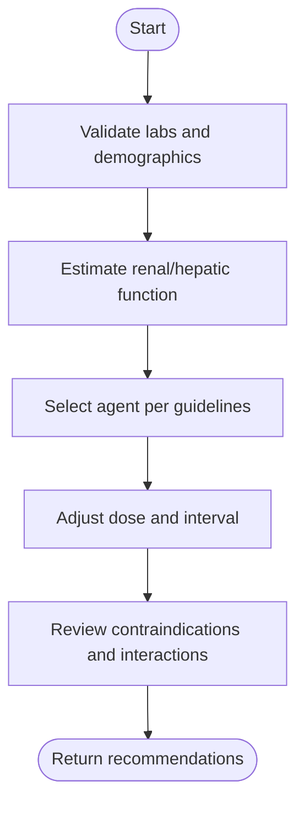
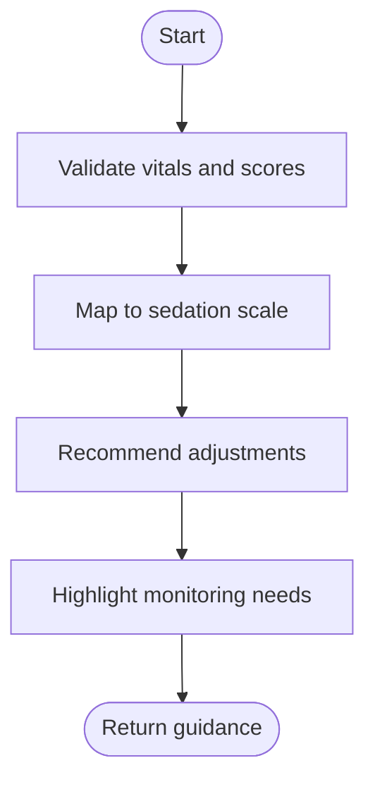
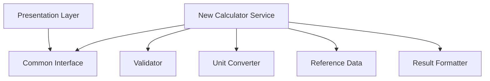
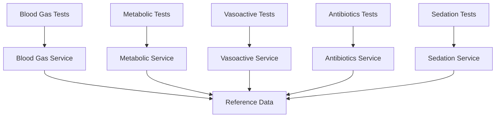

# Medical Calculators

<cite>
**Referenced Files in This Document**
- [main.dart](file://lib/main.dart)
- [pubspec.yaml](file://pubspec.yaml)
- [README.md](file://README.md)
- [blood_gas_calculator_test.dart](file://test/unit/blood_gas_calculator_test.dart)
- [metabolic_calculator_test.dart](file://test/unit/metabolic_calculator_test.dart)
- [vasoactive_data_test.dart](file://test/unit/vasoactive_data_test.dart)
- [antibiotics_data_test.dart](file://test/unit/antibiotics_data_test.dart)
- [sedation_data_test.dart](file://test/unit/sedation_data_test.dart)
</cite>

## Table of Contents
1. [Introduction](#introduction)
2. [Project Structure](#project-structure)
3. [Core Components](#core-components)
4. [Architecture Overview](#architecture-overview)
5. [Detailed Component Analysis](#detailed-component-analysis)
6. [Dependency Analysis](#dependency-analysis)
7. [Performance Considerations](#performance-considerations)
8. [Troubleshooting Guide](#troubleshooting-guide)
9. [Conclusion](#conclusion)
10. [Appendices](#appendices)

## Introduction
This document describes the EMtools medical calculator suite with a focus on architecture, shared interfaces, and common components used across medical calculation modules. It explains standard input validation patterns, calculation engine design, result interpretation algorithms, and clinical decision support features. It also provides guidance for adding new calculators, maintaining medical accuracy, implementing reference data, optimizing performance for real-time use, managing memory for large datasets, ensuring offline accessibility, and validating medical accuracy through testing strategies.

## Project Structure
The project follows a layered Flutter architecture:
- Presentation layer (UI)
- Domain layer (business logic and models)
- Data layer (reference data and persistence)
- Core utilities and shared services
- Tests for unit-level validation of calculators and datasets

**Diagram sources**
- [main.dart](file://lib/main.dart)
- [pubspec.yaml](file://pubspec.yaml)
- [blood_gas_calculator_test.dart](file://test/unit/blood_gas_calculator_test.dart)
- [metabolic_calculator_test.dart](file://test/unit/metabolic_calculator_test.dart)
- [vasoactive_data_test.dart](file://test/unit/vasoactive_data_test.dart)
- [antibiotics_data_test.dart](file://test/unit/antibiotics_data_test.dart)
- [sedation_data_test.dart](file://test/unit/sedation_data_test.dart)

**Section sources**
- [main.dart](file://lib/main.dart)
- [pubspec.yaml](file://pubspec.yaml)
- [README.md](file://README.md)

## Core Components
This section outlines the shared building blocks that underpin all calculators:

- Common Interfaces
  - Standardized input contracts for each calculator (e.g., patient demographics, lab values, medication parameters).
  - Uniform output contracts including numeric results, units, interpretation flags, and references to guidelines or thresholds.
  - Validation contracts returning structured errors with field-level messages.

- Shared Utilities
  - Unit conversion helpers for mass, volume, concentration, flow rates, and physiological units.
  - Rounding and precision utilities aligned with clinical standards.
  - Safe math helpers to guard against division by zero, overflow, and NaN propagation.

- Calculation Engine Patterns
  - Stateless service functions per calculator domain to ensure deterministic outputs.
  - Pipeline pattern: validate inputs -> normalize units -> compute -> interpret -> format.
  - Strategy pattern for alternative algorithms based on age groups, comorbidities, or guideline versions.

- Result Interpretation Algorithms
  - Threshold-based classification using evidence-based ranges.
  - Risk stratification rules combining multiple parameters.
  - Contextual annotations linking results to clinical references.

- Clinical Decision Support Features
  - Alerts for out-of-range or conflicting inputs.
  - Suggested next steps or differential considerations when appropriate.
  - Versioned reference data to maintain alignment with evolving guidelines.

- Error Handling
  - Input validation failures return structured error objects with actionable messages.
  - Graceful fallbacks when reference data is missing or outdated.
  - Logging hooks for diagnostics without exposing sensitive information.

- Offline Accessibility
  - Local caching of reference tables and lookup maps.
  - Deterministic computation independent of network calls.
  - Asset-backed datasets packaged with the app.

**Section sources**
- [blood_gas_calculator_test.dart](file://test/unit/blood_gas_calculator_test.dart)
- [metabolic_calculator_test.dart](file://test/unit/metabolic_calculator_test.dart)
- [vasoactive_data_test.dart](file://test/unit/vasoactive_data_test.dart)
- [antibiotics_data_test.dart](file://test/unit/antibiotics_data_test.dart)
- [sedation_data_test.dart](file://test/unit/sedation_data_test.dart)

## Architecture Overview
The calculator suite uses a clean separation between presentation, domain, and data layers. The presentation layer invokes domain services via common interfaces; domain services orchestrate validation, unit normalization, calculations, and interpretation; data services provide reference datasets and local storage.

**Diagram sources**
- [blood_gas_calculator_test.dart](file://test/unit/blood_gas_calculator_test.dart)
- [metabolic_calculator_test.dart](file://test/unit/metabolic_calculator_test.dart)
- [vasoactive_data_test.dart](file://test/unit/vasoactive_data_test.dart)
- [antibiotics_data_test.dart](file://test/unit/antibiotics_data_test.dart)
- [sedation_data_test.dart](file://test/unit/sedation_data_test.dart)

## Detailed Component Analysis

### Blood Gas Calculator
- Purpose: Interprets arterial blood gas values and related parameters to assist acid-base assessment.
- Inputs: pH, pCO2, pO2, HCO3-, base excess, lactate, temperature, FiO2, altitude where applicable.
- Processing: Validates ranges, normalizes units, applies established formulas, interprets primary disorders and compensations.
- Outputs: Interpretation categories, recommended follow-up tests, and links to clinical references.

**Diagram sources**
- [blood_gas_calculator_test.dart](file://test/unit/blood_gas_calculator_test.dart)

**Section sources**
- [blood_gas_calculator_test.dart](file://test/unit/blood_gas_calculator_test.dart)

### Metabolic Calculator
- Purpose: Calculates metabolic indices such as anion gap, osmolality, and related corrections.
- Inputs: Electrolytes (Na+, K+, Cl-, HCO3-), glucose, BUN, creatinine, albumin, measured osmolality.
- Processing: Applies correction factors (e.g., albumin-corrected anion gap), validates physiologic plausibility.
- Outputs: Derived values with units, interpretation flags, and suggested clinical actions.

**Diagram sources**
- [metabolic_calculator_test.dart](file://test/unit/metabolic_calculator_test.dart)

**Section sources**
- [metabolic_calculator_test.dart](file://test/unit/metabolic_calculator_test.dart)

### Vasoactive Agent Calculator
- Purpose: Assists dosing and titration of vasoactive medications with weight-based and infusion rate conversions.
- Inputs: Patient weight, target hemodynamic parameters, drug concentration, infusion pump settings.
- Processing: Converts units, computes dose per kg/min, translates to mL/hr, checks safety limits.
- Outputs: Recommended infusion rates, alerts for extreme doses, and references to institutional protocols.

**Diagram sources**
- [vasoactive_data_test.dart](file://test/unit/vasoactive_data_test.dart)

**Section sources**
- [vasoactive_data_test.dart](file://test/unit/vasoactive_data_test.dart)

### Antibiotics Dosing Calculator
- Purpose: Supports antibiotic selection and dosing adjustments based on renal/hepatic function and patient characteristics.
- Inputs: Age, weight, serum creatinine/eGFR, liver function markers, infection site, allergy history.
- Processing: Estimates clearance, adjusts doses, selects agents per guidelines, flags interactions.
- Outputs: Dosing recommendations, monitoring suggestions, and references to evidence-based protocols.

**Diagram sources**
- [antibiotics_data_test.dart](file://test/unit/antibiotics_data_test.dart)

**Section sources**
- [antibiotics_data_test.dart](file://test/unit/antibiotics_data_test.dart)

### Sedation Calculator
- Purpose: Aids sedation depth assessment and medication titration for procedural or ICU sedation.
- Inputs: Patient vitals, sedation scores, current medications, organ function.
- Processing: Maps scores to sedation levels, suggests incremental adjustments, monitors adverse effects.
- Outputs: Sedation level interpretation, titration guidance, and safety reminders.

**Diagram sources**
- [sedation_data_test.dart](file://test/unit/sedation_data_test.dart)

**Section sources**
- [sedation_data_test.dart](file://test/unit/sedation_data_test.dart)

### Conceptual Overview
The following conceptual diagram illustrates how a new calculator can be integrated into the existing architecture:

[No sources needed since this diagram shows conceptual workflow, not actual code structure]

## Dependency Analysis
The test files demonstrate dependencies on domain services and reference data, ensuring calculators remain decoupled from UI and stable across platforms.

**Diagram sources**
- [blood_gas_calculator_test.dart](file://test/unit/blood_gas_calculator_test.dart)
- [metabolic_calculator_test.dart](file://test/unit/metabolic_calculator_test.dart)
- [vasoactive_data_test.dart](file://test/unit/vasoactive_data_test.dart)
- [antibiotics_data_test.dart](file://test/unit/antibiotics_data_test.dart)
- [sedation_data_test.dart](file://test/unit/sedation_data_test.dart)

**Section sources**
- [blood_gas_calculator_test.dart](file://test/unit/blood_gas_calculator_test.dart)
- [metabolic_calculator_test.dart](file://test/unit/metabolic_calculator_test.dart)
- [vasoactive_data_test.dart](file://test/unit/vasoactive_data_test.dart)
- [antibiotics_data_test.dart](file://test/unit/antibiotics_data_test.dart)
- [sedation_data_test.dart](file://test/unit/sedation_data_test.dart)

## Performance Considerations
- Real-time calculations
  - Keep services stateless and pure to enable fast, deterministic computations.
  - Precompute static lookups and cache them in memory at startup.
  - Avoid heavy I/O during user interactions; defer background tasks.

- Memory management
  - Use streaming or chunked loading for large reference datasets.
  - Release temporary buffers after calculations.
  - Prefer immutable data structures for reference tables to reduce copying overhead.

- Offline accessibility
  - Package essential reference data as assets.
  - Implement versioned schemas for reference data to avoid runtime migrations.
  - Ensure all critical paths do not depend on network calls.

[No sources needed since this section provides general guidance]

## Troubleshooting Guide
- Input validation failures
  - Check field-level error messages returned by validators.
  - Verify units and ranges before invoking calculators.

- Incorrect results
  - Confirm reference data versions match expected guidelines.
  - Inspect intermediate normalized values for unit mismatches.

- Performance issues
  - Profile long-running computations and identify hotspots.
  - Reduce unnecessary allocations and reuse converters.

- Offline behavior
  - Validate asset loading and cache initialization at startup.
  - Test core flows without network access.

**Section sources**
- [blood_gas_calculator_test.dart](file://test/unit/blood_gas_calculator_test.dart)
- [metabolic_calculator_test.dart](file://test/unit/metabolic_calculator_test.dart)
- [vasoactive_data_test.dart](file://test/unit/vasoactive_data_test.dart)
- [antibiotics_data_test.dart](file://test/unit/antibiotics_data_test.dart)
- [sedation_data_test.dart](file://test/unit/sedation_data_test.dart)

## Conclusion
EMtools’ medical calculator suite leverages a layered architecture with shared interfaces, robust validation, unit normalization, and evidence-based interpretation. The consistent pipeline across calculators ensures reliability, while comprehensive tests anchor medical accuracy. By adhering to the patterns outlined here—stateless services, versioned reference data, and offline-first design—the suite remains performant, maintainable, and clinically trustworthy.

## Appendices

### Guidelines for Adding New Calculators
- Define clear input/output contracts via common interfaces.
- Implement validation and unit normalization before computation.
- Use strategy patterns for variant algorithms (age, comorbidities, guidelines).
- Provide annotated results with references and safety flags.
- Add unit tests covering edge cases, boundary conditions, and known scenarios.

### Maintaining Medical Accuracy
- Anchor thresholds and formulas to peer-reviewed guidelines.
- Version reference data and document change logs.
- Include scenario-based tests with expected outcomes.
- Periodically review and update calculators with new evidence.

### Implementing Clinical Reference Data
- Store reference tables as immutable assets.
- Provide migration scripts for schema updates.
- Expose APIs to query by category, version, and region if needed.

### Testing Strategies for Medical Accuracy
- Scenario-driven tests mirroring clinical vignettes.
- Boundary and negative tests for invalid inputs.
- Regression tests anchored to published examples.
- Cross-validation against trusted tools or literature.

**Section sources**
- [blood_gas_calculator_test.dart](file://test/unit/blood_gas_calculator_test.dart)
- [metabolic_calculator_test.dart](file://test/unit/metabolic_calculator_test.dart)
- [vasoactive_data_test.dart](file://test/unit/vasoactive_data_test.dart)
- [antibiotics_data_test.dart](file://test/unit/antibiotics_data_test.dart)
- [sedation_data_test.dart](file://test/unit/sedation_data_test.dart)