# Metabolic Calculator

<cite>
**Referenced Files in This Document**
- [README.md](file://README.md)
- [pubspec.yaml](file://pubspec.yaml)
- [lib/main.dart](file://lib/main.dart)
- [test/unit/metabolic_calculator_test.dart](file://test/unit/metabolic_calculator_test.dart)
- [test/unit/metabolic_scenarios_test.dart](file://test/unit/metabolic_scenarios_test.dart)
</cite>

## Table of Contents
1. [Introduction](#introduction)
2. [Project Structure](#project-structure)
3. [Core Components](#core-components)
4. [Architecture Overview](#architecture-overview)
5. [Detailed Component Analysis](#detailed-component-analysis)
6. [Dependency Analysis](#dependency-analysis)
7. [Performance Considerations](#performance-considerations)
8. [Troubleshooting Guide](#troubleshooting-guide)
9. [Conclusion](#conclusion)
10. [Appendices](#appendices)

## Introduction
This document provides comprehensive documentation for the Metabolic Calculator module within the EMtools project. The module focuses on clinical calculations relevant to metabolic and acid-base disorders, including anion gap computation, osmolar gap assessment, electrolyte balance analysis, renal function estimation (eGFR and creatinine clearance), and toxicology-related calculations. It also covers input validation, unit conversions, physiological range checks, corrected sodium, albumin-adjusted anion gap, delta-delta ratios, and clinical decision support features that interpret results and suggest differential diagnoses. Examples include diabetic ketoacidosis, lactic acidosis, and toxic alcohol ingestions.

## Project Structure
The EMtools project is a Flutter application with Dart code under lib/ and tests under test/. The Metabolic Calculator functionality is exercised through dedicated unit tests, indicating core calculation logic resides in library modules referenced by these tests. The top-level files provide project configuration and entry points:
- README.md: Project overview and usage context
- pubspec.yaml: Dependencies and metadata
- lib/main.dart: Application entry point
- test/unit/metabolic_calculator_test.dart: Unit tests for metabolic calculator functions
- test/unit/metabolic_scenarios_test.dart: Scenario-based tests for complex cases

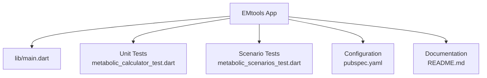

**Diagram sources**
- [lib/main.dart](file://lib/main.dart)
- [test/unit/metabolic_calculator_test.dart](file://test/unit/metabolic_calculator_test.dart)
- [test/unit/metabolic_scenarios_test.dart](file://test/unit/metabolic_scenarios_test.dart)
- [pubspec.yaml](file://pubspec.yaml)
- [README.md](file://README.md)

**Section sources**
- [README.md](file://README.md)
- [pubspec.yaml](file://pubspec.yaml)
- [lib/main.dart](file://lib/main.dart)
- [test/unit/metabolic_calculator_test.dart](file://test/unit/metabolic_calculator_test.dart)
- [test/unit/metabolic_scenarios_test.dart](file://test/unit/metabolic_scenarios_test.dart)

## Core Components
The Metabolic Calculator module includes the following core components:
- Anion Gap Calculation: Computes AG using serum sodium, chloride, and bicarbonate; supports albumin correction.
- Osmolar Gap Assessment: Calculates measured vs calculated osmolality to identify unmeasured osmoles.
- Electrolyte Balance Analysis: Evaluates net charge balance and identifies discrepancies.
- Renal Function Estimation: Implements eGFR (e.g., CKD-EPI or MDRD variants) and creatinine clearance (Cockcroft-Gault).
- Toxicology Calculations: Includes ethanol-equivalent estimates and toxic alcohol screening via osmolar gap interpretation.
- Input Validation and Range Checking: Validates units, ranges, and flags physiologically implausible values.
- Unit Conversions: Handles common lab units (mmol/L vs mEq/L, mg/dL vs SI).
- Corrected Sodium: Adjusts sodium for hyperglycemia.
- Albumin-Adjusted Anion Gap: Normalizes AG for hypoalbuminemia.
- Delta-Delta Ratio: Compares change in AG to change in bicarbonate to assess mixed acid-base disorders.
- Clinical Decision Support: Interprets results and suggests differential diagnoses based on calculated values.

These components are validated and demonstrated through unit and scenario tests.

**Section sources**
- [test/unit/metabolic_calculator_test.dart](file://test/unit/metabolic_calculator_test.dart)
- [test/unit/metabolic_scenarios_test.dart](file://test/unit/metabolic_scenarios_test.dart)

## Architecture Overview
At a high level, the Metabolic Calculator is implemented as a set of pure functions and services invoked by the UI layer. Inputs are collected from laboratory data, validated, converted to standard units, and processed by calculators. Outputs include numeric results, flags for abnormal ranges, and textual interpretations with suggested differentials.

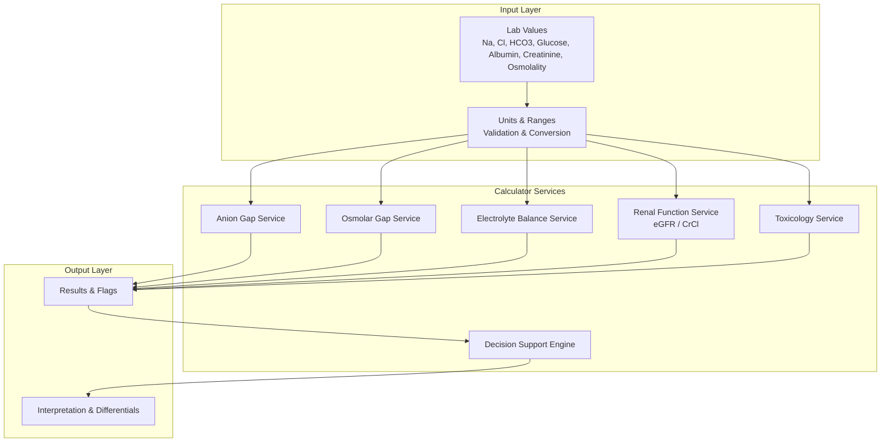

[No sources needed since this diagram shows conceptual workflow, not actual code structure]

## Detailed Component Analysis

### Anion Gap and Albumin-Adjusted Anion Gap
- Purpose: Quantify unmeasured anions and adjust for albumin effects.
- Inputs: Sodium, Chloride, Bicarbonate, Albumin.
- Processing: Compute raw AG; apply albumin correction factor proportional to deviation from normal albumin.
- Outputs: Raw AG, corrected AG, flag if elevated.

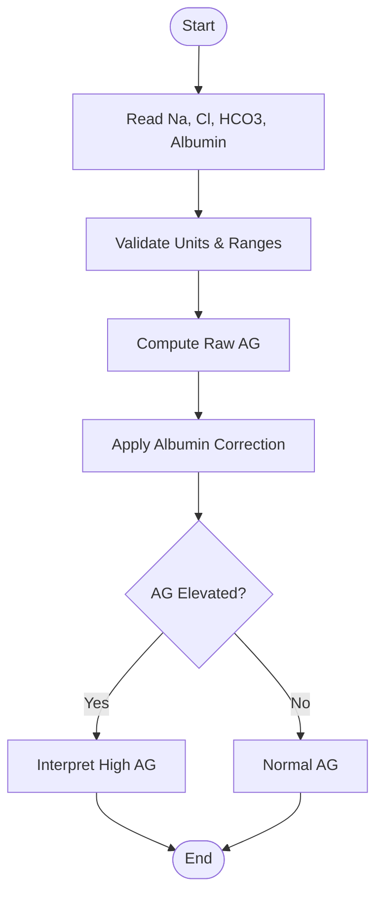

**Section sources**
- [test/unit/metabolic_calculator_test.dart](file://test/unit/metabolic_calculator_test.dart)

### Osmolar Gap Assessment
- Purpose: Identify presence of unmeasured osmoles (e.g., toxic alcohols).
- Inputs: Measured osmolality, Sodium, Glucose, BUN.
- Processing: Calculate expected osmolality; subtract from measured to obtain osmolar gap.
- Outputs: Osmolar gap value, flag if elevated, interpretation guidance.

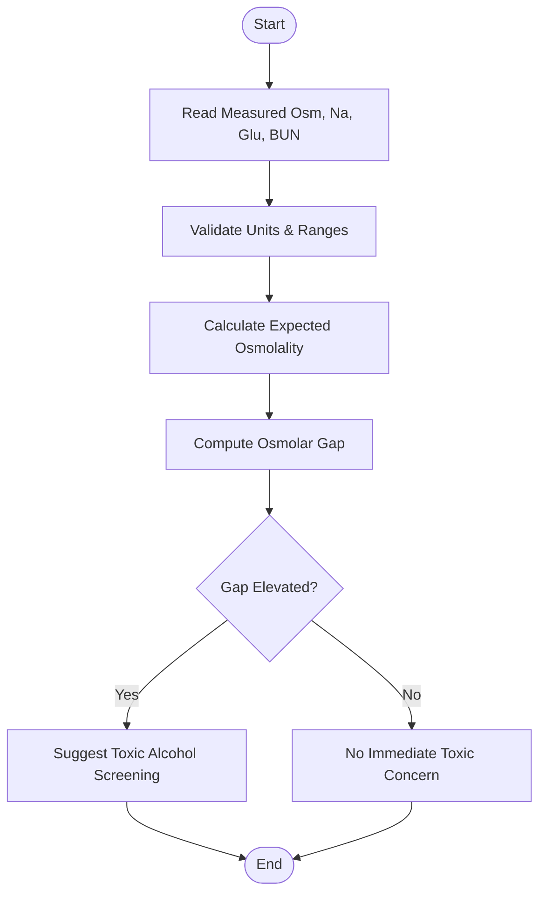

**Section sources**
- [test/unit/metabolic_calculator_test.dart](file://test/unit/metabolic_calculator_test.dart)

### Electrolyte Balance Analysis
- Purpose: Evaluate overall cation-anion balance and detect inconsistencies.
- Inputs: Major cations and anions (Na, K, Cl, HCO3).
- Processing: Sum cations and anions; compute net balance; compare to expected physiologic constraints.
- Outputs: Net balance, flags for significant imbalance, suggestions for repeat testing.

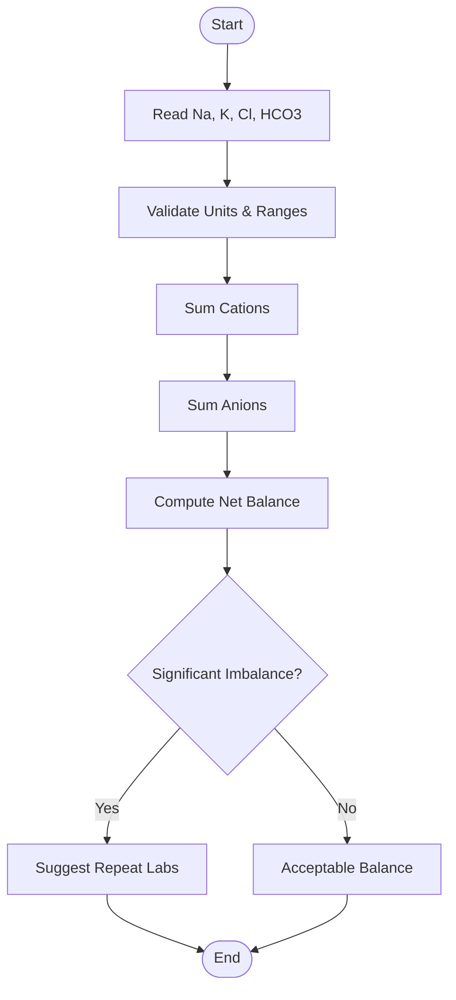

**Section sources**
- [test/unit/metabolic_calculator_test.dart](file://test/unit/metabolic_calculator_test.dart)

### Renal Function Estimation (eGFR and Creatinine Clearance)
- Purpose: Estimate kidney function for dosing and clinical decisions.
- Inputs: Serum creatinine, age, sex, weight (for CrCl), race (if applicable per formula version).
- Processing: Apply eGFR equation (e.g., CKD-EPI) and Cockcroft-Gault for CrCl.
- Outputs: eGFR, CrCl, stage classification, flags for low values.

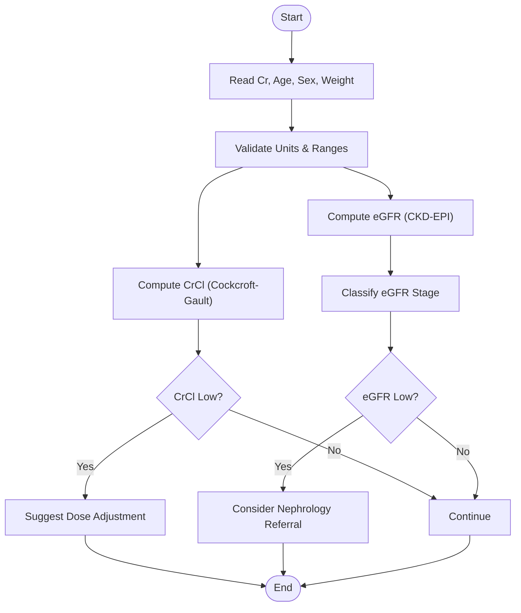

**Section sources**
- [test/unit/metabolic_calculator_test.dart](file://test/unit/metabolic_calculator_test.dart)

### Toxicology Calculations
- Purpose: Screen for toxic alcohols and estimate ethanol equivalents.
- Inputs: Osmolar gap, measured ethanol (optional), glucose, BUN.
- Processing: Use osmolar gap elevation to trigger toxic alcohol suspicion; optionally convert measured ethanol to mmol/L.
- Outputs: Toxicity risk flag, recommendations for confirmatory testing.

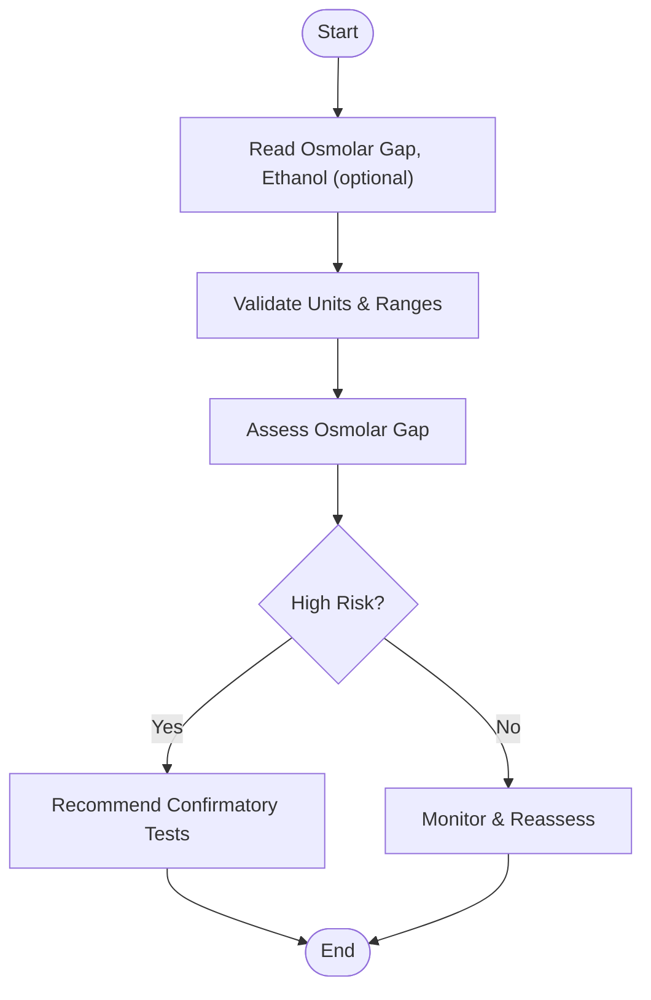

**Section sources**
- [test/unit/metabolic_calculator_test.dart](file://test/unit/metabolic_calculator_test.dart)

### Input Validation, Unit Conversions, and Physiological Range Checking
- Purpose: Ensure robustness and safety of inputs before calculations.
- Features:
  - Unit normalization (e.g., mmol/L vs mEq/L, mg/dL vs SI).
  - Range checks against accepted physiological limits.
  - Error reporting for out-of-range or missing values.
- Outputs: Validated inputs, warnings, and error messages.

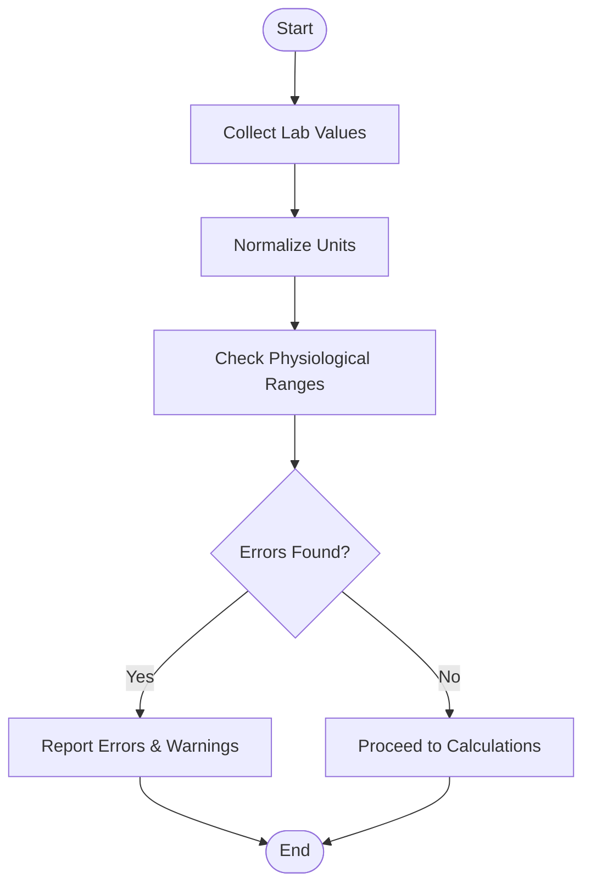

**Section sources**
- [test/unit/metabolic_calculator_test.dart](file://test/unit/metabolic_calculator_test.dart)

### Corrected Sodium
- Purpose: Adjust sodium for hyperglycemia-induced dilutional hyponatremia.
- Inputs: Measured sodium, glucose.
- Processing: Apply correction factor per unit increase in glucose above normal threshold.
- Outputs: Corrected sodium, flag if significantly altered.

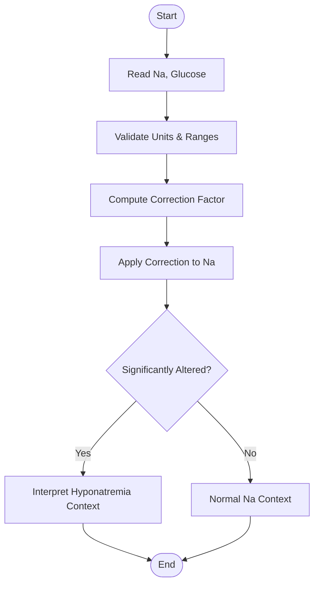

**Section sources**
- [test/unit/metabolic_calculator_test.dart](file://test/unit/metabolic_calculator_test.dart)

### Delta-Delta Ratio
- Purpose: Differentiate mixed acid-base disorders by comparing changes in AG and bicarbonate.
- Inputs: AG, baseline bicarbonate, measured bicarbonate.
- Processing: Compute delta AG and delta HCO3; derive ratio; interpret mixed processes.
- Outputs: Delta-delta ratio, interpretation (pure high AG, mixed, concurrent metabolic alkalosis).

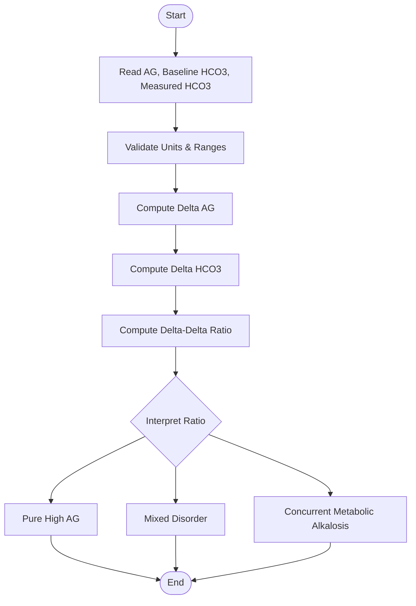

**Section sources**
- [test/unit/metabolic_calculator_test.dart](file://test/unit/metabolic_calculator_test.dart)

### Clinical Decision Support
- Purpose: Translate calculated values into actionable insights.
- Features:
  - Interpretation rules for high AG, elevated osmolar gap, low eGFR/CrCl.
  - Differential diagnosis suggestions (e.g., DKA, lactic acidosis, toxic alcohol ingestion).
  - Recommendations for confirmatory tests and management steps.
- Outputs: Textual interpretation, prioritized differentials, next-step suggestions.

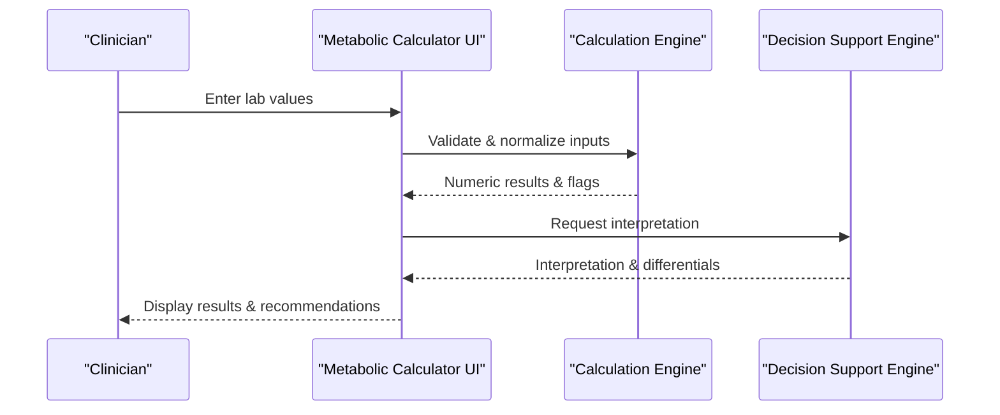

**Section sources**
- [test/unit/metabolic_scenarios_test.dart](file://test/unit/metabolic_scenarios_test.dart)

### Complex Scenarios
- Diabetic Ketoacidosis (DKA):
  - Expect elevated AG, low bicarbonate, high glucose, possible ketonemia.
  - Decision support suggests insulin therapy, fluid resuscitation, and monitoring.
- Lactic Acidosis:
  - Elevated AG with low bicarbonate; consider tissue hypoxia, sepsis, medications.
  - Decision support recommends source control and supportive care.
- Toxic Alcohol Ingestions:
  - Elevated osmolar gap with high AG; consider fomepizole or ethanol infusion.
  - Decision support advises confirmatory assays and antidote administration.

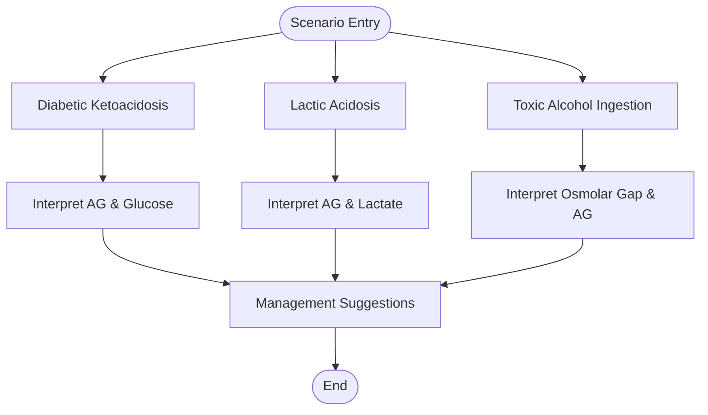

**Section sources**
- [test/unit/metabolic_scenarios_test.dart](file://test/unit/metabolic_scenarios_test.dart)

## Dependency Analysis
The Metabolic Calculator depends on:
- Input validation utilities for unit conversion and range checking.
- Calculation services for each domain (anion gap, osmolar gap, renal function, toxicology).
- Decision support engine for interpreting results and generating recommendations.
- Test suites ensure correctness across typical and edge-case scenarios.

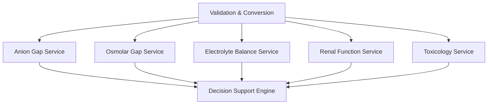

[No sources needed since this diagram shows conceptual relationships, not specific file mappings]

**Section sources**
- [test/unit/metabolic_calculator_test.dart](file://test/unit/metabolic_calculator_test.dart)
- [test/unit/metabolic_scenarios_test.dart](file://test/unit/metabolic_scenarios_test.dart)

## Performance Considerations
- Keep calculations stateless and deterministic for fast execution.
- Cache reference ranges and constants to avoid repeated lookups.
- Minimize branching complexity in validation to reduce overhead.
- Batch multiple calculations when processing large datasets.
- Avoid unnecessary string formatting until final output generation.

[No sources needed since this section provides general guidance]

## Troubleshooting Guide
Common issues and resolutions:
- Out-of-range lab values: Review input units and physiological limits; re-measure if necessary.
- Unexpected negative osmolar gap: Verify measured osmolality and calculation inputs; check for lab errors.
- Discrepancies in electrolyte balance: Consider unmeasured ions or lab variability; repeat labs.
- Incorrect eGFR/CrCl: Confirm patient demographics and units; use appropriate formula variant.
- Misinterpretation of delta-delta ratio: Recheck baseline bicarbonate and AG values; consider mixed disorders.

**Section sources**
- [test/unit/metabolic_calculator_test.dart](file://test/unit/metabolic_calculator_test.dart)
- [test/unit/metabolic_scenarios_test.dart](file://test/unit/metabolic_scenarios_test.dart)

## Conclusion
The Metabolic Calculator module provides essential clinical calculations for acid-base and metabolic assessments, supported by robust validation, unit handling, and decision support. Through targeted unit and scenario tests, it ensures accuracy across diverse clinical presentations such as DKA, lactic acidosis, and toxic alcohol ingestions. Continuous refinement of interpretation rules and performance optimizations will further enhance its utility in emergency and critical care settings.

[No sources needed since this section summarizes without analyzing specific files]

## Appendices
- Reference ranges and formulas used in calculations should be documented alongside implementation details.
- Versioning of equations (e.g., CKD-EPI updates) must be tracked to maintain clinical accuracy.
- Integration points with electronic health records can streamline data entry and validation.

[No sources needed since this section provides general guidance]