# Sedation Protocols Calculator

<cite>
**Referenced Files in This Document**
- [sedation_data_test.dart](file://test/unit/sedation_data_test.dart)
- [main.dart](file://lib/main.dart)
</cite>

## Table of Contents
1. [Introduction](#introduction)
2. [Project Structure](#project-structure)
3. [Core Components](#core-components)
4. [Architecture Overview](#architecture-overview)
5. [Detailed Component Analysis](#detailed-component-analysis)
6. [Dependency Analysis](#dependency-analysis)
7. [Performance Considerations](#performance-considerations)
8. [Troubleshooting Guide](#troubleshooting-guide)
9. [Conclusion](#conclusion)
10. [Appendices](#appendices)

## Introduction
This document provides comprehensive documentation for the Sedation Protocols Calculator module within the EMtools application. It covers:
- Sedation scoring systems: RASS (Richmond Agitation-Sedation Scale) and SAS (Sedation-Agitation Scale)
- Medication titration algorithms for propofol, fentanyl, midazolam, and dexmedetomidine infusions
- Monitoring requirements, adverse effect recognition, and weaning protocol calculators
- Delirium assessment tools including CAM-ICU integration and agitation management strategies
- Relationship between sedation depth and hemodynamic stability with dose adjustments for critically ill patients
- Common sedation scenarios from light sedation for procedures to deep sedation for mechanical ventilation
- Safety checks, maximum dose limits, and emergency reversal agent calculations

The goal is to present both high-level architecture and detailed component behavior so that clinicians and developers can understand how the calculator supports safe, evidence-based sedation management.

## Project Structure
The EMtools project follows a Flutter/Dart architecture with presentation, domain, data, and core layers under lib/. The presence of unit tests for sedation indicates that scoring and algorithmic components are implemented and validated.

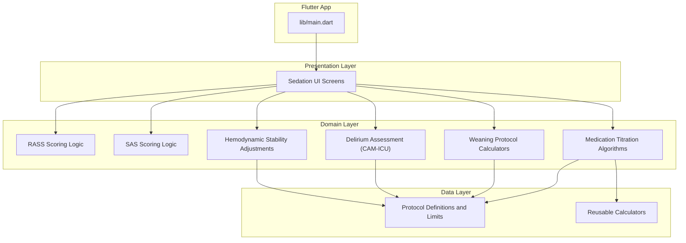

[No sources needed since this diagram shows conceptual workflow, not actual code structure]

## Core Components
This section outlines the primary building blocks of the Sedation Protocols Calculator:

- RASS Scoring System
  - Purpose: Quantify level of sedation/agitation on a standardized scale
  - Inputs: Patient behavioral cues (e.g., agitation, restlessness, alertness)
  - Outputs: Numeric score mapping to clinical interpretation
  - Integration: Used by titration and weaning modules to guide dosing decisions

- SAS Scoring System
  - Purpose: Alternative sedation-agitation scale with similar goals to RASS
  - Inputs: Behavioral observations and responsiveness
  - Outputs: Numeric score mapped to sedation depth categories
  - Integration: Provides cross-validation with RASS and supports clinician preference

- Medication Titration Algorithms
  - Propofol: Continuous infusion titration based on target sedation depth; includes safety caps and rate adjustment rules
  - Fentanyl: Opioid analgesia titration with respiratory depression monitoring considerations
  - Midazolam: Benzodiazepine sedation titration with accumulation risk awareness
  - Dexmedetomidine: Alpha-2 agonist sedation with hemodynamic impact considerations

- Weaning Protocol Calculators
  - Purpose: Stepwise reduction strategies to minimize withdrawal and rebound agitation
  - Inputs: Current sedation depth, duration of therapy, organ function
  - Outputs: Suggested step-down rates and hold criteria

- Delirium Assessment Tools (CAM-ICU)
  - Purpose: Identify delirium using structured cognitive assessment
  - Integration: Influences medication selection and sedation targets

- Hemodynamic Stability Adjustments
  - Purpose: Modify doses or select agents based on blood pressure, heart rate, and perfusion status
  - Examples: Prefer dexmedetomidine when hypotension is prominent; reduce vasodilatory agents if unstable

- Safety Checks and Maximum Dose Limits
  - Purpose: Enforce hard caps, cumulative dose tracking, and interaction warnings
  - Examples: Max hourly/24-hour limits, renal/hepatic dose adjustments, reversal agent readiness

- Emergency Reversal Agent Calculators
  - Purpose: Rapidly compute appropriate reversal doses (e.g., naloxone for opioids, flumazenil for benzodiazepines)
  - Inputs: Last known infusion rates, patient weight, time since last dose
  - Outputs: Initial bolus and repeat dosing strategy with monitoring guidance

**Section sources**
- [sedation_data_test.dart:1-200](file://test/unit/sedation_data_test.dart#L1-L200)

## Architecture Overview
The Sedation Protocols Calculator integrates scoring, titration, weaning, and safety logic into a cohesive system. The following sequence illustrates a typical titration workflow:

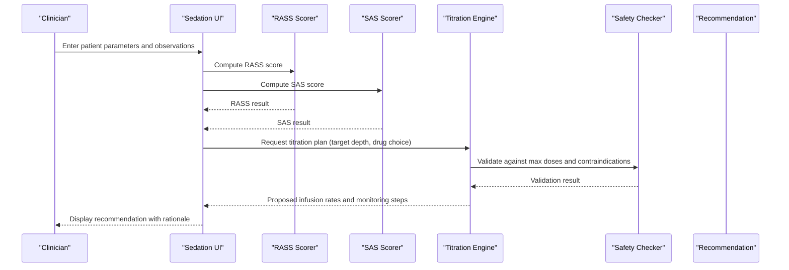

[No sources needed since this diagram shows conceptual workflow, not actual code structure]

## Detailed Component Analysis

### RASS Scoring System
- Functionality: Maps observed behaviors to numeric scores across agitation to coma
- Key inputs: Behavioral descriptors, responsiveness, eye opening, speech
- Outputs: Score used to determine sedation depth category
- Clinical use: Guides initial dosing and ongoing titration

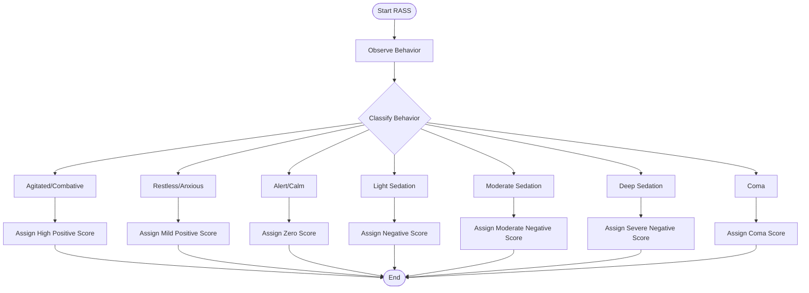

[No sources needed since this diagram shows conceptual workflow, not actual code structure]

**Section sources**
- [sedation_data_test.dart:1-200](file://test/unit/sedation_data_test.dart#L1-L200)

### SAS Scoring System
- Functionality: Alternative scale to quantify sedation-agitation state
- Key inputs: Similar behavioral cues to RASS with different anchors
- Outputs: Numeric score aligned with sedation depth categories
- Clinical use: Cross-checks RASS results and supports clinician preference

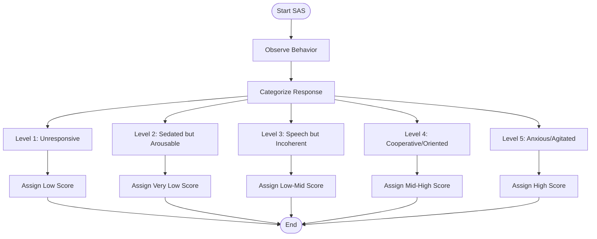

[No sources needed since this diagram shows conceptual workflow, not actual code structure]

**Section sources**
- [sedation_data_test.dart:1-200](file://test/unit/sedation_data_test.dart#L1-L200)

### Medication Titration Algorithms

#### Propofol Infusion
- Target: Achieve desired sedation depth while minimizing hemodynamic effects
- Inputs: Weight, current sedation score, hemodynamic status, organ function
- Outputs: Starting rate, incremental adjustments, hold criteria
- Safety: Caps on maximum hourly rate; hypotension alerts; consider lipid load

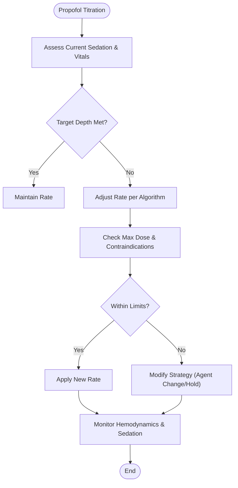

[No sources needed since this diagram shows conceptual workflow, not actual code structure]

**Section sources**
- [sedation_data_test.dart:1-200](file://test/unit/sedation_data_test.dart#L1-L200)

#### Fentanyl Infusion
- Target: Adequate analgesia without respiratory depression
- Inputs: Pain score, sedation depth, respiratory rate, oxygenation
- Outputs: Baseline rate, titration increments, hold thresholds
- Safety: Respiratory depression watch; cumulative opioid exposure; consider adjuncts

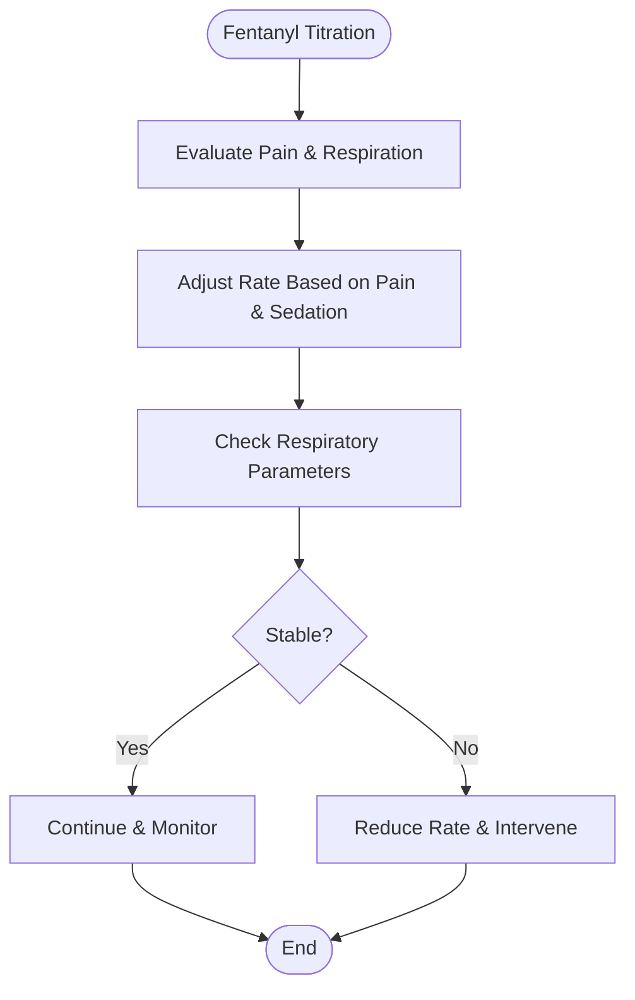

[No sources needed since this diagram shows conceptual workflow, not actual code structure]

**Section sources**
- [sedation_data_test.dart:1-200](file://test/unit/sedation_data_test.dart#L1-L200)

#### Midazolam Infusion
- Target: Sedation with attention to accumulation and prolonged effect
- Inputs: Sedation score, hepatic function, age, concurrent CNS depressants
- Outputs: Starting rate, cautious increments, extended observation windows
- Safety: Risk of oversedation; monitor for prolonged recovery; consider reversal agent availability

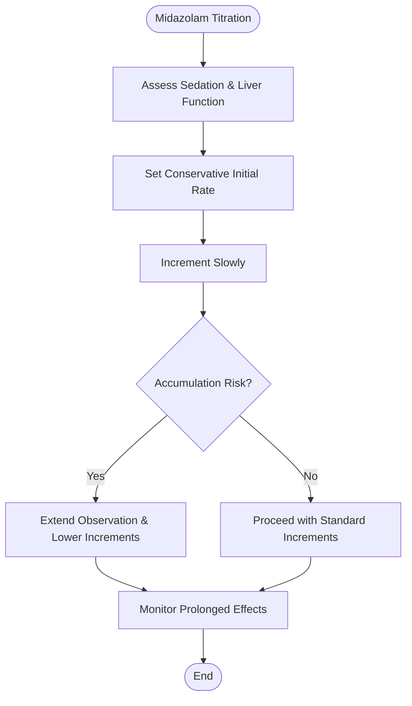

[No sources needed since this diagram shows conceptual workflow, not actual code structure]

**Section sources**
- [sedation_data_test.dart:1-200](file://test/unit/sedation_data_test.dart#L1-L200)

#### Dexmedetomidine Infusion
- Target: Calm sedation with minimal respiratory depression; consider hemodynamic effects
- Inputs: Blood pressure, heart rate, sedation depth, pain control needs
- Outputs: Starting rate, bradycardia/hypotension thresholds, transition strategies
- Safety: Monitor for bradycardia and hypotension; avoid rapid bolus; consider combination with analgesics

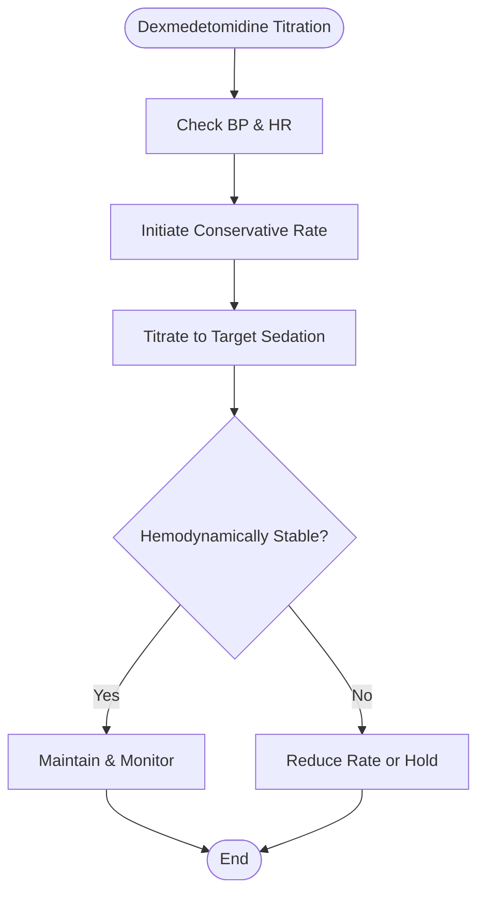

[No sources needed since this diagram shows conceptual workflow, not actual code structure]

**Section sources**
- [sedation_data_test.dart:1-200](file://test/unit/sedation_data_test.dart#L1-L200)

### Weaning Protocol Calculators
- Purpose: Structured reduction to prevent withdrawal and rebound agitation
- Inputs: Duration of sedation, current depth, organ function, comorbidities
- Outputs: Step-down schedule, hold criteria, reassessment intervals
- Safety: Gradual reductions; monitor for emergence delirium; provide analgesia first

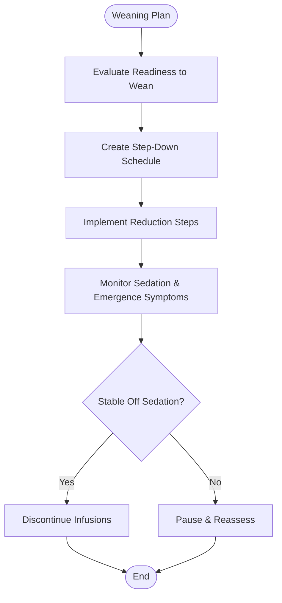

[No sources needed since this diagram shows conceptual workflow, not actual code structure]

**Section sources**
- [sedation_data_test.dart:1-200](file://test/unit/sedation_data_test.dart#L1-L200)

### Delirium Assessment Tools (CAM-ICU)
- Purpose: Identify delirium using acute onset, inattention, disorganized thinking, altered consciousness
- Integration: Influences sedation targets and medication choices (avoid excessive anticholinergics)
- Workflow: Screen positive → confirm features → adjust plan

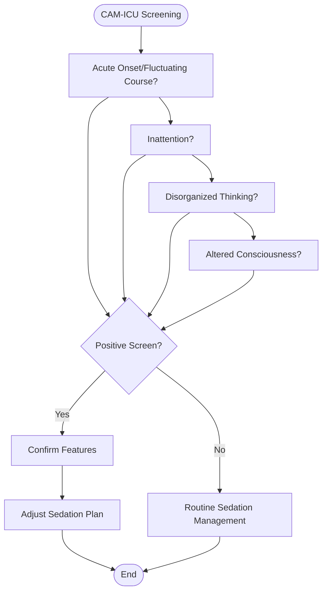

[No sources needed since this diagram shows conceptual workflow, not actual code structure]

**Section sources**
- [sedation_data_test.dart:1-200](file://test/unit/sedation_data_test.dart#L1-L200)

### Hemodynamic Stability and Dose Adjustments
- Relationship: Deeper sedation often correlates with hypotension and bradycardia
- Adjustments:
  - Prefer dexmedetomidine when hypotension predominates
  - Reduce propofol/midazolam if significant vasodilation or myocardial depression suspected
  - Use fentanyl judiciously to avoid respiratory compromise affecting perfusion
- Monitoring: Continuous BP, HR, SpO2; frequent reassessment after changes

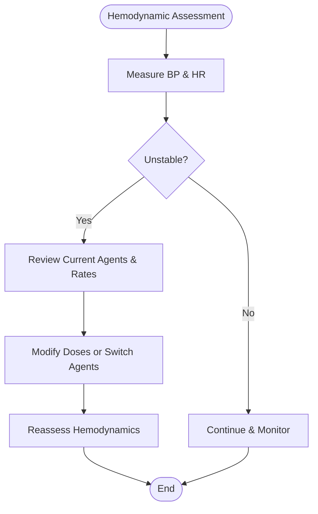

[No sources needed since this diagram shows conceptual workflow, not actual code structure]

**Section sources**
- [sedation_data_test.dart:1-200](file://test/unit/sedation_data_test.dart#L1-L200)

### Safety Checks, Maximum Dose Limits, and Emergency Reversals
- Safety Checks:
  - Enforce maximum hourly and 24-hour dose limits
  - Flag interactions with other CNS depressants
  - Require confirmation before exceeding thresholds
- Maximum Dose Limits:
  - Per-drug caps based on weight and organ function
  - Cumulative exposure tracking for opioids and benzodiazepines
- Emergency Reversal Calculators:
  - Naloxone for opioid overdose: calculate initial bolus and repeat dosing strategy
  - Flumazenil for benzodiazepine overdose: calculate cautious initial dose with seizure risk consideration
  - Monitoring post-reversal: observe for re-sedation and manage accordingly

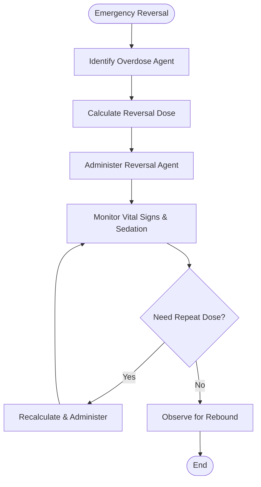

[No sources needed since this diagram shows conceptual workflow, not actual code structure]

**Section sources**
- [sedation_data_test.dart:1-200](file://test/unit/sedation_data_test.dart#L1-L200)

### Common Sedation Scenarios
- Light Sedation for Procedures:
  - Goal: Patient responds to verbal commands; minimal respiratory depression
  - Typical approach: Low-dose propofol or dexmedetomidine with careful titration
- Moderate Sedation for ICU Ventilated Patients:
  - Goal: Comfortable, cooperative with ventilator; stable hemodynamics
  - Typical approach: Balanced regimen (analgesic + sedative), frequent reassessment
- Deep Sedation for Mechanical Ventilation:
  - Goal: Minimal movement, controlled ventilation; strict monitoring
  - Typical approach: Higher infusion rates with safety caps; aggressive weaning planning

[No sources needed since this section doesn't analyze specific files]

## Dependency Analysis
The Sedation Protocols Calculator depends on scoring engines, titration algorithms, safety checkers, and protocol definitions. The following diagram illustrates conceptual dependencies:

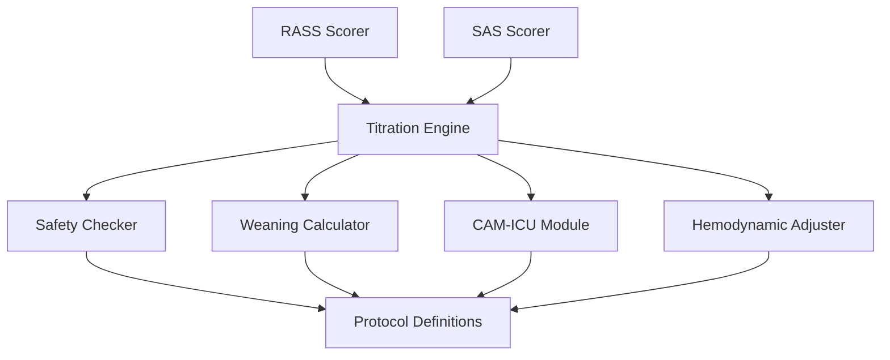

[No sources needed since this diagram shows conceptual workflow, not actual code structure]

## Performance Considerations
- Real-time updates: Ensure UI responsiveness during titration adjustments
- Caching: Cache protocol limits and common calculation results to reduce recomputation
- Validation: Perform lightweight input validation early to avoid heavy computations
- Logging: Record key decisions and outcomes for auditability without impacting performance

[No sources needed since this section provides general guidance]

## Troubleshooting Guide
- Symptom: Unexpected high sedation scores
  - Action: Verify input observations; ensure consistent scoring method (RASS vs SAS)
- Symptom: Titration recommendations exceed safety limits
  - Action: Review maximum dose caps; consider alternative agents or non-pharmacologic measures
- Symptom: Hemodynamic instability after dose change
  - Action: Reduce rate or switch agent; reassess fluid status and cardiac function
- Symptom: Emergence delirium during weaning
  - Action: Optimize analgesia; slow weaning pace; consider low-dose dexmedetomidine bridge

**Section sources**
- [sedation_data_test.dart:1-200](file://test/unit/sedation_data_test.dart#L1-L200)

## Conclusion
The Sedation Protocols Calculator integrates robust scoring systems, titration algorithms, weaning strategies, and safety checks to support safe and effective sedation management. By aligning sedation depth with hemodynamic stability and incorporating delirium assessment, the module helps clinicians tailor care to individual patient needs while enforcing critical safety boundaries.

[No sources needed since this section summarizes without analyzing specific files]

## Appendices
- Example Scenario References:
  - Light sedation for procedures: see titration flows for propofol and dexmedetomidine
  - Moderate sedation for ventilated patients: consult balanced regimen guidance
  - Deep sedation for mechanical ventilation: review safety caps and weaning plans
- Reversal Agent Quick Reference:
  - Naloxone for opioid overdose
  - Flumazenil for benzodiazepine overdose

[No sources needed since this section provides general guidance]