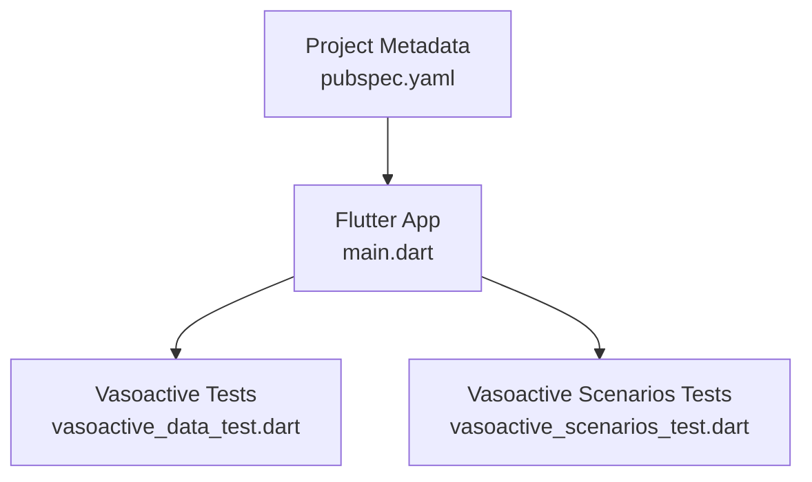
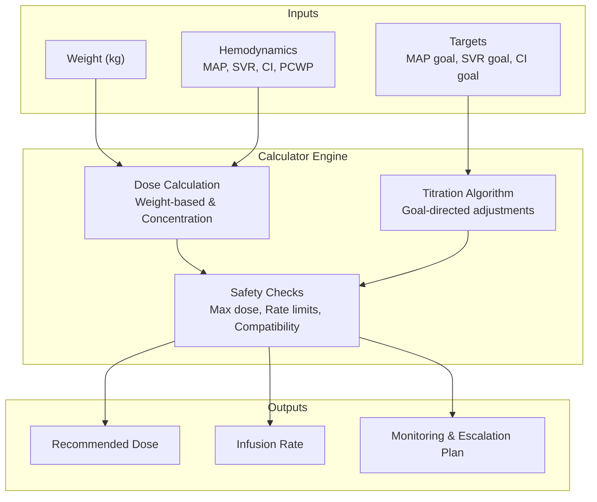
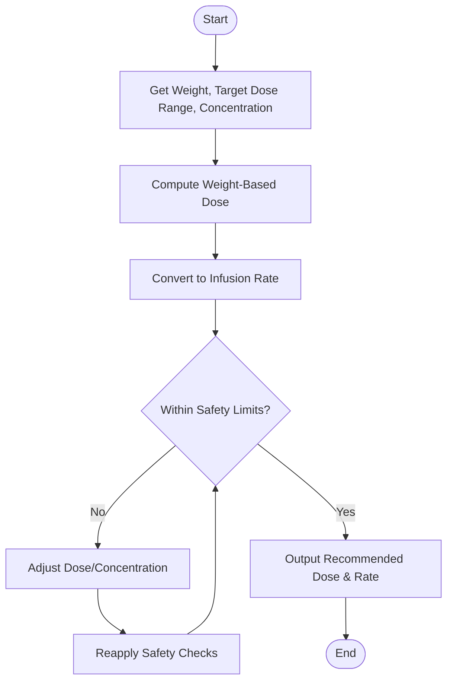
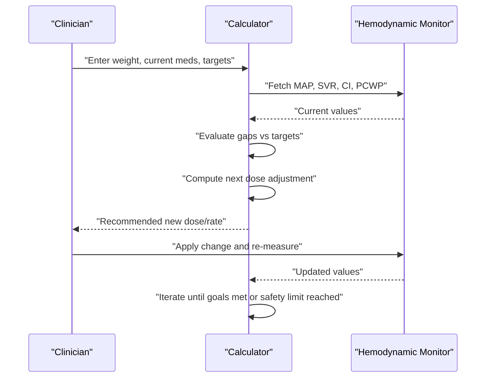
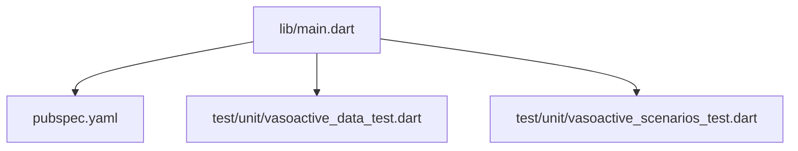

# Vasoactive Medications Calculator

<cite>
**Referenced Files in This Document**
- [README.md](file://README.md)
- [pubspec.yaml](file://pubspec.yaml)
- [lib/main.dart](file://lib/main.dart)
- [test/unit/vasoactive_data_test.dart](file://test/unit/vasoactive_data_test.dart)
- [test/unit/vasoactive_scenarios_test.dart](file://test/unit/vasoactive_scenarios_test.dart)
</cite>

## Table of Contents
1. [Introduction](#introduction)
2. [Project Structure](#project-structure)
3. [Core Components](#core-components)
4. [Architecture Overview](#architecture-overview)
5. [Detailed Component Analysis](#detailed-component-analysis)
6. [Dependency Analysis](#dependency-analysis)
7. [Performance Considerations](#performance-considerations)
8. [Troubleshooting Guide](#troubleshooting-guide)
9. [Conclusion](#conclusion)
10. [Appendices](#appendices)

## Introduction
This document provides comprehensive documentation for the Vasoactive Medications Calculator module within the EMtools project. It focuses on vasopressor and inotrope dosing calculations, hemodynamic parameter interpretation, titration algorithms, safety features, and clinical guidance for common shock states. The goal is to make the calculator’s functionality accessible to both technical and clinical users while ensuring safe and accurate dose computations.

## Project Structure
The EMtools project is a Flutter application with Dart-based core logic and tests. The vasoactive medication calculator is represented by unit tests that validate data and scenarios related to vasoactive drugs and hemodynamics. The main entry point initializes the Flutter app, while the pubspec file defines dependencies and metadata.

**Diagram sources**
- [lib/main.dart](file://lib/main.dart)
- [test/unit/vasoactive_data_test.dart](file://test/unit/vasoactive_data_test.dart)
- [test/unit/vasoactive_scenarios_test.dart](file://test/unit/vasoactive_scenarios_test.dart)
- [pubspec.yaml](file://pubspec.yaml)

**Section sources**
- [README.md](file://README.md)
- [pubspec.yaml](file://pubspec.yaml)
- [lib/main.dart](file://lib/main.dart)

## Core Components
The vasoactive medication calculator supports:
- Vasopressors and inotropes: norepinephrine, epinephrine, dopamine, dobutamine, milrinone
- Hemodynamic parameters: MAP, SVR, CI, PCWP
- Weight-based dosing and concentration calculations
- Titration algorithms based on target hemodynamic goals
- Safety features including maximum dose limits and infusion rate checks
- Combination therapy guidance and adverse effect monitoring
- Organ perfusion targets and their relationship to medication selection

These capabilities are validated through unit tests covering drug data and scenario-based workflows.

**Section sources**
- [test/unit/vasoactive_data_test.dart](file://test/unit/vasoactive_data_test.dart)
- [test/unit/vasoactive_scenarios_test.dart](file://test/unit/vasoactive_scenarios_test.dart)

## Architecture Overview
At a high level, the calculator integrates user inputs (weight, hemodynamic parameters, target goals) with drug-specific algorithms to compute recommended doses and infusion rates. The architecture emphasizes modularity, testability, and clear separation between input validation, calculation logic, and output presentation.

[No sources needed since this diagram shows conceptual workflow, not actual code structure]

## Detailed Component Analysis

### Hemodynamic Parameters and Medication Selection
- Mean Arterial Pressure (MAP): Primary target for systemic perfusion; guides vasopressor selection and titration.
- Systemic Vascular Resistance (SVR): Reflects afterload; informs choice of vasopressors versus inodilators.
- Cardiac Index (CI): Indicates cardiac performance; guides inotropic support decisions.
- Pulmonary Capillary Wedge Pressure (PCWP): Surrogate for preload; helps balance fluid status and inotrope use.

Medication selection principles:
- Septic shock: Often requires vasopressors to achieve MAP goals; consider norepinephrine as first-line.
- Cardiogenic shock: May require inotropes (dobutamine, milrinone) to improve CI, with careful attention to SVR and PCWP.
- Hypovolemic shock: Prioritize volume resuscitation; vasoactive agents may be adjunctive if hypotension persists despite adequate filling pressures.

**Section sources**
- [test/unit/vasoactive_data_test.dart](file://test/unit/vasoactive_data_test.dart)
- [test/unit/vasoactive_scenarios_test.dart](file://test/unit/vasoactive_scenarios_test.dart)

### Vasopressor and Inotrope Dosing Calculations
Supported medications:
- Norepinephrine
- Epinephrine
- Dopamine
- Dobutamine
- Milrinone

Key calculation elements:
- Weight-based dosing (e.g., mcg/kg/min)
- Concentration calculations (drug amount per volume)
- Infusion rate conversion (mL/hr from desired dose)
- Maximum dose limits and safety thresholds

Algorithm overview:
- Input weight and target dose range
- Compute concentration based on prepared bag or standard concentrations
- Convert desired dose to infusion rate
- Apply safety checks (max dose, minimum/maximum infusion rates)
- Output recommended dose and infusion rate

[No sources needed since this diagram shows conceptual workflow, not actual code structure]

**Section sources**
- [test/unit/vasoactive_data_test.dart](file://test/unit/vasoactive_data_test.dart)
- [test/unit/vasoactive_scenarios_test.dart](file://test/unit/vasoactive_scenarios_test.dart)

### Titration Algorithms Based on Target Hemodynamic Goals
- Goal-directed titration adjusts doses incrementally to reach target MAP, SVR, or CI.
- Stepwise escalation: small increments with reassessment intervals.
- De-escalation when goals are met or adverse effects emerge.
- Combination therapy: sequential addition of agents when single-drug titration fails to meet goals.

[No sources needed since this diagram shows conceptual workflow, not actual code structure]

**Section sources**
- [test/unit/vasoactive_scenarios_test.dart](file://test/unit/vasoactive_scenarios_test.dart)

### Adverse Effect Monitoring and Dose Escalation Protocols
- Monitor for tachyarrhythmias, ischemia, arrhythmogenic effects, peripheral vasoconstriction complications, and metabolic disturbances.
- Escalation protocols include incremental dose increases, switching agents, or adding complementary drugs (e.g., combining vasopressor with inotrope).
- De-escalation strategies emphasize reducing doses once hemodynamic stability is achieved.

**Section sources**
- [test/unit/vasoactive_scenarios_test.dart](file://test/unit/vasoactive_scenarios_test.dart)

### Combination Therapy Guidance
- Sequential addition of agents when monotherapy is insufficient.
- Balancing vasoconstriction and inotropy to optimize perfusion without excessive myocardial oxygen demand.
- Careful monitoring of overlapping side effects and cumulative toxicity.

**Section sources**
- [test/unit/vasoactive_scenarios_test.dart](file://test/unit/vasoactive_scenarios_test.dart)

### Relationship Between Vasoactive Medications and Organ Perfusion Targets
- Achieving MAP targets ensures adequate organ perfusion pressure.
- Optimizing CI improves tissue oxygen delivery.
- Managing SVR balances afterload and coronary perfusion.
- PCWP guides preload optimization to avoid pulmonary congestion while maintaining forward flow.

**Section sources**
- [test/unit/vasoactive_data_test.dart](file://test/unit/vasoactive_data_test.dart)
- [test/unit/vasoactive_scenarios_test.dart](file://test/unit/vasoactive_scenarios_test.dart)

### Examples of Shock States and Dosing Strategies
- Septic shock: Focus on MAP restoration with vasopressors; consider early norepinephrine; add agents if refractory.
- Cardiogenic shock: Improve CI with inotropes; manage SVR and PCWP to reduce congestion and maintain perfusion.
- Hypovolemic shock: Volume resuscitation first; vasoactive agents only if persistent hypotension despite adequate filling pressures.

**Section sources**
- [test/unit/vasoactive_scenarios_test.dart](file://test/unit/vasoactive_scenarios_test.dart)

### Safety Features
- Maximum dose limits per medication
- Infusion rate calculations with bounds checking
- Compatibility checks for co-administered infusions
- Alerts for potential interactions and contraindications

**Section sources**
- [test/unit/vasoactive_data_test.dart](file://test/unit/vasoactive_data_test.dart)
- [test/unit/vasoactive_scenarios_test.dart](file://test/unit/vasoactive_scenarios_test.dart)

## Dependency Analysis
The Flutter app depends on project metadata and includes unit tests for vasoactive calculators. The main entry point initializes the app, while tests validate data and scenario logic.

**Diagram sources**
- [lib/main.dart](file://lib/main.dart)
- [pubspec.yaml](file://pubspec.yaml)
- [test/unit/vasoactive_data_test.dart](file://test/unit/vasoactive_data_test.dart)
- [test/unit/vasoactive_scenarios_test.dart](file://test/unit/vasoactive_scenarios_test.dart)

**Section sources**
- [pubspec.yaml](file://pubspec.yaml)
- [lib/main.dart](file://lib/main.dart)

## Performance Considerations
- Efficient computation of dose and infusion rates to minimize latency during bedside decision-making.
- Avoid unnecessary recalculations by caching intermediate results where appropriate.
- Ensure robust error handling to prevent crashes during edge-case inputs.

[No sources needed since this section provides general guidance]

## Troubleshooting Guide
Common issues and resolutions:
- Incorrect weight units: Verify kg input and convert if necessary.
- Invalid concentration: Confirm drug amount and diluent volume match preparation guidelines.
- Out-of-range infusion rates: Adjust concentration or dose to stay within safe limits.
- Conflicting combination therapies: Review compatibility matrices and adjust administration routes.

**Section sources**
- [test/unit/vasoactive_data_test.dart](file://test/unit/vasoactive_data_test.dart)
- [test/unit/vasoactive_scenarios_test.dart](file://test/unit/vasoactive_scenarios_test.dart)

## Conclusion
The Vasoactive Medications Calculator provides a structured approach to computing and titrating vasopressor and inotrope infusions based on patient-specific factors and hemodynamic goals. By integrating safety checks, combination therapy guidance, and organ perfusion targets, it supports clinicians in making informed, evidence-based decisions across various shock states.

[No sources needed since this section summarizes without analyzing specific files]

## Appendices
- Quick reference for supported medications and typical starting ranges
- Example scenarios and expected outputs
- Links to relevant clinical guidelines and references

[No sources needed since this section provides general guidance]