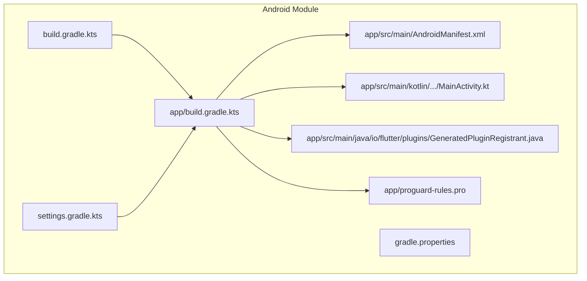
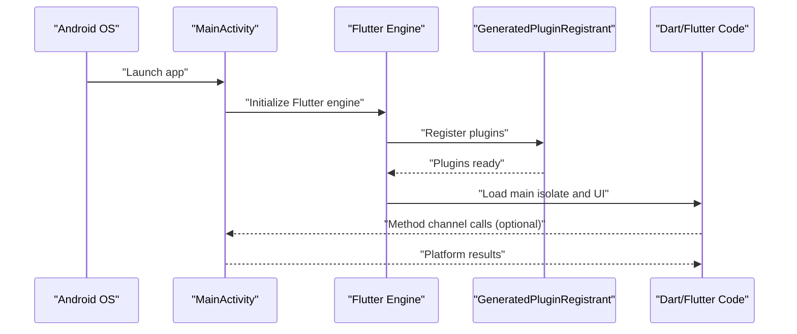
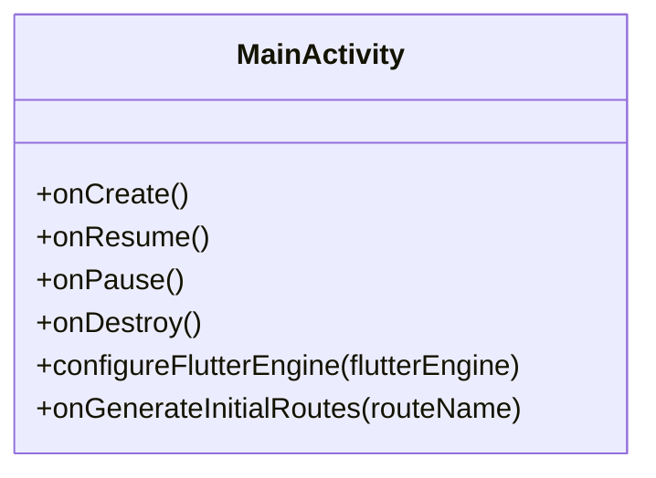
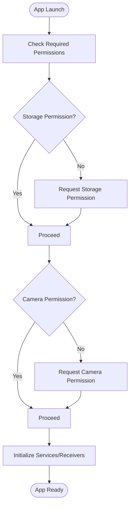
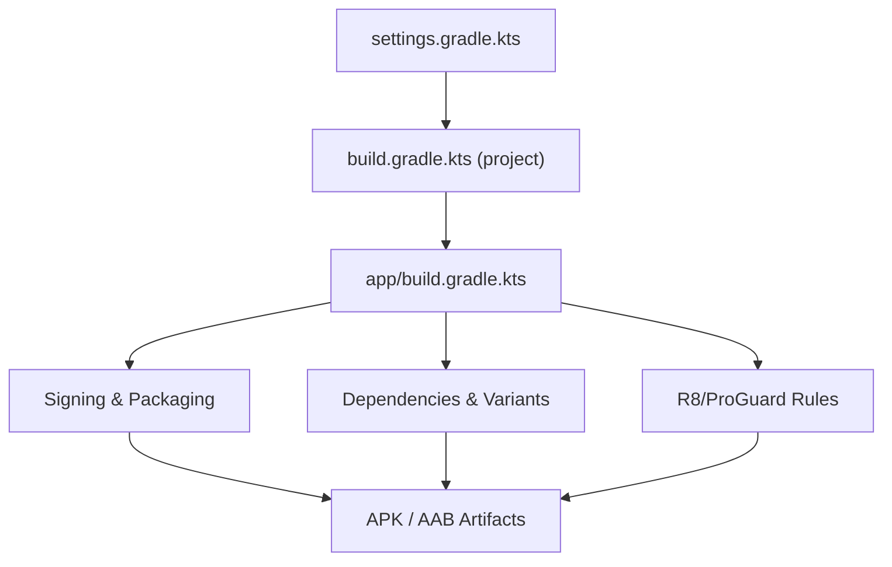
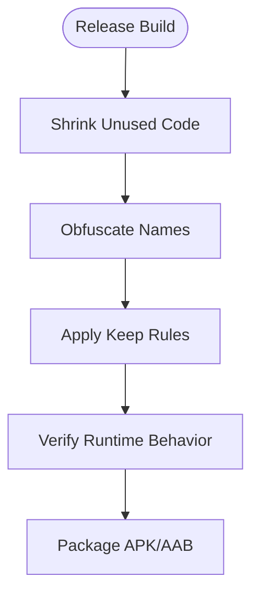
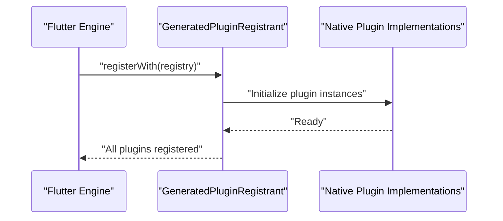
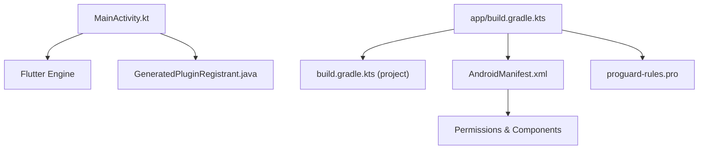

# Android Implementation

<cite>
**Referenced Files in This Document**
- [MainActivity.kt](file://android/app/src/main/kotlin/com/medlabib/emtools/MainActivity.kt)
- [AndroidManifest.xml](file://android/app/src/main/AndroidManifest.xml)
- [build.gradle.kts (app)](file://android/app/build.gradle.kts)
- [build.gradle.kts (project)](file://android/build.gradle.kts)
- [settings.gradle.kts](file://android/settings.gradle.kts)
- [gradle.properties](file://android/gradle.properties)
- [proguard-rules.pro](file://android/app/proguard-rules.pro)
- [GeneratedPluginRegistrant.java](file://android/app/src/main/java/io/flutter/plugins/GeneratedPluginRegistrant.java)
</cite>

## Table of Contents
1. [Introduction](#introduction)
2. [Project Structure](#project-structure)
3. [Core Components](#core-components)
4. [Architecture Overview](#architecture-overview)
5. [Detailed Component Analysis](#detailed-component-analysis)
6. [Dependency Analysis](#dependency-analysis)
7. [Performance Considerations](#performance-considerations)
8. [Troubleshooting Guide](#troubleshooting-guide)
9. [Conclusion](#conclusion)
10. [Appendices](#appendices)

## Introduction
This document provides comprehensive Android platform implementation documentation for EMtools, a Flutter-based application. It focuses on the Android-specific layers: MainActivity Kotlin implementation, Gradle build configuration, Android manifest entries, and integration points with native features such as push notifications, file system access, camera, and device capabilities. It also covers build outputs (APK/AAB), code obfuscation via ProGuard, performance optimizations, Android version compatibility, memory management, battery optimization, and platform-specific testing strategies.

## Project Structure
The Android module follows standard Flutter project conventions under the android directory. Key files include:
- App-level Gradle script for dependencies, signing, and packaging
- Project-level Gradle script for toolchain and repository configuration
- Settings script for plugin resolution
- Manifest for permissions, activities, services, and receivers
- MainActivity entry point extending Flutter’s activity base class
- Generated plugin registrant for Flutter plugins
- ProGuard rules for release builds

**Diagram sources**
- [build.gradle.kts (project):1-200](file://android/build.gradle.kts#L1-L200)
- [build.gradle.kts (app):1-200](file://android/app/build.gradle.kts#L1-L200)
- [settings.gradle.kts:1-200](file://android/settings.gradle.kts#L1-L200)
- [gradle.properties:1-200](file://android/gradle.properties#L1-L200)
- [AndroidManifest.xml:1-200](file://android/app/src/main/AndroidManifest.xml#L1-L200)
- [MainActivity.kt:1-200](file://android/app/src/main/kotlin/com/medlabib/emtools/MainActivity.kt#L1-L200)
- [GeneratedPluginRegistrant.java:1-200](file://android/app/src/main/java/io/flutter/plugins/GeneratedPluginRegistrant.java#L1-L200)
- [proguard-rules.pro:1-200](file://android/app/proguard-rules.pro#L1-L200)

**Section sources**
- [build.gradle.kts (project):1-200](file://android/build.gradle.kts#L1-L200)
- [build.gradle.kts (app):1-200](file://android/app/build.gradle.kts#L1-L200)
- [settings.gradle.kts:1-200](file://android/settings.gradle.kts#L1-L200)
- [gradle.properties:1-200](file://android/gradle.properties#L1-L200)
- [AndroidManifest.xml:1-200](file://android/app/src/main/AndroidManifest.xml#L1-L200)
- [MainActivity.kt:1-200](file://android/app/src/main/kotlin/com/medlabib/emtools/MainActivity.kt#L1-L200)
- [GeneratedPluginRegistrant.java:1-200](file://android/app/src/main/java/io/flutter/plugins/GeneratedPluginRegistrant.java#L1-L200)
- [proguard-rules.pro:1-200](file://android/app/proguard-rules.pro#L1-L200)

## Core Components
- MainActivity: The Android entry point that hosts the Flutter engine and integrates any Android-specific behavior.
- AndroidManifest: Declares app metadata, permissions, components (activities, services, broadcast receivers), and intent filters.
- Gradle scripts: Configure compile options, dependencies, signing, packaging, and build variants.
- ProGuard rules: Define keep/shrink configurations for release builds.
- GeneratedPluginRegistrant: Auto-generated registration of Flutter plugins at runtime.

Key responsibilities:
- Initialize and configure the Flutter engine lifecycle through the host activity.
- Bridge Android features to Dart via method channels or plugins.
- Ensure correct permissions and component declarations for platform integrations.

**Section sources**
- [MainActivity.kt:1-200](file://android/app/src/main/kotlin/com/medlabib/emtools/MainActivity.kt#L1-L200)
- [AndroidManifest.xml:1-200](file://android/app/src/main/AndroidManifest.xml#L1-L200)
- [build.gradle.kts (app):1-200](file://android/app/build.gradle.kts#L1-L200)
- [proguard-rules.pro:1-200](file://android/app/proguard-rules.pro#L1-L200)
- [GeneratedPluginRegistrant.java:1-200](file://android/app/src/main/java/io/flutter/plugins/GeneratedPluginRegistrant.java#L1-L200)

## Architecture Overview
At runtime, the Android app starts MainActivity, which initializes the Flutter engine and loads the Flutter UI. Plugins registered by GeneratedPluginRegistrant provide access to native Android APIs from Dart. Gradle orchestrates compilation, resource processing, and packaging into APK/AAB artifacts.

**Diagram sources**
- [MainActivity.kt:1-200](file://android/app/src/main/kotlin/com/medlabib/emtools/MainActivity.kt#L1-L200)
- [GeneratedPluginRegistrant.java:1-200](file://android/app/src/main/java/io/flutter/plugins/GeneratedPluginRegistrant.java#L1-L200)

## Detailed Component Analysis

### MainActivity (Kotlin)
Responsibilities:
- Hosts the Flutter view and manages lifecycle events.
- Optionally overrides default behaviors (e.g., back handling, theme, orientation).
- Integrates Android-specific features via method channels or direct API calls.
- Ensures proper initialization order for plugins and native services.

Common patterns:
- Extending Flutter’s base activity class.
- Overriding lifecycle methods to coordinate with Flutter engine.
- Using method channels to communicate between Dart and Kotlin.

**Diagram sources**
- [MainActivity.kt:1-200](file://android/app/src/main/kotlin/com/medlabib/emtools/MainActivity.kt#L1-L200)

**Section sources**
- [MainActivity.kt:1-200](file://android/app/src/main/kotlin/com/medlabib/emtools/MainActivity.kt#L1-L200)

### AndroidManifest Configuration
Purpose:
- Declare application metadata (label, icon, theme).
- Register activities, services, broadcast receivers, and content providers.
- Request permissions required for platform features (e.g., storage, camera, notification).
- Define intent filters for deep links and background triggers.

Typical entries:
- Application tag with theme and icon references.
- Activity declaration for the Flutter activity.
- Permissions for storage, camera, network, and notifications.
- Service and receiver declarations for background tasks and push notifications.

**Diagram sources**
- [AndroidManifest.xml:1-200](file://android/app/src/main/AndroidManifest.xml#L1-L200)

**Section sources**
- [AndroidManifest.xml:1-200](file://android/app/src/main/AndroidManifest.xml#L1-L200)

### Gradle Build Configuration
App-level build script (app/build.gradle.kts):
- Defines compileSdk, namespace, minSdk, targetSdk.
- Configures dependencies (Flutter SDK, AndroidX, third-party libraries).
- Sets up signingConfigs and signingConfig for release builds.
- Enables R8/ProGuard shrinking and obfuscation for release.
- Configures packagingOptions and resource exclusions if needed.

Project-level build script (build.gradle.kts):
- Declares repositories (Google, Maven Central).
- Specifies Kotlin and AGP versions.
- Applies necessary plugins (com.android.application, org.jetbrains.kotlin.android).

Settings script (settings.gradle.kts):
- Resolves Flutter plugin path and includes modules.

Gradle properties (gradle.properties):
- JVM arguments, parallel builds, AndroidX flags, and other global settings.

**Diagram sources**
- [settings.gradle.kts:1-200](file://android/settings.gradle.kts#L1-L200)
- [build.gradle.kts (project):1-200](file://android/build.gradle.kts#L1-L200)
- [build.gradle.kts (app):1-200](file://android/app/build.gradle.kts#L1-L200)
- [gradle.properties:1-200](file://android/gradle.properties#L1-L200)

**Section sources**
- [build.gradle.kts (project):1-200](file://android/build.gradle.kts#L1-L200)
- [build.gradle.kts (app):1-200](file://android/app/build.gradle.kts#L1-L200)
- [settings.gradle.kts:1-200](file://android/settings.gradle.kts#L1-L200)
- [gradle.properties:1-200](file://android/gradle.properties#L1-L200)

### ProGuard / R8 Obfuscation
- Enable shrinker and obfuscation in release builds.
- Keep classes/methods required by Flutter and plugins.
- Add custom rules for reflection, serialization, and third-party libraries.
- Validate output size and runtime behavior after obfuscation.

**Diagram sources**
- [proguard-rules.pro:1-200](file://android/app/proguard-rules.pro#L1-L200)
- [build.gradle.kts (app):1-200](file://android/app/build.gradle.kts#L1-L200)

**Section sources**
- [proguard-rules.pro:1-200](file://android/app/proguard-rules.pro#L1-L200)
- [build.gradle.kts (app):1-200](file://android/app/build.gradle.kts#L1-L200)

### Flutter Plugin Registration
- GeneratedPluginRegistrant registers all Flutter plugins used by the app.
- Ensures native side of plugins is initialized before Flutter UI runs.
- Avoid manual registration unless overriding default behavior.

**Diagram sources**
- [GeneratedPluginRegistrant.java:1-200](file://android/app/src/main/java/io/flutter/plugins/GeneratedPluginRegistrant.java#L1-L200)

**Section sources**
- [GeneratedPluginRegistrant.java:1-200](file://android/app/src/main/java/io/flutter/plugins/GeneratedPluginRegistrant.java#L1-L200)

## Dependency Analysis
High-level dependency relationships:
- App build depends on project-level toolchain and repositories.
- MainActivity depends on Flutter engine and plugin registrations.
- Manifest declares components and permissions consumed by plugins and services.
- ProGuard rules affect final artifact composition.

**Diagram sources**
- [MainActivity.kt:1-200](file://android/app/src/main/kotlin/com/medlabib/emtools/MainActivity.kt#L1-L200)
- [GeneratedPluginRegistrant.java:1-200](file://android/app/src/main/java/io/flutter/plugins/GeneratedPluginRegistrant.java#L1-L200)
- [build.gradle.kts (app):1-200](file://android/app/build.gradle.kts#L1-L200)
- [build.gradle.kts (project):1-200](file://android/build.gradle.kts#L1-L200)
- [AndroidManifest.xml:1-200](file://android/app/src/main/AndroidManifest.xml#L1-L200)
- [proguard-rules.pro:1-200](file://android/app/proguard-rules.pro#L1-L200)

**Section sources**
- [MainActivity.kt:1-200](file://android/app/src/main/kotlin/com/medlabib/emtools/MainActivity.kt#L1-L200)
- [GeneratedPluginRegistrant.java:1-200](file://android/app/src/main/java/io/flutter/plugins/GeneratedPluginRegistrant.java#L1-L200)
- [build.gradle.kts (app):1-200](file://android/app/build.gradle.kts#L1-L200)
- [build.gradle.kts (project):1-200](file://android/build.gradle.kts#L1-L200)
- [AndroidManifest.xml:1-200](file://android/app/src/main/AndroidManifest.xml#L1-L200)
- [proguard-rules.pro:1-200](file://android/app/proguard-rules.pro#L1-L200)

## Performance Considerations
- Use R8/ProGuard in release builds to reduce size and improve startup time.
- Minimize heavy work on the main thread; offload to background threads or coroutines.
- Leverage AndroidX libraries and modern APIs for better performance and compatibility.
- Profile memory usage and avoid leaks in Activities and Services.
- Optimize images and assets; use appropriate densities and formats.
- Enable multidex only when necessary; prefer dexing improvements via R8.
- Tune Gradle parallelism and JVM heap via gradle.properties for faster builds.

[No sources needed since this section provides general guidance]

## Troubleshooting Guide
Common issues and resolutions:
- Missing permissions: Ensure AndroidManifest declares required permissions and request them at runtime where applicable.
- Crash on launch: Verify MainActivity correctly initializes Flutter engine and does not block on heavy operations.
- Plugin not working: Confirm GeneratedPluginRegistrant is present and no manual overrides break registration.
- Release build crashes: Review ProGuard rules; add keep statements for reflection-heavy libraries.
- Large APK/AAB: Analyze dependencies, remove unused resources, enable shrinking and obfuscation.

**Section sources**
- [AndroidManifest.xml:1-200](file://android/app/src/main/AndroidManifest.xml#L1-L200)
- [MainActivity.kt:1-200](file://android/app/src/main/kotlin/com/medlabib/emtools/MainActivity.kt#L1-L200)
- [GeneratedPluginRegistrant.java:1-200](file://android/app/src/main/java/io/flutter/plugins/GeneratedPluginRegistrant.java#L1-L200)
- [proguard-rules.pro:1-200](file://android/app/proguard-rules.pro#L1-L200)

## Conclusion
EMtools’ Android layer adheres to Flutter best practices with a clean MainActivity, well-structured Gradle configuration, and explicit manifest declarations. Proper permission handling, plugin registration, and release-time optimizations ensure reliable performance across devices. Following the guidelines here will help maintain stability, security, and efficiency throughout the app’s lifecycle.

[No sources needed since this section summarizes without analyzing specific files]

## Appendices

### Build Process Details
- Debug builds: Generate APK for quick testing.
- Release builds: Produce signed APK or AAB for distribution.
- Variants: Configure debug/profile/release flavors as needed.
- Signing: Use keystore and alias configured in app-level Gradle script.

**Section sources**
- [build.gradle.kts (app):1-200](file://android/app/build.gradle.kts#L1-L200)

### Android Version Compatibility
- Set minSdk/targetSdk appropriately based on feature requirements.
- Use conditional logic for API level differences in native code.
- Test on representative devices spanning supported versions.

**Section sources**
- [build.gradle.kts (app):1-200](file://android/app/build.gradle.kts#L1-L200)

### Memory Management and Battery Optimization
- Avoid long-running tasks on the main thread.
- Use WorkManager for deferrable background jobs.
- Respect Doze and App Standby modes; use foreground services judiciously.
- Monitor memory with Android Profiler and address leaks promptly.

[No sources needed since this section provides general guidance]

### Platform-Specific Testing Strategies
- Unit tests for Kotlin utilities and Gradle tasks.
- Widget and integration tests using Flutter test framework.
- Device farm testing across Android versions and hardware profiles.
- Automated CI checks for build and lint validation.

[No sources needed since this section provides general guidance]