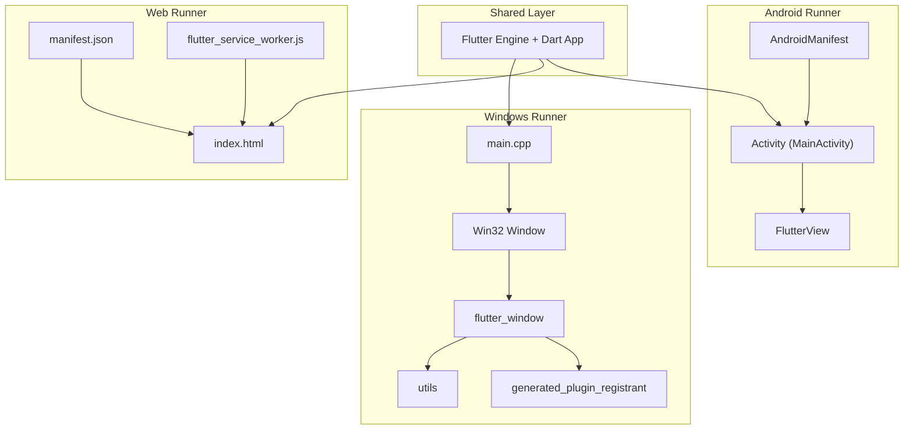
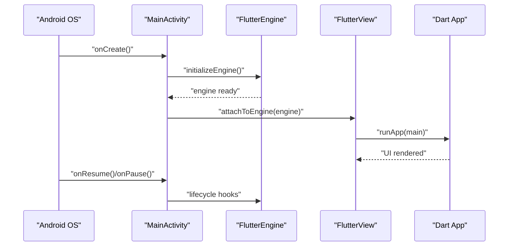
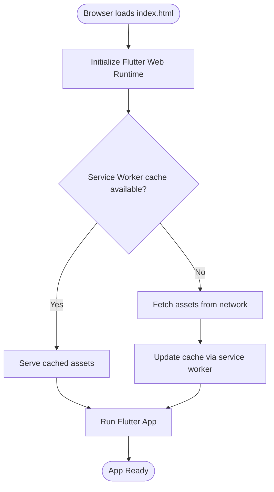
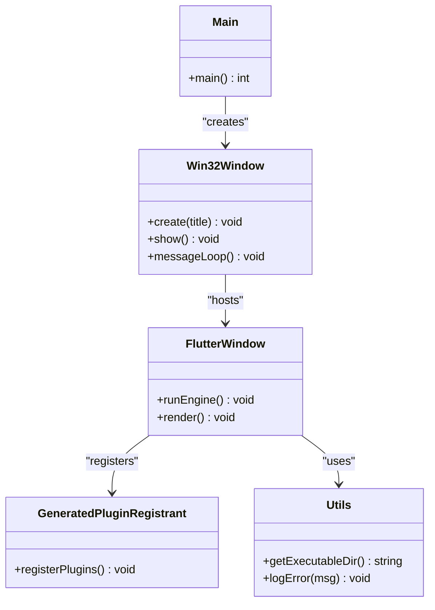
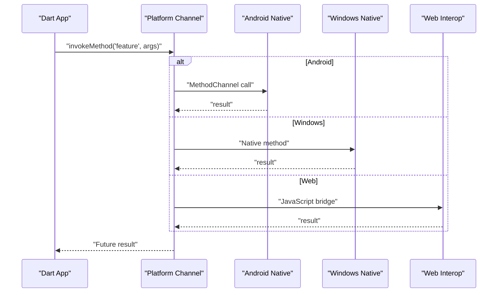
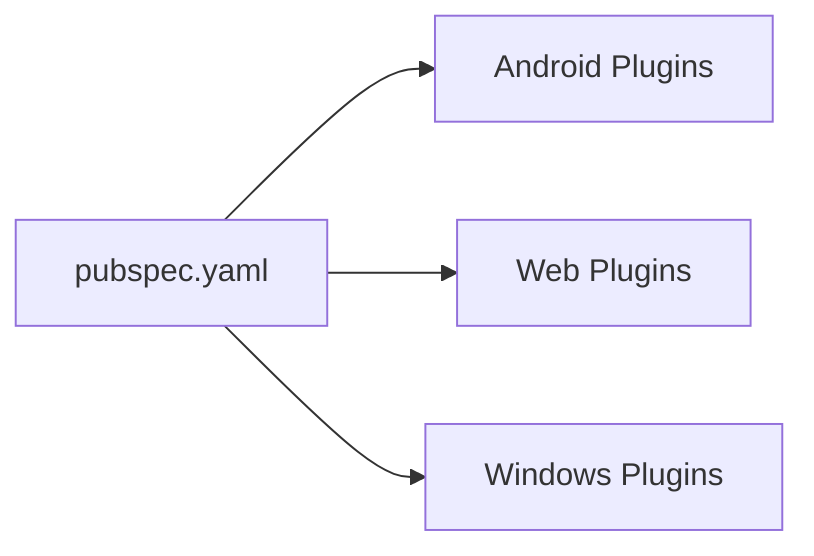

# Platform Implementations

<cite>
**Referenced Files in This Document**
- [MainActivity.kt](file://android/app/src/main/kotlin/com/medlabib/emtools/MainActivity.kt)
- [AndroidManifest.xml](file://android/app/src/main/AndroidManifest.xml)
- [build.gradle.kts](file://android/app/build.gradle.kts)
- [build.gradle.kts](file://android/build.gradle.kts)
- [settings.gradle.kts](file://android/settings.gradle.kts)
- [gradle.properties](file://android/gradle.properties)
- [index.html](file://web/index.html)
- [manifest.json](file://web/manifest.json)
- [flutter_service_worker.js](file://docs/app/flutter_service_worker.js)
- [CMakeLists.txt](file://windows/CMakeLists.txt)
- [main.cpp](file://windows/runner/main.cpp)
- [flutter_window.h](file://windows/runner/flutter_window.h)
- [win32_window.h](file://windows/runner/win32_window.h)
- [utils.h](file://windows/runner/utils.h)
- [generated_plugin_registrant.h](file://windows/flutter/generated_plugin_registrant.h)
- [pubspec.yaml](file://pubspec.yaml)
</cite>

## Table of Contents
1. [Introduction](#introduction)
2. [Project Structure](#project-structure)
3. [Core Components](#core-components)
4. [Architecture Overview](#architecture-overview)
5. [Detailed Component Analysis](#detailed-component-analysis)
6. [Dependency Analysis](#dependency-analysis)
7. [Performance Considerations](#performance-considerations)
8. [Troubleshooting Guide](#troubleshooting-guide)
9. [Conclusion](#conclusion)

## Introduction
This document describes the platform-specific implementations for EMtools across Android, Web, and Windows desktop. It covers native integrations, build configurations, deployment processes, cross-platform communication patterns, and performance strategies tailored to each target. The goal is to provide a clear reference for developers integrating or extending platform features while maintaining a consistent Flutter-based application core.

## Project Structure
EMtools follows a standard Flutter multi-platform layout:
- Android module under android/ with Kotlin MainActivity, Gradle configuration, and Android manifest.
- Web module under web/ with HTML entrypoint and PWA manifest; service worker present in docs/app/.
- Windows desktop module under windows/ with C++ runner, window management, and CMake build files.
- Shared Dart logic under lib/, with tests under test/.

```mermaid
graph TB
subgraph "Flutter Core"
D["lib/main.dart"]
P["pubspec.yaml"]
end
subgraph "Android"
AMain["android/app/src/main/kotlin/.../MainActivity.kt"]
AMF["android/app/src/main/AndroidManifest.xml"]
ABG["android/app/build.gradle.kts"]
TGB["android/build.gradle.kts"]
SGR["android/settings.gradle.kts"]
GP["android/gradle.properties"]
end
subgraph "Web"
WHTML["web/index.html"]
WMN["web/manifest.json"]
SW["docs/app/flutter_service_worker.js"]
end
subgraph "Windows Desktop"
WCML["windows/CMakeLists.txt"]
WMain["windows/runner/main.cpp"]
WFW["windows/runner/flutter_window.h"]
WW32["windows/runner/win32_window.h"]
WUTL["windows/runner/utils.h"]
WGPR["windows/flutter/generated_plugin_registrant.h"]
end
D --> AMain
D --> WHTML
D --> WMain
P --> ABG
P --> WCML
P --> WMN
```

**Diagram sources**
- [MainActivity.kt](file://android/app/src/main/kotlin/com/medlabib/emtools/MainActivity.kt)
- [AndroidManifest.xml](file://android/app/src/main/AndroidManifest.xml)
- [build.gradle.kts](file://android/app/build.gradle.kts)
- [build.gradle.kts](file://android/build.gradle.kts)
- [settings.gradle.kts](file://android/settings.gradle.kts)
- [gradle.properties](file://android/gradle.properties)
- [index.html](file://web/index.html)
- [manifest.json](file://web/manifest.json)
- [flutter_service_worker.js](file://docs/app/flutter_service_worker.js)
- [CMakeLists.txt](file://windows/CMakeLists.txt)
- [main.cpp](file://windows/runner/main.cpp)
- [flutter_window.h](file://windows/runner/flutter_window.h)
- [win32_window.h](file://windows/runner/win32_window.h)
- [utils.h](file://windows/runner/utils.h)
- [generated_plugin_registrant.h](file://windows/flutter/generated_plugin_registrant.h)
- [pubspec.yaml](file://pubspec.yaml)

**Section sources**
- [MainActivity.kt](file://android/app/src/main/kotlin/com/medlabib/emtools/MainActivity.kt)
- [AndroidManifest.xml](file://android/app/src/main/AndroidManifest.xml)
- [build.gradle.kts](file://android/app/build.gradle.kts)
- [build.gradle.kts](file://android/build.gradle.kts)
- [settings.gradle.kts](file://android/settings.gradle.kts)
- [gradle.properties](file://android/gradle.properties)
- [index.html](file://web/index.html)
- [manifest.json](file://web/manifest.json)
- [flutter_service_worker.js](file://docs/app/flutter_service_worker.js)
- [CMakeLists.txt](file://windows/CMakeLists.txt)
- [main.cpp](file://windows/runner/main.cpp)
- [flutter_window.h](file://windows/runner/flutter_window.h)
- [win32_window.h](file://windows/runner/win32_window.h)
- [utils.h](file://windows/runner/utils.h)
- [generated_plugin_registrant.h](file://windows/flutter/generated_plugin_registrant.h)
- [pubspec.yaml](file://pubspec.yaml)

## Core Components
- Android: Kotlin MainActivity integrates Flutter engine lifecycle with Android Activity. Gradle scripts configure compileSdk, minSdk, dependencies, and packaging options. AndroidManifest declares app metadata and permissions.
- Web: index.html bootstraps the Flutter web runtime; manifest.json defines PWA metadata; flutter_service_worker.js provides caching and offline behavior.
- Windows: C++ runner initializes Flutter Engine, creates Win32 window, and manages message loop. CMake orchestrates builds and links plugins via generated plugin registrant.

Key responsibilities:
- Native integration points (platform channels, OS APIs).
- Build and packaging per platform.
- Platform-specific optimizations and resource handling.

**Section sources**
- [MainActivity.kt](file://android/app/src/main/kotlin/com/medlabib/emtools/MainActivity.kt)
- [AndroidManifest.xml](file://android/app/src/main/AndroidManifest.xml)
- [build.gradle.kts](file://android/app/build.gradle.kts)
- [build.gradle.kts](file://android/build.gradle.kts)
- [settings.gradle.kts](file://android/settings.gradle.kts)
- [gradle.properties](file://android/gradle.properties)
- [index.html](file://web/index.html)
- [manifest.json](file://web/manifest.json)
- [flutter_service_worker.js](file://docs/app/flutter_service_worker.js)
- [CMakeLists.txt](file://windows/CMakeLists.txt)
- [main.cpp](file://windows/runner/main.cpp)
- [flutter_window.h](file://windows/runner/flutter_window.h)
- [win32_window.h](file://windows/runner/win32_window.h)
- [utils.h](file://windows/runner/utils.h)
- [generated_plugin_registrant.h](file://windows/flutter/generated_plugin_registrant.h)
- [pubspec.yaml](file://pubspec.yaml)

## Architecture Overview
The application uses Flutter as the shared UI layer with platform-specific runners:
- Android: Activity hosts FlutterView and delegates lifecycle to FlutterEngine.
- Web: Browser loads index.html and runs Flutter web renderer.
- Windows: C++ main creates a Win32 window and embeds Flutter rendering.

**Diagram sources**
- [MainActivity.kt](file://android/app/src/main/kotlin/com/medlabib/emtools/MainActivity.kt)
- [AndroidManifest.xml](file://android/app/src/main/AndroidManifest.xml)
- [index.html](file://web/index.html)
- [manifest.json](file://web/manifest.json)
- [flutter_service_worker.js](file://docs/app/flutter_service_worker.js)
- [main.cpp](file://windows/runner/main.cpp)
- [flutter_window.h](file://windows/runner/flutter_window.h)
- [win32_window.h](file://windows/runner/win32_window.h)
- [utils.h](file://windows/runner/utils.h)
- [generated_plugin_registrant.h](file://windows/flutter/generated_plugin_registrant.h)

## Detailed Component Analysis

### Android Implementation
- MainActivity: Extends Flutter’s activity base class and configures initial route and platform channel setup if needed. Integrates lifecycle callbacks to ensure proper engine state transitions.
- Gradle Configuration:
  - app-level build.gradle.kts sets compileSdk, minSdk, targetSdk, versioning, signing configs, and packaging rules.
  - project-level build.gradle.kts defines repositories, dependency versions, and tasks.
  - settings.gradle.kts includes Flutter modules and local properties.
  - gradle.properties configures JVM args and Gradle daemon settings.
- AndroidManifest: Declares application metadata, permissions, intent filters, and theme.

**Diagram sources**
- [MainActivity.kt](file://android/app/src/main/kotlin/com/medlabib/emtools/MainActivity.kt)
- [AndroidManifest.xml](file://android/app/src/main/AndroidManifest.xml)
- [build.gradle.kts](file://android/app/build.gradle.kts)
- [build.gradle.kts](file://android/build.gradle.kts)
- [settings.gradle.kts](file://android/settings.gradle.kts)
- [gradle.properties](file://android/gradle.properties)

Build and packaging highlights:
- Configure compileSdk/minSdk/targetSdk aligned with Flutter requirements.
- Enable R8/ProGuard rules for release builds using proguard-rules.pro.
- Use flavor dimensions if multiple variants are required.

Deployment:
- Debug: flutter build apk --debug or flutter run on device.
- Release: flutter build apk --release and sign with keystore configured in Gradle.

**Section sources**
- [MainActivity.kt](file://android/app/src/main/kotlin/com/medlabib/emtools/MainActivity.kt)
- [AndroidManifest.xml](file://android/app/src/main/AndroidManifest.xml)
- [build.gradle.kts](file://android/app/build.gradle.kts)
- [build.gradle.kts](file://android/build.gradle.kts)
- [settings.gradle.kts](file://android/settings.gradle.kts)
- [gradle.properties](file://android/gradle.properties)

### Web Implementation (PWA)
- Entrypoint: index.html loads Flutter web assets and initializes the engine.
- PWA Manifest: manifest.json defines app name, icons, display mode, and theme colors.
- Service Worker: flutter_service_worker.js caches assets and supports offline access.

**Diagram sources**
- [index.html](file://web/index.html)
- [manifest.json](file://web/manifest.json)
- [flutter_service_worker.js](file://docs/app/flutter_service_worker.js)

Browser compatibility:
- Ensure modern browsers supporting ES6+, Service Workers, and fetch API.
- Provide fallbacks for older browsers if necessary.

Offline capabilities:
- Register service worker to precache critical assets.
- Handle network failures gracefully and show cached content.

**Section sources**
- [index.html](file://web/index.html)
- [manifest.json](file://web/manifest.json)
- [flutter_service_worker.js](file://docs/app/flutter_service_worker.js)

### Windows Desktop Implementation
- Runner Entry: main.cpp initializes Win32 environment and starts Flutter window.
- Window Management: win32_window.h encapsulates Win32 window creation and message loop.
- Flutter Integration: flutter_window.h manages FlutterWindow instance and lifecycle.
- Utilities: utils.h provides helper functions for paths and error handling.
- Plugin Registration: generated_plugin_registrant.h wires native plugins into the Flutter Engine.
- Build System: CMakeLists.txt configures targets, sources, and linking.

**Diagram sources**
- [main.cpp](file://windows/runner/main.cpp)
- [win32_window.h](file://windows/runner/win32_window.h)
- [flutter_window.h](file://windows/runner/flutter_window.h)
- [utils.h](file://windows/runner/utils.h)
- [generated_plugin_registrant.h](file://windows/flutter/generated_plugin_registrant.h)

File system access and desktop optimizations:
- Use absolute paths resolved via utilities for persistent storage.
- Prefer asynchronous I/O where possible to keep UI responsive.
- Optimize startup by minimizing heavy initialization in main.

Build and packaging:
- Configure CMakeLists.txt to include all runner sources and link Flutter libraries.
- Generate installer using provided script or tools.

**Section sources**
- [main.cpp](file://windows/runner/main.cpp)
- [win32_window.h](file://windows/runner/win32_window.h)
- [flutter_window.h](file://windows/runner/flutter_window.h)
- [utils.h](file://windows/runner/utils.h)
- [generated_plugin_registrant.h](file://windows/flutter/generated_plugin_registrant.h)
- [CMakeLists.txt](file://windows/CMakeLists.txt)

### Cross-Platform Abstraction and Communication
- Platform Channels: Dart code communicates with native platforms via MethodChannel (Android/Windows) or JavaScript interop (Web).
- Feature Flags: Abstract platform-specific behaviors behind interfaces in Dart, delegating to platform implementations.
- Dependency Injection: Centralize platform services to simplify testing and switching implementations.

[No diagram sources since this is a conceptual flow]

**Section sources**
- [pubspec.yaml](file://pubspec.yaml)

## Dependency Analysis
Flutter packages declared in pubspec.yaml drive platform-specific dependencies. For example, platform integrations like file system, notifications, or hardware features are added as packages that implement platform channels.

**Diagram sources**
- [pubspec.yaml](file://pubspec.yaml)

**Section sources**
- [pubspec.yaml](file://pubspec.yaml)

## Performance Considerations
- Android:
  - Enable R8/ProGuard for release builds to reduce APK size and improve startup.
  - Tune minSdk and targetSdk to balance compatibility and performance.
  - Avoid heavy work on the main thread; use background isolates for CPU-bound tasks.
- Web:
  - Leverage service worker caching to minimize network latency.
  - Minimize asset sizes and enable compression.
  - Monitor memory usage in browser dev tools; avoid large object retention.
- Windows:
  - Keep window creation lightweight; defer expensive initialization until needed.
  - Use efficient data structures and avoid excessive allocations in hot paths.
  - Profile with Visual Studio diagnostics to identify bottlenecks.

[No sources needed since this section provides general guidance]

## Troubleshooting Guide
- Android:
  - Verify AndroidManifest permissions and intent filters.
  - Check Gradle sync errors and SDK versions.
  - Review ProGuard rules if release builds crash due to reflection.
- Web:
  - Confirm service worker registration and cache updates.
  - Validate manifest.json fields for PWA installability.
  - Inspect console for CORS or asset loading issues.
- Windows:
  - Ensure CMake configuration matches Flutter toolchain.
  - Validate plugin registration order and missing DLLs.
  - Use logging utilities to trace initialization failures.

**Section sources**
- [AndroidManifest.xml](file://android/app/src/main/AndroidManifest.xml)
- [build.gradle.kts](file://android/app/build.gradle.kts)
- [flutter_service_worker.js](file://docs/app/flutter_service_worker.js)
- [CMakeLists.txt](file://windows/CMakeLists.txt)
- [generated_plugin_registrant.h](file://windows/flutter/generated_plugin_registrant.h)

## Conclusion
EMtools leverages Flutter’s cross-platform capabilities with focused native integrations for Android, Web, and Windows. By adhering to the platform-specific configurations and optimization strategies outlined here, teams can maintain high performance, reliable offline behavior, and smooth user experiences across devices. Consistent abstraction layers and clear communication patterns ensure maintainability and extensibility as new features and platforms are added.