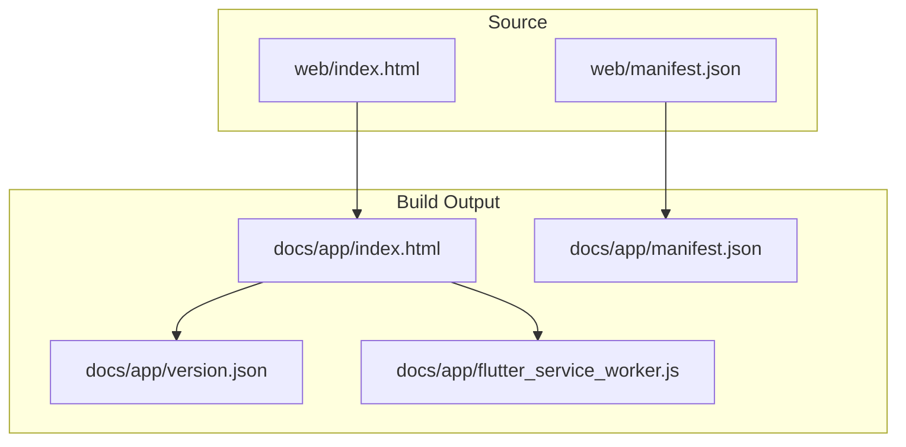
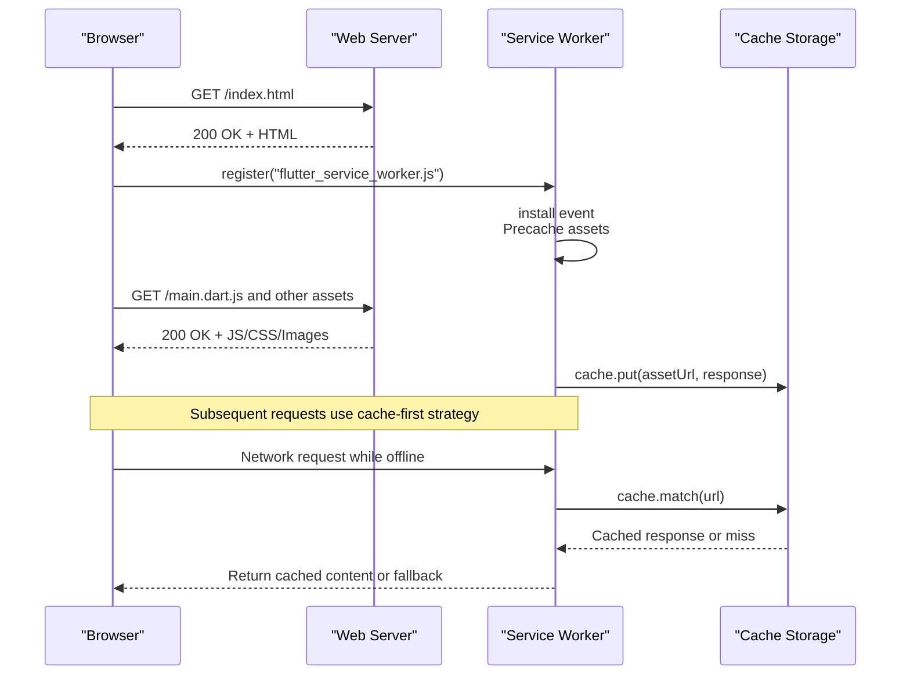
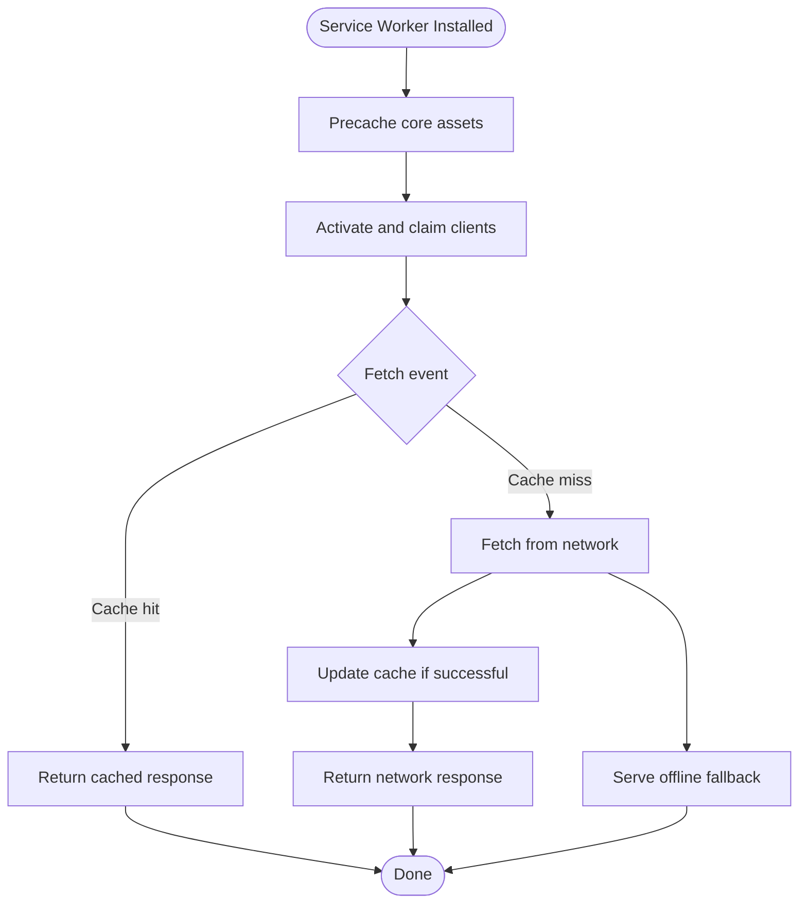
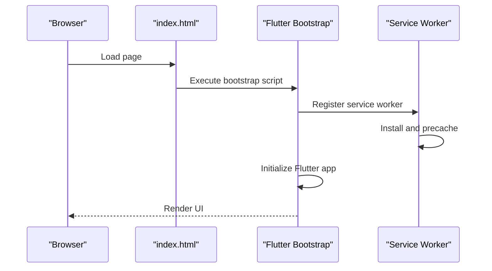
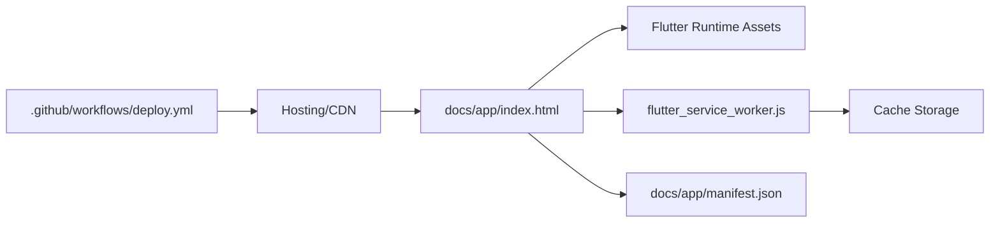

# Web Platform Implementation

<cite>
**Referenced Files in This Document**
- [index.html](file://web/index.html)
- [manifest.json](file://web/manifest.json)
- [flutter_service_worker.js](file://docs/app/flutter_service_worker.js)
- [index.html](file://docs/app/index.html)
- [manifest.json](file://docs/app/manifest.json)
- [version.json](file://docs/app/version.json)
- [deploy.yml](file://.github/workflows/deploy.yml)
</cite>

## Table of Contents
1. [Introduction](#introduction)
2. [Project Structure](#project-structure)
3. [Core Components](#core-components)
4. [Architecture Overview](#architecture-overview)
5. [Detailed Component Analysis](#detailed-component-analysis)
6. [Dependency Analysis](#dependency-analysis)
7. [Performance Considerations](#performance-considerations)
8. [Troubleshooting Guide](#troubleshooting-guide)
9. [Conclusion](#conclusion)
10. [Appendices](#appendices)

## Introduction
This document describes the web platform implementation for EMtools as a Progressive Web App (PWA). It covers the HTML entry point, JavaScript initialization, PWA manifest configuration, service worker behavior, browser compatibility, responsive design patterns, performance optimizations, security considerations, and deployment processes. The goal is to provide both high-level guidance and code-level references so that developers can understand, maintain, and extend the web experience reliably across devices and browsers.

## Project Structure
The project follows a Flutter-based structure with two primary web outputs:
- Source web assets under web/: the build-time entrypoint and PWA manifest used by the Flutter web build pipeline.
- Built artifacts under docs/app/: the generated Flutter web app including index.html, manifest.json, version.json, and the generated flutter_service_worker.js.

**Diagram sources**
- [index.html](file://web/index.html)
- [manifest.json](file://web/manifest.json)
- [index.html](file://docs/app/index.html)
- [manifest.json](file://docs/app/manifest.json)
- [version.json](file://docs/app/version.json)
- [flutter_service_worker.js](file://docs/app/flutter_service_worker.js)

**Section sources**
- [index.html](file://web/index.html)
- [manifest.json](file://web/manifest.json)
- [index.html](file://docs/app/index.html)
- [manifest.json](file://docs/app/manifest.json)
- [version.json](file://docs/app/version.json)
- [flutter_service_worker.js](file://docs/app/flutter_service_worker.js)

## Core Components
- HTML entrypoint and bootstrapping: The source index.html defines the base page structure and links to the Flutter bootstrap script. The built index.html includes the Flutter runtime and registers the service worker.
- PWA manifest: The source manifest.json provides metadata such as name, short_name, description, icons, theme_color, background_color, display, and start_url. The build output copies or generates a corresponding manifest for the deployed app.
- Service worker: The generated flutter_service_worker.js handles caching strategies, precaching, runtime caching, and offline fallbacks for Flutter web assets.
- Versioning: version.json contains build metadata used by the service worker to bust caches and manage updates.

Key responsibilities:
- Provide a minimal, accessible HTML shell.
- Declare PWA capabilities via manifest.
- Register and control the service worker for caching and offline support.
- Ensure reliable updates using versioned assets.

**Section sources**
- [index.html](file://web/index.html)
- [manifest.json](file://web/manifest.json)
- [index.html](file://docs/app/index.html)
- [manifest.json](file://docs/app/manifest.json)
- [flutter_service_worker.js](file://docs/app/flutter_service_worker.js)
- [version.json](file://docs/app/version.json)

## Architecture Overview
The web architecture centers on a static site produced by Flutter’s web build. The browser loads index.html, which initializes the Flutter engine and registers the service worker. The service worker manages asset caching and offline availability.

**Diagram sources**
- [index.html](file://docs/app/index.html)
- [flutter_service_worker.js](file://docs/app/flutter_service_worker.js)

## Detailed Component Analysis

### HTML Entrypoint and Bootstrap
Responsibilities:
- Define document structure, meta tags, viewport settings, and theme color.
- Load the Flutter bootstrap script and initialize the Flutter web application.
- Reference the PWA manifest and any required polyfills or scripts.

Implementation notes:
- The source index.html is the template used during build; the generated index.html in docs/app reflects final paths and asset hashes.
- The bootstrap script configures the Flutter engine and starts the app.

Best practices:
- Keep the HTML minimal and declarative.
- Avoid heavy inline logic; rely on the Flutter bootstrap.
- Ensure correct base href and resource paths for CDN hosting.

**Section sources**
- [index.html](file://web/index.html)
- [index.html](file://docs/app/index.html)

### PWA Manifest Configuration
Responsibilities:
- Describe app identity (name, short_name, description).
- Provide icons for various densities and splash screens.
- Configure theme_color, background_color, display mode, and start_url.
- Enable installation prompts and PWA behaviors.

Configuration highlights:
- Icons should include multiple sizes and formats for optimal rendering across platforms.
- Display mode typically set to standalone or fullscreen for app-like experiences.
- Start_url should point to the root or an initial route.

Operational flow:
- The browser reads manifest.json from the app root to enable add-to-home-screen and PWA features.
- The build process may copy or generate a manifest in docs/app for deployment.

**Section sources**
- [manifest.json](file://web/manifest.json)
- [manifest.json](file://docs/app/manifest.json)

### Service Worker Implementation
Responsibilities:
- Precache core Flutter assets during install.
- Implement cache-first strategies for static assets.
- Handle network failures gracefully with offline fallbacks.
- Manage updates using version information.

Lifecycle events:
- Install: Precache critical resources.
- Activate: Clean up old caches and claim clients.
- Fetch: Serve from cache when available; otherwise fetch from network.

Versioning and updates:
- Use version.json to invalidate stale caches and ensure users receive updated assets.
- Trigger update checks after activation.

**Diagram sources**
- [flutter_service_worker.js](file://docs/app/flutter_service_worker.js)
- [version.json](file://docs/app/version.json)

**Section sources**
- [flutter_service_worker.js](file://docs/app/flutter_service_worker.js)
- [version.json](file://docs/app/version.json)

### Initialization Flow
Responsibilities:
- Bootstrap the Flutter engine.
- Register the service worker.
- Initialize app state and routes.

Sequence:
- Browser loads index.html.
- Bootstrap script initializes Flutter.
- Service worker registration occurs early to enable caching.

**Diagram sources**
- [index.html](file://docs/app/index.html)
- [flutter_service_worker.js](file://docs/app/flutter_service_worker.js)

**Section sources**
- [index.html](file://docs/app/index.html)
- [flutter_service_worker.js](file://docs/app/flutter_service_worker.js)

## Dependency Analysis
The web layer depends on:
- Flutter web runtime and generated assets referenced by index.html.
- Service worker for caching and offline behavior.
- Manifest for PWA metadata.
- CI/CD workflow for automated deployment.

**Diagram sources**
- [index.html](file://docs/app/index.html)
- [flutter_service_worker.js](file://docs/app/flutter_service_worker.js)
- [manifest.json](file://docs/app/manifest.json)
- [deploy.yml](file://.github/workflows/deploy.yml)

**Section sources**
- [index.html](file://docs/app/index.html)
- [flutter_service_worker.js](file://docs/app/flutter_service_worker.js)
- [manifest.json](file://docs/app/manifest.json)
- [deploy.yml](file://.github/workflows/deploy.yml)

## Performance Considerations
- Asset optimization:
  - Prefer compressed images and vector formats where appropriate.
  - Leverage HTTP caching headers and CDN edge caching.
- Lazy loading:
  - Defer non-critical assets and modules to improve initial load time.
- Code splitting:
  - Utilize Flutter web build options to split large libraries into separate chunks.
- Caching strategies:
  - Cache-first for immutable assets; network-first for dynamic data.
- Monitoring:
  - Integrate lightweight analytics or RUM to track performance metrics.
- Responsive design:
  - Use fluid layouts, media queries, and scalable typography for cross-device consistency.

[No sources needed since this section provides general guidance]

## Troubleshooting Guide
Common issues and resolutions:
- Service worker not registering:
  - Verify HTTPS and correct path to flutter_service_worker.js.
  - Check console for registration errors and ensure no conflicting workers.
- Stale assets after deployment:
  - Confirm version.json changes and service worker activation logic.
  - Clear cache storage manually if necessary.
- Offline fallback not working:
  - Validate precache list and ensure fallback responses are served.
- Manifest not recognized:
  - Ensure manifest.json is served at the expected URL with correct MIME type.
- Installation prompt not appearing:
  - Confirm manifest fields and icon requirements are met.

**Section sources**
- [flutter_service_worker.js](file://docs/app/flutter_service_worker.js)
- [manifest.json](file://docs/app/manifest.json)
- [version.json](file://docs/app/version.json)

## Conclusion
EMtools’ web implementation leverages Flutter’s web build to deliver a fast, installable PWA. The HTML entrypoint initializes the Flutter runtime, the manifest declares PWA capabilities, and the generated service worker ensures efficient caching and offline functionality. By following the recommended performance, security, and deployment practices outlined here, teams can maintain a robust and user-friendly web experience across modern browsers and devices.

[No sources needed since this section summarizes without analyzing specific files]

## Appendices

### Deployment Process
- CI/CD pipeline:
  - The GitHub Actions workflow builds and deploys the Flutter web app.
  - Artifacts include index.html, manifest.json, service worker, and versioned assets.
- Hosting and CDN:
  - Serve assets with proper caching headers.
  - Enable HTTPS and HSTS for security.
- Continuous delivery:
  - Automate tests and linting before deployment.
  - Roll back quickly by pointing to previous versions.

**Section sources**
- [deploy.yml](file://.github/workflows/deploy.yml)

### Security Considerations
- HTTPS requirement:
  - Service workers require secure contexts; enforce HTTPS in production.
- Content Security Policy:
  - Restrict script sources and disallow inline scripts unless necessary.
- Data protection:
  - Avoid storing sensitive data in cache storage.
  - Use secure cookies and token management for authenticated flows.

[No sources needed since this section provides general guidance]

### Browser Compatibility and Testing
- Compatibility:
  - Target modern browsers supporting ES6+, Service Workers, and Cache API.
- Responsive testing:
  - Test on mobile, tablet, and desktop viewports.
- Cross-browser validation:
  - Use automated tools to verify PWA compliance and performance budgets.

[No sources needed since this section provides general guidance]