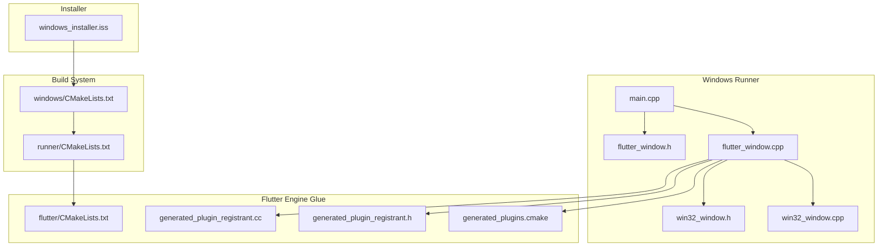
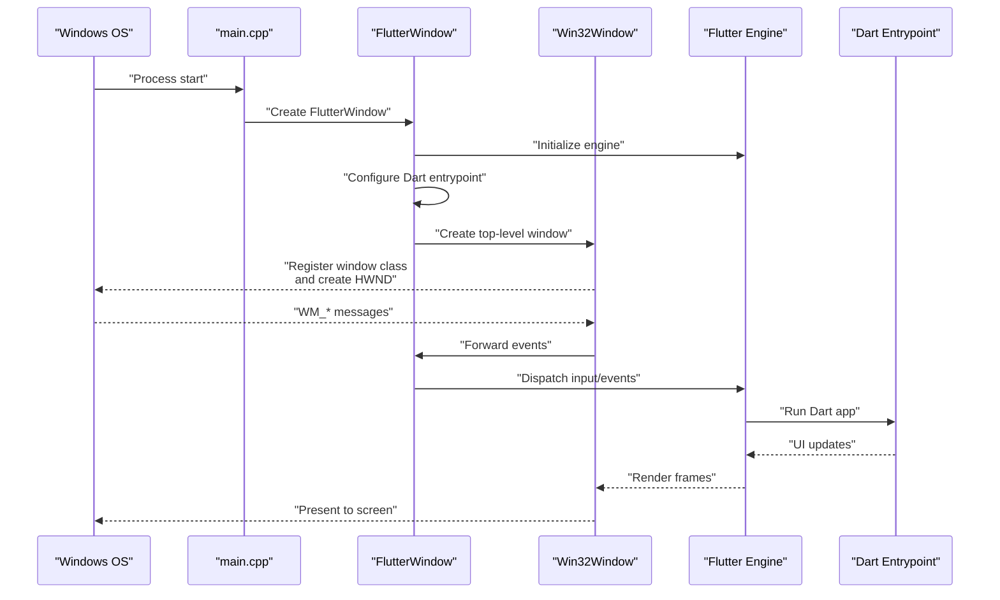
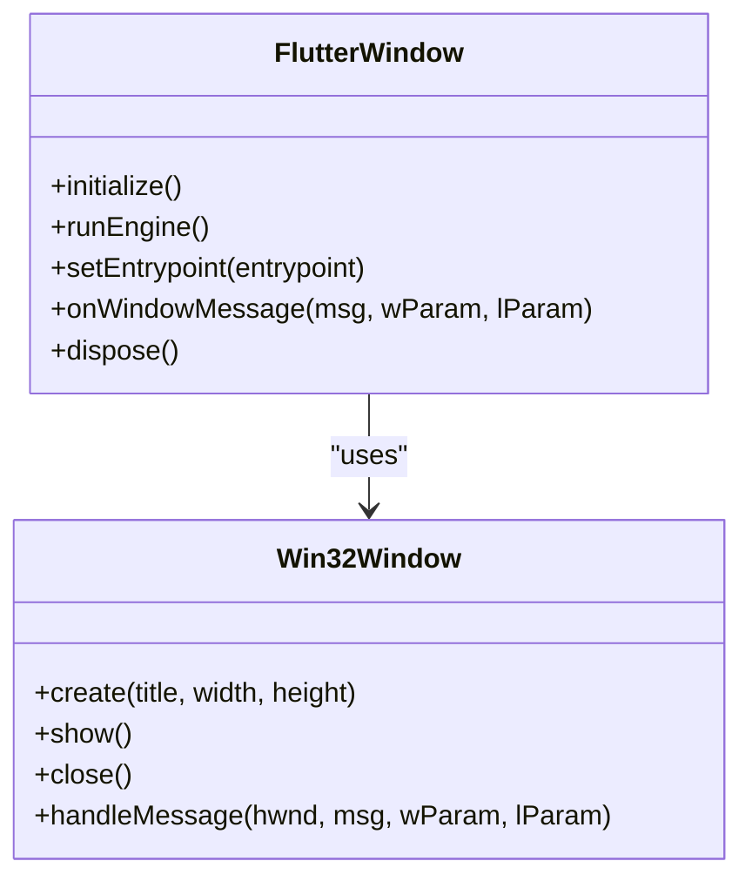
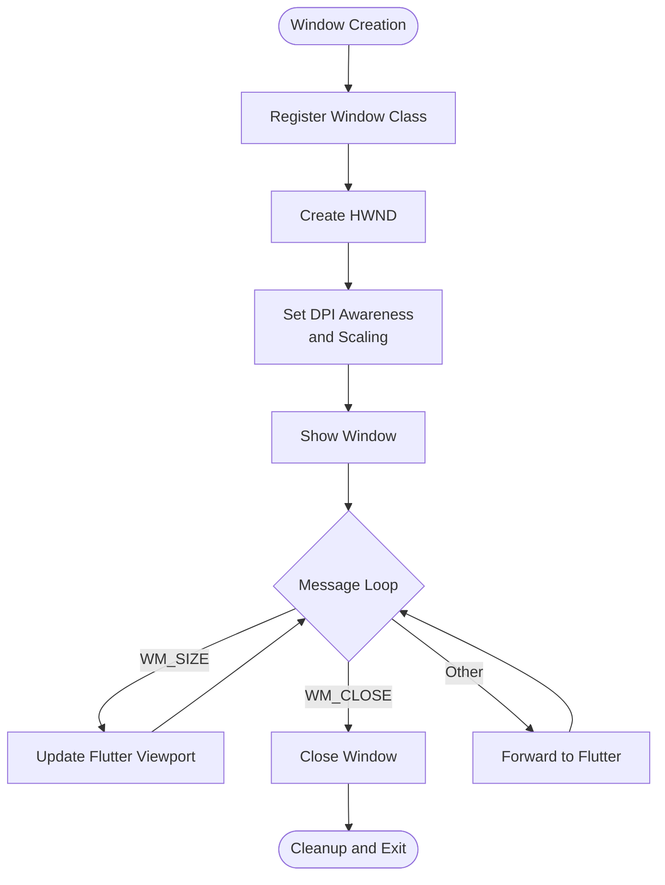
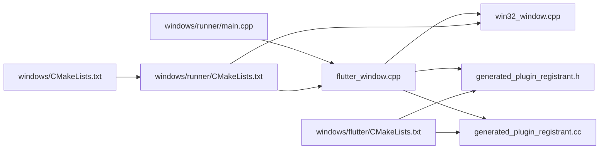

# Windows Desktop Implementation

<cite>
**Referenced Files in This Document**
- [main.cpp](file://windows/runner/main.cpp)
- [flutter_window.h](file://windows/runner/flutter_window.h)
- [flutter_window.cpp](file://windows/runner/flutter_window.cpp)
- [win32_window.h](file://windows/runner/win32_window.h)
- [win32_window.cpp](file://windows/runner/win32_window.cpp)
- [CMakeLists.txt](file://windows/CMakeLists.txt)
- [CMakeLists.txt](file://windows/runner/CMakeLists.txt)
- [CMakeLists.txt](file://windows/flutter/CMakeLists.txt)
- [windows_installer.iss](file://windows_installer.iss)
</cite>

## Table of Contents
1. [Introduction](#introduction)
2. [Project Structure](#project-structure)
3. [Core Components](#core-components)
4. [Architecture Overview](#architecture-overview)
5. [Detailed Component Analysis](#detailed-component-analysis)
6. [Dependency Analysis](#dependency-analysis)
7. [Performance Considerations](#performance-considerations)
8. [Troubleshooting Guide](#troubleshooting-guide)
9. [Conclusion](#conclusion)
10. [Appendices](#appendices)

## Introduction
This document describes the Windows desktop implementation for EMtools, focusing on the C++ entry point, Flutter engine initialization, Windows-specific startup procedures, build configuration with CMake, window management and event handling via native APIs, and installer creation using Inno Setup. It also covers platform-specific features such as file system access, clipboard operations, system tray integration, high-DPI support, deployment strategies, code signing, update mechanisms, and performance optimizations.

## Project Structure
The Windows desktop portion is organized under the windows directory with a standard Flutter Windows runner layout:
- windows/runner: Native C++ entry point, window classes, and helper utilities
- windows/flutter: Generated plugin registration and Flutter engine glue
- windows: Top-level CMake configuration that ties everything together
- windows_installer.iss: Inno Setup script for packaging and installation

**Diagram sources**
- [main.cpp](file://windows/runner/main.cpp)
- [flutter_window.h](file://windows/runner/flutter_window.h)
- [flutter_window.cpp](file://windows/runner/flutter_window.cpp)
- [win32_window.h](file://windows/runner/win32_window.h)
- [win32_window.cpp](file://windows/runner/win32_window.cpp)
- [CMakeLists.txt](file://windows/flutter/CMakeLists.txt)
- [CMakeLists.txt](file://windows/runner/CMakeLists.txt)
- [CMakeLists.txt](file://windows/CMakeLists.txt)
- [windows_installer.iss](file://windows_installer.iss)

**Section sources**
- [main.cpp](file://windows/runner/main.cpp)
- [flutter_window.h](file://windows/runner/flutter_window.h)
- [flutter_window.cpp](file://windows/runner/flutter_window.cpp)
- [win32_window.h](file://windows/runner/win32_window.h)
- [win32_window.cpp](file://windows/runner/win32_window.cpp)
- [CMakeLists.txt](file://windows/CMakeLists.txt)
- [CMakeLists.txt](file://windows/runner/CMakeLists.txt)
- [CMakeLists.txt](file://windows/flutter/CMakeLists.txt)
- [windows_installer.iss](file://windows_installer.iss)

## Core Components
- Entry point (main.cpp): Initializes the Windows application, creates the Flutter window, and runs the message loop.
- FlutterWindow (flutter_window.h/cpp): Manages the Flutter engine lifecycle, Dart entrypoint selection, and bridges between Flutter and native code.
- Win32Window (win32_window.h/cpp): Encapsulates Win32 window creation, sizing, DPI awareness, and event dispatching to Flutter.
- Build configuration (CMakeLists.txt files): Defines targets, links dependencies, sets compilation flags, and includes generated plugin files.
- Installer (windows_installer.iss): Packages binaries, assets, and optional registry entries; defines installation steps and uninstall behavior.

**Section sources**
- [main.cpp](file://windows/runner/main.cpp)
- [flutter_window.h](file://windows/runner/flutter_window.h)
- [flutter_window.cpp](file://windows/runner/flutter_window.cpp)
- [win32_window.h](file://windows/runner/win32_window.h)
- [win32_window.cpp](file://windows/runner/win32_window.cpp)
- [CMakeLists.txt](file://windows/CMakeLists.txt)
- [CMakeLists.txt](file://windows/runner/CMakeLists.txt)
- [CMakeLists.txt](file://windows/flutter/CMakeLists.txt)
- [windows_installer.iss](file://windows_installer.iss)

## Architecture Overview
At runtime, the Windows process starts at main.cpp, which constructs a FlutterWindow instance. FlutterWindow initializes the Flutter engine, configures the Dart entrypoint, and delegates window creation and event handling to Win32Window. The Flutter engine renders the UI and communicates back to native code through method channels. The build system compiles these components into a single executable and bundles required Flutter artifacts.

**Diagram sources**
- [main.cpp](file://windows/runner/main.cpp)
- [flutter_window.cpp](file://windows/runner/flutter_window.cpp)
- [win32_window.cpp](file://windows/runner/win32_window.cpp)

## Detailed Component Analysis

### Entry Point and Startup (main.cpp)
Responsibilities:
- Initialize Windows subsystem and set up application context
- Create the FlutterWindow instance
- Run the Windows message loop until exit

Key behaviors:
- Sets up any Windows-specific environment before creating the Flutter window
- Ensures proper cleanup when the window closes

**Section sources**
- [main.cpp](file://windows/runner/main.cpp)

### Flutter Window Management (flutter_window.h/cpp)
Responsibilities:
- Manage Flutter engine lifecycle (create, configure, run, dispose)
- Select and pass the Dart entrypoint to the engine
- Bridge between Flutter and native code via method channels
- Handle window lifecycle callbacks from Win32Window

Implementation highlights:
- Engine initialization and configuration
- Entrypoint setup for the Flutter UI
- Event forwarding to Flutter
- Resource cleanup on shutdown

**Diagram sources**
- [flutter_window.h](file://windows/runner/flutter_window.h)
- [flutter_window.cpp](file://windows/runner/flutter_window.cpp)
- [win32_window.h](file://windows/runner/win32_window.h)
- [win32_window.cpp](file://windows/runner/win32_window.cpp)

**Section sources**
- [flutter_window.h](file://windows/runner/flutter_window.h)
- [flutter_window.cpp](file://windows/runner/flutter_window.cpp)

### Win32 Window and Event Handling (win32_window.h/cpp)
Responsibilities:
- Register a window class and create an HWND
- Configure DPI awareness and scaling
- Process Windows messages and forward relevant ones to Flutter
- Manage resizing, minimization, maximization, and closing

Implementation highlights:
- DPI-aware window creation and scaling adjustments
- Message loop integration and filtering
- Safe destruction and resource release

**Diagram sources**
- [win32_window.cpp](file://windows/runner/win32_window.cpp)

**Section sources**
- [win32_window.h](file://windows/runner/win32_window.h)
- [win32_window.cpp](file://windows/runner/win32_window.cpp)

### Build Configuration (CMakeLists.txt)
Top-level windows/CMakeLists.txt:
- Defines the main executable target
- Includes the runner subdirectory
- Configures output directories and install rules

windows/runner/CMakeLists.txt:
- Builds the native runner source files
- Links against Flutter Windows libraries and Windows SDK components
- Adds include paths and compile definitions
- Integrates generated plugin registration files

windows/flutter/CMakeLists.txt:
- Provides Flutter engine targets and resources
- Supplies generated plugin registration headers and sources

Key considerations:
- Ensure correct architecture (x64) and toolchain settings
- Include generated files from Flutter’s plugin system
- Set appropriate optimization flags for release builds

**Section sources**
- [CMakeLists.txt](file://windows/CMakeLists.txt)
- [CMakeLists.txt](file://windows/runner/CMakeLists.txt)
- [CMakeLists.txt](file://windows/flutter/CMakeLists.txt)

### Installer Creation (windows_installer.iss)
Inno Setup script responsibilities:
- Package the compiled executable and Flutter assets
- Define installation directory structure
- Optionally write registry entries for shell integration or file associations
- Provide uninstaller and upgrade behavior
- Configure shortcuts and application metadata

Typical sections:
- [Setup]: App name, version, publisher, default directory
- [Files]: Source files and destination folders
- [Icons]: Desktop/start menu shortcuts
- [Registry]: Keys/values for integration
- [Tasks]: Optional features during install
- [Code]: Custom scripting if needed

**Section sources**
- [windows_installer.iss](file://windows_installer.iss)

## Dependency Analysis
The Windows runner depends on:
- Flutter Windows engine and framework libraries
- Windows SDK components for windowing and messaging
- Generated plugin registration files for third-party plugins

**Diagram sources**
- [main.cpp](file://windows/runner/main.cpp)
- [flutter_window.cpp](file://windows/runner/flutter_window.cpp)
- [win32_window.cpp](file://windows/runner/win32_window.cpp)
- [CMakeLists.txt](file://windows/flutter/CMakeLists.txt)
- [CMakeLists.txt](file://windows/runner/CMakeLists.txt)
- [CMakeLists.txt](file://windows/CMakeLists.txt)

**Section sources**
- [main.cpp](file://windows/runner/main.cpp)
- [flutter_window.cpp](file://windows/runner/flutter_window.cpp)
- [win32_window.cpp](file://windows/runner/win32_window.cpp)
- [CMakeLists.txt](file://windows/flutter/CMakeLists.txt)
- [CMakeLists.txt](file://windows/runner/CMakeLists.txt)
- [CMakeLists.txt](file://windows/CMakeLists.txt)

## Performance Considerations
- Enable link-time optimization and release flags in CMake for faster execution
- Minimize heavy work on the UI thread; offload I/O and computations to background tasks
- Use efficient image formats and asset compression for faster startup
- Avoid excessive window redraws by batching updates and respecting WM_PAINT semantics
- Profile memory usage and handle large datasets carefully to prevent GC pressure in Dart

[No sources needed since this section provides general guidance]

## Troubleshooting Guide
Common issues and resolutions:
- Build failures due to missing Windows SDK or incorrect architecture: verify toolchain and target platform in CMake
- Missing Flutter artifacts or generated files: ensure Flutter Windows setup is complete and generated files are present
- Runtime crashes on window close: confirm proper cleanup in Win32Window and FlutterWindow disposal
- High-DPI rendering problems: validate DPI awareness settings and scaling logic in Win32Window
- Installer errors: check file paths, permissions, and registry keys defined in the Inno Setup script

**Section sources**
- [win32_window.cpp](file://windows/runner/win32_window.cpp)
- [flutter_window.cpp](file://windows/runner/flutter_window.cpp)
- [windows_installer.iss](file://windows_installer.iss)

## Conclusion
EMtools’ Windows desktop implementation follows Flutter’s standard Windows runner pattern, with clear separation between engine initialization, window management, and event handling. The CMake configuration integrates generated plugin files and links necessary dependencies, while the Inno Setup script packages the application for distribution. By adhering to best practices for DPI handling, performance tuning, and secure deployment, the application delivers a robust Windows experience.

[No sources needed since this section summarizes without analyzing specific files]

## Appendices

### Windows-Specific Features
- File system access: Use Dart’s io package or platform channels to call native APIs when needed
- Clipboard operations: Access via platform channels or existing plugins; ensure thread safety
- System tray integration: Implement via Win32 API calls exposed through method channels
- High-DPI support: Ensure DPI awareness is enabled and scaling is handled consistently

[No sources needed since this section provides general guidance]

### Deployment Strategies
- Code signing: Sign the executable and installer to improve trust and reduce UAC prompts
- Update mechanisms: Implement a self-updater or use external tools to download and replace binaries safely
- Silent installs: Configure Inno Setup parameters for unattended installations in enterprise environments

[No sources needed since this section provides general guidance]