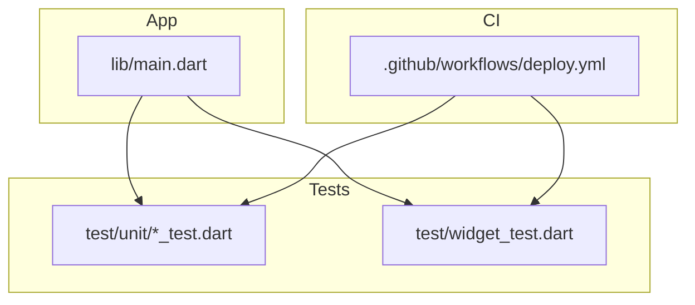
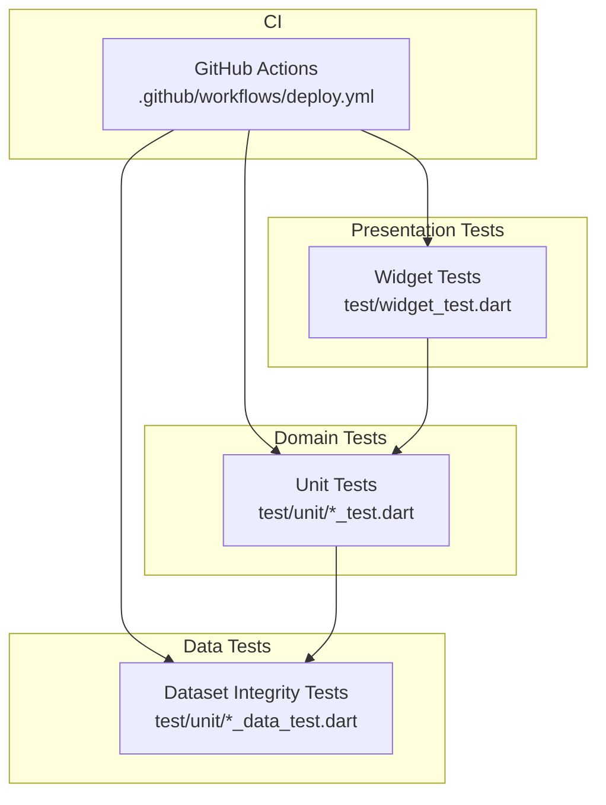
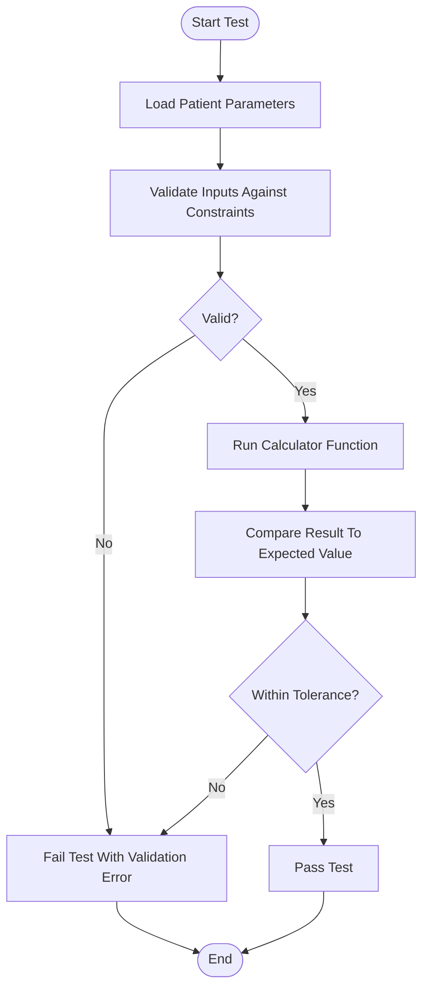
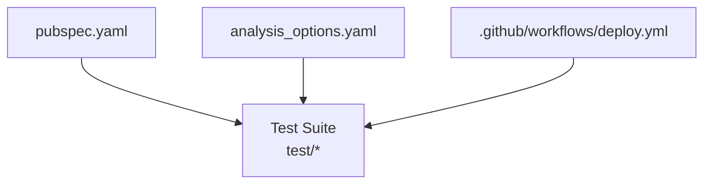

# Testing Strategy

<cite>
**Referenced Files in This Document**
- [pubspec.yaml](file://pubspec.yaml)
- [analysis_options.yaml](file://analysis_options.yaml)
- [main.dart](file://lib/main.dart)
- [widget_test.dart](file://test/widget_test.dart)
- [antibiotics_data_test.dart](file://test/unit/antibiotics_data_test.dart)
- [blood_gas_calculator_test.dart](file://test/unit/blood_gas_calculator_test.dart)
- [blood_gas_scenarios_test.dart](file://test/unit/blood_gas_scenarios_test.dart)
- [calculators_data_test.dart](file://test/unit/calculators_data_test.dart)
- [metabolic_calculator_test.dart](file://test/unit/metabolic_calculator_test.dart)
- [metabolic_scenarios_test.dart](file://test/unit/metabolic_scenarios_test.dart)
- [sedation_data_test.dart](file://test/unit/sedation_data_test.dart)
- [vasoactive_data_test.dart](file://test/unit/vasoactive_data_test.dart)
- [vasoactive_scenarios_test.dart](file://test/unit/vasoactive_scenarios_test.dart)
- [deploy.yml](file://.github/workflows/deploy.yml)
</cite>

## Table of Contents
1. [Introduction](#introduction)
2. [Project Structure](#project-structure)
3. [Core Components](#core-components)
4. [Architecture Overview](#architecture-overview)
5. [Detailed Component Analysis](#detailed-component-analysis)
6. [Dependency Analysis](#dependency-analysis)
7. [Performance Considerations](#performance-considerations)
8. [Troubleshooting Guide](#troubleshooting-guide)
9. [Conclusion](#conclusion)
10. [Appendices](#appendices)

## Introduction
This document defines the testing strategy for EMtools, a Flutter-based medical calculator application. It covers unit tests for clinical calculation algorithms, widget tests for UI components, and integration tests for end-to-end workflows. The strategy emphasizes medical accuracy validation against established guidelines, robust test data management, mocking of external dependencies, and automated pipelines for continuous integration. It also provides guidance on writing medical scenario tests, validating edge cases, maintaining coverage for critical functions, and performing performance and load testing for the calculation engines.

## Project Structure
EMtools follows a layered architecture with presentation, domain, and core layers under lib, and tests organized by type under test. The key testing-related structure includes:
- Unit tests under test/unit for calculators, datasets, and scenario validations
- Widget tests under test for UI component verification
- CI configuration under .github/workflows for automated runs

**Diagram sources**
- [main.dart](file://lib/main.dart)
- [widget_test.dart](file://test/widget_test.dart)
- [deploy.yml](file://.github/workflows/deploy.yml)

**Section sources**
- [pubspec.yaml](file://pubspec.yaml)
- [analysis_options.yaml](file://analysis_options.yaml)
- [main.dart](file://lib/main.dart)
- [widget_test.dart](file://test/widget_test.dart)
- [deploy.yml](file://.github/workflows/deploy.yml)

## Core Components
The testing suite is organized into three primary layers:
- Unit tests for medical calculation algorithms and dataset integrity
- Widget tests for UI components and user interactions
- Integration tests for end-to-end workflows (to be added as needed)

Unit tests cover:
- Antibiotics data consistency
- Blood gas calculator logic and scenarios
- Metabolic calculator logic and scenarios
- Vasoactive drug data and scenarios
- General calculators data integrity

Widget tests validate UI rendering and basic interactions.

Integration tests should verify complete user journeys such as selecting a calculator, entering patient parameters, and verifying displayed results align with expected values.

**Section sources**
- [antibiotics_data_test.dart](file://test/unit/antibiotics_data_test.dart)
- [blood_gas_calculator_test.dart](file://test/unit/blood_gas_calculator_test.dart)
- [blood_gas_scenarios_test.dart](file://test/unit/blood_gas_scenarios_test.dart)
- [metabolic_calculator_test.dart](file://test/unit/metabolic_calculator_test.dart)
- [metabolic_scenarios_test.dart](file://test/unit/metabolic_scenarios_test.dart)
- [vasoactive_data_test.dart](file://test/unit/vasoactive_data_test.dart)
- [vasoactive_scenarios_test.dart](file://test/unit/vasoactive_scenarios_test.dart)
- [sedation_data_test.dart](file://test/unit/sedation_data_test.dart)
- [calculators_data_test.dart](file://test/unit/calculators_data_test.dart)
- [widget_test.dart](file://test/widget_test.dart)

## Architecture Overview
The testing architecture mirrors the application’s layered design:
- Presentation layer tests focus on widgets and navigation flows
- Domain layer tests validate pure calculation functions and business rules
- Data layer tests ensure dataset correctness and schema stability
- CI orchestrates test execution across platforms

**Diagram sources**
- [widget_test.dart](file://test/widget_test.dart)
- [deploy.yml](file://.github/workflows/deploy.yml)

## Detailed Component Analysis

### Medical Calculation Unit Tests
Focus areas:
- Input validation and boundary conditions (e.g., zero, negative, extreme values)
- Numerical precision and rounding behavior
- Consistency with clinical guidelines and reference tables
- Deterministic outputs for identical inputs

Recommended patterns:
- Parameterized tests for multiple clinical scenarios
- Golden comparisons for numeric outputs within tolerance thresholds
- Scenario-driven tests that mirror real-world patient profiles

Example categories:
- Blood gas calculations and derived indices
- Metabolic rate estimations and adjustments
- Vasoactive dosing regimens and titration steps
- Antibiotic dosing based on weight and renal function
- Sedation scoring and dosing ranges

**Section sources**
- [blood_gas_calculator_test.dart](file://test/unit/blood_gas_calculator_test.dart)
- [blood_gas_scenarios_test.dart](file://test/unit/blood_gas_scenarios_test.dart)
- [metabolic_calculator_test.dart](file://test/unit/metabolic_calculator_test.dart)
- [metabolic_scenarios_test.dart](file://test/unit/metabolic_scenarios_test.dart)
- [vasoactive_data_test.dart](file://test/unit/vasoactive_data_test.dart)
- [vasoactive_scenarios_test.dart](file://test/unit/vasoactive_scenarios_test.dart)
- [antibiotics_data_test.dart](file://test/unit/antibiotics_data_test.dart)
- [sedation_data_test.dart](file://test/unit/sedation_data_test.dart)

#### Flowchart: Validating a Clinical Calculation Test

[No sources needed since this diagram shows conceptual workflow, not actual code structure]

### Dataset Integrity Tests
Purpose:
- Ensure static datasets (e.g., antibiotic profiles, vasoactive drug tables) are well-formed
- Verify required fields exist and constraints hold (ranges, units)
- Guard against accidental data corruption or schema drift

Patterns:
- Schema validation checks
- Range assertions for physiological limits
- Cross-reference checks between related datasets

**Section sources**
- [antibiotics_data_test.dart](file://test/unit/antibiotics_data_test.dart)
- [sedation_data_test.dart](file://test/unit/sedation_data_test.dart)
- [vasoactive_data_test.dart](file://test/unit/vasoactive_data_test.dart)
- [calculators_data_test.dart](file://test/unit/calculators_data_test.dart)

### Widget Tests
Scope:
- Render correctness of calculator screens
- User input handling and immediate feedback
- Navigation to result views and back

Patterns:
- Pump and bind cycles for asynchronous updates
- Mocking services if present
- Verifying text and numeric displays match expected formats

**Section sources**
- [widget_test.dart](file://test/widget_test.dart)

### Integration Tests (Guidance)
While not yet present in the repository, integration tests should:
- Launch the app and simulate realistic user flows
- Validate end-to-end outcomes (inputs to final results)
- Use golden images for UI snapshots where appropriate
- Exercise platform channels and external dependencies via mocks

[No sources needed since this section provides general guidance]

## Dependency Analysis
Testing dependencies and tooling are declared in the project manifest and analysis options. The CI pipeline triggers tests during deployment.

**Diagram sources**
- [pubspec.yaml](file://pubspec.yaml)
- [analysis_options.yaml](file://analysis_options.yaml)
- [deploy.yml](file://.github/workflows/deploy.yml)

**Section sources**
- [pubspec.yaml](file://pubspec.yaml)
- [analysis_options.yaml](file://analysis_options.yaml)
- [deploy.yml](file://.github/workflows/deploy.yml)

## Performance Considerations
- Prefer deterministic, fast-running unit tests; avoid heavy I/O
- For calculation-heavy modules, consider benchmarking suites to track regression
- Use parameterized tests to cover large input spaces without bloating runtime
- Cache expensive setup in setUpAll when safe and necessary
- Isolate long-running operations behind interfaces to allow mocking in tests

[No sources needed since this section provides general guidance]

## Troubleshooting Guide
Common issues and resolutions:
- Flaky tests due to randomness or time:
  - Replace random seeds with fixed values
  - Use controlled clocks or timers
- Precision mismatches:
  - Assert within acceptable tolerances rather than exact equality
- Missing dependencies in tests:
  - Ensure all required packages are declared in the project manifest
- CI failures:
  - Check environment setup and Flutter/Dart versions in the CI configuration

**Section sources**
- [deploy.yml](file://.github/workflows/deploy.yml)
- [pubspec.yaml](file://pubspec.yaml)

## Conclusion
EMtools employs a multi-layered testing approach focused on medical accuracy, robustness, and reliability. Unit tests validate core algorithms and datasets, while widget tests ensure UI correctness. A CI pipeline automates execution to maintain quality over time. Extending the suite with integration tests and performance benchmarks will further strengthen confidence in clinical safety and system responsiveness.

[No sources needed since this section summarizes without analyzing specific files]

## Appendices

### Writing Medical Scenario Tests
- Model realistic patient profiles covering common and rare presentations
- Include edge cases: extreme weights, ages, organ dysfunction, pregnancy
- Validate outputs against authoritative references and include citations in comments
- Use descriptive test names reflecting clinical context

### Test Data Management
- Centralize reference datasets and constants
- Version control clinical references and annotate sources
- Provide fixtures for complex inputs and expected outputs

### Mock Implementations for External Dependencies
- Abstract platform channels and network calls behind interfaces
- Provide test doubles that return deterministic responses
- Validate error paths and retries

### Automated Testing Pipelines
- Configure CI to run unit and widget tests on multiple platforms
- Publish test reports and artifacts
- Gate merges on passing tests and coverage thresholds

### Tools and Frameworks
- Dart and Flutter testing frameworks
- Assertion libraries for precise comparisons
- Optional golden testing for UI snapshots
- Coverage tools to monitor critical path coverage

[No sources needed since this section provides general guidance]