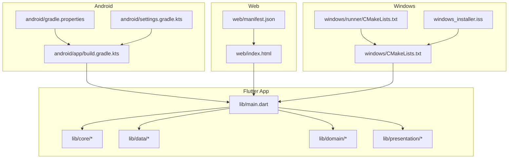
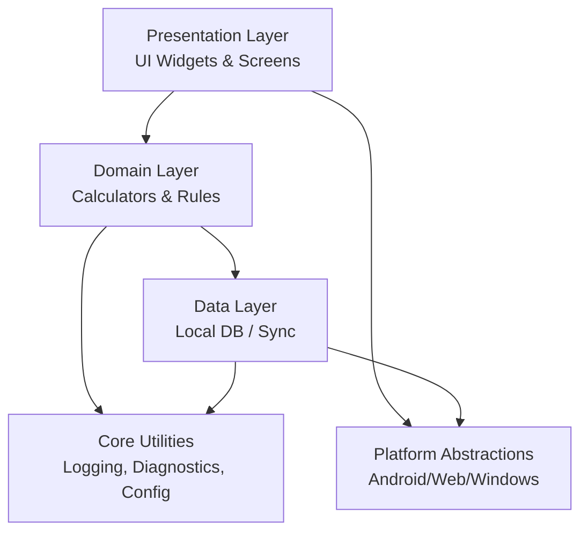
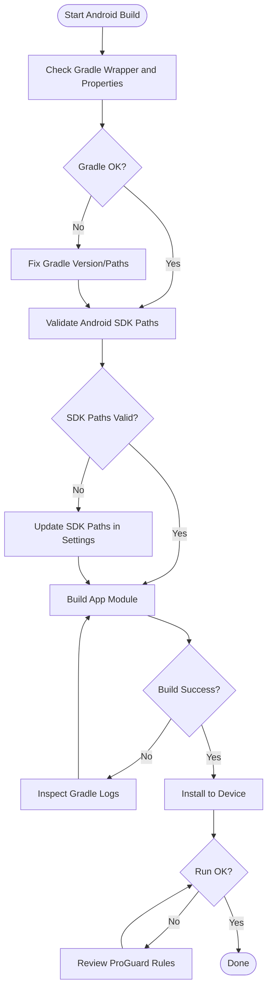
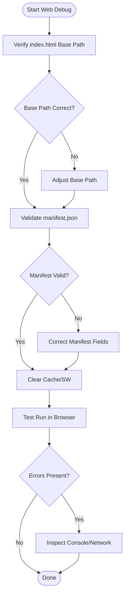
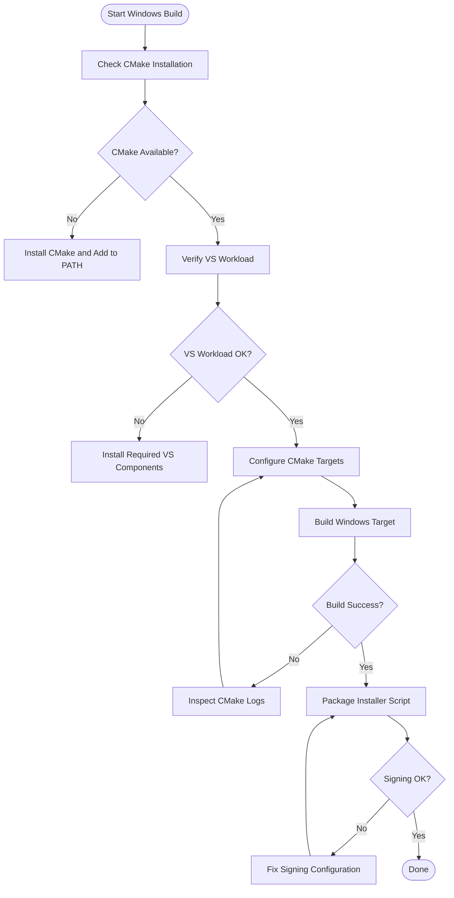
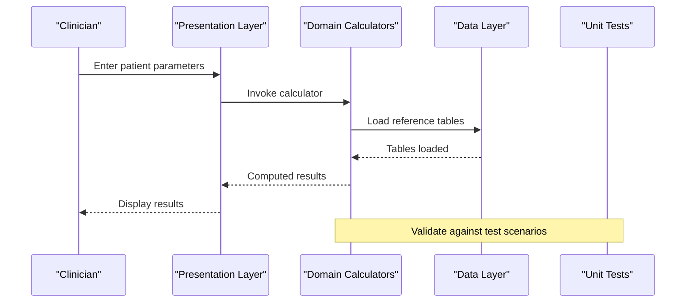
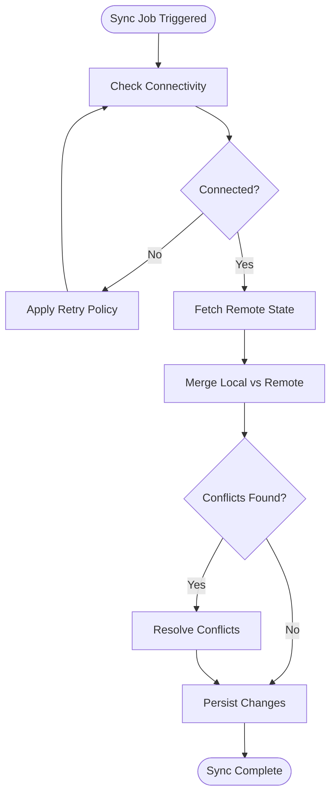
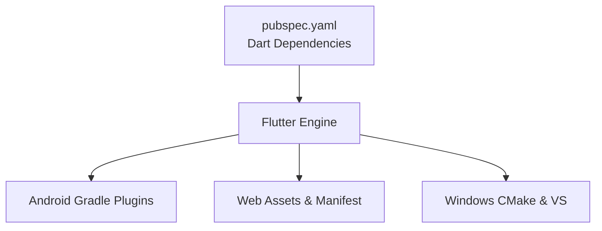

# Troubleshooting and Support

<cite>
**Referenced Files in This Document**
- [README.md](file://README.md)
- [pubspec.yaml](file://pubspec.yaml)
- [lib/main.dart](file://lib/main.dart)
- [android/app/build.gradle.kts](file://android/app/build.gradle.kts)
- [android/gradle.properties](file://android/gradle.properties)
- [android/settings.gradle.kts](file://android/settings.gradle.kts)
- [windows/CMakeLists.txt](file://windows/CMakeLists.txt)
- [windows/runner/CMakeLists.txt](file://windows/runner/CMakeLists.txt)
- [web/index.html](file://web/index.html)
- [web/manifest.json](file://web/manifest.json)
- [docs/wiki/Home.md](file://docs/wiki/Home.md)
- [docs/wiki/Installation.md](file://docs/wiki/Installation.md)
- [docs/wiki/Contributing.md](file://docs/wiki/Contributing.md)
- [docs/SECURITY.md](file://docs/SECURITY.md)
- [windows_installer.iss](file://windows_installer.iss)
</cite>

## Table of Contents
1. [Introduction](#introduction)
2. [Project Structure](#project-structure)
3. [Core Components](#core-components)
4. [Architecture Overview](#architecture-overview)
5. [Detailed Component Analysis](#detailed-component-analysis)
6. [Dependency Analysis](#dependency-analysis)
7. [Performance Considerations](#performance-considerations)
8. [Troubleshooting Guide](#troubleshooting-guide)
9. [Conclusion](#conclusion)
10. [Appendices](#appendices)

## Introduction
This document provides comprehensive troubleshooting and support guidance for the EMtools application across Android, Web, and Windows platforms. It covers common installation and setup issues, build errors, runtime exceptions, platform-specific problems, diagnostic procedures for medical calculation accuracy, data synchronization, performance bottlenecks, logging and crash reporting, debugging techniques, security and HIPAA compliance considerations, community resources, contribution guidelines, feedback collection, maintenance, updates, and long-term support strategies for healthcare environments.

## Project Structure
EMtools is a Flutter-based multi-platform application with shared Dart logic under lib and platform-specific configurations for Android, Web, and Windows. The docs directory contains user-facing documentation and security policy.

**Diagram sources**
- [lib/main.dart:1-50](file://lib/main.dart#L1-L50)
- [android/app/build.gradle.kts:1-50](file://android/app/build.gradle.kts#L1-L50)
- [android/gradle.properties:1-50](file://android/gradle.properties#L1-L50)
- [android/settings.gradle.kts:1-50](file://android/settings.gradle.kts#L1-L50)
- [web/index.html:1-50](file://web/index.html#L1-L50)
- [web/manifest.json:1-50](file://web/manifest.json#L1-L50)
- [windows/CMakeLists.txt:1-50](file://windows/CMakeLists.txt#L1-L50)
- [windows/runner/CMakeLists.txt:1-50](file://windows/runner/CMakeLists.txt#L1-L50)
- [windows_installer.iss:1-50](file://windows_installer.iss#L1-L50)

**Section sources**
- [README.md:1-100](file://README.md#L1-L100)
- [pubspec.yaml:1-100](file://pubspec.yaml#L1-L100)
- [lib/main.dart:1-50](file://lib/main.dart#L1-L50)
- [android/app/build.gradle.kts:1-50](file://android/app/build.gradle.kts#L1-L50)
- [android/gradle.properties:1-50](file://android/gradle.properties#L1-L50)
- [android/settings.gradle.kts:1-50](file://android/settings.gradle.kts#L1-L50)
- [web/index.html:1-50](file://web/index.html#L1-L50)
- [web/manifest.json:1-50](file://web/manifest.json#L1-L50)
- [windows/CMakeLists.txt:1-50](file://windows/CMakeLists.txt#L1-L50)
- [windows/runner/CMakeLists.txt:1-50](file://windows/runner/CMakeLists.txt#L1-L50)
- [windows_installer.iss:1-50](file://windows_installer.iss#L1-L50)

## Core Components
- Application entry point initializes the Flutter engine and bootstraps the app lifecycle.
- Platform configuration files define build targets, dependencies, and environment properties for Android, Web, and Windows.
- Documentation assets provide installation instructions, contributing guidelines, and security policies.

Key responsibilities:
- Entry point: initialize services, configure routing, and set up error handling hooks where applicable.
- Android: Gradle build settings, Kotlin activity, and manifest permissions.
- Web: HTML shell and manifest metadata.
- Windows: CMake configuration and installer script.

**Section sources**
- [lib/main.dart:1-50](file://lib/main.dart#L1-L50)
- [android/app/build.gradle.kts:1-50](file://android/app/build.gradle.kts#L1-L50)
- [web/index.html:1-50](file://web/index.html#L1-L50)
- [windows/CMakeLists.txt:1-50](file://windows/CMakeLists.txt#L1-L50)

## Architecture Overview
The application follows a layered architecture:
- Presentation layer (UI)
- Domain layer (business logic)
- Data layer (local storage, remote sync)
- Core utilities (logging, diagnostics, configuration)

[No sources needed since this diagram shows conceptual architecture]

## Detailed Component Analysis

### Android Build and Runtime Troubleshooting
Common issues:
- Gradle version mismatch or missing Java/Kotlin toolchain
- Missing or incorrect Android SDK paths
- ProGuard/R8 obfuscation causing runtime crashes
- Permission-related failures on device

Diagnostic steps:
- Validate Gradle wrapper and properties
- Check project-level and app-level Gradle scripts
- Review ProGuard rules if enabled
- Inspect AndroidManifest for required permissions

**Diagram sources**
- [android/app/build.gradle.kts:1-50](file://android/app/build.gradle.kts#L1-L50)
- [android/gradle.properties:1-50](file://android/gradle.properties#L1-L50)
- [android/settings.gradle.kts:1-50](file://android/settings.gradle.kts#L1-L50)

**Section sources**
- [android/app/build.gradle.kts:1-50](file://android/app/build.gradle.kts#L1-L50)
- [android/gradle.properties:1-50](file://android/gradle.properties#L1-L50)
- [android/settings.gradle.kts:1-50](file://android/settings.gradle.kts#L1-L50)

### Web Deployment and Runtime Troubleshooting
Common issues:
- Incorrect base href or asset paths
- Manifest misconfiguration
- CORS or service worker caching problems
- Browser console errors related to CanvasKit or WASM

Diagnostic steps:
- Verify index.html base path and asset references
- Confirm manifest.json fields and icons
- Clear browser cache and service workers
- Inspect network requests and console logs

**Diagram sources**
- [web/index.html:1-50](file://web/index.html#L1-L50)
- [web/manifest.json:1-50](file://web/manifest.json#L1-L50)

**Section sources**
- [web/index.html:1-50](file://web/index.html#L1-L50)
- [web/manifest.json:1-50](file://web/manifest.json#L1-L50)

### Windows Build and Installer Troubleshooting
Common issues:
- CMake not installed or not in PATH
- Visual Studio workload missing components
- Installer signing or code signing failures
- Missing runtime dependencies

Diagnostic steps:
- Ensure CMake and Visual Studio are configured
- Validate CMakeLists.txt entries
- Review installer script parameters
- Check system dependencies and logs

**Diagram sources**
- [windows/CMakeLists.txt:1-50](file://windows/CMakeLists.txt#L1-L50)
- [windows/runner/CMakeLists.txt:1-50](file://windows/runner/CMakeLists.txt#L1-L50)
- [windows_installer.iss:1-50](file://windows_installer.iss#L1-L50)

**Section sources**
- [windows/CMakeLists.txt:1-50](file://windows/CMakeLists.txt#L1-L50)
- [windows/runner/CMakeLists.txt:1-50](file://windows/runner/CMakeLists.txt#L1-L50)
- [windows_installer.iss:1-50](file://windows_installer.iss#L1-L50)

### Medical Calculation Accuracy Diagnostics
Focus areas:
- Input validation and unit conversions
- Algorithm correctness and edge cases
- Scenario coverage via tests

Diagnostic workflow:
- Reproduce scenario with known inputs
- Compare outputs against reference values
- Inspect domain logic and data layers
- Validate test scenarios and fixtures

[No sources needed since this diagram shows conceptual workflow]

**Section sources**
- [test/unit/blood_gas_calculator_test.dart:1-50](file://test/unit/blood_gas_calculator_test.dart#L1-L50)
- [test/unit/metabolic_calculator_test.dart:1-50](file://test/unit/metabolic_calculator_test.dart#L1-L50)
- [test/unit/antibiotics_data_test.dart:1-50](file://test/unit/antibiotics_data_test.dart#L1-L50)
- [test/unit/sedation_data_test.dart:1-50](file://test/unit/sedation_data_test.dart#L1-L50)
- [test/unit/vasoactive_data_test.dart:1-50](file://test/unit/vasoactive_data_test.dart#L1-L50)

### Data Synchronization Troubleshooting
Common issues:
- Network connectivity failures
- Conflict resolution between local and remote states
- Schema mismatches after updates

Diagnostic steps:
- Inspect network logs and retry policies
- Validate conflict resolution strategy
- Check migration scripts and schema versions
- Monitor sync job status and backoff behavior

[No sources needed since this diagram shows conceptual workflow]

### Logging, Crash Reporting, and Debugging
Guidance:
- Enable verbose logging in development builds
- Capture stack traces and context for crashes
- Use platform-specific debuggers (Android Studio, Chrome DevTools, Visual Studio)
- Implement structured logging for production telemetry

Best practices:
- Avoid logging sensitive health data
- Redact identifiers and PHI
- Aggregate logs securely and accessibly

[No sources needed since this section provides general guidance]

### Security, HIPAA Compliance, and Privacy
Considerations:
- Encrypt data at rest and in transit
- Enforce authentication and authorization
- Minimize data retention and implement secure deletion
- Conduct regular security assessments and audits
- Follow HIPAA technical safeguards and organizational policies

References:
- Security policy document
- Contribution and release processes

**Section sources**
- [docs/SECURITY.md:1-100](file://docs/SECURITY.md#L1-L100)

### Community Support, Contributions, and Feedback
Resources:
- Wiki home page and installation guide
- Contributing guidelines
- Issue reporting and feedback channels

Steps:
- Review installation prerequisites
- Follow contribution workflow
- Submit detailed bug reports with reproduction steps

**Section sources**
- [docs/wiki/Home.md:1-100](file://docs/wiki/Home.md#L1-L100)
- [docs/wiki/Installation.md:1-100](file://docs/wiki/Installation.md#L1-L100)
- [docs/wiki/Contributing.md:1-100](file://docs/wiki/Contributing.md#L1-L100)

## Dependency Analysis
External dependencies and platform toolchains impact build stability and runtime behavior.

**Diagram sources**
- [pubspec.yaml:1-100](file://pubspec.yaml#L1-L100)
- [android/app/build.gradle.kts:1-50](file://android/app/build.gradle.kts#L1-L50)
- [web/index.html:1-50](file://web/index.html#L1-L50)
- [windows/CMakeLists.txt:1-50](file://windows/CMakeLists.txt#L1-L50)

**Section sources**
- [pubspec.yaml:1-100](file://pubspec.yaml#L1-L100)
- [android/app/build.gradle.kts:1-50](file://android/app/build.gradle.kts#L1-L50)
- [web/index.html:1-50](file://web/index.html#L1-L50)
- [windows/CMakeLists.txt:1-50](file://windows/CMakeLists.txt#L1-L50)

## Performance Considerations
Recommendations:
- Profile CPU and memory usage per platform
- Optimize heavy calculations using isolates or background tasks
- Reduce widget rebuilds and unnecessary state changes
- Cache frequently used reference data locally
- Monitor network latency and implement efficient batching

[No sources needed since this section provides general guidance]

## Troubleshooting Guide

### Installation and Setup
- Android:
  - Ensure JDK and Android SDK are installed and configured
  - Verify Gradle wrapper and properties
  - Check device/emulator connectivity
- Web:
  - Confirm browser compatibility and extensions
  - Validate base paths and asset loading
- Windows:
  - Install CMake and required Visual Studio workloads
  - Validate CMake targets and output directories

**Section sources**
- [docs/wiki/Installation.md:1-100](file://docs/wiki/Installation.md#L1-L100)
- [android/gradle.properties:1-50](file://android/gradle.properties#L1-L50)
- [windows/CMakeLists.txt:1-50](file://windows/CMakeLists.txt#L1-L50)

### Build Errors
- Android:
  - Fix Gradle version conflicts and plugin compatibility
  - Resolve dependency resolution failures
- Web:
  - Address asset path errors and manifest issues
- Windows:
  - Resolve CMake configuration errors and missing components

**Section sources**
- [android/app/build.gradle.kts:1-50](file://android/app/build.gradle.kts#L1-L50)
- [web/manifest.json:1-50](file://web/manifest.json#L1-L50)
- [windows/runner/CMakeLists.txt:1-50](file://windows/runner/CMakeLists.txt#L1-L50)

### Runtime Exceptions
- Enable verbose logging and capture stack traces
- Reproduce issues with minimal steps
- Isolate platform-specific behaviors
- Validate input constraints and boundary conditions

[No sources needed since this section provides general guidance]

### Platform-Specific Problems
- Android:
  - Permissions denied, background execution limits, battery optimizations
- Web:
  - Service worker caching, CORS restrictions, canvas rendering issues
- Windows:
  - Code signing, UAC prompts, runtime DLL availability

**Section sources**
- [android/app/build.gradle.kts:1-50](file://android/app/build.gradle.kts#L1-L50)
- [web/index.html:1-50](file://web/index.html#L1-L50)
- [windows_installer.iss:1-50](file://windows_installer.iss#L1-L50)

### Diagnostic Procedures
- Medical calculation accuracy:
  - Use unit tests and scenario fixtures
  - Compare outputs against clinical references
- Data synchronization:
  - Inspect sync logs and conflict resolution outcomes
  - Validate schema migrations and versioning
- Performance bottlenecks:
  - Profile CPU/memory/network
  - Identify hotspots and optimize algorithms

**Section sources**
- [test/unit/blood_gas_scenarios_test.dart:1-50](file://test/unit/blood_gas_scenarios_test.dart#L1-L50)
- [test/unit/metabolic_scenarios_test.dart:1-50](file://test/unit/metabolic_scenarios_test.dart#L1-L50)
- [test/unit/vasoactive_scenarios_test.dart:1-50](file://test/unit/vasoactive_scenarios_test.dart#L1-L50)

### Error Logging and Crash Reporting
- Implement structured logging with levels and contexts
- Capture unhandled exceptions and environment details
- Integrate crash reporting tools compliant with privacy policies
- Ensure PHI redaction before transmission

[No sources needed since this section provides general guidance]

### Debugging Techniques
- Development:
  - Hot reload, breakpoints, inspector tools
- Production:
  - Remote logging, feature flags, safe fallbacks
- Cross-platform:
  - Platform-specific debuggers and profilers

[No sources needed since this section provides general guidance]

### Security and HIPAA Compliance
- Encryption at rest/in transit
- Access controls and audit trails
- Secure key management and certificate handling
- Regular risk assessments and compliance reviews

**Section sources**
- [docs/SECURITY.md:1-100](file://docs/SECURITY.md#L1-L100)

### Community Resources and Feedback
- Wiki pages for installation and features
- Contributing guidelines for developers
- Issue templates and feedback forms

**Section sources**
- [docs/wiki/Home.md:1-100](file://docs/wiki/Home.md#L1-L100)
- [docs/wiki/Contributing.md:1-100](file://docs/wiki/Contributing.md#L1-L100)

### Maintenance and Updates
- Versioning strategy and changelog maintenance
- Automated testing and CI/CD pipelines
- Rollback plans and staged deployments
- Long-term support schedules and deprecation notices

**Section sources**
- [README.md:1-100](file://README.md#L1-L100)

## Conclusion
This troubleshooting and support guide consolidates platform-specific diagnostics, build and runtime resolutions, accuracy verification, performance tuning, security and compliance measures, and community engagement practices. Following these procedures will help maintain reliable, secure, and high-performing deployments of EMtools in healthcare environments.

## Appendices

### Quick Reference Checklist
- Environment setup validated
- Dependencies resolved
- Builds succeed on all targets
- Tests pass including scenario fixtures
- Logging and crash reporting configured
- Security controls implemented
- Documentation reviewed and updated

[No sources needed since this section provides general guidance]